# Query overview in Power BI Desktop
With Power BI Desktop you can connect to the world of data, create compelling and foundational reports, and share your efforts with others – who can then build on your work, and expand their business intelligence efforts.

Power BI Desktop has three views:

* **Report** view – where you use queries you create to build compelling visualizations, arranged as you want them to appear, and with multiple pages, that you can share with others
* **Data** view – see the data in your report in data model format, where you can add measures, create new columns, and manage relationships
* **Relationships** view – get a graphical representation of the relationships that have been established in your data model, and manage or modify them as needed.

Access these views by selecting one of the three icons along the left side of Power BI Desktop. In the following image, **Report** view is selected, indicated by the yellow band beside the icon.  

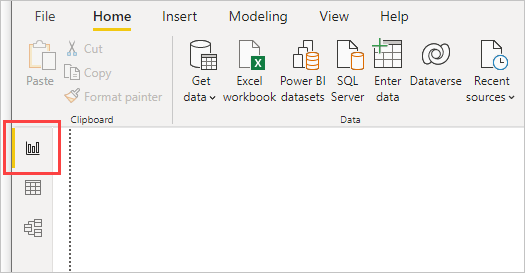
 
Power BI Desktop also comes with Power Query Editor. Use Power Query Editor to connect to one or many data sources, shape and transform the data to meet your needs, then load that model into Power BI Desktop.

This document provides an overview of the work with data in the Power Query Editor, but there's more to learn. At the end of this document, you'll find links to detailed guidance about supported data types. You'll also find guidance about connecting to data, shaping data, creating relationships, and how to get started.

But first, let's see get acquainted with Power Query Editor.

## Power Query Editor
To get to Power Query Editor, select **Transform data** from the **Home** tab of Power BI Desktop.  

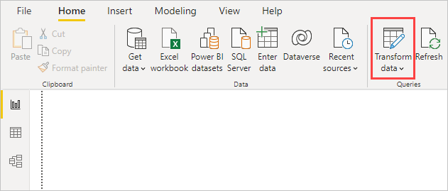

With no data connections, Power Query Editor appears as a blank pane, ready for data.  

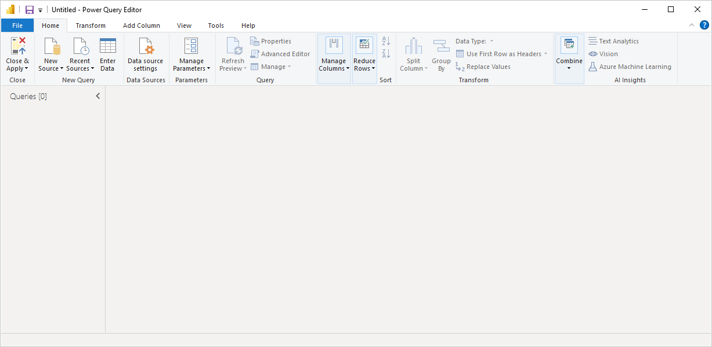

Once a query is loaded, Power Query Editor view becomes more interesting. If we connect to the following Web data source, Power Query Editor loads information about the data, which you can then begin to shape:

[*https://www.bankrate.com/retirement/best-and-worst-states-for-retirement/*](https://www.bankrate.com/retirement/best-and-worst-states-for-retirement/)

Here's how Power Query Editor appears once a data connection is established:

1. In the ribbon, many buttons are now active to interact with the data in the query.
2. In the left pane, queries are listed and available for selection, viewing, and shaping.
3. In the center pane, data from the selected query is displayed and available for shaping.
4. The **Query Settings** pane appears, listing the query's properties and applied steps.  
   
   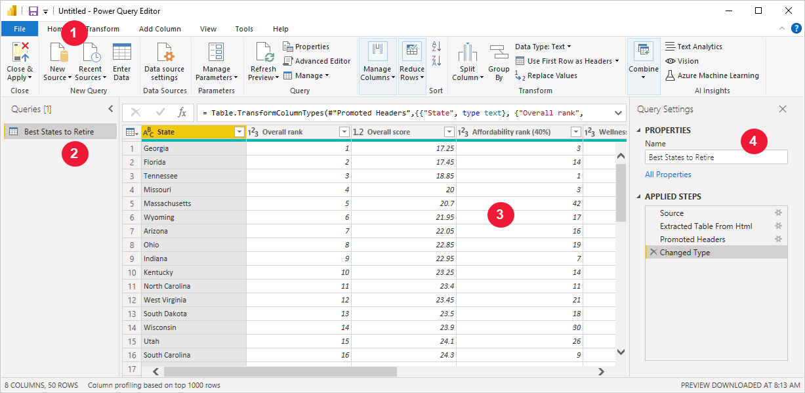

We'll look at each of these four areas: the ribbon, the Queries pane, the Data view, and the Query Settings pane.

## The query ribbon
The ribbon in Power Query Editor consists of four tabs: **Home**, **Transform**, **Add Column**, **View**, **Tools**, and **Help**.

The **Home** tab contains the common query tasks.

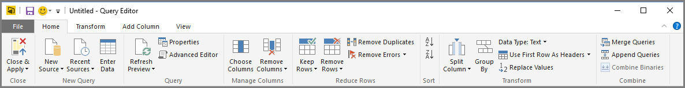

To connect to data and begin the query building process, select **New Source**. A menu appears, providing the most common data sources.  

For more information about available data sources, see [Data Sources](../connect-data/desktop-data-sources.md). For information about connecting to data, including examples and steps, see [Connect to Data](../connect-data/desktop-connect-to-data.md).

The **Transform** tab provides access to common data transformation tasks, such as:

* Adding or removing columns
* Changing data types 
* Splitting columns 
* Other data-driven tasks

For more information about transforming data, including examples, see [Tutorial: Shape and combine data in Power BI Desktop](../connect-data/desktop-shape-and-combine-data.md).

The **Add Column** tab provides additional tasks associated with adding a column, formatting column data, and adding custom columns. The following image shows the **Add Column** tab.  

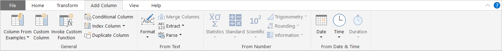

The **View** tab on the ribbon is used to toggle whether certain panes or windows are displayed. It's also used to display the Advanced Editor. The following image shows the **View** tab.  

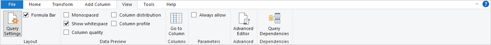

It's useful to know that many of the tasks available from the ribbon are also available by right-clicking a column, or other data, in the center pane.

## The left (Queries) pane
The left pane, or **Queries** pane, displays the number of active queries and the name of the query. When you select a query from the left pane, its data is displayed in the center pane, where you can shape and transform the data to meet your needs. The following image shows the left pane with a query.  

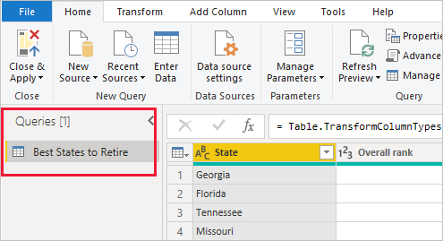

## The center (Data) pane
In the center pane, or **Data** pane, data from the selected query is displayed. This pane is where much of the work of the **Query** view is accomplished.

In the following image shows the Web data connection established earlier. The **Overall score** column is selected, and its header is right-clicked to show the available menu items. Notice that many of these right-click menu items are the same as buttons in the ribbon tabs.  

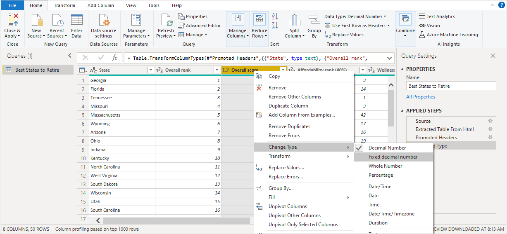

When you select a right-click menu item (or a ribbon button), the query applies the step to the data. It also saves step as part of the query itself. The steps are recorded in the **Query Settings** pane in sequential order, as described in the next section.  

## The right (Query Settings) pane
The right pane, or **Query Settings** pane, is where all steps associated with a query are displayed. For example, in the following image, the **Applied Steps** section of the **Query Settings** pane reflects the fact that we just changed the type of the **Overall score** column.

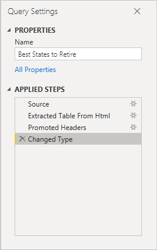

As additional shaping steps are applied to the query, they're captured in the **Applied Steps** section.

It's important to know that the underlying data *isn't* changed. Rather, Power Query Editor adjusts and shapes its view of the data. It also shapes and adjusts the view of any interaction with the underlying data that occurs based on Power Query Editor's shaped and modified view of that data.

In the **Query Settings** pane, you can rename steps, delete steps, or reorder the steps as you see fit. To do so, right-click the step in the **Applied Steps** section, and choose from the menu that appears. All query steps are carried out in the order they appear in the **Applied Steps** pane.

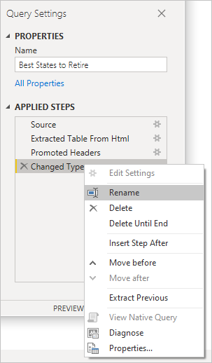

## Advanced Editor
The **Advanced Editor** lets you see the code that Power Query Editor is creating with each step. It also lets you create your own shaping code. To launch the advanced editor, select **View** from the ribbon, then select **Advanced Editor**. A window appears, showing the existing query code.  
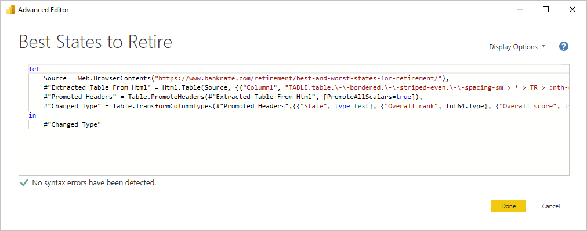

You can directly edit the code in the **Advanced Editor** window. To close the window, select the **Done** or **Cancel** button.  

## Saving your work
When your query is where you want it, select **Close & Apply** from Power Query Editor's **File** menu. This action applies the changes and closes the editor.  
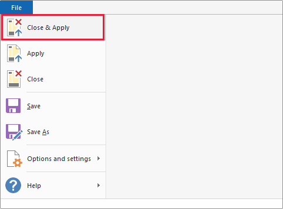

As progress is made, Power BI Desktop provides a dialog to display its status.  

When you're ready, Power BI Desktop can save your work in the form of a *.pbix* file.

To save your work, select **File** \> **Save** (or **File** \> **Save As**), as shown in the following image.  
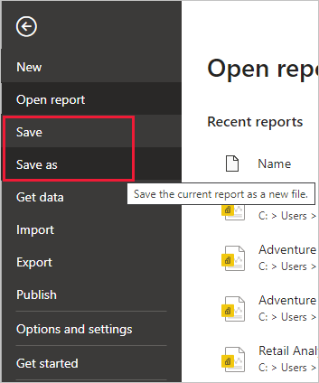

## Next steps
There are all sorts of things you can do with Power BI Desktop. For more information on its capabilities, check out the following resources:

* [What is Power BI Desktop?](../fundamentals/desktop-what-is-desktop.md)
* [Data sources in Power BI Desktop](../connect-data/desktop-data-sources.md)
* [Connect to data in Power BI Desktop](../connect-data/desktop-connect-to-data.md)
* [Tutorial: Shape and combine data with Power BI Desktop](../connect-data/desktop-shape-and-combine-data.md)
* [Perform common query tasks in Power BI Desktop](desktop-common-query-tasks.md)