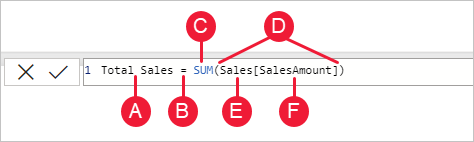
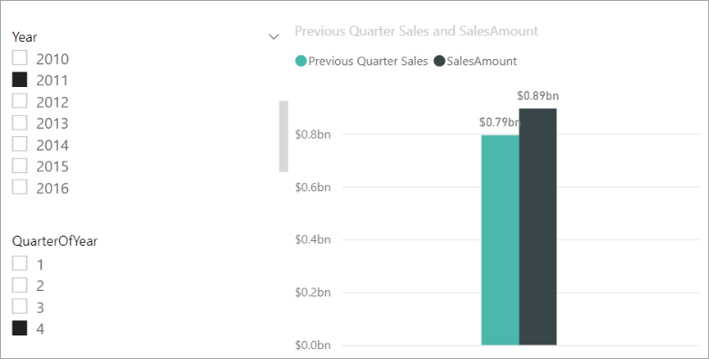
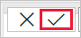
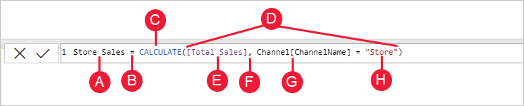

# Learn DAX basics in Power BI Desktop

Users who are new to Power BI Desktop can use this article as a quick and easy introduction on how you can use Data Analysis Expressions (DAX) to solve many basic calculations and data analysis problems. We’ll go over some conceptual information, a series of tasks you can complete, and a knowledge check to test what you’ve learned. After completing this article, you should have a good understanding of the most important fundamental concepts in DAX.

## What is DAX?

DAX is a collection of functions, operators, and constants that can be used in a formula, or expression, to calculate and return one or more values. DAX helps you create new information from data already in your model.

## Why is DAX so important?

It’s easy to create a new Power BI Desktop file and import some data into it. You can even create reports that show valuable insights without using any DAX formulas at all. But, what if you need to analyze growth percentage across product categories and for different date ranges? Or, you need to calculate year-over-year growth compared to market trends? DAX formulas provide this capability and many other important capabilities as well. Learning how to create effective DAX formulas will help you get the most out of your data. When you get the information you need, you can begin to solve real business problems that affect your bottom line.

## Prerequisites

You might already be familiar with creating formulas in Microsoft Excel, and that knowledge will be helpful in understanding DAX. But even if you have no experience with Excel formulas, the concepts described here will help you get started creating DAX formulas and solving real-world BI problems right away.

We’ll focus on understanding DAX formulas used in calculations, more specifically, in measures and calculated columns. You should already be familiar with using Power BI Desktop to import data and add fields to a report, and you should also be familiar with fundamental concepts of [Measures](desktop-measures.md) and [Calculated columns](desktop-calculated-columns.md).

### Example workbook

The best way to learn DAX is to create some basic formulas, use them with actual data, and see the results for yourself. The examples and tasks here use the [Contoso Sales Sample for Power BI Desktop file](https://download.microsoft.com/download/4/6/A/46AB5E74-50F6-4761-8EDB-5AE077FD603C/Contoso%20Sales%20for%20Power%20BI%20Designer.zip). This sample file is the same one used in the [Tutorial: Create your own measures in Power BI Desktop](desktop-tutorial-create-measures.md) article.

## Let's begin

We'll frame our understanding of DAX around three fundamental concepts: *Syntax*, *Functions*, and *Context*. There are other important concepts in DAX, but understanding these three concepts will provide the best foundation on which to build your DAX skills.

### Syntax

Before you create your own formulas, let’s take a look at DAX formula syntax. Syntax includes the various elements that make up a formula, or more simply, how the formula is written. For example, here's a simple DAX formula for a measure:

This formula includes the following syntax elements:

**A.** The measure name, **Total Sales**.

**B.** The equals sign operator (**=**), which indicates the beginning of the formula. When calculated, it will return a result.

**C.** The DAX function **SUM**, which adds up all of the numbers in the **Sales[SalesAmount]** column. You’ll learn more about functions later.

**D.** Parenthesis **()**, which surround an expression that contains one or more arguments. Most functions require at least one argument. An argument passes a value to a function.

**E.** The referenced table, **Sales**.

**F.** The referenced column, **[SalesAmount]**, in the Sales table. With this argument, the SUM function knows on which column to aggregate a SUM.

When trying to understand a DAX formula, it's often helpful to break down each of the elements into a language you think and speak every day. For example, you can read this formula as:

> *For the measure named Total Sales, calculate (=) the SUM of values in the [SalesAmount ] column in the Sales table.*
>
>

When added to a report, this measure calculates and returns values by summing up sales amounts for each of the other fields we include, for example, Cell Phones in the USA.

You might be thinking, "Isn’t this measure doing the same thing as if I were to just add the SalesAmount field to my report?" Well, yes. But, there’s a good reason to create our own measure that sums up values from the SalesAmount field: We can use it as an argument in other formulas. This solution might seem a little confusing now, but as your DAX formula skills grow, knowing this measure will make your formulas and your model more efficient. In fact, you’ll see the Total Sales measure showing up as an argument in other formulas later on.

Let’s go over a few more things about this formula. In particular, we introduced a function, [SUM](/dax/sum-function-dax). Functions are pre-written formulas that make it easier to do complex calculations and manipulations with numbers, dates, time, text, and more. You'll learn more about functions later.

You also see that the column name [SalesAmount] was preceded by the Sales table in which the column belongs. This name is known as a fully qualified column name in that it includes the column name preceded by the table name. Columns referenced in the same table don't require the table name be included in the formula, which can make long formulas that reference many columns shorter and easier to read. However, it's a good practice to  include the table name in your measure formulas, even when in the same table.

> [!NOTE]
> If a table name contains spaces, reserved keywords, or disallowed characters, you must enclose the table name in single quotation marks. You’ll also need to enclose table names in quotation marks if the name contains any characters outside the ANSI alphanumeric character range, regardless of whether your locale supports the character set or not.
>
>

It’s important your formulas have the correct syntax. In most cases, if the syntax isn't correct, a syntax error is returned. In other cases, the syntax might be correct, but the values returned might not be what you're expecting. The DAX editor in Power BI Desktop includes a suggestions feature, used to create syntactically correct formulas by helping you select the correct elements.

Let’s create an example formula. This task will help you further understand formula syntax and how the suggestions feature in the formula bar can help you.

### Task: Create a measure formula

1. [Download](https://download.microsoft.com/download/4/6/A/46AB5E74-50F6-4761-8EDB-5AE077FD603C/Contoso%20Sales%20for%20Power%20BI%20Designer.zip) and open the Contoso Sales Sample Power BI Desktop file.

2. In Report view, in the field list, right-click the **Sales** table, and then select **New Measure**.

3. In the formula bar, replace **Measure** by entering a new measure name, *Previous Quarter Sales*.

4. After the equals sign, type the first few letters *CAL*, and then double-click the function you want to use. In this formula, you want to use the **CALCULATE** function.

   You’ll use the CALCULATE function to filter the amounts we want to sum by an argument we pass to the CALCULATE function. This type of function is referred to as nesting functions. The CALCULATE function has at least two arguments. The first is the expression to be evaluated, and the second is a filter.

5. After the opening parenthesis *(* for the **CALCULATE** function, type *SUM* followed by another opening parenthesis *(*.

   Next, we'll pass an argument to the SUM function.

6. Begin typing *Sal*, and then select **Sales[SalesAmount]**, followed by a closing parenthesis *)*.

   This step creates the first expression argument for our CALCULATE function.

7. Type a comma (*,*) followed by a space to specify the first filter, and then type *PREVIOUSQUARTER*.

   You’ll use the PREVIOUSQUARTER time intelligence function to filter SUM results by the previous quarter.

8. After the opening parenthesis *(* for the PREVIOUSQUARTER function, type *Calendar[DateKey]*.

   The PREVIOUSQUARTER function has one argument, a column containing a contiguous range of dates. In our case, that's the DateKey column in the Calendar table.

9. Close both the arguments being passed to the PREVIOUSQUARTER function and the CALCULATE function by typing two closing parenthesis *))*.

   Your formula should now look like this:

   **Previous Quarter Sales = CALCULATE(SUM(Sales[SalesAmount]), PREVIOUSQUARTER(Calendar[DateKey]))**

10. Select the checkmark  in the formula bar or press Enter to validate the formula and add it to the Sales table.

You did it! You just created a complex measure by using DAX. What this formula will do is calculate the total sales for the previous quarter, depending on the filters applied in a report. For example, we can put SalesAmount and our new Previous Quarter Sales measure from the Sales table into a Clustered column chart. Then from the Calendar table add Year as a slicer and select 2011. Then after, add QuarterOfYear as another Slicer and select 4, and we get a chart like this:

Keep in mind, the sample model contains only a small amount of sales data from 1/1/2011 to 1/19/2013. If you select a year or quarter where SalesAmount can't be summed, or your new measure can't calculate sales data for the current or previous quarter, no data for that period is shown. For example, if you select 2011 for Year and 1 for QuarterOfYear, no data is shown for Previous Quarter Sales because there's no data for the fourth quarter of 2010.

You were introduced to several important aspects of DAX formulas:

- This formula included two functions. [PREVIOUSQUARTER](/dax/previousquarter-function-dax), a time intelligence function, is nested as an argument passed to [CALCULATE](/dax/calculate-function-dax), a filter function.

   DAX formulas can contain up to 64 nested functions. It’s unlikely a formula would ever contain so many nested functions. In fact, such a formula would be difficult to create and debug, and it probably wouldn’t be fast either.

- In this formula, you also used filters. Filters narrow down what will be calculated. In this case, you selected one filter as an argument, which is actually the result of another function. You'll learn more about filters later.

- You used the CALCULATE function. This function is one of the most powerful functions in DAX. As you author models and create more complex formulas, you'll likely use this function many times. Although further discussion about the CALCULATE function is outside the scope of this article, as your knowledge of DAX grows, pay special attention to it.

### Syntax QuickQuiz

1. What does this button on the formula bar do?

   > 
   >
   >
2. What always surrounds a column name in a DAX formula?

Answers are provided at the end of this article.

### Functions

Functions are predefined formulas that perform calculations by using specific values, called arguments, in a particular order or structure. Arguments can be other functions, another formula, expression, column references, numbers, text, logical values such as TRUE or FALSE, or constants.

DAX includes the following categories of functions: [Date and Time](/dax/date-and-time-functions-dax), [Time Intelligence](/dax/time-intelligence-functions-dax), [Information](/dax/information-functions-dax), [Logical](/dax/logical-functions-dax), [Mathematical](/dax/math-and-trig-functions-dax), [Statistical](/dax/statistical-functions-dax), [Text](/dax/text-functions-dax), [Parent/Child](/dax/parent-and-child-functions-dax), and [Other](/dax/other-functions-dax) functions. If you’re familiar with functions in Excel formulas, many of the functions in DAX will appear similar to you; however, DAX functions are unique in the following ways:

- A DAX function always references a complete column or a table. If you want to use only particular values from a table or column, you can add filters to the formula.
- If you need to customize calculations on a row-by-row basis, DAX provides functions that let you use the current row value or a related value as a kind of argument to perform calculations based on the context. You'll learn more about context later.
- DAX includes many functions that return a table rather than a value. The table isn't displayed, but is used to provide input to other functions. For example, you can retrieve a table and then count the distinct values in it, or calculate dynamic sums across filtered tables or columns.
- DAX includes various time intelligence functions. These functions let you define or select date ranges, and perform dynamic calculations based on them. For example, you can compare sums across parallel periods.
- Excel has a popular function, VLOOKUP. DAX functions don’t take a cell or cell range as a reference like VLOOKUP does in Excel. DAX functions take a column or a table as a reference. Keep in mind, in Power BI Desktop you’re working with a relational data model. Looking up values in another table is easy, and in most cases you don’t need to create any formulas at all.
  
  As you can see, functions in DAX can help you create powerful formulas. We only touched on the basics of functions. As your DAX skills grow, you'll create formulas by using many different functions. One of the best places to learn details about each of the DAX functions is in the [DAX Function Reference](/dax/).

### Functions QuickQuiz

1. What does a function always reference?
2. Can a formula contain more than one function?
3. What category of functions would you use to concatenate two text strings into one string?

Answers are provided at the end of this article.

### Context

Context is one of the most important DAX concepts to understand. There are two types of context in DAX: row context and filter context. We’ll first look at row context.

#### Row context

Row context is most easily thought of as the current row. It applies whenever a formula has a function that applies filters to identify a single row in a table. The function will inherently apply a row context for each row of the table over which it's filtering. This type of row context most often applies to measures.

#### Filter context

Filter context is a little more difficult to understand than row context. You can most easily think of filter context as: One or more filters applied in a calculation that determines a result or value.

Filter context doesn’t exist in place of row context; rather, it applies in addition to row context. For example, to further narrow down the values to include in a calculation, you can apply a filter context, which not only specifies the row context, but also specifies a particular value (filter) in that row context.

Filter context is easily seen in your reports. For example, when you add TotalCost to a visualization, and then add Year and Region, you're defining a filter context that selects a subset of data based on a given year and region.

Why is filter context so important to DAX? You've seen that filter context can be applied by adding fields to a visualization. Filter context can also be applied in a DAX formula by defining a filter with functions such as ALL, RELATED, FILTER, CALCULATE, by relationships, and by other measures and columns. For example, let’s look at the following formula in a measure named Store Sales:

To better understand this formula, we can break it down, much like with other formulas.

This formula includes the following syntax elements:

**A.** The measure name, **Store Sales**.

**B.** The equals sign operator (**=**), which indicates the beginning of the formula.

**C.** The **CALCULATE** function, which evaluates an expression, as an argument, in a context that is modified by the specified filters.

**D.** Parenthesis **()**, which surround an expression containing one or more arguments.

**E.** A measure **[Total Sales]** in the same table as an expression. The Total Sales measure has the formula: =SUM(Sales[SalesAmount]).

**F.** A comma (**,**), which separates the first expression argument from the filter argument.

**G.** The fully qualified referenced column, **Channel[ChannelName]**. This is our row context. Each row in this column specifies a channel, such as Store or Online.

**H.** The particular value, **Store**, as a filter. This is our filter context.

This formula ensures only sales values defined by the Total Sales measure are calculated only for rows in the Channel[ChannelName] column, with the value *Store* used as a filter.

As you can imagine, being able to define filter context within a formula has immense and powerful capabilities. The ability to reference only a particular value in a related table is just one such example. Don’t worry if you don't completely understand context right away. As you create your own formulas, you'll better understand context and why it’s so important in DAX.

### Context QuickQuiz

1. What are the two types of context?
2. What is filter context?
3. What is row context?

Answers are provided at the end of this article.

## Summary

Now that you have a basic understanding of the most important concepts in DAX, you can begin creating DAX formulas for measures on your own. DAX can indeed be a little tricky to learn, but there are many resources available to you. After reading through this article and experimenting with a few of your own formulas, you can learn more about other DAX concepts and formulas that can help you solve your own business problems. There are many DAX resources available to you; most important is the [Data Analysis Expressions (DAX) Reference](/dax/).

Because DAX has been around for several years in other Microsoft BI tools such as Power Pivot and Analysis Services Tabular models, there are many great sources information out there. You can find more information in books, whitepapers, and blogs from both Microsoft and leading BI professionals. The [DAX Resource Center](https://social.technet.microsoft.com) is also a great place to start.

### QuickQuiz answers

Syntax:

1. Validates and enters the measure into the model.
2. Brackets [].

Functions:

1. A table and a column.
2. Yes. A formula can contain up to 64 nested functions.
3. [Text functions](/dax/text-functions-dax).

Context:

1. Row context and filter context.
2. One or more filters in a calculation that determines a single value.
3. The current row.
