# Tutorial: Create calculated columns in Power BI Desktop

Sometimes the data you’re analyzing doesn’t contain a particular field you need to get the results you’re after. This is where *calculated columns* come in. Calculated columns use Data Analysis Expressions (DAX) formulas to define a column’s values, anything from putting together text values from a couple of different columns to calculating a numeric value from other values. For example, let’s say your data has **City** and **State** fields, but you want a single **Location** field that has both, like "Miami, FL". This is precisely what calculated columns are for.

Calculated columns are similar to [measures](desktop-tutorial-create-measures.md) in that both are based on DAX formulas, but they differ in how they are used. You often use measures in a visualization's **Values** area, to calculate results based on other fields. You use calculated columns as new **Fields** in the rows, axes, legends, and group areas of visualizations.

This tutorial will guide you through understanding and creating some calculated columns and using them in report visualizations in Power BI Desktop.

## Prerequisites

- This tutorial is intended for Power BI users already familiar with using Power BI Desktop to create more advanced models. You should already know how to use Get Data and the Power Query Editor to import data, work with multiple related tables, and add fields to the Report canvas. If you’re new to Power BI Desktop, be sure to check out [Getting Started with Power BI Desktop](../fundamentals/desktop-getting-started.md).
  
- The tutorial uses the [Contoso Sales Sample for Power BI Desktop](https://download.microsoft.com/download/4/6/A/46AB5E74-50F6-4761-8EDB-5AE077FD603C/Contoso%20Sales%20Sample%20for%20Power%20BI%20Desktop.zip), the same sample used for the [Create your own measures in Power BI Desktop](desktop-tutorial-create-measures.md) tutorial. This sales data from the fictitious company Contoso, Inc. was imported from a database, so you won’t be able to connect to the data source or view it in the Power Query Editor. Download and extract the file on your own computer, and then open it in Power BI Desktop.

## Create a calculated column with values from related tables

In your Sales Report, you want to display product categories and subcategories as single values, like "Cell phones – Accessories", "Cell phones – Smartphones & PDAs", and so on. There's no field in the **Fields** list that gives you that data, but there is a **ProductCategory** field and a **ProductSubcategory** field, each in its own table. You can create a calculated column that combines values from these two columns. DAX formulas can leverage the full power of the model you already have, including relationships between different tables that already exist.

 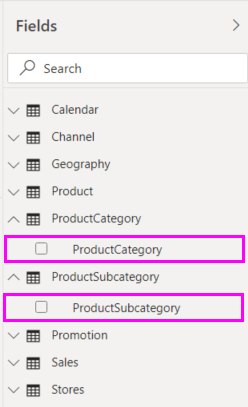

1. To create your new column in the **ProductSubcategory** table, right-click or select the ellipsis **...** next to **ProductSubcategory** in the **Fields** pane, and select **New column** from the menu.

   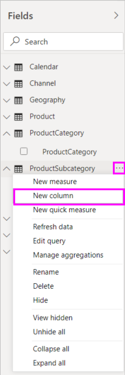

   When you select **New column**, the **Formula bar** appears along the top of the Report canvas, ready for you to name your column and enter a DAX formula.

   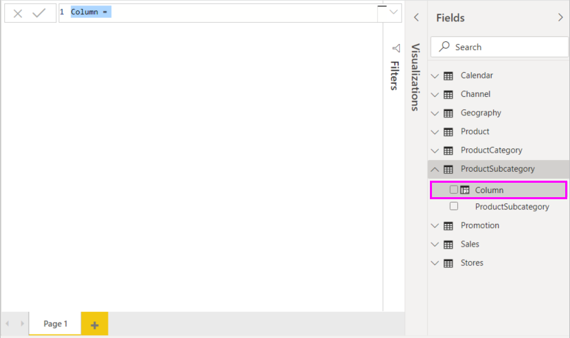

2. By default, a new calculated column is named **Column**. If you don’t rename it, additional new columns will be named **Column 2**, **Column 3**, and so on. You want your column to be more identifiable, so while the **Column** name is already highlighted in the formula bar, rename it by typing **ProductFullCategory**, and then type an equals (**=**) sign.

3. You want the values in your new column to start with the name in the **ProductCategory** field. Because this column is in a different but related table, you can use the [RELATED](/dax/related-function-dax) function to help you get it.

   After the equals sign, type **r**. A dropdown suggestion list shows all of the DAX functions beginning with the letter R. Selecting each function shows a description of its effect. As you type, the suggestion list scales closer to the function you need. Select **RELATED**, and then press **Enter**.

   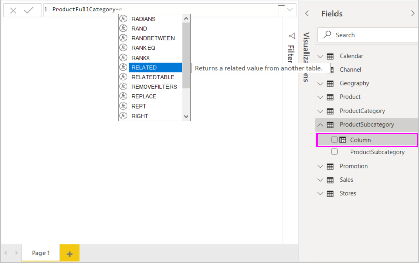

   An opening parenthesis appears, along with another suggestion list of the related columns you can pass to the RELATED function, with descriptions and details of expected parameters.

   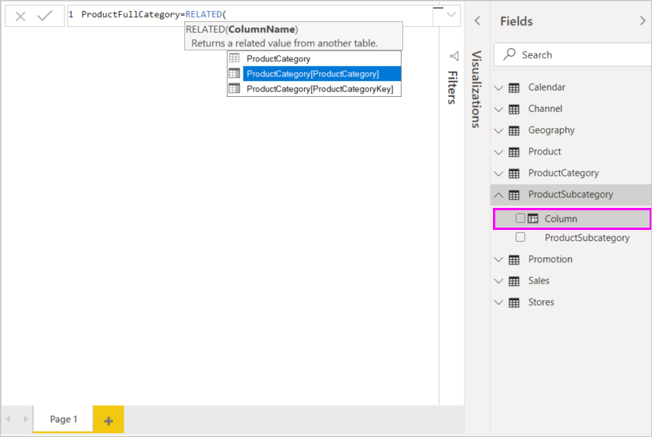

4. You want the **ProductCategory** column from the **ProductCategory** table. Select **ProductCategory[ProductCategory]**, press **Enter**, and then type a closing parenthesis.

    > [!TIP]
    > Syntax errors are most often caused by a missing or misplaced closing parenthesis, although sometimes Power BI Desktop will add it for you.

5. You want dashes and spaces to separate the **ProductCategories** and **ProductSubcategories** in the new values, so after the closing parenthesis of the first expression, type a space, ampersand (**&**), double-quote (**"**), space, dash (**-**), another space, another double-quote, and another ampersand. Your formula should now look like this:

    `ProductFullCategory = RELATED(ProductCategory[ProductCategory]) & " - " &`

    > [!TIP]
    > If you need more room, select the down chevron on the right side of the formula bar to expand the formula editor. In the editor, press **Alt + Enter** to move down a line, and **Tab** to move things over.

6. Enter an opening bracket (**[**), and then select the **[ProductSubcategory]** column to finish the formula. 

    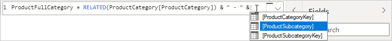

    You didn’t need to use another RELATED function to call the **ProductSubcategory** table in the second expression, because you are creating the calculated column in this table. You can enter **[ProductSubcategory]** with the table name prefix (fully-qualified) or without (non-qualified).

7. Complete the formula by pressing **Enter** or selecting the checkmark in the formula bar. The formula validates, and the **ProductFullCategory** column name appears in the **ProductSubcategory** table in the **Fields** pane.

   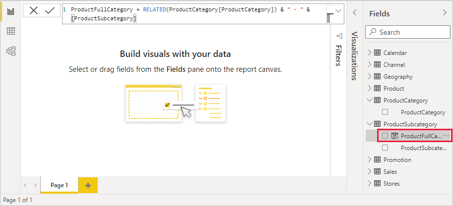

    >[!NOTE]
    >In Power BI Desktop, calculated columns have a special icon in the **Fields** pane, showing that they contain formulas. In the Power BI service (your Power BI site), there’s no way to change formulas, so calculated columns don't have icons.

## Use your new column in a report

Now you can use your new **ProductFullCategory** column to look at **SalesAmount** by **ProductFullCategory**.

1. Select or drag the **ProductFullCategory** column from the **ProductSubcategory** table onto the Report canvas to create a table showing all of the **ProductFullCategory** names.

   

2. Select or drag the **SalesAmount** field from the **Sales** table into the table to show the **SalesAmount** for each **ProductFullCategory**.

   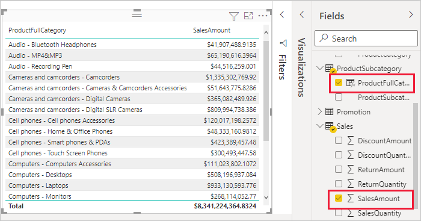

## Create a calculated column that uses an IF function

The Contoso Sales Sample contains sales data for both active and inactive stores. You want to ensure that active store sales are clearly separated from inactive store sales in your report by creating an **Active StoreName** field. In the new **Active StoreName** calculated column, each active store will appear with the store's full name, while the sales for inactive stores will be grouped together in one line item called **Inactive**.

Fortunately, the **Stores** table has a column named **Status**, with values of "On" for active stores and "Off" for inactive stores, which we can use to create values for our new **Active StoreName** column. Your DAX formula will use the logical [IF](/dax/if-function-dax) function to test each store's **Status** and return a particular value depending on the result. If a store's **Status** is "On", the formula will return the store's name. If it’s "Off", the formula will assign an **Active StoreName** of "Inactive".

1. Create a new calculated column in the **Stores** table and name it **Active StoreName** in the formula bar.

2. After the **=** sign, begin typing **IF**. The suggestion list will show what you can add. Select **IF**.

    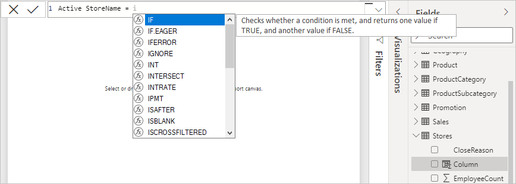

3. The first argument for **IF** is a logical test of whether a store's **Status** is "On". Type an opening bracket **[**, which lists columns from the **Stores** table, and select **[Status]**.

    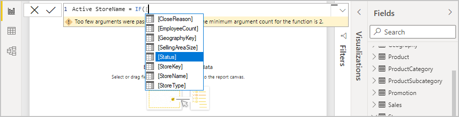

4. Right after **[Status]**, type **="On"**, and then type a comma (**,**) to end the argument. The tooltip suggests that you now need to add a value to return when the result is TRUE.

    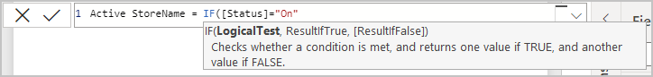

5. If the store's status is "On", you want to show the store’s name. Type an opening bracket (**[**) and select the **[StoreName]** column, and then type another comma. The tooltip now indicates that you need to add a value to return when the result is FALSE.

    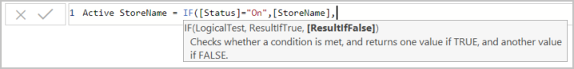

6. You want the value to be "Inactive", so type **"Inactive"**, and then complete the formula by pressing **Enter** or selecting the checkmark in the formula bar. The formula validates, and the new column's name appears in the **Stores** table in the **Fields** pane.

    

7. You can use your new **Active StoreName** column in visualizations just like any other field. To show **SalesAmounts** by **Active StoreName**, select the **Active StoreName** field or drag it onto the Report canvas, and then select the **SalesAmount** field or drag it into the table. In this table, active stores appear individually by name, but inactive stores are grouped together at the end as **Inactive**.

    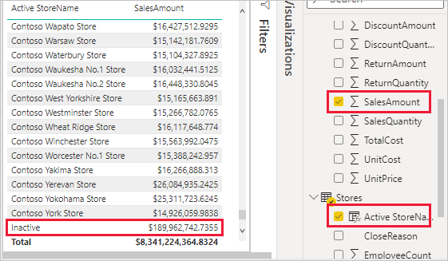

## What you've learned

Calculated columns can enrich your data and provide easier insights. You've learned how to create calculated columns in the **Fields** pane and formula bar, use suggestion lists and tooltips to help construct your formulas, call DAX functions like RELATED and IF with the appropriate arguments, and use your calculated columns in report visualizations.

## Next steps

If you want to take a deeper dive into DAX formulas and create calculated columns with more advanced formulas, see [DAX Basics in Power BI Desktop](desktop-quickstart-learn-dax-basics.md). This article focuses on fundamental concepts in DAX, such as syntax, functions, and a more thorough understanding of context.

Be sure to add the [Data Analysis Expressions (DAX) Reference](/dax/) to your favorites. This is where you'll find detailed info on DAX syntax, operators, and over 200 DAX functions.
