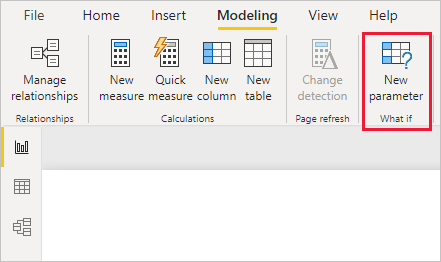
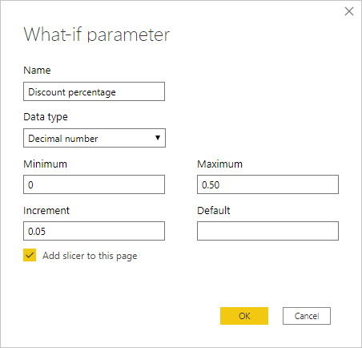
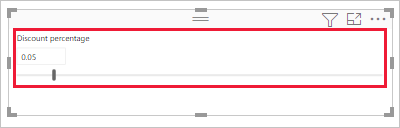
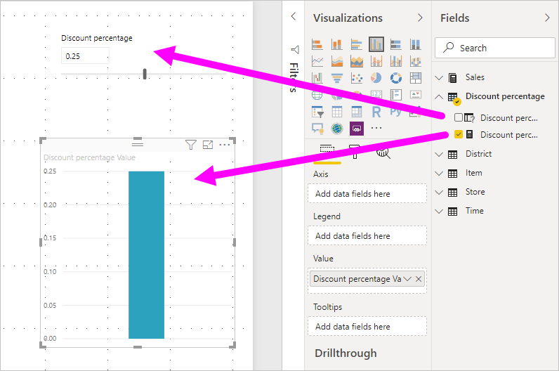
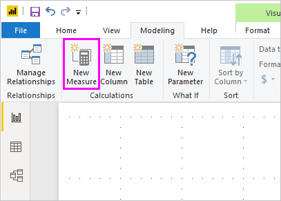
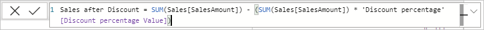
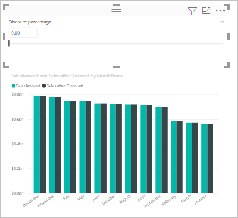
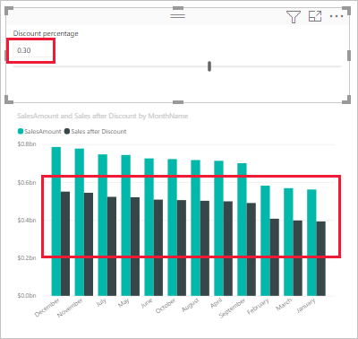

# Create and use what-if parameters to visualize variables in Power BI Desktop

You can create *what-if* variables for your reports, interact with the variable as a slicer, and visualize and quantify different key values in your reports.

Create a *what-if* parameter on the **Modeling** tab in Power BI Desktop. When you select it, a dialog box appears where you can configure the parameter.

## Creating a what-if parameter

To create a what-if parameter, select **New Parameter** from the **Modeling** tab in Power BI Desktop. In the following image, we've created a parameter called *Discount percentage* and set its data type to **Decimal number**. The **Minimum** value is zero. The **Maximum** is 0.50 (50 percent). We've also set the **Increment** to 0.05, or five percent. That's how much the parameter will adjust when interacted with in a report.

> [!NOTE]
> For decimal numbers, make sure you precede the value with a zero, as in 0.50 versus just .50. Otherwise, the number won't validate and the **OK** button won't be selectable.
> 
> 

For your convenience, the **Add slicer to this page** checkbox automatically puts a slicer with your what-if parameter onto the current report page.

In addition to creating the parameter, creating a what-if parameter also creates a measure, which you can use to visualize the current value of the what-if parameter.

It's important and useful to note that once you create a what-if parameter, both the parameter and the measure become part of your model. So, they're available throughout the report and can be used on other report pages. And, since they're part of the model, you can delete the slicer from the report page. If you want it back, just grab the what-if parameter from the **Fields** list and drag it onto the canvas, then change the visual to a slicer.

## Using a what-if parameter

Let's create a simple example of using a what-if parameter. We created the what-if parameter in the previous section. Now we'll put it to use by creating a new measure whose value adjusts with the slider.

The new measure is simply going to be the total sales amount, with the discount rate applied. You can create complex and interesting measures that let the consumers of your reports visualize the variable of your what-if parameter. For example, you could create a report that lets sales people see their compensation if they meet certain sales goals or percentages, or see the effect of increased sales to deeper discounts.

Enter the measure formula into the formula bar, and name the formula *Sales after Discount*.

Then, we create a column visual with **OrderDate** on the axis, and both **SalesAmount** and the just-created measure, **Sales after Discount** as the values.

Then, as we move the slider, we see that the **Sales after Discount** column reflects the discounted sales amount.

And, that's all there is to it. You can use what-if parameters in all sorts of situations. These parameters enable the consumers of reports to interact with different scenarios that you create in your reports.

## Considerations and limitations
There are a few considerations and limitations for **what-if** variables to keep in mind.

* What-if parameters can only be used with value ranges between 0 and 1,000. For ranges greater than 1,000, the parameter value will be sampled.

* What if parameters are designed for measures within visuals, and may not calculate properly when used in a dimension calculation.

## Next steps

You might also be interested in the following articles:

* [Use gridlines and snap-to-grid in Power BI Desktop reports](desktop-gridlines-snap-to-grid.md)
* [About filters and highlighting in Power BI reports](power-bi-reports-filters-and-highlighting.md)

