# Using the Log Analytics for Power BI Datasets Template App (preview)

Power BI is integrating with Azure Log Analytics (LA) to enable administrators and Premium workspace owners to configure a connection from Power BI to a Log Analytics workspace in Azure subscriptions that they control. We published a Template App to give you a head start with your analysis. This article describes the app so you can understand how to use the parameters, filters, navigation, and drillthrough paths to answer questions about datasets operations from the perspective of the Analysis Services engine. We will describe each page so you can understand its purpose and typical use cases they support.

To [install the AS Engine app](install-as-engine-app.md), you must have a Log Analytics workspace. Once installed, anyone in the organization with the right permissions can view the app.

## App Goals
We wanted to build an app that can be used to analyze AS engine behavior in general, and to help isolate and debug specific problems in depth. Any operation can be sliced by CapacityId, Workspace Name, Dataset Name and ReportId to give you the necessary context. We are looking into providing you with more item names, and not just the ID. 

Some examples of questions that can be answered
 

**General**
* What is engine activity by capacity and workspace?
* What is my engine load by day or by hour?
* What operations are taking the most CPU time or duration?
* How does the load vary by hour of day?
* Which users are generating load?

**Query**
* Which DAX queries were issued in a particular scope? 
* Which queries are the most expensive?
* How does a unique DAX query vary over time, and which are the worst?
* What was the query text?
* What were the Storage Engine or DQ queries that were generated from a DAX query?
* How much time did the query spend in Storage Engine vs Formula Engine?
* Did queries use aggregations and what was the performance benefit?

**Refresh**
* Which refreshes are expensive? 
* Which refreshes are overlapping?
* Which operations within a refresh are in parallel, and which ones take the longest time?
* What were the different operations and suboperations within a refresh?

**Others**
* Since the app contains a variety of AS engine events, you can customize the **app** to answer questions related to other events such as Discover or Notification.

 
 
## App Data Source

The app loads data from a single Azure Log Analytics workspace.
 
It doesn't matter if the Log Analytics workspace contains data from many Power BI workspaces. It also doesn't matter which level of administrator configured logging. The log schemas are exactly the same for every role, so there is only one version of the app. We included different levels of aggregation to cater for a range of use cases. [Using Log Analytics in Power BI](desktop-log-analytics-overview.md) goes into detail on this.

## App Data Model

The app has following tables and relationships

* User
* Query Duration Segment
* Scenario
* Calendar
* Time
* Operation
* Suboperation - Aggregations
* Suboperation - Query
* Suboperation - Refresh

Screenshot of ER Diagram
 
 
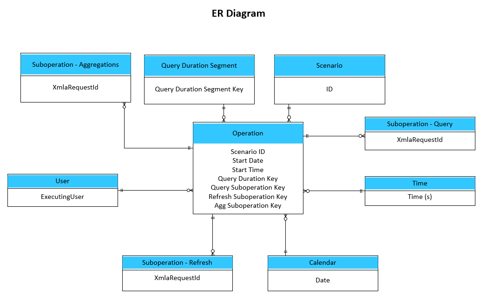

## App Parameters

The following parameters are defined in the template. 

|**Parameter**  |**Description**  |
|---------|---------|
|Days Ago To Start     |Load data from the specified number of days ago. Maximum value you can select here is 30 days.    |
|Days Ago To Finish  |Load data up to the specified number of days ago. Use 0 for today. | 
|Log Analytics Table |Preset values corresponding to the Log Analytics source table:  -	PowerBIDatasetsWorkspace  -	PowerBIDatasetsTenant   Currently only PowerBIDatasetsWorkspace is supported. |
|Log Analytics WorkspaceId |GUID of the Azure Log Analytics workspace containing the AS Engine data. |
UTC Offset |An hourly offset used to convert the data from UTC to a local time zone. |
Pagination Hours | This is an optional parameter. It describes the time window for each log analytics call from Power BI. You only need to update this if you're running into failures while fetching data due to data size exceeding Log Analytics limits. |

Screenshot of AS Engine Parameters
 
 
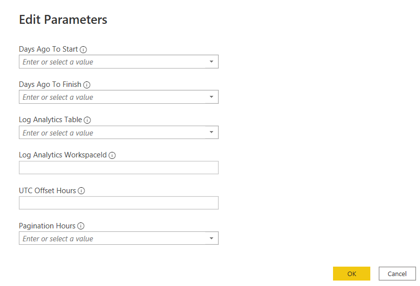
 

 
## App Usage

### App Workflow

Diagram showing the major pages of the app and some important available drillthroughs
 

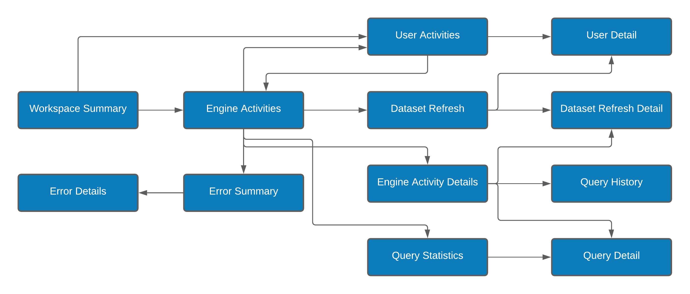

### Workspace Summary 
Shows engine activities and load at a workspace level, focusing on identifying interesting datasets, reports, or users. You can use this to identify a high-level issue to analyze further by navigating or drill through to other pages of the app.

### Engine Activities
Provides engine load and activity trends by day and hour, with the ability to select a scenario such as Refresh Completed or Query Completed. You can drill through to the Engine Activity Detail page to get a look at the detailed list of each activity within the selected context. 

### Engine Activity Detail
This is a drillthrough page showing event level data. For example, you can list all queries that ran in a particular time range.

### Dataset Refresh
Provides a Gantt chart for style view of refreshes to observe duration and parallelism. You can drill through to the dataset refresh details for more details.

### Dataset Refresh Detail
A drillthrough page showing the operations that occurred within a single dataset refresh. You can use this to identify the longest running operation in a refresh and see if there are any dependencies between activities. 

### Query Statistics
An overview of query performance, highlighting typical and low performing durations and letting you see how variable each unique query is. 

### Query Detail
A drillthrough page showing visuals like detailed table for query, table for related query etc. For Import tables, it will show you the internal Vertipaq storage engine queries and durations. For DirectQuery models, it will show you the external queries, for example T-SQL sent to a SQL Server.

### Query History
Shows you every execution of a query, provides CPU and duration stats and trend visuals to see if there are any spikes. 

### User Activities
A summary view that focuses on users, helping you identify the most active and those experiencing worse performance relative to others. 

### User Detail
A drillthrough page provides details of the activities performed by a single user.

### Error Summary
Helps identify errors and spot any error trends.

### Error Details
Allows you to zoom in on a specific error by viewing the detailed event.

### Navigating in The App

The app contains the navigation bar at top of the page to navigate to reach the expected page.
 

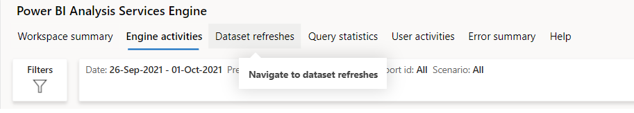

 

Also, there is back button on top left corner to go back to previous page and info icon which gives information about the page.
 

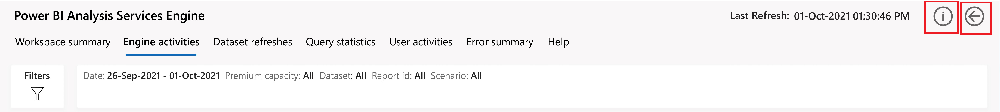

### Filtering and Understanding Current Context

Every page has a filter button below the navigation bar which you can click to open the pop-up filter panel and make selections.
 

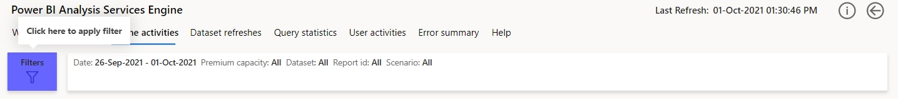

 

The current values of the filters are displayed in smart narrative adjacent to the filters button. You can clear all the slicers using the "Clear" button on the top left corner or close the window using ‘X’ button on top right corner.
 

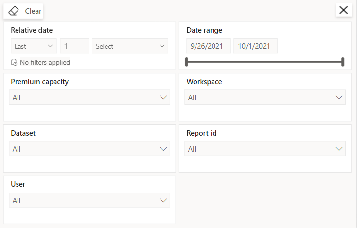

**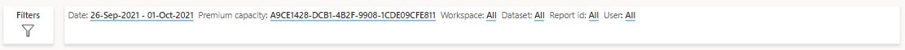**

>[!NOTE]
>In case more than one value is selected for a filter, the smart narrative displays one of the values followed by "and more". 

  
 
## App Pages

* [Workspace Summary](#page-workspace-summary)
* [Engine Activities](#page-engine-activities-also-a-drillthrough)
* [Engine Activity Details](#drillthrough-page-engine-activity-details)
* [Dataset Refreshes](#page-dataset-refreshes-also-a-drillthrough)
* [Dataset Refresh Detail](#drillthrough-page-dataset-refresh-detail)
* [Query Statistics](#page-query-statistics-also-a-drillthrough)
* [Query Detail](#drillthrough-page-query-detail)
* [Query History](#drillthrough-page-query-history)
* [User Activities](#page-user-activities)
* [User Detail](#drillthrough-page-user-detail)
* [Error Summary](#page-error-summary)
* [Error Detail](#drillthrough-page--error-detail)
* [Help](#help)

### Page: Workspace Summary
This page is targeted at a Workspace Administrator and shows activities and statistics related to datasets and queries. It also identifies top reports by load, details popular datasets by operations or users, and allows drill through to various pages to get further details.

Workspace Summary
 
 

The table below lists the visuals displayed on the workspace summary page according to their location on the page.

|Left  | Right  |
|---------|---------|
|**Top N reports with high CPU Usage** - Bar chart shows Top N reports with high aggregate CPU usage by default.    **Top N users with high CPU Usage** - Bar chart shows Top N users with high aggregate CPU usage by default.  |**Top 10 datasets by query executions** - Table shows 10 datasets by query executions in descending order.     **Reports by slow queries** - Scatter chart shows the query performance distribution. |
|**Dataset refresh success vs failures** - Column chart shows number of successful vs failed dataset refreshes per day.  |**Queries by duration** - Column chart shows the count of queries by duration band.
|**Queries by date and duration segments** - Clustered column chart shows query count by query duration distribution per day. | |

### Page: Engine Activities (also a drillthrough)
This page provides a trend overview of AS Engine activities by day and by hour. It allows you to identify peaks or outliers on a day and then see how that activity was distributed by hour when you cross highlight by selecting a day. 

Engine Activities
 
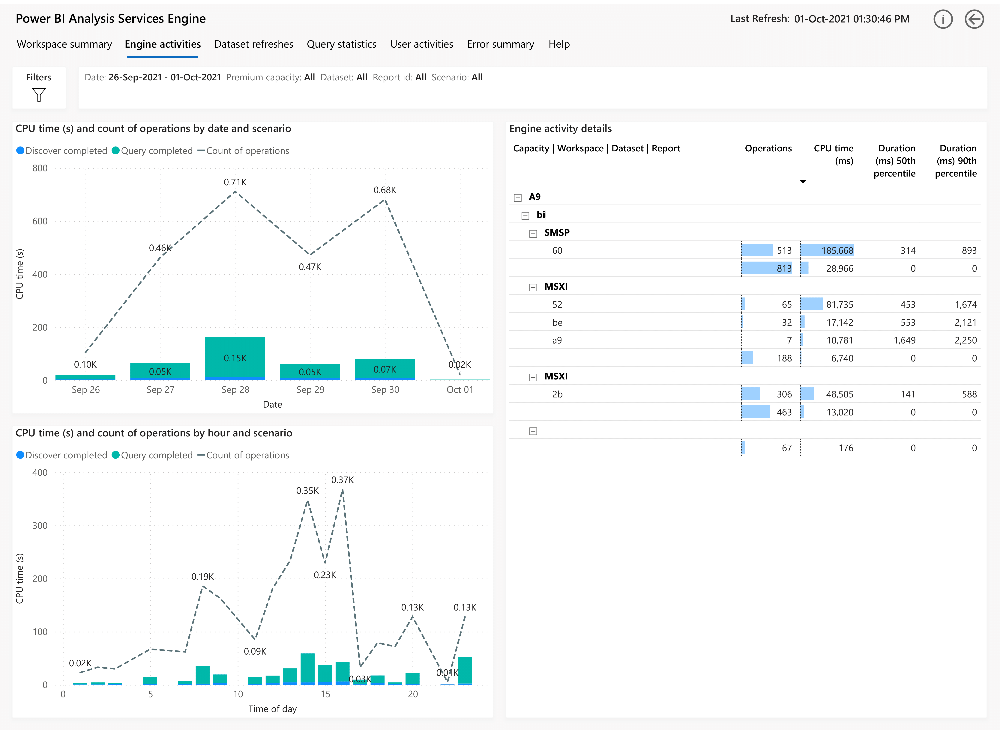

The table below lists the visuals displayed on the engine activities page according to their location on the page.

|Left  | Right  |
|---------|---------|
|**CPU time (s) and count of operation by date and scenario** - Columns show the total CPU time taken per day by each operation type.  | **Engine activity details** - Table is represented in stepped layout as a hierarchy across capacities, workspaces, datasets, reports showing count of operations, CPU time and durations. |
| **CPU time (s) and count of operations by hour and scenario** - Columns show the total CPU time taken per hour by each operation type. | |

### Drillthrough Page: Engine Activity Details

This page allows you to focus on a narrow time range and see the individual activities at a granular level of detail. The example below shows all the DAX queries that were executed in a minute, sorted by longest duration. 

Engine Activity Details
 
 
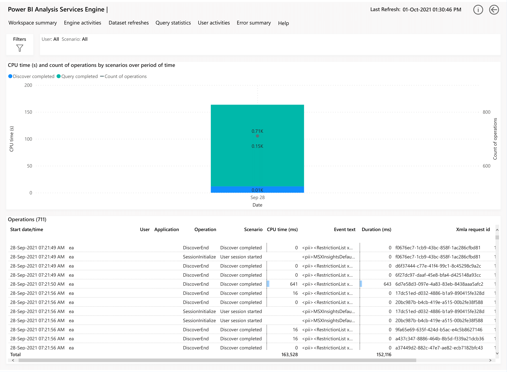

The table below lists the visuals displayed on the engine activity details page according to their location on the page.

| Visuals  | 
|---------|
|**CPU time (s) and count of operation by scenarios over period of time** - Column chart shows the total CPU time taken by each scenario per day.  | 
**Operations** - Table shows the detail of operations. |

### Page: Dataset Refreshes (also a drillthrough)

This page provides an overview of dataset refreshes occurring over a selected period. It allows you to identify long running refreshes and visualize which ones are happening in parallel. This page allows you to select any data refresh and drill to a page called Dataset Refresh Detail.

Dataset Refreshes
 
 
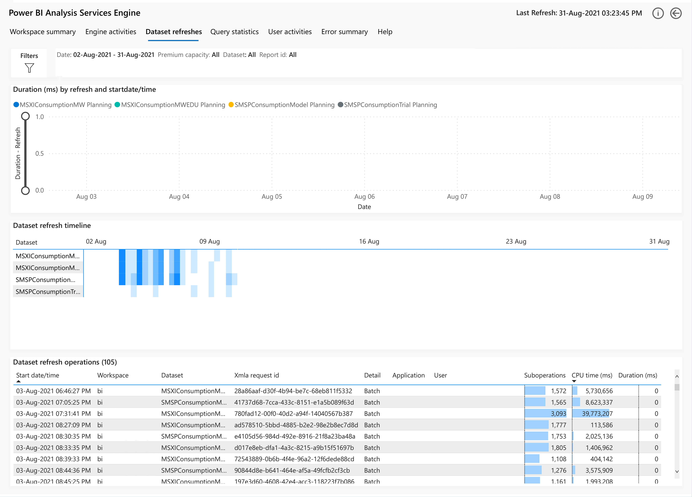

The table below lists the visuals displayed on the dataset refreshes page according to their location on the page.

| Visuals | 
|---------|
|**Duration (ms) by refresh and start date/time** - Column chart shows the refresh duration for datasets over a period of time. 
| **Dataset refresh timeline** - Timeline visual shows refreshes per dataset over a period of time. |
| **Dataset refresh operations** - Table shows details for the refresh operations. | |

### Drillthrough Page: Dataset Refresh Detail

This page allows you to visualize a single dataset refresh in detail. You can see all the internal operations that the engine performed such as executing queries and compressing data. It allows you to determine the longest running operations, which are parallel, and which may have dependencies. 

Dataset Refresh Detail
 
 
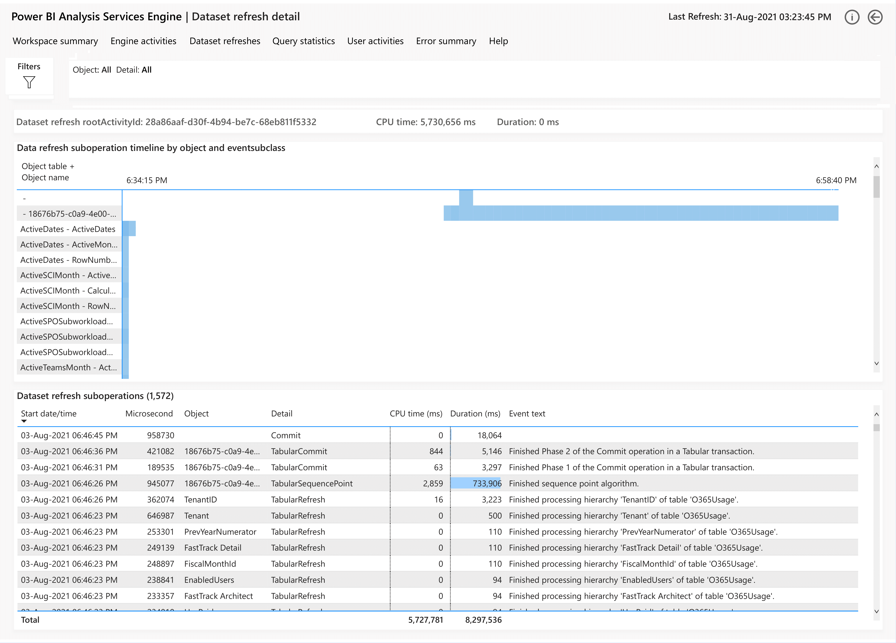

The table below lists the visuals displayed on the dataset refresh detail page according to their location on the page.

| Visuals  | 
|---------|
|**Data refresh suboperation timeline by object and event subclass** - Timeline of each corresponding dataset refresh suboperation is displayed.  
| **Dataset refresh suboperations** - Table shows details of the sub-operations that the engine performs for each refresh. |

###	Page: Query Statistics (also a drillthrough)

This page focuses on queries in bulk. The goal is to identify which queries are common, and which queries have high variability. We provide percentiles and deviations to give you an idea of both typical and more extreme measurements. 

Any query can be drilled through to a page called _Query Details_ to see details about its execution like Storage Engine and Formulae Engine time. You can also see the internal Vertipaq Queries or external DirectQuery text and duration depending on the model type.

You can also drill to a page called _Query History_ which will show you all execution of that query over a period, and its performance trend. 

Query Statistics
 
 
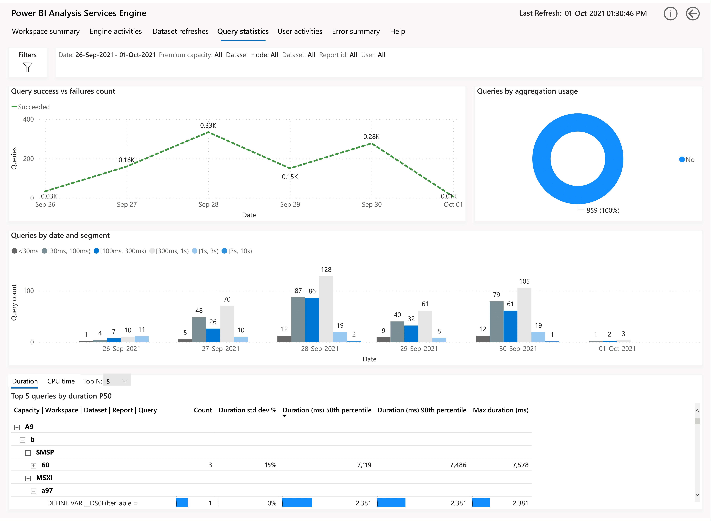

The table below lists the visuals displayed on the query statistics page according to their location on the page.

|Left  | Right  |
|---------|---------|
|**Query success vs failures count** - Line chart shows daily trend of query completions and failures.  |**Queries by aggregation usage** - Shows how many queries used aggregations using both count and percentage. |
|**Queries by date and segments** - Clustered column chart shows query count by query duration segment. | | 
|**Top N queries by CPU variability** - Table is represented in stepped layout as a hierarchy across capacities, workspaces, datasets, reports and queries showing the count of operations, CPU time standard deviation and more.    **Top N queries by duration P50** - Table is represented in stepped layout as a hierarchy across capacities, workspaces, datasets, reports and queries showing the count of operations, duration standard deviation and more.||

### Drillthrough Page: Query Detail

This page provides a detailed look at a single execution of a DAX query. Depending on whether the query was for Import or DQ model, you will either see the internal Vertipaq Storage Engine queries or the external DQ source queries (e.g. T-SQL for SQL Server). It also identifies which aggregations were used, if any.

Query Detail
 
 

The table below lists the visuals displayed on the query detail page according to their location on the page.

|Left  | Right  |
|---------|---------|
|**Query executions** - Table lists each query executed, with performance details.  |**Event Text** - Table shows the complete event text for queries executed. |
|**CPU time (s) by date and time** - Line chart shows total CPU time taken in seconds depending on whether aggregation is used or not over a time period.    **Duration (ms) by date and time** - Line chart shows total duration taken in seconds depending on whether aggregation is used or not over a time period. |  | 

The cards on the right display the number of users who ran this query and application which was used to run this query. 

### Drillthrough Page: Query History

This is a historical view of a single unique query. It shows metrics over time and introduces the Storage Engine and Formula Engine time. You can use it to determine how consistent a query is over time and identify if issues are isolated to particular users or time frames.

Query History
 
 

The table below lists the visuals displayed on the query history page according to their location on the page.

| Visuals  | 
|---------|
|**Query details** - Lists each query executed with performance details.  
|**Related queries details** - Table shows related query details.    **Aggregation details** - When queries are able to use aggregations, details are provided here. |

The cards on the right display total number of executions of a given query, the execution times in ms and aggregation utilization percentage.

### Page: User Activities

This page gives an overview of the user activities across the workspace. Also informs about the most active users for a period by capturing their CPU time usage, query usage and operations performed.

User Activities
 
 

The table below lists the visuals displayed on the user activities page according to their location on the page.

|Left  | Right  |
|---------|---------|
|**Top N users by operation** - Shows top 5 users who performed the most operations against the dataset.    **Top N users by query execution** - Shows top 5 users who ran the most queries against the dataset. |**Queries vs CPU time by users** - Compares query count vs Avg CPU time for each unique query text. | 
| **Daily user and operation count** - Columns show count of users and line shows operation count, both by day. | **Hourly user and operation count** - Column chart represents the users as column and operation count over the time as hourly trend for user.
|**User details** - Shows a count of actions and artifacts per user. | |

The cards on the right display user count and operations count.

 
###	Drillthrough Page: User Detail 
This page provides a detailed historical view of activities for a single user.

User Detail
 
 

The table below lists the visuals displayed on the user detail page according to their location on the page.

|Left  | Right  |
|---------|---------|
|**CPU time (s), count of operations and users by date** - Columns show the total CPU time taken by per day by each operation type. The line shows the count of operations for a day. | **CPU time (s), count of operations and earliest date by hour and scenario** - This hourly breakdown complements the daily version of the chart. ||
|**User details** - Table shows the user activities sorted by timestamp. | 

### Page: Error Summary
This page provides an overview of errors or failed executions over time, allowing you to view individual operations that reported an error status.

Error Summary
 
 
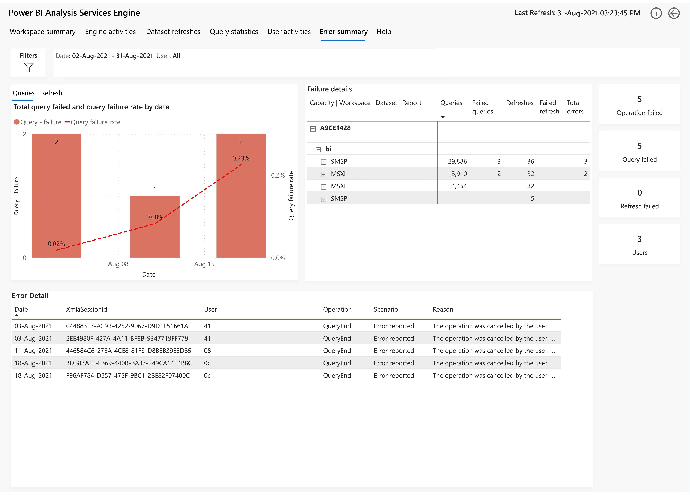

The table below lists the visuals displayed on the error summary page according to their location on the page.

|Left  | Right  |
|---------|---------|
|**Total query failed and query failure rate by date** - Columns shows total failed queries. Line values represent the query failure rate.    **Total failed refreshes and refresh - failure rate by date** - Columns shows total failed dataset refreshes. Line values represent the dataset refresh failure rate. Both are shown by day. | **Failure details** - Table shows the details of failure with respect to the total values. ||
|**Error details** - Lists errors reported by datasets for any operation.||

The cards on the right display overall operations count, query failure count, refresh failure count and user count.

### Drillthrough Page:  Error Detail
This page provides details of errors generated by the engine. It also provides the information about failed operations due to query failures.

Error Detail
 
 
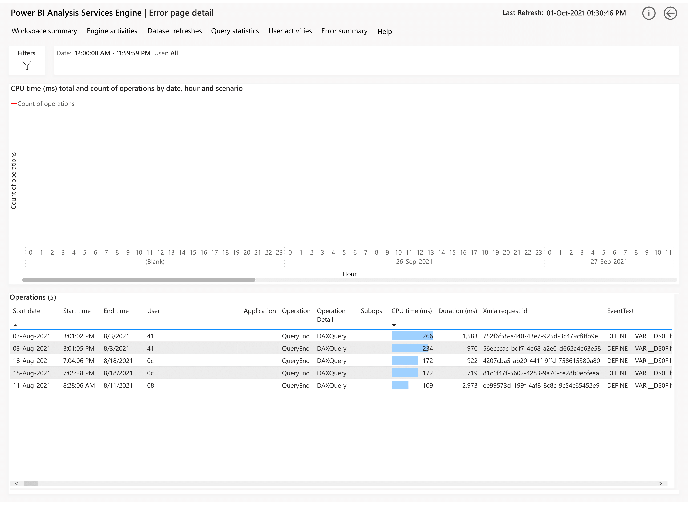

The table below lists the visuals displayed on the error detail page according to their location on the page.

| Visuals  |  
|---------|
|**CPU time (ms) total and count of operations by date, hour and scenario** - Line and column chart shows the trends for the scenario executed on the day distributed by CPU time taken for each scenario in stacked column series. |  ||
|**Operations** - Table lists all operations performed on the dataset. |   

### Help

This page provides a help summary of different features throughout the app. It also has support links that can be used for any support assistance.

Help
 
 
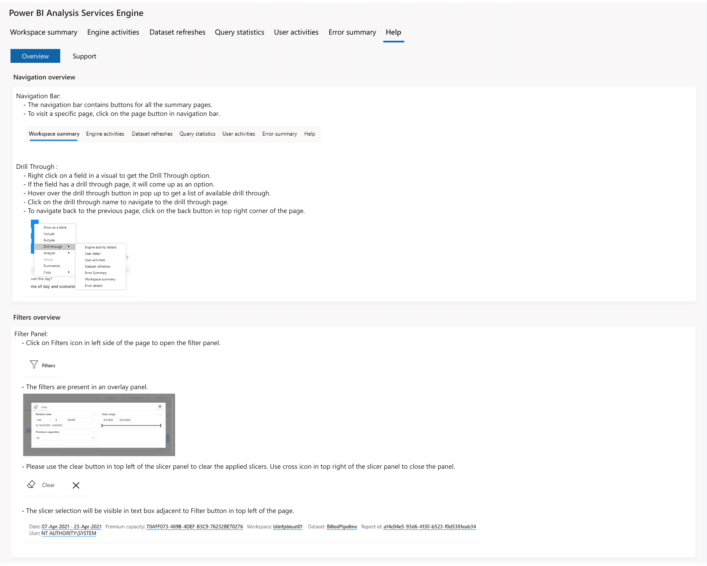

>[!NOTE]
>Each visual in the AS Engine app has a **?** icon. Select this icon to learn more about the visual.

 

 
## Considerations and Limitations
 
* Log Analytics Query Limits

  * Kusto has limits in terms of number of records returned and the overall size of the data based on the query. The app has been built to work around these limits by pulling data in sequential chunks. However, you might still exceed these limits, resulting in a refresh failure in this template app. [Query Limits](/azure/data-explorer/kusto/concepts/querylimits) 

  * If template app refresh is failing due to above data limits, you can configure the Pagination Hours parameter. Setting a lower value here will lower the amount of data retrieved from Log Analytics per call by increasing the number of calls. 
 

* The following events are intentionally excluded from Log Analytics during the Preview. Due to this, storage engine subqueries are not visible for now in Query Detail page.
  
  * ProgressReportCurrent
  * ProgressReportBegin
  * ProgressReportError
  * VertipaqSEQueryBegin
  * VertipaqSEQueryEnd

## Next steps
The following articles provide more information about Power BI and its many features:

* [Log Analytics for Analysis Services Template App](https://appsource.microsoft.com/en-us/product/power-bi/pbi_pcmm.powerbiloganalyticsforasengine)
* [Install Log Analytics Template App](install-as-engine-app.md)
* [Configuring Azure Log Analytics for Power BI (Preview)](desktop-log-analytics-configure.md)
* [Azure Log Analytics in Power BI FAQ](desktop-log-analytics-faq.md)
* [What is Power BI Premium?](../../admin/service-premium-what-is.md)

