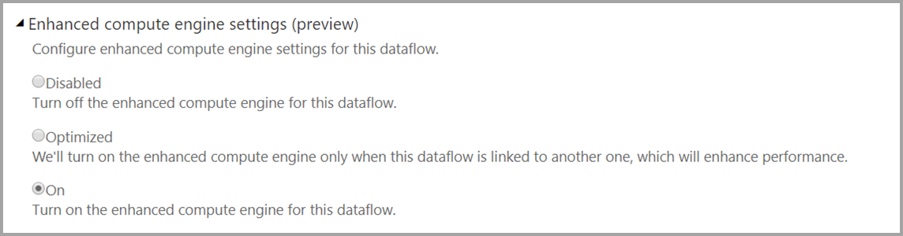

# Use DirectQuery with dataflows in Power BI (preview)

You can use DirectQuery to connect directly to dataflows, and thereby connect directly to your dataflow without having to import its data. 

Using DirectQuery with dataflows enables the following enhancements to your Power BI and dataflows processes:

* **Avoid separate refresh schedules** - DirectQuery connects directly to a dataflow, removing the need to create an imported dataset. As such, using DirectQuery with your dataflows means you no longer need separate refresh schedules for the dataflow and the dataset to ensure your data is synchronized.

* **Filtering data** - DirectQuery is useful for working on a filtered view of data inside a dataflow. If you want to filter data, and thereby work with a smaller subset of the data in your dataflow, you can use DirectQuery (and the compute engine) to filter dataflow data and work with the filtered subset you need.

## Using DirectQuery for dataflows

Using DirectQuery with dataflows is a preview feature available beginning with the May 2020 version of Power BI Desktop. 

There are also prerequisites for using DirectQuery with dataflows:

* Your dataflow must reside within a Power BI Premium enabled workspace
* The **compute engine** must be turned on. For more information about the compute engine, see [the enhanced compute engine](service-dataflows-enhanced-compute-engine.md).

## Enable DirectQuery for dataflows

To ensure your dataflow is available for DirectQuery access, the enhanced compute engine must be in its optimized state. To enable DirectQuery for dataflows, set the new **Enhanced compute engine settings** option to **On**. The following image shows the setting properly selected.

Once you've applied that setting, refresh the dataflow for the optimization to take effect. 

## Considerations and limitations

There are a few known limitations with DirectQuery and dataflows, explained in the following list.

* During the preview period of this feature, some customers may experience timeouts or performance issues when using DirectQuery with dataflows. Such issues are being actively addressed during this preview period.

* Composite/mixed models which have import and DirectQuery data sources are currently not supported.

* Large dataflows may have trouble with timeout issues when viewing visualizations. This limitation is expected to be removed as part of this feature's general availability. Meanwhile, large dataflows that run into trouble with timeout issues should use Import mode.

* Under data source settings, the dataflow connector will show invalid credentials if you are using DirectQuery. This does not affect the behavior, and the dataset will work work properly. This issue will be removed as we approach general availability.

## Next steps

The following articles are useful for further information and scenarios when using dataflows:

* [Self-service data prep with dataflows](service-dataflows-overview.md)
* [Using computed entities on Power BI Premium](service-dataflows-computed-entities-premium.md)
* [Using dataflows with on-premises data sources](service-dataflows-on-premises-gateways.md)
* [Developer resources for Power BI dataflows](service-dataflows-developer-resources.md)
* [Dataflows and Azure Data Lake integration (Preview)](service-dataflows-azure-data-lake-integration.md)

For more information about the Common Data Model, you can read its overview article:
* [Common Data Model - overview ](/powerapps/common-data-model/overview)
* [Learn more about the Common Data Model schema and entities on GitHub](https://github.com/Microsoft/CDM)

Related Power BI Desktop articles:

* [Connect to datasets in the Power BI service from Power BI Desktop](../connect-data/desktop-report-lifecycle-datasets.md)
* [Query overview in Power BI Desktop](desktop-query-overview.md)

Related Power BI service articles:
* [Configuring scheduled refresh](../connect-data/refresh-scheduled-refresh.md)