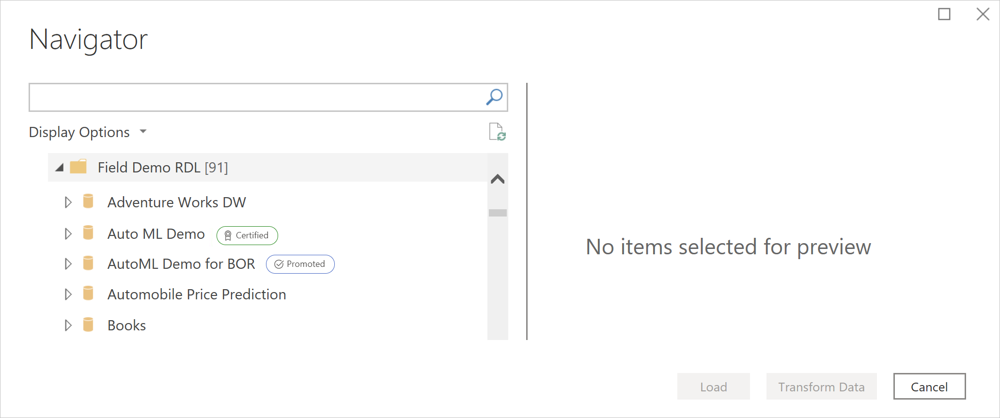

# Endorsement: Promoting and certifying Power BI content

Organizations often have large amounts of Power BI content available for sharing and reuse by their Power BI users. To make it easier for those users to find the high-quality, trustworthy content they need, you can raise the visibility and discoverability of quality content by *endorsing* it. Endorsed content is clearly labeled in many places to make it easy to identify, and is given priority in searches and other lists.

There are two kinds of endorsement: **promotion** and **certification**.

* **Promotion**: Promotion enables users to highlight content that they think is valuable, worthwhile, and ready for others to use. It encourages the collaborative spread of content within the organization. Any content owner, or any member with write permissions on the workspace where the content is located, can simply promote the content when they think it's good enough for sharing.

* **Certification**: Certification means that the content meets the organization's quality standards and can be regarded as reliable, authoritive content that is ready for use across the organization. Only a select group of reviewers (defined by the Power BI administrator) is authorized to certify content. Content owners who wish to see their content certified and are not authorized to certify it themselves need to follow their organization's guidelines about getting their content certified.

    Certification is only possible if it has been enabled by the Power BI administrator in the admin portal tenant settings.

The image below shows how promoted and certified dataflows are easily identified in Power Query.

This article describes
* Promoting a dataflow (dataflow owner or any user with member permissions on the workspace where the dataflow is located)
* Certifying a dataflow (authorized dataflow certifier, as determined by the Power BI admin)

For information about setting up dataflow certification (administrator), see [Set up dataset and dataflow certification](../admin/service-admin-setup-certification.md)

## Promote a dataflow

To promote a dataflow, you must have write permissions the workspace where the dataflow you want to promote is located.

1. Go to the list of dataflows in the workspace.
 
1. Select **More options** (...) on the dataflow you want to promote, then select **Settings**.

    

1. Expand the endorsement section and select **Promoted**.

    

1. Select **Apply**.

## Certify a dataflow

This section is intended for users who have been authorized by their Power BI admin to certify dataflows. Certifying dataflows is a big responsibility. This section explains the certification process you go through.

1. Get write permissions on the workspace where the dataflow you want to certify resides. This could be from dataflow owner or from anyone with admin permissions on the workspace. 

1. Carefully review the dataflow and determine whether it merits certification.

1. If you decide to certify the dataflow, go to the workspace where it resides.
 
1. Find the dataflow you are looking for, click **More options** (...), then select **Settings**.

    

1. Expand the endorsement section and click **Certified**. 

    

2. Click **Apply**.

## Next steps

* [Set up dataset and dataflow certification](../admin/service-admin-setup-certification.md)
* Questions? [Try asking the Power BI Community](https://community.powerbi.com/)