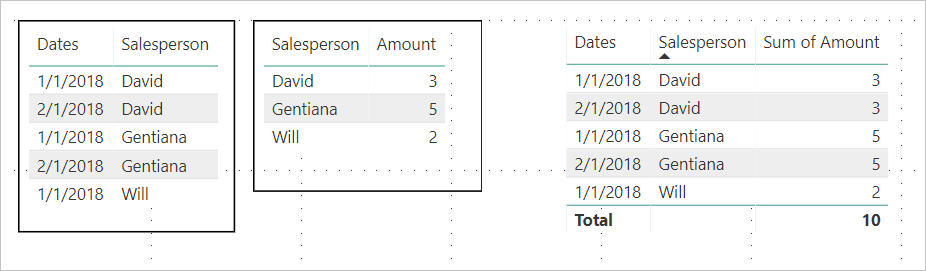
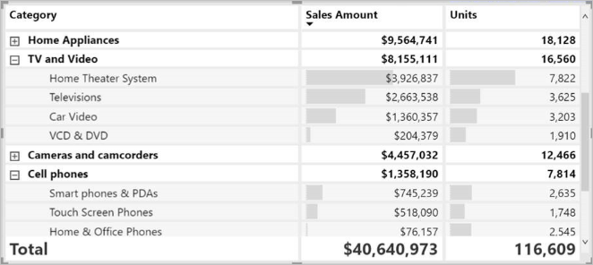
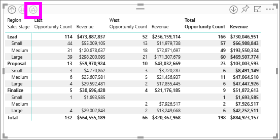

# Create matrix visualizations in Power BI

[!INCLUDE [applies-yes-desktop-yes-service](../includes/applies-yes-desktop-yes-service.md)]

The matrix visual is similar to a table.  A table supports two dimensions and the data is flat, meaning duplicate values are displayed and not aggregated. A matrix makes it easier to display data meaningfully across multiple dimensions -- it supports a stepped layout. The matrix automatically aggregates the data and enables you to drill down. 

You can create matrix visuals in **Power BI Desktop** reports and cross-highlight elements within the matrix with other visuals on that report page. For example, you can select rows, columns, and even individual cells and cross-highlight. Also, individual cells and multiple cell selections can be copied and pasted into other applications. 

There are many features associated with the matrix, and we'll go through them in the following sections of this article.

> [!NOTE]
> Sharing your report with a Power BI colleague requires that you both have individual Power BI Pro licenses or that the report is saved in Premium capacity.

## Understanding how Power BI calculates totals

Before jumping into how to use the matrix visual, it's important to learn how Power BI calculates total and subtotal values in tables and matrices. For total and subtotal rows, Power BI evaluates the measure over all rows in the underlying data – it isn't just a simple addition of the values in the visible or displayed rows. This means you can end up with different values in the total row than you might expect.

Take a look at the following matrix visuals. 

In this example, each row in the matrix visual farthest to the right is showing the *Amount* for each salesperson/date combination. However, since a salesperson shows up against multiple dates, the numbers can appear more than once. Thus, the accurate total from the underlying data, and a simple addition of the visible values, do not equate. This is a common pattern when the value you’re summing is on the ‘one’ side of a one-to-many relationship.

When you look at totals and subtotals, remember that those values are based on the underlying data. They aren't solely based on the visible values.

## Expanding and collapsing row headers

There are two ways you can expand row headers. The first is through the right-click menu. You’ll see options to expand the specific row header you selected, the entire level, or everything down to the very last level of the hierarchy. You have similar options for collapsing row headers as well.

You can also add +/- buttons to the row headers through the formatting pane under the **Row headers** card. By default, the icons will match the formatting of the row header, but you can customize the icons’ colors and sizes separately if you want.

Once the icons are turned on, they work similar to PivotTable icons in Excel.

The expansion state of the matrix will save with your report. A matrix can be pinned to a dashboard expanded or collapsed. When that dashboard tile is selected, and the report opens, the expansion state can still be changed in the report. 

> [!NOTE]
> If you're building a report on top of an Analysis Services multidimensional model, there are some special considerations for expand/collapse if the model uses the Default Member feature. For more information see [Work with multidimensional models in Power BI](../connect-data/desktop-default-member-multidimensional-models.md)

## Using drill-down actions with the matrix visual

With the matrix visual, you can do all sorts of interesting drill-down activities that weren't available before. This includes the ability to drill down using rows, columns, and even into individual sections and cells. Let's take a look at how each of these works.

### Drill down on row headers

In the Visualizations pane, when you add multiple fields to the **Rows** section of the **Fields** well, you enable drill-down actions on the rows of the matrix visual. This is similar to creating a hierarchy, which then allows you to drill down (and then back up) through that hierarchy, and analyze the data at each level.

In the following image, the **Rows** section contains *Sales stage* and *Opportunity size*, creating a grouping (or hierarchy) in the rows that we can drill to see details.

When the visual has grouping created in the **Rows** section, the visual itself displays the *drill* and *expand* icons in the top-left corner of the visual.

Similar to the drill and expand behavior in other visuals, selecting those buttons lets us drill down (or back up) through the hierarchy. In this case, we can drill down from *Sales stage* to *Opportunity size*, as shown in the following image, where the **drill down one level** icon (the pitchfork) has been selected.

In addition to using those icons, you can select any of those row headers and drill down by choosing from the menu that appears.

Notice there are a few options from the menu that appears, which generate different results:

Selecting **Drill Down** expands the matrix for *that* row level, *excluding* all other row headings except the row header that was selected. In the following image, **Proposal** > **Drill Down** was selected. Notice that other top-level rows no longer appear in the matrix. This way to drill is a useful feature, and becomes especially cool when we get to the cross-highlighting section.

Select the **Drill up** icon to get back to the previous top-level view. If you then select **Proposal** > **Show Next Level**, you get an ascending listing of all the next-level items (in this case, the *Opportunity size* field), without the higher-level hierarchy categorization.

Select the **Drill up** icon in the upper-left corner to have the matrix show all top-level categories, then select **Proposal** > **Expand to next level**, to see all the values for both levels of the hierarchy - *Sales stage* and *Opportunity size*.

You can also use the **Expand** menu item to control the display further.  For example, select  **Proposal** > **Expand** > **Selection**. Power BI displays one total row for each *Sales stage* and all the *Opportunity size* options for *Proposal*.

### Drill down on column headers

Similar to the ability to drill down on rows, you can also drill down on columns. In the following image, there are two fields in the **Columns** field well, creating a hierarchy similar to what we used for the rows earlier in this article. In the **Columns** field well, we have *Region* and *Segment*. As soon as the second field was added to **Columns**, a new dropdown menu displayed on the visual, it currently shows **Rows**.

To drill down on columns, select **Columns** from the *Drill on* menu that can be found in the upper left corner of the matrix. Select the *East* region and choose **Drill Down**.

When you select **Drill Down**, the next level of the column hierarchy for *Region > East* displays, which in this case is *Opportunity count*. The other region is hidden.

The rest of the menu items work on columns in the same way they do for rows (see the previous section, **Drill down on row headers**). You can **Show Next Level** and **Expand to next level** with columns just as you can with rows.

> [!NOTE]
> The drill-down and drill-up icons in the upper-left of the matrix visual only apply to rows. In order to drill down on columns, you must use the right-click menu.

## Stepped layout with matrix visuals

The matrix visual automatically indents subcategories in a hierarchy beneath each parent, called a stepped layout.

In the original version of the matrix visual, subcategories were shown in an entirely different column, taking up much more space in the visual. The following image shows the table in original matrix visual; notice the subcategories in a separate column.

In the following image, you see a matrix visual, with stepped layout in action. Notice the category *Computers* has its subcategories (Computers Accessories, Desktops, Laptops, Monitors, and so on) slightly indented, providing a cleaner and much more condensed visual.

You can easily adjust the stepped layout settings. With the matrix visual selected, in the **Format** section (the paint roller icon) of the **Visualizations** pane, expand the row headers section. You have two options: the stepped layout toggle (which turns it on or off), and the stepped layout indentation (specifies the indentation amount, in pixels).

If you turn off stepped layout, Power BI shows the subcategories in another column rather than indented beneath the parent category.

## Subtotals and grand totals with matrix visuals

You can turn subtotals on or off in matrix visuals, for both rows and columns. In the following image, you can see that the row subtotals are set to **On** and set to display at the bottom.

When you turn on **Subtotals** and add a label, Power BI also adds a row, and the same label, for the grand total value. To format your grand total, select the format option for **Grand total**. 

If you want to turn subtotals and grand total off, in the format section of the visualizations pane, expand the **Subtotals** card. Turn the row subtotals slider to **Off**. When you do so, the subtotals aren't shown.

The same process applies for column subtotals.

## Add conditional icons

Add visual cues to your table or matrix with *conditional icons*. 

In the format section of the Visualizations pane, expand the **Conditional formatting** card. Turn the **Icons** slider to **On** and select **Advanced controls**.

Adjust the conditions, icons, and colors for your matrix and select **OK**. In this example, we used a red flag for low values, purple circle for high values, and yellow triangle for everything in between. 

## Cross-highlighting with matrix visuals

With the matrix visual, you can select any elements in the matrix as the basis for cross-highlighting. Select a column in a matrix and Power BI highlights the column, as does any other visuals on the report page. This type of cross-highlighting has been a common feature of other visuals and data point selections, so now the matrix visual offers the same function.

In addition, using Ctrl+Click also works for cross-highlighting. For example, in the following image a collection of subcategories were selected from the matrix visual. Notice how items that weren't selected from the visual are grayed out, and how the other visuals on the page reflect the selections made in the matrix visual.

## Copying values from Power BI for use in other applications

Your matrix or table may have content that you'd like to use in other applications: Dynamics CRM, Excel, and other Power BI reports. With the Power BI right-click, you can copy a single cell or a selection of cells onto your clipboard. Then, paste them into the other application.

* To copy the value of a single cell, select the cell,  right-click, and choose **Copy value**. With the _unformatted_ cell value on your clipboard, you can now paste it into another application.

    

* To copy more than a single cell, select a range of cells or use CTRL to select one or more cells.  **Copy selection** will ensure that measures are formatted according to the column's formatting rules, unlike the unformatted **Copy value** command.

    

* The copy will include the column and row headers.

    

* To make a copy  of the visual itself containing only your selected cells, select one or more cells using CTRL, right-click, and choose **Copy visual**

    

* The copy will be another matrix visualization, but contain only your copied data.

    

## Setting a matrix value as a custom URL

If you have a column or measure that contains website URLs, you can use conditional formatting to apply those URLs to fields as active links. You’ll find this option under the **Conditional formatting** card in the formatting pane.

Turn **Web URL** On, and select a field to use as the URL for the column. Once applied, the values in that field (column) become active links. Hover to see the link, and select to jump to that page. 

For more information, see [Conditional table formatting](../create-reports/desktop-conditional-table-formatting.md)

## Shading and font colors with matrix visuals

With the matrix visual, you can apply conditional formatting (colors and shading and data bars) to the background of cells within the matrix, and you can apply conditional formatting to the text and values themselves.

To apply conditional formatting, select the matrix visual and open the **Format** pane. Expand the **Conditional formatting** card and for **Background color**, **Font color**, or **Data bars**, turn the slider to **On**. Turning on one of these options displays a link for *Advanced controls*, which lets you customize the colors and values for the color formatting.
  
  

Select *Advanced controls* to display a dialog, which lets you make adjustments. This example shows the dialog for **Data bars**.

## Ragged hierarchy

A ragged hierarchy has levels with no data.  A good example is a company employee matrix. A company has many levels, from CEO on down.  The CEO is the highest level in the hierarchy and reports to no other employees.  Any other company employee, on the other hand, may report to a chain of managers who report to a vice-president who reports to the CEO. Depending on their level in the hierarchy and the way their department is organized, employees may have data for one, two, five, or ten levels in the hierarchy. And, for any given employee, there may be no data for particular hierarchy levels.  

There is currently no way to hide blank rows or identical parent and child values. And you can’t control which levels of the hierarchy can and can’t be expanded. However, there are a few steps you can take to make the visual look more appealing.    

* Turn off stepped layout. In the Format pane, expand the **Row headers** card and set the **Stepped layout** toggle to **Off**.  All the blank values for a hierarchy level will now display in the same row.

  

* Turn off subtotals for the matrix rows and columns. In the Format pane, select **Format** > **Subtotals**.

  

## Considerations and troubleshooting

* If the text data in your matrix's cells or headers contain new line characters, those characters will be ignored unless you toggle on the 'Word Wrap' option in the element's associated formatting pane card. 

## Next steps

[Power Apps visual for Power BI](power-bi-visualization-powerapp.md)

[Visualization types in Power BI](power-bi-visualization-types-for-reports-and-q-and-a.md)
