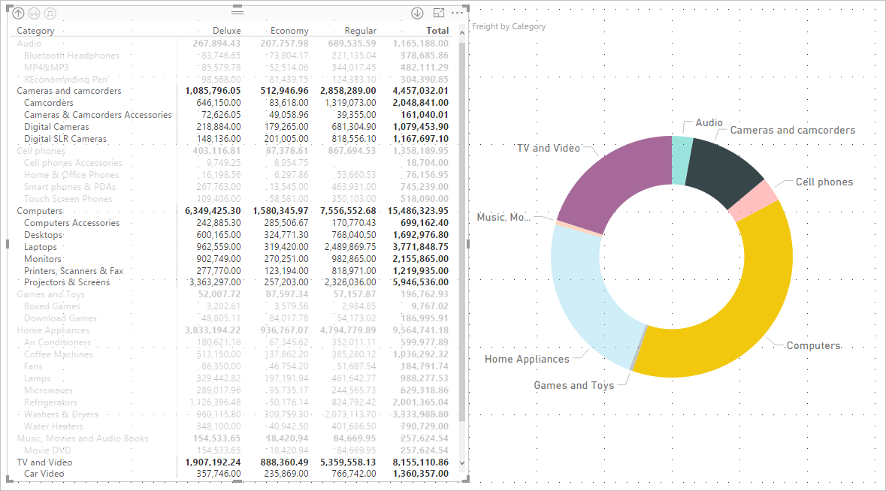
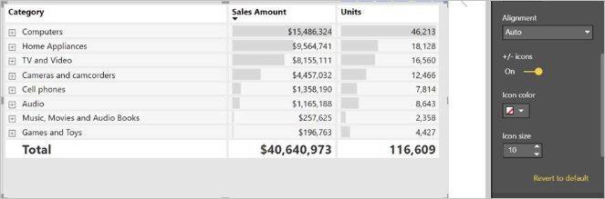
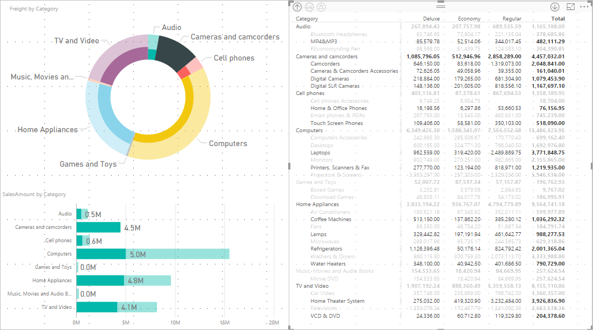

# Use the Matrix visual in Power BI Desktop
With the **Matrix** visual feature, you can create matrix visuals (sometimes also referred to as *tables*) in **Power BI Desktop** and **Power BI service** reports and cross-highlight elements within the matrix with other visuals. In addition, you can select rows, columns, and even individual cells and cross-highlight. Individual cells and multiple cell selections can by copied and pasted into other applications. Lastly, to make better use of layout space, the matrix visual supports a stepped layout.

There are many features associated with the matrix, and we'll go through them in the following sections of this article.

## Report themes
Both matrix and table visuals reflect styling (including colors) from the applied **Report Theme**. These may not be the colors you expect for your matrix visual, which you can change in your **Report Theme** configuration. For more information, see [**Use Report Themes in Power BI Desktop**](../desktop-report-themes.md) for more information about themes.

## Understanding how Power BI calculates totals

Before jumping into how to use the **Matrix** visual, it's important to understand how Power BI calculates total and subtotal values in tables and matrices. For total and subtotal rows, the measure is evaluated over all rows in the underlying data – it is *not* just a simple addition of the values in the visible or displayed rows. This means you can end up with different values in the total row than you might expect. 

Take a look at the following **Matrix** visuals. 

In this example, each row in the **Matrix** visual farthest to the right is showing the *Amount* for each salesperson/date combination. However, since a salesperson shows up against multiple dates, the numbers can appear more than once. Thus, the accurate total from the underlying data, and a simple addition of the visible values, do not equate. This is a common pattern when the value you’re summing is on the ‘one’ side of a one-to-many relationship.

When looking at total and subtotals, remember that those values are based on the underlying data, and not solely based on the visible values. 

<!-- use Nov blog post video

## Expanding and collapsing row headers
There are two ways you can expand row headers. The first is through the right-click menu. You’ll see options to expand the specific row header you clicked on, the entire level or everything down to the very last level of the hierarchy. You have similar options for collapsing row headers as well.

You can also add +/- buttons to the row headers through the formatting pane under the row headers card. By default, the icons will match the formatting of the row header, but you can customize the icons’ color and size separately if you want. 
Once the icons are turned on, they work similarly to the icons from PivotTables in Excel.

The expansion state of the matrix will save with your report. It can be pinned to dashboards as well, but consumers will need to open up the report to change the state. Conditional formatting will only apply to the inner most visible level of the hierarchy. Note that this expand/collapse experience is not currently supported when connecting to AS servers older than 2016 or MD servers.

Watch the following video to learn more about expand/collapse in the matrix:

-->
## Using drill down with the Matrix visual
With the **Matrix** visual, you can do all sorts of interesting drill down activities that weren't available before. This includes the ability to drill down using rows, columns, and even into individual sections and cells. Let's take a look at how each of these works.

### Drill down on row headers
In the **Visualizations** pane, when you add multiple fields to the **Rows** section of the **Fields** well, you enable drill down on the rows of the matrix visual. This is similar to creating a hierarchy, which then allows you to drill down (and then back up) through that hierarchy, and analyze the data at each level.

In the following image, the **Rows** section contains *Category* and *SubCategory*, creating a grouping (or hierarchy) in the rows that we can drill through.

When the visual has grouping created in the **Rows** section, the visual itself displays the *drill* and *expand* icons in the top-left corner of the visual.

Similar to the drill and expand behavior in other visuals, selecting those buttons lets us drill down (or back up) through the hierarchy. In this case, we can drill down from *Category* to *SubCategory*, as shown in the following image, where the drill down one level icon (the pitchfork) has been selected.

In addition to using those icons, you can right-click on any of those row headers and drill down by selecting from the menu that appears.

Notice there are a few options from the menu that appears, which generate different results:

Selecting **Drill Down** expands the matrix for *that* row level, *excluding* all other row headings except the row header that was right-clicked. In the following image, *Computers* was right-clicked, and **Drill Down** was selected. Notice that other top-level rows no longer appear in the matrix. This way to drill is a useful feature, and becomes especially cool when we get to the **cross-highlighting** section.

You can click the **Drill up** icon to get back to the previous top-level view. If you then select **Show Next Level** from the right-click menu, you get an alphabetical listing of all the next-level items (in this case, the *SubCategory* field), without the higher-level hierarchy categorization.

When you click on the **Drill up** icon in the upper-left corner to have the matrix show all top-level categories, then right-click again and select **Expand to next level**, you see the following visual.

You can also use the **Include** and **Exclude** menu items to keep (or remove, respectively) the right-clicked row (and any subcategories) from the matrix.

### Drill down on column headers
Similar to the ability to drill down on Rows, you can also drill down on **Columns**. In the following image, you can see that there are two fields in the **Columns** field well, creating a hierarchy similar to what we used for the rows earlier in this article. In the **Columns** field well, we have *Class* and *Color*.

In the **Matrix** visual, when we right-click a column, we see the option to drill down. In the following image, we right-click on *Deluxe* and select **Drill Down**.

When you select **Drill Down**, the next level of the column hierarchy for *Deluxe* displays, which in this case is *Color*.

The rest of the right-click menu items work on columns in the same way they do for rows (see the previous section, **Drill down on row headers**). You can **Show Next Level**, **Expand to next level**, **Include**, or **Exclude** your columns just as you can with rows.

> [!NOTE]
> The drill down and drill up icons in the upper-left of the matrix visual only apply to rows. In order to drill down on columns, you must use the right-click menu.
> 
> 

## Stepped layout with matrix visuals
The **Matrix** visual automatically indents subcategories in a hierarchy beneath each parent, which is called a **Stepped layout**.

In the *original* version of the matrix visual, subcategories were shown in an entirely different column, taking up much more space in the visual. The following image shows the table in original **Matrix** visual; notice the subcategories in a separate column.

In the following image, you see a **Matrix** visual, with **Stepped layout** in action. Notice the category *Computers* has its subcategories (Computers Accessories, Desktops, Laptops, Monitors, and so on) slightly indented, providing a cleaner and much more condensed visual.

You can easily adjust the stepped layout settings. With the **Matrix** visual selected, in the **Format** section (the paint roller icon) of the **Visualizations** pane, expand the **Row headers** section. You have two options: the **Stepped layout** toggle (which turns it on or off), and the **Stepped layout indentation** (specifies the indentation amount, in pixels).

If you turn off **Stepped layout**, the subcategories are shown in another column rather than indented beneath the parent category.

## Subtotals with matrix visuals
You can turn subtotals on or off in matrix visuals, for both rows and columns. In the following image, you can see that the row subtotals are set to **on**.

In the **Format** section of the **Visualizations** pane, expand the **Subtotals** card, and turn the **Row subtotals** slider to **Off**. When you do so, the subtotals are not shown.

The same process applies for column subtotals.

## Cross-highlighting with matrix visuals
With the **Matrix** visual, you can select any elements in the matrix as the basis for cross-highlighting. Select a column in a **Matrix** and that column is highlighted, as are any other visuals on the report page. This type of cross-highlighting has been a common feature of other visuals and data point selections, so now the **Matrix** visual offers the same function.

In addition, using Ctrl+Click also works for cross-highlighting. For example, in the following image a collection of subcategories were selected from the **Matrix** visual. Notice how items that weren't selected from the visual are grayed out, and how the other visuals on the page reflect the selections made in the **Matrix** visual.

## Copying values from Power BI for use in other applications

Your matrix or table may have content that you'd like to use in other applications, like Dynamics CRM, Excel, and even other Power BI reports. With the Power BI right-click, you can copy a single cell or a selection of cells onto your clipboard, and paste into the other application.

* To copy the value of a single cell, select the cell,  right-click, and choose **Copy value**. With the unformatted cell value on your clipboard, you can now paste it into another application.

    

* To copy more than a single cell, select a range of cells or use CTRL to select one or more cells. The copy will include the column and row headers.

    

## Shading and font colors with matrix visuals
With the **Matrix** visual, you can apply **Conditional formatting** (colors and shading) to the background of cells within the matrix, and you can apply conditional formatting to the text and values themselves.

To apply conditional formatting, you can do either of the following when a matrix visual is selected:

* In the **Fields** pane, right-click the Field, and select **Conditional formatting** from the menu.
  
  
* Or, in the **Format** pane, expand the **Conditional formatting** card and for either **Background color scales** or **Font color scales**, turn the slider to **On**. Turning on either option displays a link for *Advanced controls*, which lets you customize the colors and values for the color formatting.
  
  

Either approach achieves the same result. Selecting *Advanced controls* displays the following dialog, which lets you make adjustments:

## Next steps

[Scatter and bubble charts in Power BI](power-bi-visualization-scatter.md)

[Visualization types in Power BI](power-bi-visualization-types-for-reports-and-q-and-a.md)