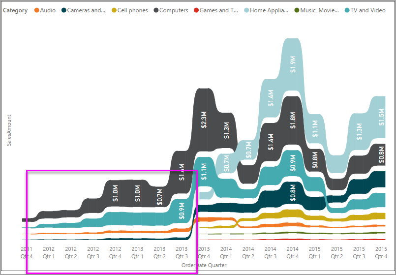
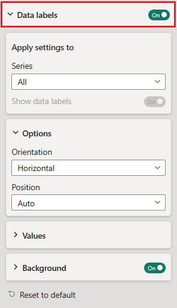

# Create ribbon charts in Power BI

[!INCLUDE [applies-yes-desktop-yes-service](../includes/applies-yes-desktop-yes-service.md)]

You can create ribbon charts to visualize data, and quickly discover which data category has the highest rank (largest value). Ribbon charts are effective at showing rank change, with the highest range (value) always displayed on top for each time period. 

> [!NOTE]
> Sharing your report with a Power BI colleague requires that you both have individual Power BI Pro licenses or that the report is saved in Premium capacity. See [sharing reports](../collaborate-share/service-share-reports.md).

## Prerequisites

This tutorial uses the [Retail Analysis sample PBIX file](https://download.microsoft.com/download/9/6/D/96DDC2FF-2568-491D-AAFA-AFDD6F763AE3/Retail%20Analysis%20Sample%20PBIX.pbix).

1. From the upper left section of the menubar, select **File** > **Open**
   
2. Find your copy of the **Retail Analysis sample PBIX file**

1. Open the **Retail Analysis sample PBIX file** in report view .

1. Select  to add a new page.

## Create a ribbon chart

1. To create a ribbon chart, select **Ribbon chart** from the **Visualizations** panel.

    

    Ribbon charts connect a category of data over the visualized time continuum using ribbons, enabling you to see how a given category ranks throughout the span of the chart's x-axis (usually the timeline).

2. Select fields for **Axis**, **Legend**, and **Value**.  In this example, we've selected: **Store** > **OpenDate**, **Item** > **Category**, and **Sales** > **This year sales** > **Value**.  

    

    Since the dataset contains data for only one year, we removed the **Year** and **Quarter** field from the **Axis** well.

3. The ribbon chart shows rank for every month. Notice how rank changes across time. For example, the Home category moves from second to fifth from February to March.

    

## Format a ribbon chart
When you create a ribbon chart, you have formatting options available in the **Format** section of the **Visualizations** pane. The formatting options for ribbon charts are similar to those for a stacked column chart, with additional formatting options that are specific to the ribbons.

These formatting options for ribbon charts let you make adjustments.

* **Spacing** lets you adjust how much space appears between ribbons. The number is the percentage of the column's maximum height.
* **Match series color** allows you to match the color of the ribbons with the series color. When set to **off**, ribbons are gray.
* **Transparency** specifies how transparent the ribbons are, with the default set to 30.
* **Border** lets you place a dark border on the top and bottom of the ribbons. By default, borders are off.

Since the ribbon chart does not have y-axis labels, you may want to add data labels. From the Formatting pane, select **Data labels**. 

Set formatting options for your data labels. In this example, we've set the text color to white and display units to thousands.

## Next steps

[Scatter charts and bubble charts in Power BI](power-bi-visualization-scatter.md)

[Visualization types in Power BI](power-bi-visualization-types-for-reports-and-q-and-a.md)
