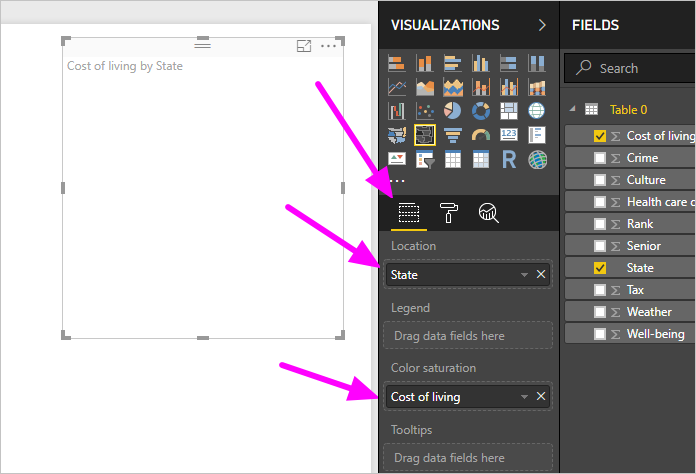
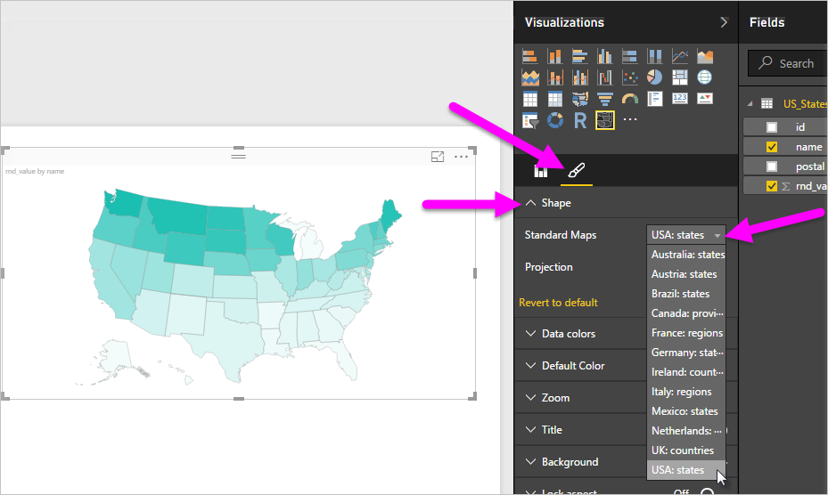
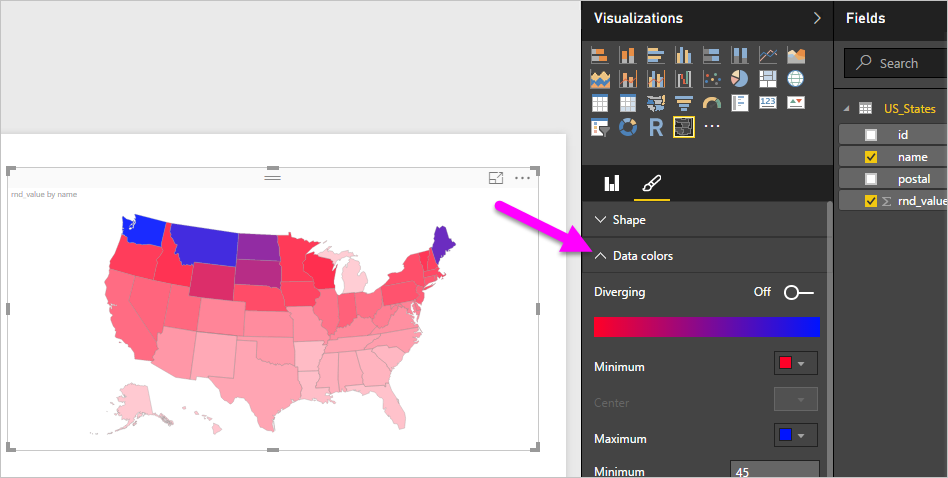
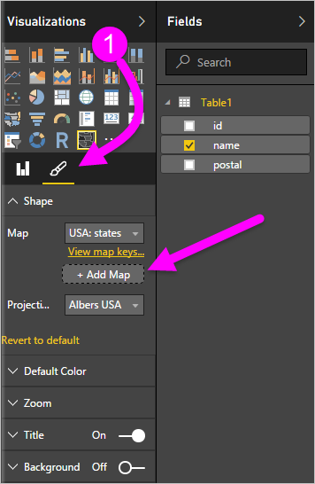

# Shape Maps in Power BI Desktop (Preview)

Create a **Shape Map** visual to compare regions on a map using color. Unlike the **Map** visual, **Shape Map** can't show precise geographical locations of data points on a map. Instead, its main purpose is to show relative comparisons of regions on a map by coloring them differently.

Power BI bases **Shape Map** visuals on ESRI/TopoJSON maps, which have the compelling ability to use custom maps that you can create. Examples of custom maps are: geographical, seating arrangements, floor plans, and others. The ability to use custom maps isn't available in this Preview release of **Shape Map**.

## Creating Shape Maps

You can test the **Shape Map** control with the maps that are shipping with this Preview release. You can also use your own custom map as long as it meets the requirements outlined in the [**Use Custom Maps**](#use-custom-maps) section.

The **Shape Map** visual is one of the Preview Features, and you must enable it in Power BI Desktop. To enable **Shape Map**, select **File > Options and Settings > Options > Preview Features**, then select the **Shape Map Visual** checkbox. You'll need to restart Power BI Desktop after you make the selection.

Once **Shape Map** is enabled, click the **Shape Map** control from the **Visualizations** pane.

Power BI Desktop creates an empty **Shape Map** visual design canvas.

Do the following to create a **Shape Map**:

1. In the **Fields** pane, drag a data field that has the region names (or abbreviations) into the **Location** well.

1. Then, drag a data measure field into the **Color saturation** well. You won't see a map yet.

   

   > [!NOTE]
   > See the [**Get Map Data**](#get-map-data) section below for information on how to quickly get map data to test **Shape Map**.

1. In the **Format** settings pane, expand **Shape**, and select from the **Standard Maps** drop-down to show your data. At this point, the rendering appears:

   

   > [!NOTE]
   > In the [**Region Keys**](#region-keys) section at the end of this article is a collection of tables that have map regions keys you can use to test the **Shape Map** visual.

1. You can then modify the map projection, zooming settings, and the colors of data points from the **Format** settings pane. For example, you can change colors, set maximums and minimums, and so on.

   

1. You can also add a category data column to the **Legend** well, and classify the map regions based on categories.

## Use custom maps

You can use custom maps with **Shape Map** as long as they are in the **TopoJSON** format. If your map is in another format, you can use online tools such as [**Map Shaper**](http://mapshaper.org/) to convert your *shapefiles* or your *GeoJSON* maps into the **TopoJSON** format.

To use your **TopoJSON** map file:

1. Add a ShapeMap visual to your report.

1. Add some data to the *Location* and *Color saturation* buckets.

1. Then, in the **Visualizations** pane with the **Format** section selected (shown as (1) in the following image), expand the **Shape** section:

    

1. Select **+ Add Map**.

## Sample Custom Map

The *Offices of the United States Attorneys* release an annual fiscal report on their litigation and caseload data. You can find all of their reports on the [Offices of the United States Attorneys](https://www.justice.gov/usao/resources/annual-statistical-reports) website.

Since you can divide states into multiple districts, we have to use a custom shape map. By importing the **TopoJSON** map of the U.S. judicial districts into **Power BI Desktop**, we can then visualize the annual fiscal district attorney data. The image below shows an example of this map.

You can do interesting things with the individual state maps as well, and show more detail based on the districts it contains.

If you’d like to experiment with this dataset and visualization, you can download the original PBIX file used to generate this report at the following link:

* [Custom shape map demo .PBIX file](http://download.microsoft.com/download/1/2/8/128943FB-9231-42BD-8A5D-5E2362C9D589/DistrictAttorneyFiscalReport.pbix)

## Get map data

To quickly get data into a model so you can test **Shape Map**, copy one of the tables at the end of this article, then select **Enter Data** from the **Home** ribbon.

If your data has multiple columns, you'll need to use an editor like Excel to paste the data, then copy each data column separately. You can then paste the data into Power BI Desktop. The top row is automatically identified as a header.

You can enter a new column simply by typing a new column name (in the blank column to the right), then add values in each cell, just like you can do in Excel. When finished, select **Load**. Power BI adds the table to the data model for Power BI Desktop.

> [!NOTE]
> When working with countries or regions, use the three-letter abbreviation to ensure that geocoding works properly in map visualizations. Do *not* use two-letter abbreviations, as some countries or regions may not be properly recognized.
>
> If you only have two-letter abbreviations, check out [this external blog post](https://blog.ailon.org/how-to-display-2-letter-country-data-on-a-power-bi-map-85fc738497d6#.yudauacxp) for steps on how to associate your two-letter country/region abbreviations with three-letter country/region abbreviations.

## Preview behavior and requirements

There are a few considerations and requirements for this Preview release of **Shape Map**:

* The **Shape Map** visual is one of the Preview Features, and you must enable it in Power BI Desktop. To enable **Shape Map**, select **File > Options and Settings > Options > Preview Features**, then select the **Shape Map Visual** checkbox.

* Currently, you must also have the **Color saturation** well set in order for the **Legend** classification to work properly.

* The final release version of **Shape Map** will have a user interface that shows the map keys of the currently selected map. There's no date set for final release. **Shape Map** is still one of the Preview Features. In this Preview release, you can reference the map region keys in the tables. You can find them in the next section.

* The **Shape Map** visual will plot up to a maximum of 1,000 data points.

## Region keys

Use the following **Region Keys** in this Preview release to test **Shape Map**.

### Australia: States

| `id` | `abbr` | `iso` | `name` | `postal` |
| --- | --- | --- | --- | --- |
| au-wa |WA |AU-WA |Western Australia |WA |
| au-vic |Vic |AU-VIC |Victoria |VIC |
| au-tas |Tas |AU-TAS |Tasmania |TAS |
| au-sa |SA |AU-SA |South Australia |SA |
| au-qld |Qld |AU-QLD |Queensland |QLD |
| au-nt |NT |AU-NT |Northern Territory |NT |
| au-nsw |NSW |AU-NSW |New South Wales |NSW |
| au-act |ACT |AU-ACT |Australian Capital Territory |ACT |

### Austria: States

| `id` | `iso` | `name` | `name-en` | `postal` |
| --- | --- | --- | --- | --- |
| at-wi |AT-9 |Wien |Vienna |WI |
| at-vo |AT-8 |Vorarlberg |Vorarlberg |VO |
| at-tr |AT-7 |Tirol |Tyrol |TR |
| at-st |AT-6 |Steiermark |Styria |ST |
| at-sz |AT-5 |Salzburg |Salzburg |SZ |
| at-oo |AT-4 |Oberösterreich |Upper Austria |OO |
| at-no |AT-3 |Niederösterreich |Lower Austria |NO |
| at-ka |AT-2 |Kärnten |Carinthia |KA |
| at-bu |AT-1 |Burgenland |Burgenland |BU |

### Brazil: States

| `id` |
| --- |
| Tocantins |
| Pernambuco |
| Goias |
| Sergipe |
| Sao Paulo |
| Santa Catarina |
| Roraima |
| Rondonia |
| Rio Grande do Sul |
| Rio Grande do Norte |
| Rio de Janeiro |
| Piaui |
| Parana |
| Paraiba |
| Para |
| Minas Gerais |
| Mato Grosso |
| Maranhao |
| Mato Grosso do Sul |
| Distrito Federal |
| Ceara |
| Espirito Santo |
| Bahia |
| Amazonas |
| Amapa |
| Alagoas |
| Acre |
| Litigated Zone 1 |
| Litigated Zone 2 |
| Litigated Zone 3 |
| Litigated Zone 4 |

### Canada: Provinces

| `id` | `iso` | `name` | `postal` |
| --- | --- | --- | --- |
| ca-nu |CA-NU |Nunavut |NU |
| ca-nt |CA-NT |Northwest Territories |NT |
| ca-yt |CA-YT |Yukon |YT |
| ca-sk |CA-SK |Saskatchewan |SK |
| ca-qc |CA-QC |Quebec |QC |
| ca-pe |CA-PE |Prince Edward Island |PE |
| ca-on |CA-ON |Ontario |ON |
| ca-ns |CA-NS |Nova Scotia |NS |
| ca-nl |CA-NL |Newfoundland and Labrador |NL |
| ca-nb |CA-NB |New Brunswick |NB |
| ca-mb |CA-MB |Manitoba |MB |
| ca-bc |CA-BC |British Columbia |BC |
| ca-ab |CA-AB |Alberta |AB |

### France: Regions

| `id` | `name` | `name-en` |
| --- | --- | --- |
| Alsace |Alsace |Alsace |
| Rhone-Alpes |Rhône-Alpes |Rhone-Alpes |
| Provence-Alpes-Cote d'Azur |Provence-Alpes-Côte d'Azur |Provence-Alpes-Cote d'Azur |
| Poitou-Charentes |Poitou-Charentes |Poitou-Charentes |
| Picardie |Picardie |Picardy |
| Pays de la Loire |Pays de la Loire |Pays de la Loire |
| Nord-Pas-de-Calais |Nord-Pas-de-Calais |Nord-Pas-de-Calais |
| Midi-Pyrenees |Midi-Pyrénées |Midi-Pyrenees |
| Lorraine |Lorraine |Lorraine |
| Limousin |Limousin |Limousin |
| Languedoc-Roussillon |Languedoc-Roussillon |Languedoc-Roussillon |
| Ile-del-France |Île-de-France |Ile-de-France |
| Haute-Normandie |Haute-Normandie |Upper Normandy |
| Franche-Comte |Franche-Comté |Franche-Comte |
| Corse |Corse |Corsica |
| Champagne-Ardenne |Champagne-Ardenne |Champagne-Ardenne |
| Centre-Val de Loire |Centre-Val de Loire |Centre-Val de Loire |
| Bretagne |Bretagne |Brittany |
| Bourgogne |Bourgogne |Burgundy |
| Basse-Normandie |Basse-Normandie |Lower Normandy |
| Auvergne |Auvergne |Auvergne |
| Aquitaine |Aquitaine |Aquitaine |

### Germany: States

| `id` | `iso` | `name` | `name-en` | `postal` |
| --- | --- | --- | --- | --- |
| de-be |DE-BE |Berlin |Berlin |BE |
| de-th |DE-TH |Thüringen |Thuringia |TH |
| de-st |DE-ST |Sachsen-Anhalt |Saxony-Anhalt |ST |
| de-sn |DE-SN |Sachsen |Saxony |SN |
| de-mv |DE-MV |Mecklenburg-Vorpommern |Mecklenburg-Vorpommern |MV |
| de-bb |DE-BB |Brandenburg |Brandenburg |BB |
| de-sh |DE-SH |Schleswig-Holstein |Schleswig-Holstein |SH |
| de-sl |DE-SL |Saarland |Saarland |SL |
| de-rp |DE-RP |Rheinland-Pfalz |Rhineland-Palatinate |RP |
| de-nw |DE-NW |Nordrhein-Westfalen |North Rhine-Westphalia |NW |
| de-ni |DE-NI |Niedersachsen |Lower Saxony |NI |
| de-he |DE-HE |Hessen |Hesse |HE |
| de-hh |DE-HH |Hamburg |Hamburg |HH |
| de-hb |DE-HB |Bremen |Bremen |HB |
| de-by |DE-BY |Bayern |Bavaria |BY |
| de-bw |DE-BW |Baden-Württemberg |Baden-Wurttemberg |BW |

### Ireland: Counties

| `id` |
| --- |
| Wicklow |
| Wexford |
| Westmeath |
| Waterford |
| Sligo |
| Tipperary |
| Roscommon |
| Offaly |
| Monaghan |
| Meath |
| Mayo |
| Louth |
| Longford |
| Limerick |
| Leitrim |
| Laoighis |
| Kilkenny |
| Kildare |
| Kerry |
| Galway |
| Dublin |
| Donegal |
| Cork |
| Clare |
| Cavan |
| Carlow |

### Italy: Regions

| `id` | `iso` | `name` | `name-en` | `postal` |
| --- | --- | --- | --- | --- |
| it-vn |IT-34 |Veneto |Veneto |VN |
| it-vd |IT-23 |Valle d'Aosta |Aosta Valley |VD |
| it-um |IT-55 |Umbria |Umbria |UM |
| it-tt |IT-32 |Trentino-Alto Adige |Trentino-South Tyrol |TT |
| it-tc |IT-52 |Toscana |Tuscany |TC |
| it-sc |IT-82 |Sicilia |Sicily |SC |
| it-sd |IT-88 |Sardegna |Sardinia |SD |
| it-pm |IT-21 |Piemonte |Piedmont |PM |
| it-ml |IT-67 |Molise |Molise |ML |
| it-mh |IT-57 |Marche |Marche |MH |
| it-lm |IT-25 |Lombardia |Lombardy |LM |
| it-lg |IT-42 |Liguria |Liguria |LG |
| it-lz |IT-62 |Lazio |Lazio |LZ |
| it-fv |IT-36 |Friuli-Venezia Giulia |Friuli-Venezia Giulia |FV |
| it-er |IT-45 |Emilia-Romagna |Emilia-Romagna |ER |
| it-cm |IT-72 |Campania |Campania |CM |
| it-lb |IT-78 |Calabria |Calabria |LB |
| it-bc |IT-77 |Basilicata |Basilicata |BC |
| it-pu |IT-75 |Apulia |Puglia |PU |
| it-ab |IT-65 |Abruzzo |Abruzzo |AB |

### Mexico: States

| `id` | `abreviatura` | `iso` | `name` | `name-en` | `postal` |
| --- | --- | --- | --- | --- | --- |
| mx-zac |Zac. |MX-ZAC |Zacatecas |Zacatecas |ZA |
| mx-yuc |Yuc. |MX-YUC |Yucatán |Yucatan |YU |
| mx-ver |Ver. |MX-VER |Veracruz |Veracruz |VE |
| mx-tla |Tlax. |MX-TLA |Tlaxcala |Tlaxcala |TL |
| mx-tam |Tamps. |MX-TAM |Tamaulipas |Tamaulipas |TM |
| mx-tab |Tab. |MX-TAB |Tabasco |Tabasco |TB |
| mx-son |Son. |MX-SON |Sonora |Sonora |SO |
| mx-sin |Sin. |MX-SIN |Sinaloa |Sinaloa |SI |
| mx-slp |S.L.P. |MX-SLP |San Luis Potosí |San Luis Potosi |SL |
| mx-roo |Q.R. |MX-ROO |Quintana Roo |Quintana Roo |QR |
| mx-que |Qro. |MX-QUE |Querétaro |Queretaro |QE |
| mx-pue |Pue. |MX-PUE |Puebla |Puebla |PU |
| mx-oax |Oax. |MX-OAX |Oaxaca |Oaxaca |OA |
| mx-nle |N.L. |MX-NLE |Nuevo León |Nuevo Leon |NL |
| mx-nay |Nay. |MX-NAY |Nayarit |Nayarit |NA |
| mx-mor |Mor. |MX-MOR |Morelos |Morelos |MR |
| mx-mic |Mich. |MX-MIC |Michoacán |Michoacan |MC |
| mx-mex |Méx. |MX-MEX |Estado de México |Mexico State |MX |
| mx-jal |Jal. |MX-JAL |Jalisco |Jalisco |JA |
| mx-hid |Hgo. |MX-HID |Hidalgo |Hidalgo |HI |
| mx-gro |Gro. |MX-GRO |Guerrero |Guerrero |GR |
| mx-gua |Gto. |MX-GUA |Guanajuato |Guanajuato |GT |
| mx-dur |Dgo. |MX-DUR |Durango |Durango |DU |
| mx-dif |Col. |MX-DIF |Ciudad de México |Mexico City |DF |
| mx-col |Coah. |MX-COL |Colima |Colima |CL |
| mx-coa |Chis. |MX-COA |Coahuila |Coahuila |CA |
| mx-chh |Chih. |MX-CHH |Chihuahua |Chihuahua |CH |
| mx-chp |CDMX. |MX-CHP |Chiapas |Chiapas |CP |
| mx-cam |Camp. |MX-CAM |Campeche |Campeche |CM |
| mx-bcs |B.C.S. |MX-BCS |Baja California Sur |Baja California Sur |BS |
| mx-bcn |B.C. |MX-BCN |Baja California |Baja California |BN |
| mx-agu |Ags. |MX-AGU |Aguascalientes |Aguascalientes |AG |

### Netherlands: Provinces

| `id` | `iso` | `name` | `name-en` |
| --- | --- | --- | --- |
| nl-zh |NL-ZH |Zuid-Holland |South Holland |
| nl-ze |NL-ZE |Zeeland |Zeeland |
| nl-ut |NL-UT |Utrecht |Utrecht |
| nl-ov |NL-OV |Overijssel |Overijssel |
| nl-nh |NL-NH |Noord-Holland |North Holland |
| nl-nb |NL-NB |Noord-Brabant |North Brabant |
| nl-li |NL-LI |Limburg |Limburg |
| nl-gr |NL-GR |Groningen |Groningen |
| nl-ge |NL-GE |Gelderland |Gelderland |
| nl-fr |NL-FR |Fryslân |Friesland |
| nl-fl |NL-FL |Flevoland |Flevoland |
| nl-dr |NL-DR |Drenthe |Drenthe |

### UK: Countries

| `id` | `iso` | `name` |
| --- | --- | --- |
| gb-wls |GB-WLS |Wales |
| gb-sct |GB-SCT |Scotland |
| gb-nir |GB-NIR |Northern Ireland |
| gb-eng |GB-ENG |England |

### USA: States

| `id` | `name` | `postal` |
| --- | --- | --- |
| us-mi |Michigan |MI |
| us-ak |Alaska |AK |
| us-hi |Hawaii |HI |
| us-fl |Florida |FL |
| us-la |Louisiana |LA |
| us-ar |Arkansas |AR |
| us-sc |South Carolina |SC |
| us-ga |Georgia |GA |
| us-ms |Mississippi |MS |
| us-al |Alabama |AL |
| us-nm |New Mexico |NM |
| us-tx |Texas |TX |
| us-tn |Tennessee |TN |
| us-nc |North Carolina |NC |
| us-ok |Oklahoma |OK |
| us-az |Arizona |AZ |
| us-mo |Missouri |MO |
| us-va |Virginia |VA |
| us-ks |Kansas |KS |
| us-ky |Kentucky |KY |
| us-co |Colorado |CO |
| us-md |Maryland |MD |
| us-wv |West Virginia |WV |
| us-de |Delaware |DE |
| us-dc |District of Columbia |DC |
| us-il |Illinois |IL |
| us-oh |Ohio |OH |
| us-ca |California |CA |
| us-ut |Utah |UT |
| us-nv |Nevada |NV |
| us-in |Indiana |IN |
| us-nj |New Jersey |NJ |
| us-ri |Rhode Island |RI |
| us-ct |Connecticut |CT |
| us-pa |Pennsylvania |PA |
| us-ny |New York |NY |
| us-ne |Nebraska |NE |
| us-ma |Massachusetts |MA |
| us-ia |Iowa |IA |
| us-nh |New Hampshire |NH |
| us-or |Oregon |OR |
| us-mn |Minnesota |MN |
| us-vt |Vermont |VT |
| us-id |Idaho |ID |
| us-wi |Wisconsin |WI |
| us-wy |Wyoming |WY |
| us-sd |South Dakota |SD |
| us-nd |North Dakota |ND |
| us-me |Maine |ME |
| us-mt |Montana |MT |
| us-wa |Washington |WA |

## Next steps

* [Matrix visual in Power BI](desktop-matrix-visual.md)

* [Visualization types in Power BI](power-bi-visualization-types-for-reports-and-q-and-a.md)
