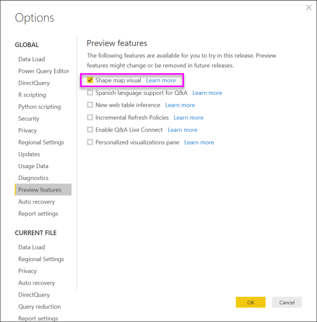
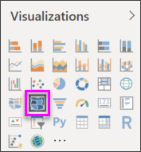
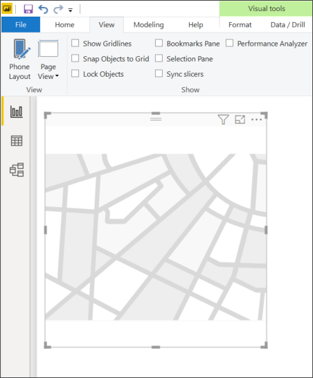
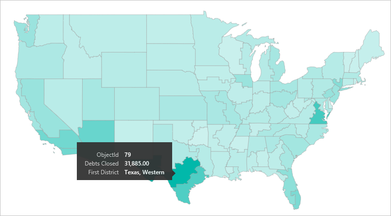
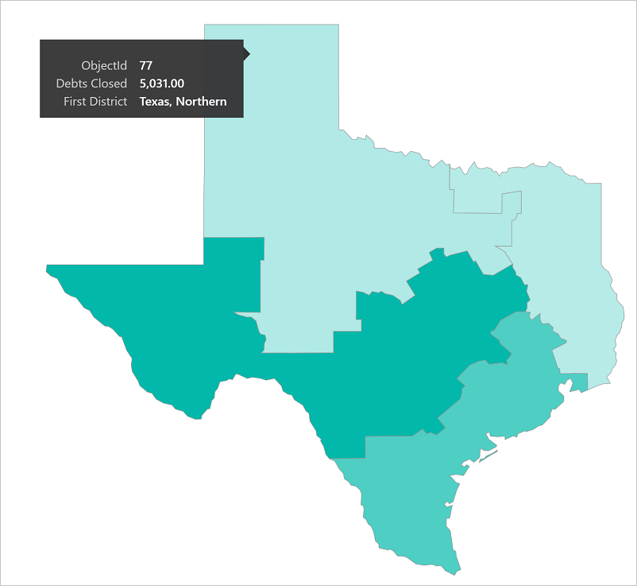
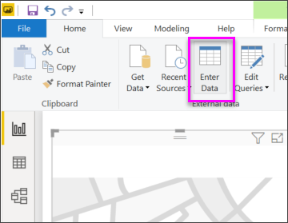

# Create Shape Map visualizations in Power BI Desktop (preview)

[!INCLUDE [applies-yes-desktop-yes-service](../includes/applies-yes-desktop-yes-service.md)]

Create a **Shape map** visual to compare regions on a map using color. Unlike the **Map** visual, **Shape map** doesn't show precise geographical locations of data points on a map. Instead, its main purpose is to compare regions on a map by coloring them differently.

:::image type="content" source="media/desktop-shape-map/power-bi-shape-map.png" alt-text="Example of a shape map.":::

The **Shape map** visual is only available in Power BI Desktop and not in Power BI service or mobile. Since it is in preview, it must be enabled before you can use it. To enable **Shape map**, select **File > Options and Settings > Options > Preview Features**, then select the **Shape map visual** checkbox. You'll need to restart Power BI Desktop after you make the selection.

> [!NOTE]
> Sharing your report with a Power BI colleague requires that you both have individual Power BI paid licenses or that the report is saved in Premium capacity.

## Creating Shape Maps
You can test the **Shape map** control with the maps that are shipping with this Preview release, or you can use your own custom map as long as it meets the requirements outlined in the following section called **Use custom maps**. **Shape map** visuals are based on maps that you can find on the Internet, create yourself, or convert to the TopoJSON format. See the section below to learn more. Examples of custom maps are: geographical, seating arrangements, floor plans, and others. 

In Power BI Desktop, after **Shape map visual** is enabled, select the **Shape map** icon from the **Visualizations** pane.

Power BI Desktop creates an empty **Shape map** visual design canvas.

Take the following steps to create a **Shape map**:

1. In the **Fields** pane, drag a data field that has geography names (or abbreviations) onto the **Location** bucket, and a data measure field into the **Color saturation** bucket.

   > [!NOTE]
   > To get sample map data you can use to test the **Shape map** visual, see the section titled **Getting map data** below.
   > 

   :::image type="content" source="media/desktop-shape-map/power-bi-shape-map-selections.png" alt-text="Build your shape map.":::

2. In the **Format** settings pane, expand **Shape**, and change the default **Map**. In this example we've selected **Italy**, and the rendering appears, as shown in the following image.

   :::image type="content" source="media/desktop-shape-map/power-bi-italy-map.png" alt-text="Open the Formatting pane and select Shape and then Italy.":::

   > [!NOTE]
   > In the **Region keys** section at the end of this article is a collection of tables that have map regions keys you can use to test the **Shape map** visual.
   > 
   > 
3. To display the map keys of the currently selected map, select **View map keys**.  In this example we're using a map of Mexico and the **Map keys** displays the values being used to buld the map. 

    :::image type="content" source="media/desktop-shape-map/power-bi-map-keys.png" alt-text="Select View map keys to display keys.":::

4. You can then modify the map using the Formatting options such as **Default color**, **Zoom**, and more. And, you can also add a category data column to the **Legend** bucket, and classify the map regions based on categories.

## Use custom maps
You can use custom maps with **Shape map** as long as they are in the **TopoJSON** format. If your map is in another format, you can use online tools such as [**Map Shaper**](https://mapshaper.org/) to convert your *shapefiles* or your *GeoJSON* maps into the **TopoJSON** format.

To use a **TopoJSON** map file, add a Shape map visual to your report and add some data to the *Location* and *Color saturation* buckets. Then, in the **Format** section, expand **Shape** and select **+ Add map**.

:::image type="content" source="media/desktop-shape-map/power-bi-add-custom.png" alt-text="open Formatting pane and select Add Map.":::

### Sample custom map
The *Offices of the United States Attorneys* release an annual fiscal report on their litigation and caseload data. We've converted some of their district data into .json files and added them to this sample PBIX: 

[Custom shape map demo .PBIX file](https://download.microsoft.com/download/1/2/8/128943FB-9231-42BD-8A5D-5E2362C9D589/DistrictAttorneyFiscalReport.pbix) 

If you'd like to experiment with custom maps, download this PBIX file and follow along.

1. From Power BI Desktop, select **File** > **Open report**. 

2. Since states can be divided into multiple districts, we have to use a custom shape map for districts.  By importing the **TopoJSON** map of the U.S. judicial districts into **Power BI Desktop**, we can then visualize the annual fiscal district attorney data.  The image below uses a custom map named *2000_districts_extra_simplified_CONUS.json* file.   

    :::image type="content" source="media/desktop-shape-map/power-bi-custom-maps.png" alt-text="Select the custom map for districts.":::

You can do interesting things with the individual state maps as well, and show more detail based on the districts it contains. 

## Getting map data
To quickly get data into a model to test **Shape map**, you can copy one of the tables at the end of this article, then select **Enter data** from the **Home** ribbon.

In this example, we've selected the data for Mexico and pasted it into Desktop using **Enter data**. The top row is automatically identified as a header.

:::image type="content" source="media/desktop-shape-map/power-bi-create-table.png" alt-text="Create table using copy and paste. ":::

You can enter a new column simply by typing a new column name (in the blank column to the right), then add values in each cell, just like you can do in Excel. When finished, select **Load** and the table is added to the data model for Power BI Desktop.

> [!NOTE]
> When working with countries or regions, use the three-letter abbreviation to ensure that geocoding works properly in map visualizations. Do *not* use two-letter abbreviations, as some countries or regions may not be properly recognized.
> 
> If you only have two-letter abbreviations, check out [this external blog post](https://blog.ailon.org/how-to-display-2-letter-country-data-on-a-power-bi-map-85fc738497d6#.yudauacxp) for steps on how to associate your two-letter country/region abbreviations with three-letter country/region abbreviations.
> 
> 

## Preview behavior and requirements
There are a few considerations and requirements for this Preview release of **Shape map**:

* The **Shape map** visual is in Preview, and must be enabled in Power BI Desktop. To enable **Shape map**, select **File > Options and Settings > Options > Preview Features**, then select the **Shape map visual** checkbox.
* Currently, you must also have the **Color saturation** bucket set in order for the **Legend** classification to work properly.

* The **Shape map** visual will plot up to a maximum of 1,500 data points.

* The United States districts reports referenced above can be found in the link below, https://www.justice.gov/usao/resources/annual-statistical-reports.

## Region keys

Use the following **Region keys** in this Preview release to test **Shape map**.

### Australia: States

| ID | abbr | iso | name | postal |
| --- | --- | --- | --- | --- |
| au-wa |WA |AU-WA |Western Australia |WA |
| au-vic |Vic |AU-VIC |Victoria |VIC |
| au-tas |Tas |AU-TAS |Tasmania |TAS |
| au-sa |SA |AU-SA |South Australia |SA |
| au-qld |Qld |AU-QLD |Queensland |QLD |
| au-nt |NT |AU-NT |Northern Territory |NT |
| au-nsw |NSW |AU-NSW |New South Wales |NSW |
| au-act |ACT |AU-ACT |Australian Capital Territory |ACT |

### Austria: States

| ID | iso | name | name-en | postal |
| --- | --- | --- | --- | --- |
| at-wi |AT-9 |Wien |Vienna |WI |
| at-vo |AT-8 |Vorarlberg |Vorarlberg |VO |
| at-tr |AT-7 |Tirol |Tyrol |TR |
| at-st |AT-6 |Steiermark |Styria |ST |
| at-sz |AT-5 |Salzburg |Salzburg |SZ |
| at-oo |AT-4 |Oberösterreich |Upper Austria |OO |
| at-no |AT-3 |Niederösterreich |Lower Austria |NO |
| at-ka |AT-2 |Kärnten |Carinthia |KA |
| at-bu |AT-1 |Burgenland |Burgenland |BU |

### Brazil: States

| ID |
| --- |
| Tocantins |
| Pernambuco |
| Goias |
| Sergipe |
| Sao Paulo |
| Santa Catarina |
| Roraima |
| Rondonia |
| Rio Grande do Sul |
| Rio Grande do Norte |
| Rio de Janeiro |
| Piaui |
| Parana |
| Paraiba |
| Para |
| Minas Gerais |
| Mato Grosso |
| Maranhao |
| Mato Grosso do Sul |
| Distrito Federal |
| Ceara |
| Espirito Santo |
| Bahia |
| Amazonas |
| Amapa |
| Alagoas |
| Acre |
| Litigated Zone 1 |
| Litigated Zone 2 |
| Litigated Zone 3 |
| Litigated Zone 4 |

### Canada: Provinces

| ID | iso | name | postal |
| --- | --- | --- | --- |
| ca-nu |CA-NU |Nunavut |NU |
| ca-nt |CA-NT |Northwest Territories |NT |
| ca-yt |CA-YT |Yukon |YT |
| ca-sk |CA-SK |Saskatchewan |SK |
| ca-qc |CA-QC |Quebec |QC |
| ca-pe |CA-PE |Prince Edward Island |PE |
| ca-on |CA-ON |Ontario |ON |
| ca-ns |CA-NS |Nova Scotia |NS |
| ca-nl |CA-NL |Newfoundland and Labrador |NL |
| ca-nb |CA-NB |New Brunswick |NB |
| ca-mb |CA-MB |Manitoba |MB |
| ca-bc |CA-BC |British Columbia |BC |
| ca-ab |CA-AB |Alberta |AB |

### France: Regions

| ID | name | name-en |
| --- | --- | --- |
| Auvergne-Rhone-Alpes |  |  |
| Bourgogne-Franche-Comte |  |  |
| Bretagne |Bretagne |Brittany |
| Centre-Val de Loire |Centre-Val de Loire |Centre-Val de Loire |
| Corse |Corse |Corsica |
| Grand Est |  |  |
| Guadeloupe | |   |
| Hauts-de-France |  |  |
| Ile-de-France |Île-de-France |Ile-de-France |
| La Reunion |  |  |
| Mayotte  |  |  |
| Normandie |Normandie |  |
| Nouvelle-Aquitaine |  |  |
| Occitanie  |  |  |
| Pays de la Loire |Pays de la Loire |Pays de la Loire |
| Provence-Alpes-Cote d'Azur |Provence-Alpes-Côte d'Azur |Provence-Alpes-Cote d'Azur |
|  |  |  |

### Germany: States

| ID | iso | name | name-en | postal |
| --- | --- | --- | --- | --- |
| de-be |DE-BE |Berlin |Berlin |BE |
| de-th |DE-TH |Thüringen |Thuringia |TH |
| de-st |DE-ST |Sachsen-Anhalt |Saxony-Anhalt |ST |
| de-sn |DE-SN |Sachsen |Saxony |SN |
| de-mv |DE-MV |Mecklenburg-Vorpommern |Mecklenburg-Vorpommern |MV |
| de-bb |DE-BB |Brandenburg |Brandenburg |BB |
| de-sh |DE-SH |Schleswig-Holstein |Schleswig-Holstein |SH |
| de-sl |DE-SL |Saarland |Saarland |SL |
| de-rp |DE-RP |Rheinland-Pfalz |Rhineland-Palatinate |RP |
| de-nw |DE-NW |Nordrhein-Westfalen |North Rhine-Westphalia |NW |
| de-ni |DE-NI |Niedersachsen |Lower Saxony |NI |
| de-he |DE-HE |Hessen |Hesse |HE |
| de-hh |DE-HH |Hamburg |Hamburg |HH |
| de-hb |DE-HB |Bremen |Bremen |HB |
| de-by |DE-BY |Bayern |Bavaria |BY |
| de-bw |DE-BW |Baden-Württemberg |Baden-Wurttemberg |BW |

### Ireland: Counties

| ID |
| --- |
| Wicklow |
| Wexford |
| Westmeath |
| Waterford |
| Sligo |
| Tipperary |
| Roscommon |
| Offaly |
| Monaghan |
| Meath |
| Mayo |
| Louth |
| Longford |
| Limerick |
| Leitrim |
| Laoighis |
| Kilkenny |
| Kildare |
| Kerry |
| Galway |
| Dublin |
| Donegal |
| Cork |
| Clare |
| Cavan |
| Carlow |

### Italy: Regions

| ID | iso | name | name-en | postal |
| --- | --- | --- | --- | --- |
| it-vn |IT-34 |Veneto |Veneto |VN |
| it-vd |IT-23 |Valle d'Aosta |Aosta Valley |VD |
| it-um |IT-55 |Umbria |Umbria |UM |
| it-tt |IT-32 |Trentino-Alto Adige |Trentino-South Tyrol |TT |
| it-tc |IT-52 |Toscana |Tuscany |TC |
| it-sc |IT-82 |Sicilia |Sicily |SC |
| it-sd |IT-88 |Sardegna |Sardinia |SD |
| it-pm |IT-21 |Piemonte |Piedmont |PM |
| it-ml |IT-67 |Molise |Molise |ML |
| it-mh |IT-57 |Marche |Marche |MH |
| it-lm |IT-25 |Lombardia |Lombardy |LM |
| it-lg |IT-42 |Liguria |Liguria |LG |
| it-lz |IT-62 |Lazio |Lazio |LZ |
| it-fv |IT-36 |Friuli-Venezia Giulia |Friuli-Venezia Giulia |FV |
| it-er |IT-45 |Emilia-Romagna |Emilia-Romagna |ER |
| it-cm |IT-72 |Campania |Campania |CM |
| it-lb |IT-78 |Calabria |Calabria |LB |
| it-bc |IT-77 |Basilicata |Basilicata |BC |
| it-pu |IT-75 |Apulia |Puglia |PU |
| it-ab |IT-65 |Abruzzo |Abruzzo |AB |

### Mexico: States

| ID | abreviatura | iso | name | name-en | postal |
| --- | --- | --- | --- | --- | --- |
| mx-zac |Zac. |MX-ZAC |Zacatecas |Zacatecas |ZA |
| mx-yuc |Yuc. |MX-YUC |Yucatán |Yucatan |YU |
| mx-ver |Ver. |MX-VER |Veracruz |Veracruz |VE |
| mx-tla |Tlax. |MX-TLA |Tlaxcala |Tlaxcala |TL |
| mx-tam |Tamps. |MX-TAM |Tamaulipas |Tamaulipas |TM |
| mx-tab |Tab. |MX-TAB |Tabasco |Tabasco |TB |
| mx-son |Son. |MX-SON |Sonora |Sonora |SO |
| mx-sin |Sin. |MX-SIN |Sinaloa |Sinaloa |SI |
| mx-slp |S.L.P. |MX-SLP |San Luis Potosí |San Luis Potosi |SL |
| mx-roo |Q.R. |MX-ROO |Quintana Roo |Quintana Roo |QR |
| mx-que |Qro. |MX-QUE |Querétaro |Queretaro |QE |
| mx-pue |Pue. |MX-PUE |Puebla |Puebla |PU |
| mx-oax |Oax. |MX-OAX |Oaxaca |Oaxaca |OA |
| mx-nle |N.L. |MX-NLE |Nuevo León |Nuevo Leon |NL |
| mx-nay |Nay. |MX-NAY |Nayarit |Nayarit |NA |
| mx-mor |Mor. |MX-MOR |Morelos |Morelos |MR |
| mx-mic |Mich. |MX-MIC |Michoacán |Michoacan |MC |
| mx-mex |Méx. |MX-MEX |Estado de México |Mexico State |MX |
| mx-jal |Jal. |MX-JAL |Jalisco |Jalisco |JA |
| mx-hid |Hgo. |MX-HID |Hidalgo |Hidalgo |HI |
| mx-gro |Gro. |MX-GRO |Guerrero |Guerrero |GR |
| mx-gua |Gto. |MX-GUA |Guanajuato |Guanajuato |GT |
| mx-dur |Dgo. |MX-DUR |Durango |Durango |DU |
| mx-dif |CDMX. |MX-DIF |Ciudad de México |Mexico City |DF |
| mx-col |Col. |MX-COL |Colima |Colima |CL |
| mx-coa |Coah. |MX-COA |Coahuila |Coahuila |CA |
| mx-chh |Chih. |MX-CHH |Chihuahua |Chihuahua |CH |
| mx-chp |Chis. |MX-CHP |Chiapas |Chiapas |CP |
| mx-cam |Camp. |MX-CAM |Campeche |Campeche |CM |
| mx-bcs |B.C.S. |MX-BCS |Baja California Sur |Baja California Sur |BS |
| mx-bcn |B.C. |MX-BCN |Baja California |Baja California |BN |
| mx-agu |Ags. |MX-AGU |Aguascalientes |Aguascalientes |AG |

### Netherlands: Provinces

| ID | iso | name | name-en |
| --- | --- | --- | --- |
| nl-zh |NL-ZH |Zuid-Holland |South Holland |
| nl-ze |NL-ZE |Zeeland |Zeeland |
| nl-ut |NL-UT |Utrecht |Utrecht |
| nl-ov |NL-OV |Overijssel |Overijssel |
| nl-nh |NL-NH |Noord-Holland |North Holland |
| nl-nb |NL-NB |Noord-Brabant |North Brabant |
| nl-li |NL-LI |Limburg |Limburg |
| nl-gr |NL-GR |Groningen |Groningen |
| nl-ge |NL-GE |Gelderland |Gelderland |
| nl-fr |NL-FR |Fryslân |Friesland |
| nl-fl |NL-FL |Flevoland |Flevoland |
| nl-dr |NL-DR |Drenthe |Drenthe |

### UK: Countries

| ID | iso | name |
| --- | --- | --- |
| gb-wls |GB-WLS |Wales |
| gb-sct |GB-SCT |Scotland |
| gb-nir |GB-NIR |Northern Ireland |
| gb-eng |GB-ENG |England |

### USA: States

| ID | name | postal |
| --- | --- | --- |
| us-mi |Michigan |MI |
| us-ak |Alaska |AK |
| us-hi |Hawaii |HI |
| us-fl |Florida |FL |
| us-la |Louisiana |LA |
| us-ar |Arkansas |AR |
| us-sc |South Carolina |SC |
| us-ga |Georgia |GA |
| us-ms |Mississippi |MS |
| us-al |Alabama |AL |
| us-nm |New Mexico |NM |
| us-tx |Texas |TX |
| us-tn |Tennessee |TN |
| us-nc |North Carolina |NC |
| us-ok |Oklahoma |OK |
| us-az |Arizona |AZ |
| us-mo |Missouri |MO |
| us-va |Virginia |VA |
| us-ks |Kansas |KS |
| us-ky |Kentucky |KY |
| us-co |Colorado |CO |
| us-md |Maryland |MD |
| us-wv |West Virginia |WV |
| us-de |Delaware |DE |
| us-dc |District of Columbia |DC |
| us-il |Illinois |IL |
| us-oh |Ohio |OH |
| us-ca |California |CA |
| us-ut |Utah |UT |
| us-nv |Nevada |NV |
| us-in |Indiana |IN |
| us-nj |New Jersey |NJ |
| us-ri |Rhode Island |RI |
| us-ct |Connecticut |CT |
| us-pa |Pennsylvania |PA |
| us-ny |New York |NY |
| us-ne |Nebraska |NE |
| us-ma |Massachusetts |MA |
| us-ia |Iowa |IA |
| us-nh |New Hampshire |NH |
| us-or |Oregon |OR |
| us-mn |Minnesota |MN |
| us-vt |Vermont |VT |
| us-id |Idaho |ID |
| us-wi |Wisconsin |WI |
| us-wy |Wyoming |WY |
| us-sd |South Dakota |SD |
| us-nd |North Dakota |ND |
| us-me |Maine |ME |
| us-mt |Montana |MT |
| us-wa |Washington |WA |

## Next steps

* [Matrix visual in Power BI](desktop-matrix-visual.md)

* [Visualization types in Power BI](power-bi-visualization-types-for-reports-and-q-and-a.md)
