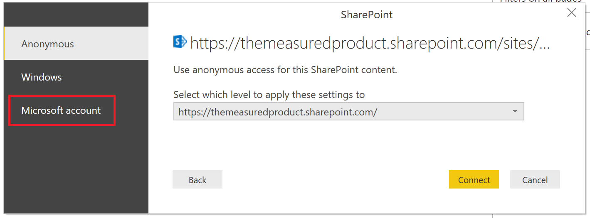

# Creating a report on a SharePoint List

Many teams and organizations use Lists in SharePoint Online to store data since it is easy to set up and for users to update.  Sometimes a chart is a much easier way for users to quickly understand the data rather than looking at the list itself.  In this tutorial, we will show you how to transform your SharePoint List data into a Power BI Report.

Watch a 5 minute tutorial video or scroll down for step-by-step instructions.

<iframe width="400" height="450" src="https://www.youtube.com/embed/OZO3x2NF8Ak" frameborder="0" allowfullscreen></iframe>

# Part 1: Connect to your SharePoint List

1. If you don't have it already, download and install [Power BI Desktop](https://powerbi.microsoft.com/en-us/desktop/).
2. Open Power BI Desktop and in the Home tab of the ribbon, click *Get Data*. Click *More*.

   

3. Click *Online Services* on the left, then click *SharePoint Online list*.  Click *Connect*.
4. Find the address (also known as a URL) of your SharePoint Online site that contains your list.  From a page in SharePoint Online, you can usually get to the site address by clicking "Home" in the left navigation or the icon for the site at the top, then copying the address from your web browser's address bar.

   Watch a video of this step:
   <iframe width="400" height="300" src="https://www.youtube.com/embed/OZO3x2NF8Ak?start=48&end=90" frameborder="0" allowfullscreen></iframe>

5. Paste the address into the Site URL field in the dialog open in Power BI Desktop.

    **Problems completing this step?** <a href="https://forms.office.com/Pages/ResponsePage.aspx?id=v4j5cvGGr0GRqy180BHbR8M5xArDGsxPhvdGH5o-Ym1UQjRUUTVLMzdXN0ZBNkZJNjlKOVFYMVhUVS4u" target="_blank">Yes, I'm having problems</a>

6. You may or may not see a screen like the one below.  If you don't skip to step 9.  If you do, click on *Microsoft Account* on the left hand side of the page.

   

7. Click Sign In and enter your username and password you use to sign in to Microsoft Office 365.

   

8. When you are finished the sign in process, click *Connect*.

    **Problems completing this step?** <a href="https://forms.office.com/Pages/ResponsePage.aspx?id=v4j5cvGGr0GRqy180BHbR8M5xArDGsxPhvdGH5o-Ym1UQjRUUTVLMzdXN0ZBNkZJNjlKOVFYMVhUVS4u" target="_blank">Yes, I'm having problems</a>

9. On the left hand side of the page, click the checkbox beside the SharePoint list you want to connect to.

   

10. Click *Load*.  Power BI will load your list data into a new report.

# Part 2: Create a report

1. On the left hand side, click the *Data* icon to see your SharePoint list data that was loaded.

   Watch a video of this step:
   <iframe width="400" height="300" src="https://www.youtube.com/embed/OZO3x2NF8Ak?start=147&end=203" frameborder="0" allowfullscreen></iframe>

2. Make sure your list columns with numbers show the Sum icon in the list on the right hand side of the screen.  For any that don't, fix this by clicking the column header in the table view, clicking the *Modeling* tab, then changing the Data type dropdown to Decimal Number or Whole Number, depending on your situation.  If prompted to confirm your change, click *Yes*.  If your number is a special format, like currency, you can also choose that by setting the 'Format'.

    **Problems completing this step?** <a href="https://forms.office.com/Pages/ResponsePage.aspx?id=v4j5cvGGr0GRqy180BHbR8M5xArDGsxPhvdGH5o-Ym1UQjRUUTVLMzdXN0ZBNkZJNjlKOVFYMVhUVS4u" target="_blank">Yes, I'm having problems</a>

3. On the left hand side, click the *Report* icon.
4. Select columns you want to visualize by clicking the checkbox beside them on the right hand side of the screen.

   Watch a video of this step:
   <iframe width="400" height="300" src="https://www.youtube.com/embed/OZO3x2NF8Ak?start=215&end=252" frameborder="0" allowfullscreen></iframe>

5. Change the visual type if you need to.
6. You can create multiple visualizations in the same report by unselecting the existing visual then clicking checkboxes for new columns.
7. Click *Save* to save your report.

**Did you succeed at creating a report?  Any other feedback?** <a href="https://forms.office.com/Pages/ResponsePage.aspx?id=v4j5cvGGr0GRqy180BHbR8M5xArDGsxPhvdGH5o-Ym1UM00wUE8yQ1dFQjUzWEk3VlU4SkhGVVhDWC4u" target="_blank">Take a quick 1 minute survey.</a>
