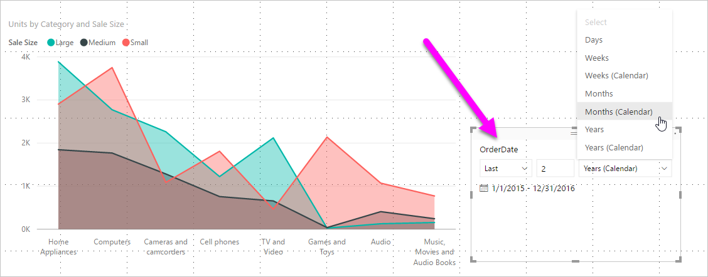
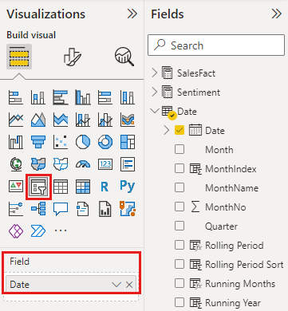
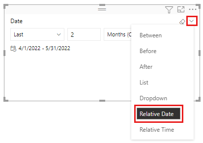
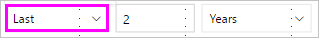
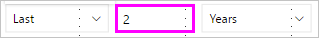
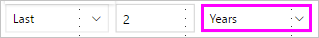
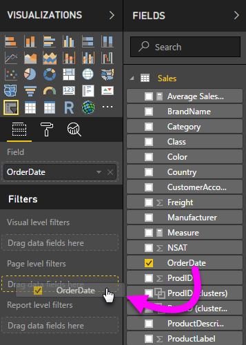
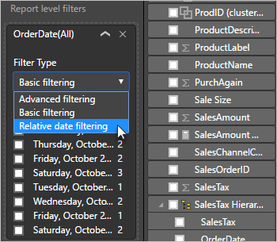
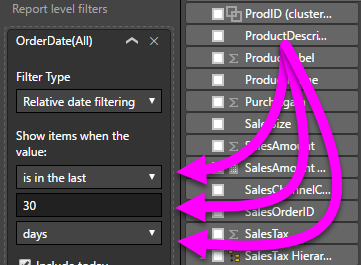

# Creating a relative date slicer and filter in Power BI

[!INCLUDE[consumer-appliesto-nyyn](../includes/consumer-appliesto-nyyn.md)]

With the **relative date slicer** or **relative date filter**, you can apply time-based filters to any date column in your data model. For example, you can use the **relative date slicer** to show only sales data that's happened within the last 30 days (or month, calendar months, and so on). When you refresh the data, the relative time period automatically applies the appropriate relative date constraint.

To share your report with a Power BI colleague requires that you both have individual Power BI Pro licenses or that the report is saved in Premium capacity.

## Create the relative date range slicer

You can use the relative date slicer just like any other slicer. Create a **slicer** visual for your report and then select a date value for the **Field** value. In the following image, we selected the *OrderDate* field.

Select the slicer on your canvas and then the carat in the upper-right corner of the slicer visual. If the visual has date data, the menu displays the option for **Relative**.

For the relative date slicer, select *Relative*.

You can then select the settings.

For the first setting in the *relative date slicer*, you have the following choices:

* Last
* Next
* This

The second (middle) setting in the *relative date slicer* lets you enter a number to define the relative date range.

The third setting lets you pick the date measurement. You have the following choices:

* Days
* Weeks
* Weeks (Calendar)
* Months
* Months (Calendar)
* Years
* Years (Calendar)

If you select **Months** from that list, and enter *2* in the middle setting, here's what happens:

* If today is July 20:

    - The data included in visuals constrained by the slicer will show data for the previous two months,
    - Starting on May 21 and going through July 20 (today's date).

In comparison, if you selected *Months (Calendar)*, the visuals constrained would show data from May 1 through June 30 (the last two complete calendar months).

## Create the relative date range filter

You can also create a relative date range filter for your report page or your entire report. To do so, drag a date field into the **Page level filters** well or the **Report level filters** well in the **Field** pane:

Once there, you can change the relative date range. It's similar to how you can customize the **relative date slicer**. Select **Relative date filtering** from the **Filter Type** drop-down.

Once you've selected **Relative date filtering**, you see three sections to change, including a middle numeric box, just like the slicer.

## Considerations and limitations

The following considerations and limitations currently apply to the **relative date range slicer** and filter.

* The data type for the field in the slicer must be a date, and not the default of text. Otherwise, the relative options don't show up in the slicer.
* Data models in **Power BI** don't include time zone info. The models can store times, but there's no indication of the time zone they're in.
* The slicer and filter are always based on the time in UTC. If you set up a filter in a report and send it to a colleague in a different time zone, you both see the same data. Unless you are in the UTC time zone, you and your colleague must account for the time offset you experience.
* You can convert data captured in a local time zone to UTC using the **Query Editor**.

## Next steps

- [Use a relative time slicer and filter in Power BI](../create-reports/slicer-filter-relative-time.md)
- [Slicers in Power BI](power-bi-visualization-slicers.md)
