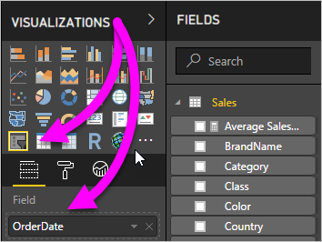

# Use a relative date slicer and filter in Power BI Desktop

With the **relative date slicer** or **relative date filter**, you can apply time-based filters to any date column in your data model. For example, you can use the **relative date slicer** to show only sales data that's happened within the last 30 days (or month, calendar months, and so on). When you refresh the data, the relative time period automatically applies the appropriate relative date constraint.

## Using the relative date range slicer

You can use the relative date slicer just like any other slicer. Create a **slicer** visual for your report and then select a date value for the **Field** value. In the following image, we selected the *OrderDate* field.

Select the slicer on your canvas and then the carat in the upper-right corner of the slicer visual. If the visual contains date data, the menu will display the option for **Relative**. 

For the relative date slicer, select *Relative*.

You can then select the settings. For the first drop-down in the *relative date slicer*, you have the following choices:

* Last

* Next

* This

The following image shows these selections:

The next (middle) setting in the *relative date slicer* lets you type in a number to define the relative date range.

The third setting lets you pick the date measurement. You have the following choices:

* Days

* Weeks

* Weeks (Calendar)

* Months

* Months (Calendar)

* Years

* Years (Calendar)

The following image shows these selections:

If you select *Months* from that list, and enter **2** in the middle setting, this is what will happen:

* if today is July 20th

    * the data included in visuals constrained by the slicer will show data for the previous two months

        * starting on May 20th and going through July 20th (today's date)

In comparison, if you selected *Months (Calendar)*, the visuals constrained would show data from May 1st through June 30th (the last two complete calendar months).

## Using the relative date range filter

You can also create a relative date range filter for your report page or your entire report. To do so, drag a date field into the **Page level filters** or the **Report level filters** areas in the **Field** pane:

Once there, you can modify the relative date range in a similar fashion to how you can customize the **relative date slicer**. Select **Relative date filtering** from the **Filter Type** drop-down.

Once you've selected **Relative date filtering**, you see three sections to modify, including a middle numeric box, just like the slicer.

And, that's all there's to using these relative date constraints in your reports.

## Limitations and considerations

The following limitations and considerations currently apply to the **relative date range slicer** and filter.

* Data models in **Power BI** don't include time zone information. The models can store times, but there's no indication of the time zone they're in.

* The slicer and filter are always based on the time in UTC. If you configure a filter in a report and send it to a colleague in a different time zone, you'll both see the same data. However, if you aren't in the UTC time zone, you might see data for a different time offset than you expect.

* You can convert data captured in a local time zone to UTC using the **Query Editor**.
