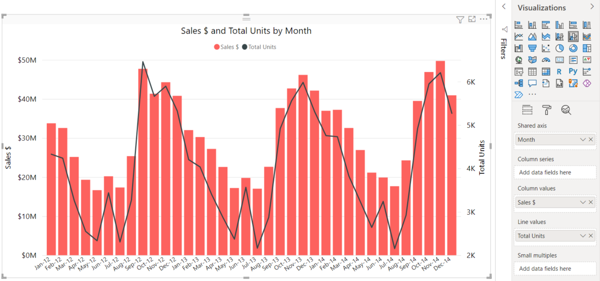

# Line charts in Power BI
A line chart is a series of data points that are represented by dots and connected by straight lines. A line chart may have one or many lines. Line charts have an X and a Y axis. 

## Create a line chart
These instructions use the Sales and Marketing Sample app to create a line chart that displays this year's sales by category. To follow along, get the sample app from appsource.com.

1. Start on a blank report page. If you're using Power BI service, make sure you open the report in [Editing View](../service-interact-with-a-report-in-editing-view.md).

2. From the Fields pane, select **SalesFact** \> **Total units**, and select **Date** > **Month**.  Power BI creates a column chart on your report canvas.

    

4. Convert to a line chart by selecting the line chart template from the Visualizations pane. 

    
   

4. Filter your line chart to show data for the years 2012-2014. If your Filters pane is collapsed, expand it now. From the Fields pane, select **Date** \> **Year** and drag it onto the Filters pane. Drop it under the heading **Filters on this visual**. 
     
    

    Change **Advanced filters** to **Basic filters** and select **2012**, **2013** and **2014**.

    

6. Optionally, [adjust the size and color of the chart's text](power-bi-visualization-customize-title-background-and-legend.md). 

    

## Add additional lines to the chart
Line charts can have many different lines. And, in some cases, the values on the lines may be so divergent that they don't display well together. Let's look at adding additional lines to our current chart and then learn how to format our chart when the values represented by the lines are very different. 

### Add additional lines
Instead of looking at total units for all regions as a single line on the chart, let's split out total units by region. Add additional lines by dragging **Geo** > **Region** to the Legend well.

   

### Use two Y axes
What if you want to look at total sales and total units on the same chart? Sales numbers are so much higher than unit numbers, making the line chart unusable. In fact, the red line for total units appears to be zero.

   

To display highly diverging values on one chart, use a combo chart. You can learn all about combo charts by reading [Combo charts in Power BI](power-bi-visualization-combo-chart.md). In our example below, we can display sales and total units together on one chart by adding a second Y axis. 

   

## Considerations and troubleshooting
* One line chart cannot have dual Y axes.  You'll need to use a combo chart instead.
* In the examples above, the charts were formatted to increase font size, change font color, add axis titles, center the chart title and legend, start both axes at zero, and more. The Formatting pane (paint roller icon) has a seemingly endless set of options for making your charts look the way you want them to. The best way to learn is to open the Formatting pane and explore.

## Next steps

[Visualization types in Power BI](power-bi-visualization-types-for-reports-and-q-and-a.md)

