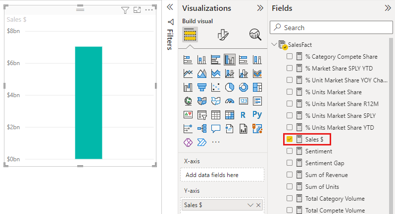
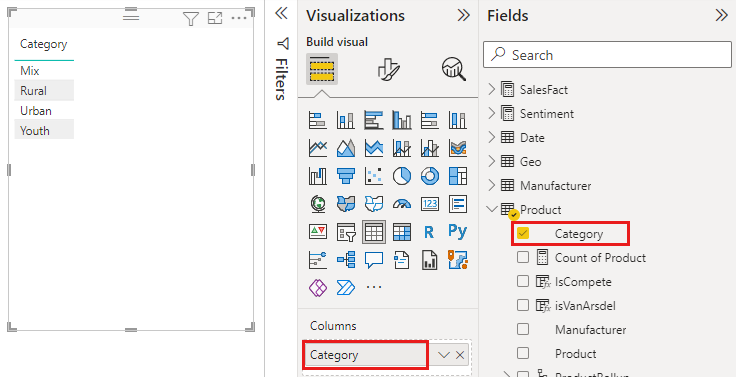
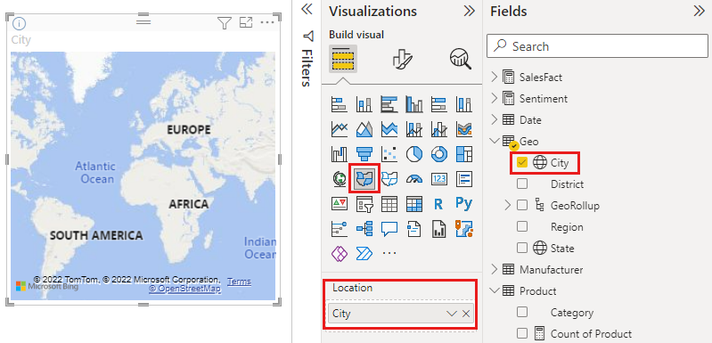
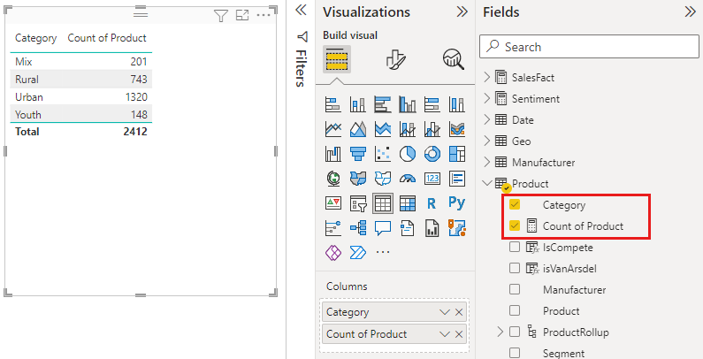
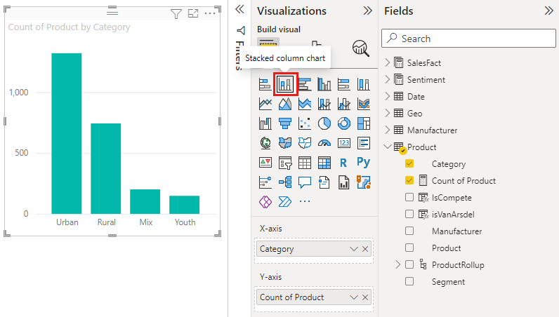
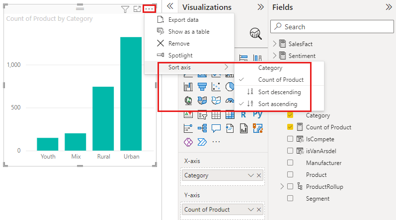

# Part 1, Add visualizations to a Power BI report

[!INCLUDE [power-bi-visuals-desktop-banner](../includes/power-bi-visuals-desktop-banner.md)]

This article gives a quick introduction to creating a visualization in a report. It applies to both the Power BI service and Power BI Desktop. For more-advanced content, [see Part 2](power-bi-report-add-visualizations-ii.md) of this series. Watch Amanda demonstrate a few different ways to create, edit, and format visuals on the report canvas. Then try it out yourself using the [Sales and Marketing sample](../sample-datasets.md) to create your own report.

<iframe width="560" height="315" src="https://www.youtube.com/embed/IkJda4O7oGs" frameborder="0" allowfullscreen></iframe>

## Prerequisites

This tutorial uses the [Sales & marketing PBIX file](https://download.microsoft.com/download/9/7/6/9767913A-29DB-40CF-8944-9AC2BC940C53/Sales%20and%20Marketing%20Sample%20PBIX.pbix).

1. From the upper left section of the Power BI Desktop menu bar, select **File** > **Open**
   
2. Find your copy of the **Sales and marketing sample PBIX file**

1. Open the **Sales and marketing sample PBIX file** in report view .

1. Select  to add a new page.

## Add visualizations to the report

1. Create a visualization by selecting a field from the **Fields** pane.

    Start with a numeric field like **Sales** > **TotalSales**. Power BI creates a column chart with a single column.

    

    Or, start with a category field, such as **Name** or **Product**. Power BI creates a table and adds that field to the **Values** well.

    

    Or, start with a geography field, such as **Geo** > **City**. Power BI and Bing Maps create a map visualization.

    

## Change the type of visualization

 Create a visualization and then change its type. 
 
 1. Select **Product** > **Category** and then **Product** > **Count of Product** to add them both to the **Values** well.

    

1. Change the visualization to a column chart by selecting the **Stacked column chart** icon.

   

1. To change the way the visual is sorted, select **More actions** (...).  Use the sort options to change the direction of the sort (ascending or descending) and change the column being used to sort (**Sort by**).

   
  
## Next steps

 Continue on to:

* [Part 2: Add visualizations to a Power BI report](power-bi-report-add-visualizations-ii.md)

* [Interact with the visualizations](../consumer/end-user-reading-view.md) in the report.

