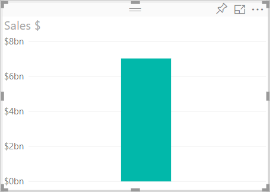
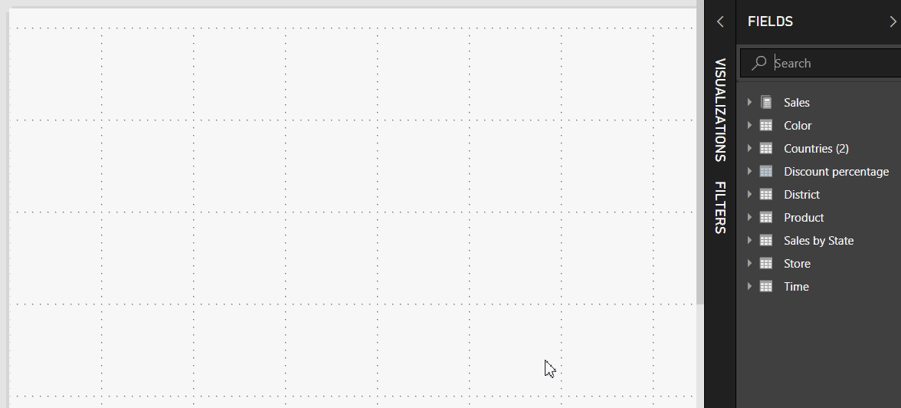
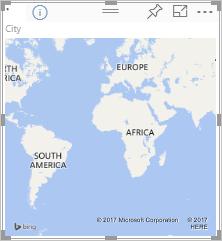
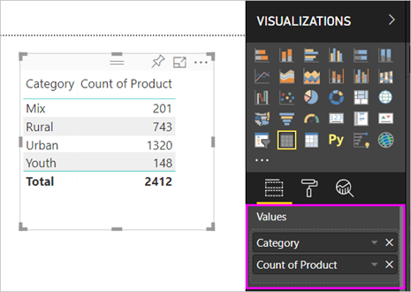
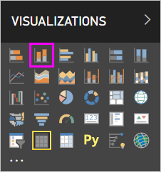
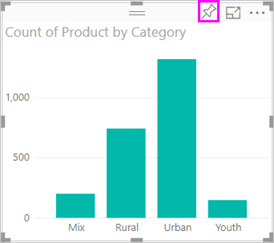

# Part 1, Add visualizations to a Power BI report

This article gives a quick introduction to creating a visualization in a report. It applies to both the Power BI service and Power BI Desktop. For more-advanced content, [see Part 2](power-bi-report-add-visualizations-ii.md) of this series. Watch Amanda demonstrate a few different ways to create, edit, and format visuals on the report canvas. Then try it out yourself using the [Sales and Marketing sample](../sample-datasets.md) to create your own report.

<iframe width="560" height="315" src="https://www.youtube.com/embed/IkJda4O7oGs" frameborder="0" allowfullscreen></iframe>

## Open a report and add a new page

1. Open a [report in Editing View](../service-interact-with-a-report-in-editing-view.md).

    This tutorial uses the [Sales and Marketing sample](../sample-datasets.md).

1. If the **Fields** pane isn't visible, select the arrow icon to open it.

   

1. Add a blank page to the report.

## Add visualizations to the report

1. Create a visualization by selecting a field from the **Fields** pane.

    Start with a numeric field like **SalesFact** > **Sales $**. Power BI creates a column chart with a single column.

    

    Or, start with a category field, such as **Name** or **Product**. Power BI creates a table and adds that field to the **Values** well.

    

    Or, start with a geography field, such as **Geo** > **City**. Power BI and Bing Maps create a map visualization.

    

1. Create a visualization and then change its type. Select **Product** > **Category** and then **Product** > **Count of Product** to add them both to the **Values** well.

   

1. Change the visualization to a column chart by selecting the **Stacked column chart** icon.

   

1. When you create visualizations in your report, you can [pin them to your dashboard](../service-dashboard-pin-tile-from-report.md). To pin the visualization, select the pin icon .

   
  
## Next steps

 Continue on to:

* [Part 2: Add visualizations to a Power BI report](power-bi-report-add-visualizations-ii.md)

* [Interact with the visualizations](../consumer/end-user-reading-view.md) in the report.

* [Do even more with visualizations](power-bi-report-visualizations.md).

* [Save your report](../service-report-save.md).
