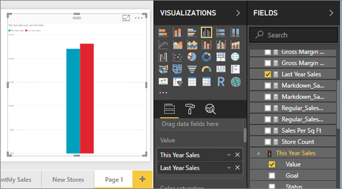
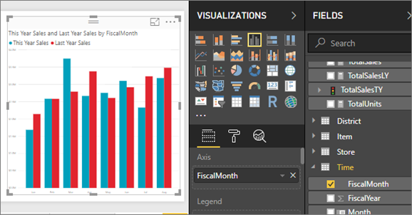
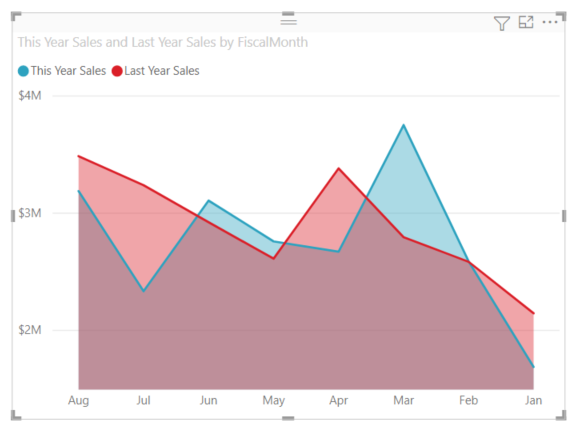
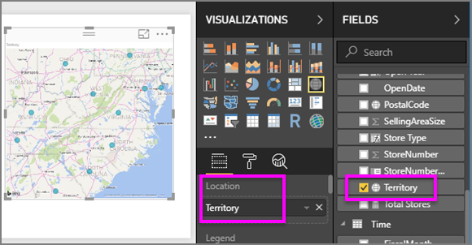
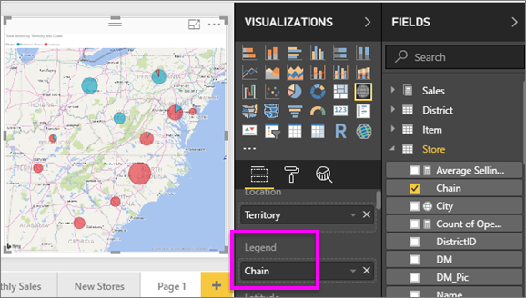

# Part 2, Add visualizations to a Power BI report
In [Part 1](power-bi-report-add-visualizations-ii.md), you created a basic visualization by selecting checkboxes next to field names.  In Part 2 you'll learn how to use drag-and-drop and make full use of the **Fields** and **Visualizations** panes to create and modify visualizations.

### Prerequisites
- [Part 1](power-bi-report-add-visualizations-ii.md)
- Power BI Desktop - visualizations can be added to reports using Power BI service or Power BI Desktop. This tutorial uses Power BI Desktop. 
- [Retail Analysis sample](http://download.microsoft.com/download/9/6/D/96DDC2FF-2568-491D-AAFA-AFDD6F763AE3/Retail%20Analysis%20Sample%20PBIX.pbix)

## Create a new visualization
In this tutorial we'll dig into our Retail Analysis dataset and create a few key visualizations.

### Open a report and add a new blank page.
1. Open the Retail Analysis sample .PBIX file in Power BI Desktop. 
      

2. Add a new page by selecting the yellow plus icon at the bottom of the canvas.

### Add a visualization that looks at this year's sales compared to last year.
1. From the **Sales** table, select **This Year Sales** > **Value** and **Last Year Sales**. Power BI creates a column chart.  This is somewhat interesting, and you want to dig deeper. What do the sales look like by month?  
   
   
2. From the Time table, drag **FiscalMonth** into the **Axis** area.  
   
3. [Change the visualization](power-bi-report-change-visualization-type.md) to an Area chart.  There are many visualization types to choose from - see [descriptions of each, tips for best practices, and tutorials](power-bi-visualization-types-for-reports-and-q-and-a.md) for help deciding which type to use. From the Visualizations pane, select the Area chart icon .
4. Sort the visualization by selecting the ellipses and choosing **Sort by FiscalMonth**.
5. [Resize the visualization](power-bi-visualization-move-and-resize.md) by selecting the visualization, grabbing one of the outline circles and dragging. Make it wide enough to eliminate the scrollbar and small enough to give us enough room to add another visualization.
   
   
6. [Save the report](../service-report-save.md).

### Add a map visualization that looks at sales by location
1. From the **Store** table, select **Territory**. Power BI recognizes that Territory is a location, and creates a map visualization.  
   
2. Drag **Total Stores** into the Size area.  
   
3. Add a legend.  To see the data by store name, drag **Chain** into the Legend area.  
   

## Next steps
* More about [Visualizations in Power BI reports](power-bi-report-visualizations.md).  
* More questions? [Try the Power BI Community](http://community.powerbi.com/)

