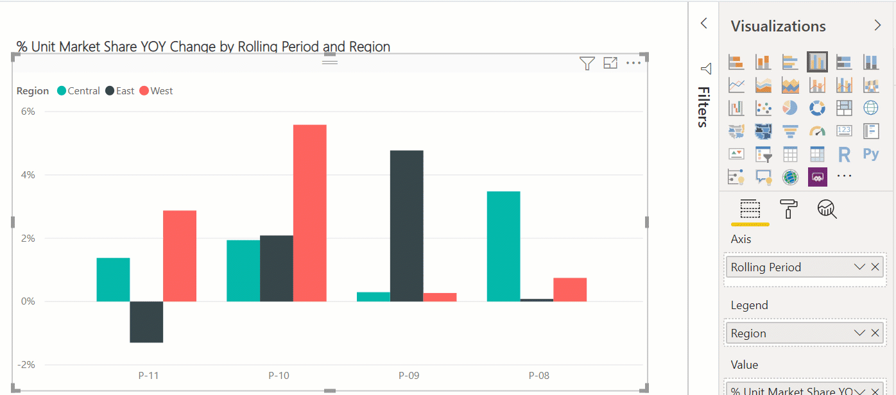

# Change the type of visualization in a Power BI report

[!INCLUDE [applies-yes-desktop-yes-service](../includes/applies-yes-desktop-yes-service.md)]

## Select a new visualization type

Try different types of visualizations in the Power BI service and Power BI Desktop to see which one illustrates your data best. 

1. Open a report that already has at least one visualization.   
2. Select a visualization to make it active. An active visualization has handles and a border.    
3. In the Visualizations pane, select the new visualization type. 
   
   .
4. (Optional) [Pin your visualization](../create-reports/service-dashboard-pin-tile-from-report.md) to your dashboard as a tile. 

## Considerations and troubleshooting
If you change the visualization type in the report after you pinned it to your dashboard, the dashboard tile does not automatically update. So, if you used the Power BI service to pin the visualization as a line chart and then, in the report, changed it to a bar chart, the already-pinned version of this data will remain a line chart. Pin the bar chart to see it too on the dashboard.

Sharing your report with a Power BI colleague requires that you both have individual Power BI Pro licenses or that the report is saved in Premium capacity. See [sharing reports](../collaborate-share/service-share-reports.md).

## Next steps
More about [Visualizations in Power BI reports](power-bi-report-visualizations.md)

[Power BI - Basic Concepts](../consumer/end-user-basic-concepts.md)

More questions? [Try the Power BI Community](https://community.powerbi.com/)

