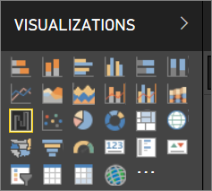
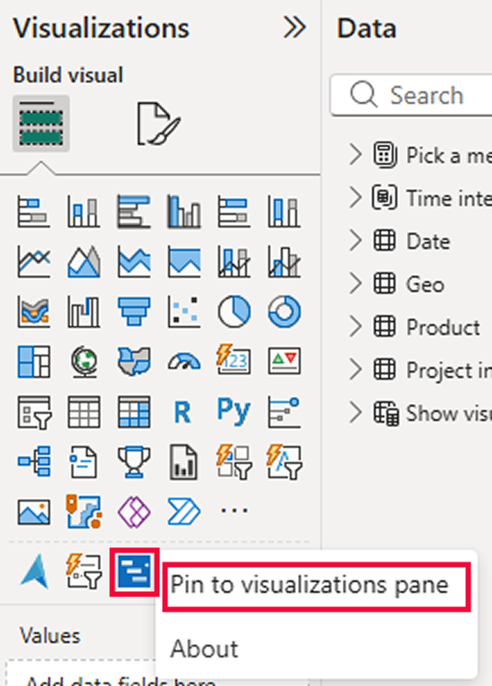
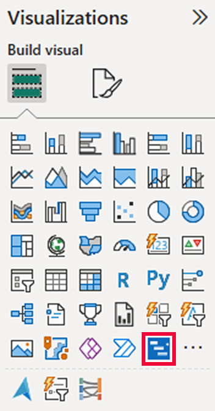

# Visualizations in Power BI reports

Visualizations (aka visuals) display insights that have been discovered in the data. A Power BI report might have a single page with one visual or it might have pages full of visuals. In Power BI service, visuals can be [pinned from reports to dashboards](../service-dashboard-pin-tile-from-report.md).

It's important to make the distinction between report *designers* and report *consumers*  If you are the person building or modifying the report, then you are a designer.  Designers have edit permissions to the report and its underlying dataset. In Power BI Desktop, this means you can open the dataset in Data view and create visuals in Report view. In Power BI service, this means you can open the data set or report in the report editor in [Editing view](../consumer/end-user-reading-view.md). If a report or dashboard has been [shared with you ](../consumer/end-user-shared-with-me.md), you are a report **consumer**. You'll be able to view and interact with the report and its visuals but you won't be able to save major changes.

There are many different visual types available directly from the Power BI VISUALIZATIONS pane.

And for even more choices, visit the [Microsoft AppSource community site](https://appsource.microsoft.com) to find and [download](https://appsource.microsoft.com/marketplace/apps?page=1&product=power-bi-visuals) [custom visuals](../developer/custom-visual-develop-tutorial.md) provided by Microsoft and the community.

<iframe width="560" height="315" src="https://www.youtube.com/embed/SYk_gWrtKvM?list=PL1N57mwBHtN0JFoKSR0n-tBkUJHeMP2cP" frameborder="0" allowfullscreen></iframe>

If you're new to Power BI, or need a refresher, use the links below to learn the basics of Power BI visualizations.  Alternately, use our Table of Contents (along the left side of this article) to find even more helpful information.

## Add a visualization in Power BI

[Create visualizations](power-bi-report-add-visualizations-i.md) on the pages of your reports. Browse the [list of available visualizations and available visualization tutorials.](power-bi-visualization-types-for-reports-and-q-and-a.md) 

## Upload a custom visualization and use it in Power BI

Add a custom visualization that you created yourself or that you found in the [Microsoft AppSource community site](https://appsource.microsoft.com/marketplace/apps?product=power-bi-visuals). Feeling creative? Dig into our source code and use our [developer tools](../developer/custom-visual-develop-tutorial.md) to create a new visualization type and [share it with the community](../developer/office-store.md). To learn more about developing a custom visual, visit [Developing a Power BI custom visual](../developer/custom-visual-develop-tutorial.md).

## Personalize your visualization pane (preview)

If you find yourself using the same custom visual across many reports, you can pin the custom visualization to your visualization pane. To pin the visualization, right-click on the visual to pin it to the pane.

Once a visual has been pinned, it moves up to live with the other built-in visuals. This visual is now tied to your signed in account, so any new reports you built will automatically have this visual included, assuming you are signed in. This makes it very easy to standardize on a particular visual without needing to add it to every single report.

While this feature is in preview, you’ll only see your pinned visuals in Power BI Desktop. Additionally, you must be signed in for this feature to be available.

## Change the visualization type

Try [changing the type of visualization](power-bi-report-change-visualization-type.md) to see which works best with your data.

## Pin the visualization

In Power BI service, when you have the visualization the way you want it, you can [pin it to a dashboard](../service-dashboard-pin-tile-from-report.md) as a tile. If you change the visualization being used in the report after you pin it, the tile on the dashboard doesn't change -- if it was a line chart, it stays a line chart, even if you changed it to a Doughnut chart in the report.

## Limitations and considerations
- Depending on the data source and the number of fields (measures or columns), a visual may load slowly.  We recommend limiting visuals to 10-20 total fields, both for readability and performance reasons. 

- The upper limit for visuals is 100 fields (measures or columns). If your visual fails to load, reduce the number of fields.   

## Next steps

* [Visualization types in Power BI](power-bi-visualization-types-for-reports-and-q-and-a.md)
* [Custom visuals](../power-bi-custom-visuals.md)
