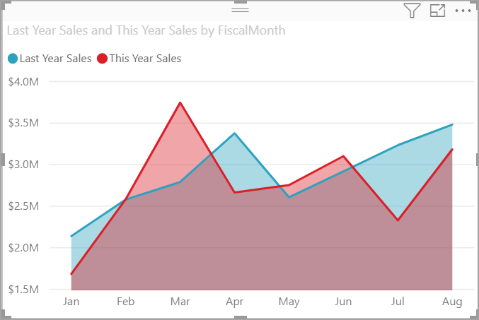
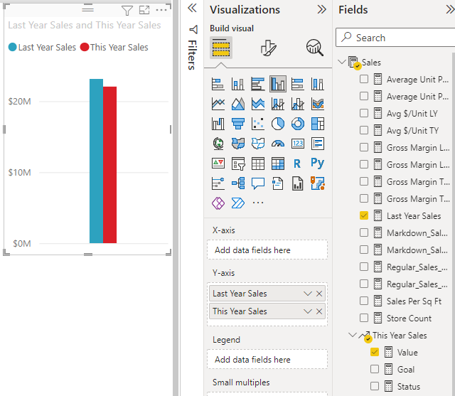
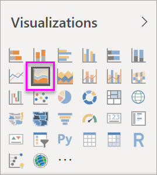
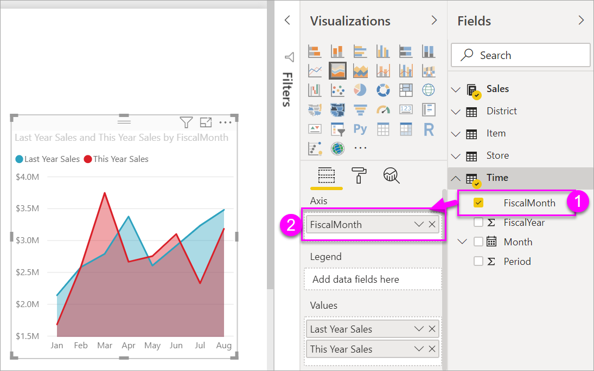
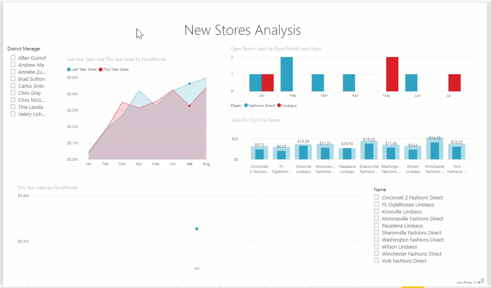

# Create and use basic area charts

[!INCLUDE [applies-yes-desktop-yes-service](../includes/applies-yes-desktop-yes-service.md)]

The basic area chart (also known as layered area chart.) is based on the line chart. The area between axis and line is filled with colors to indicate volume. 

Area charts emphasize the magnitude of change over time, and can be used to draw attention to the total value across a trend. For example, data that represents profit over time can be plotted in an area chart to emphasize the total profit.

> [!NOTE]
> Sharing your report with a Power BI colleague requires that you both have individual Power BI Pro licenses or that the report is saved in Premium capacity.

## When to use a basic area chart
Basic area charts are a great choice:

* to see and compare the volume trend across time series 
* for individual series representing a physically countable set

### Prerequisites
This tutorial uses the [Retail Analysis sample PBIX file](https://download.microsoft.com/download/9/6/D/96DDC2FF-2568-491D-AAFA-AFDD6F763AE3/Retail%20Analysis%20Sample%20PBIX.pbix).

1. From the upper left section of the menubar, select **File** > **Open**
   
2. Find your copy of the **Retail Analysis sample PBIX file**

1. Open the **Retail Analysis sample PBIX file** in report view .

1. Select  to add a new page.

## Create a basic area chart
 

1. These steps will help you create an area chart that displays this year's sales and last year's sales by month.
   
   a. From the Fields pane, select **Sales \> Last Year Sales**, and **This Year Sales > Value**.

   

   b.  Convert the chart to a basic area chart by selecting the Area chart icon from the Visualizations pane.

   
   
   c.  Select **Time \> FiscalMonth** to add it to the **Axis** well.   
   
   
   d.  To display the chart by month, select the ellipses (top right corner of the visual) and choose **Sort by month**. To change the sort order, select the ellipses again and select either **Sort ascending** or **Sort descending**.

## Highlighting and cross-filtering
For information about using the Filters pane, see [Add a filter to a report](../create-reports/power-bi-report-add-filter.md).

To highlight one particular area in your chart, select that area or its top border.  Unlike other visualization types, if there are other visualizations on the same page, highlighting a basic area charts does not cross-filter the other visualizations on the report page. However, area charts are a target for cross-filtering triggered by other visualizations on the report page. 

1. Try it out by selecting your area chart and copying it to the **New Store Analysis** report page (CTRL-C and CTRL-V).
2. Select one of the shaded areas of the area chart and then select the other shaded area. You'll notice no impact on the other visualizations on the page.
1. Now select an element. Notice the impact on the area chart -- it gets cross-filtered.

     

To learn more, see [Visual interactions in reports](../create-reports/service-reports-visual-interactions.md)

## Considerations and troubleshooting   
* [Make the report more accessible for people with disabilities](../create-reports/desktop-accessibility-overview.md)
* Basic area charts are not effective for comparing the values due to the occlusion on the layered areas. Power BI uses transparency to indicate the overlap of areas. However, it only works well with two or three different areas. When you need to compare trend to more than three measures, try using line charts. When you need to compare volume to more than three measures, try using treemap.

## Next step
[Reports in Power BI](power-bi-visualization-card.md)  
