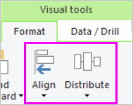
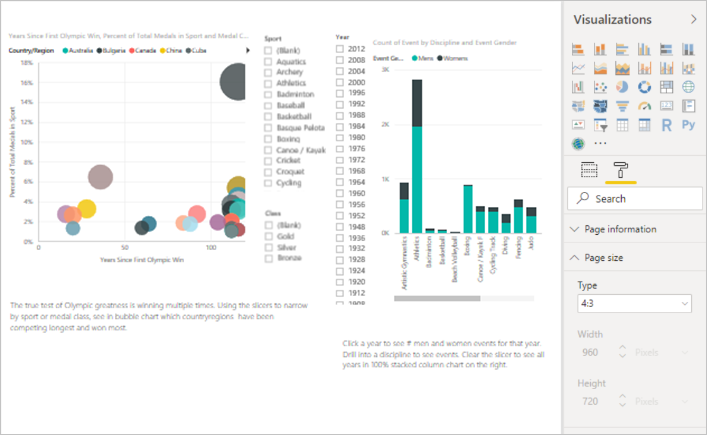
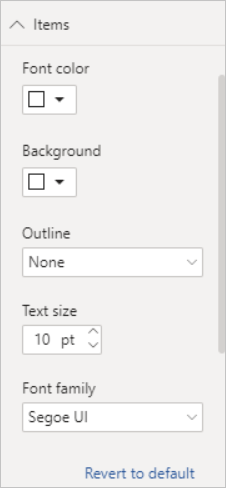
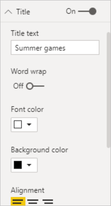
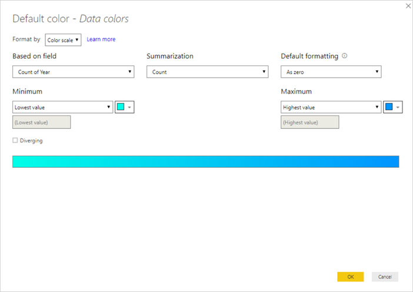
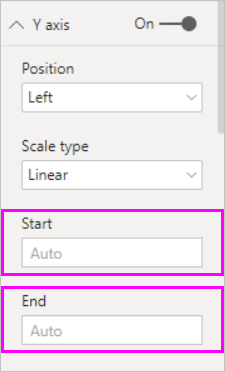
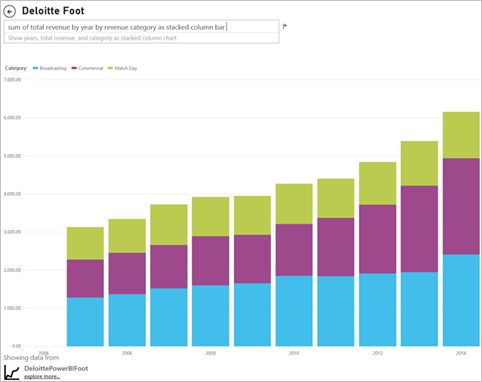

# Best design practices for reports and visuals
<!-- Shared newnav Include -->
[!INCLUDE [newnavbydefault](../includes/newnavbydefault.md)]

## Introduction
This paper provides best practices for designing reports in Power BI. Starting with planning, it discusses principles of design that you can apply to your reports and to the pages and individual visuals that make up that report.  Many of these best practices apply to dashboard design as well.

We hope this paper will be a jumping-off point for you and that you’ll apply what you learn to your own reports and visualizations and that you’ll continue the conversation on community.powerbi.com. BI report design and visualization usage is a hot topic right now and there are many thought leaders, bloggers, and websites that look at this topic in breadth and depth (we’ve listed a few at the end).   

> [!NOTE]
> The recommendations made in this white paper are guidelines for you to apply when and where it makes sense. For every principle we describe below, there are usually valid reasons to “break the rule.”
> 
> 

*We are overwhelmed by information, not because there is too much, but because we don't know how to tame it.*
-- Stephen Few

## A look at the landscape and terminology
In Power BI, a report can have one or more report pages and all the pages together are collectively referred to as the report. The basic elements of the report are visuals (aka visualizations), standalone images, and text boxes. From the individual data points, to the report elements, to the report page itself, there are innumerable formatting options.

We’ll start at the report planning stage, continue on to basic report design principles, then discuss visual design principles, and finish with a discussion of best practices for individual visual types.

In-depth guidance and instructions for creating and using Power BI reports is available at **powerbi.com > Learn**.

## Before you build your first visualization…focus on requirements
Creating a report starts before you build your first visual because a good report needs planning.  Know what data you have to work with and write down the requirements for the report. Ask yourself “What is the business need, how is this data going to be used, and by whom?” A key question is “what decisions does the reader want to be able to make based on this report?”

The answer to those questions will drive your design. Every report tells a story. Make sure that story matches the business need. It may be tempting to add visuals that show dramatic insights, but if those insights don’t match the business need, then the report won’t be useful – and in fact your users might be distracted by those visuals. Also, you may find that the information needed to make that decision cannot be gleaned from this data. Can this report be used to measure what is needed?

Reports can be used to monitor, uncover, track, predict, measure, manage, test, and more. If, for example, the business need is a sales report that measures performance, then you might design a report that looks at current sales, compares it to previous sales, compares to competitors, and includes some KPIs that trigger alerts.  Perhaps readers can drill down into the sales numbers to see store closures or supply chain issues that may be impacting sales.  Another drill down might be the ability to look at sales by store, region, product, season, and more.

Know the customers for the report and design a report that uses familiar terminology and provides data at a level of detail and complexity on par with the customers’ level of knowledge. Have more than one type of customer? One size doesn’t always fit all; design separate report pages based on expertise and be sure to label each page clearly so customers can self-identify. Another option is to use slicers so customers can tailor the page to fit them. Involve the customer in the planning stage and avoid the mistake of building what you think they need.  Be prepared to start over and to iterate.

Once you’ve identified the business need, the customers, and the metrics you’d like to include, the next step is to pick the right visuals to tell the story and present those visuals in the most-effective way possible. That covers a lot of ground, and we’ll start with some basic principles of report design.

## Principles of report design
A report page has limited space and one of the hardest things is to fit all the elements you want into that space – and still have that information be easily understood. And don’t underplay the value of “pretty.” The key is to find the balance between pretty and useful.

Let’s take a look at layout, clarity, and aesthetics.

### Layout - the report canvas
The report canvas has a finite amount of space.  If you can’t fit all the elements on a single report page, break the report up into pages.  A report page can be tailored to a specific audience (e.g., HR, IT, Sales, SLT), or to a specific business question (e.g., How are defects impacting our downtime?, What is our Marketing campaign’s impact on Sentiment?) or as a progressive story (e.g. first page as overview or attention-grabbing “hook”, 2nd page continues the data story, 3rd page dives deeper into the story, etc.).  If your entire report fits on a single page, great. If it doesn’t, create separate report pages that logically chunk the content.  And don’t forget to give the pages meaningful and helpful names.

Think about filling an art gallery. You wouldn’t put 50 pieces of artwork into a small room, fill it with chairs and paint each wall a different color. As the curator, you’d choose just pieces that have a common theme, lay them out around the room with plenty of space for visitors to move and think, and place informational cards that describes what they’re looking at. And there’s a reason most modern galleries have plain walls!
For this article, we’ll start with a report example that needs a lot of work.  As we apply our best practices and principles of design, our report will improve.

**Figure 1:    This ugly report page needs a lot of work**

The example above has many space-related (layout) design issues that we’ll discuss below:

* alignment, order, and use of proximity
* poor use of space and sorting
* clutter

### Alignment, order, and proximity
The layout of your report elements impacts comprehension and guides the reader through the report page. How you place and position elements tells a story.  The story might be “start here and then look here” or “these 3 elements are related to each other.”

* In most cultures, people scan from left to right and top to bottom. Position the most important element in the top left corner of your report. And organize the rest of the visuals in a way that leads to logical navigation and comprehension of the information.
* Position elements that require the reader to make a choice to the left of the visualizations the choice will impact: slicers, for example.
* Position related elements close to each other; proximity implies the elements are related.
* Another way to convey relationships is to add a border or color background around related elements. Conversely, add a divider to distinguish between different sections of a report.
* Use white space to visually chunk sections of the report page.
* Fill the report page. If you find that you have a lot of extra white space, make your visualizations larger or make the canvas smaller.
* Be intentional with sizing your report elements. Don’t let space availability dictate the size of a visualization.
* Make important elements larger than the others or add a visual element like an arrow to draw attention.
* Align the elements on the report page, either symmetrically or intentionally asymmetrically.

Let’s take a closer look at alignment.

#### Alignment
Alignment doesn’t mean that the different components need to be the same size or that you must have the same number of components on each row of the report. It just means that there is a structure to the page that aids in navigation and readability.

We can see in our updated report below that the report components are now aligned on the left and right edges and each report row is aligned horizontally and vertically as well. Our slicers are to the left of the visuals they impact.

**Figure 2:    Our ugly report example improved with layout edits**

Power BI includes tools to help you align your visuals. In Power BI Desktop, with multiple visuals selected, you can use the **Align and Distribute** options on the **Visuals** ribbon tab to match up the position of visuals.

**Figure 3:    Align visuals in Power BI Desktop**

In Power BI online and Power BI Desktop, you also have precise control over the size and position of visuals through the **General** tab on the formatting pane for all visuals:

**Figure 4:    Set exact position for your visual**

In our example report page (Figure 2), the 2 cards and large border are aligned on the **X Position** at 200.

#### Fit to the space
Make the best use of the space you have.  If you know how the report will be viewed/displayed, design with that in mind. Reduce empty space to fill the canvas.  Do all you can to eliminate the need for scrollbars on individual visuals.  Fill the space without making the visuals seem cramped.

##### Adjust the page size
By reducing the page size, individual elements become larger relative to the overall page. Do this by deselecting any visuals on the page and using the **Page Size** tab in the formatting pane.  

Here is a report page using page size 4:3 and then using 16:9. Notice how the layout suits 16:9 so much better. There is even enough room to remove the scrollbar from the second visual.

**Figure 5a:    The report at 4:3 page size**

**Figure 5b:    The report at 16:9 page size ratio**

Will your report be viewed 4:3, 16:9 or another ratio? On small screens or huge screens? Or on all possible screen ratios and sizes?  Design with this in mind.

Our example report page seems a bit cramped. With no visual selected, open the formatting pane by selecting the paintroller icon. Expand **Page Size** and change **Height** to 900.

**Figure 6:    Increase page height**

#### Reduce clutter
A cluttered report page will be hard to understand at-a-glance and may be so overwhelming that readers won’t even try.  Get rid of all report elements that aren’t necessary. Don’t add bells-and-whistles that don’t help comprehension or navigation. Your report page needs to convey the information as clearly and quickly and cohesively as it can.

Edward Tufte calls it “data to ink ratio” in his book *The Visual Display of Quantitative Information*.  Basically, remove anything that isn’t essential.

The clutter you remove will increase the whitespace on your report page and give you more real estate for applying the best practices we learned about above in the “Alignment, order, and proximity” section.

Here our example is already looking better. We’ve removed lots of clutter and added shapes to group elements together.  The background image is gone, the unnecessary arrow shape and text box are gone, one visual has been moved to another page in the report, etc. We’ve also lengthened the page size to increase white (yellow?) space.

**Figure 7:    Our ugly report example de-cluttered**

### Tell a story at a glance
The overall test should be that somebody without any prior knowledge can quickly understand the report without any explanation from anybody. With a quick glance, readers should be able to quickly see what the page is about and what each chart/table is about.   

When readers look at your report, their eyes should be drawn to the element you want them to look at first and their eyes will then continue left-right-top-down.  Change this behavior by adding visual cues like text box labels, shapes, borders, size, and color.  

#### Text boxes
Sometimes the titles on visualizations aren’t enough to tell the story.  Add text boxes to communicate with the people viewing your reports.  Text boxes can describe the report page, a grouping of visuals, or describe an individual visual. They can explain results or better-define a visual, components in the visual, or relationships between visuals. Text boxes can be used to draw attention based on different criteria called out in the text box.

In Power BI service, from the top menubar, select **Text Box**. (In Power BI Desktop, select **Text Box** from the **Insert** area of the ribbon.)

**Figure 8:    Add a text box**

Type in the empty box and then use the controls at the bottom to set font face, size, alignment, and more. Use the handles to resize the box.

**Figure 9:    Format the text box**

But don’t overdo it! Too much text on a report is distracting and detracting from the visuals. If you find that your report page requires a ton of text to make it understandable, then start over.  Can you pick a different visual that tells a better story on its own? Can you tweak the visual’s native titles to make it more intelligible?   

#### Text
Create a text style guide and apply it to all pages of your report. Pick just a few font faces, text sizes, and colors.  Apply this style guide to not only textual elements but to the font choices you make within your visualizations (see Titles and labels that are part of the visualizations, below). Set rules for when you’ll use bold, italics, increased font size, certain colors, and more.  Try to avoid using all capitalization or underlining.

#### Shapes
Shapes too can aid navigation and comprehension. Use shapes to group related information together, highlight important data, and use arrows to direct the eye. Shapes help readers understand where to start and how to interpret your report. In design terms, this is often referred to as *contrast*.

**Figure 10a:    Shapes in Power BI service**

**Figure 10b:    Shapes in Power BI Desktop**

What does our example page look like now?  Figure 11 shows a cleaner, less cluttered page with a consistent use of text faces, fonts, and colors.  Our page title in the top-left corner tells us what the page is all about.

**Figure 11:    Our report example with text guidelines applied and title added**

In our example, a report page title was added in the top left corner; the first place readers look. Font size is 28 and font is Segoe Bold to help it stand out from the rest of the page.  Our text style guide calls for no backgrounds, black titles, legends, and labels and that was applied to all visuals on the page, where possible (the Combo chart axes and labels are not editable).  Additionally:

* Cards: **Category label** set to Off, **Title** turned On and set to 12pt black centered.
* Visual titles: if turned On, set to 12pt and left-aligned.
* Slicers: **Header** set to Off, **Title** turned On. Leave **Items** > **Text** grey and 10pt.
* Scatter and column charts: black font for X and Y axes and X and Y axes titles, if used.

#### Color
Use color for consistency.  We’ll talk more about color in Principles of visual design, below. But here we’re referring to being deliberate in your selection of color so that it doesn’t detract from your readers being able to quickly understand your report.  Too many bright colors barrage the senses. This section is more what not to do with color.

#### Backgrounds
When setting backgrounds for report pages, choose colors that don’t overshadow the report, clash with other colors on the page, or generally hurt the eyes. Realize that some colors have inherent meaning.  For example, in the US, red in a report is typically interpreted as “bad”.

**Figure 12: Set report background**

You’re not creating a work of art, but a functional report. Choose a color that improves the readability and prominence of the report elements.  

A study on the use of color and visualizations within Web pages found that higher contrast between colors increases the speed of comprehension (The effect of text and background colour on visual search of Web pages and **Determining Users’ Perception of Web Page Visual Complexity and Aesthetic Characteristics**.)

We’ve applied some color best practices to our example report (Figure 20 and 21) below. The most-notable was that we changed the background color to black.  The yellow was too bright and strained our eyes.  Also, on the “Count of athlete name by year and class” chart, the yellow portion of the bars disappeared into the yellow background.  Using a black (or white) background gives us maximum contrast and makes the visuals the focus of attention.

Here are the additional steps we took to improve the example report:

**Page title**

When we changed the background to black, our title disappeared because the text box field only allows black font.   To fix this, add a text box title instead.  With the text box selected, erase the text and in the Visualizations tab, select **Title** and turn it On. Select the arrow to expand the **Title** options, type **Summer Olympic Games** into the **Title Text** field and select white **Font color**.

**Figure 13: Add a page title**

**Cards**

For the card visuals, open the formatting pane (paint roller icon) and turn **Background** On. Select white with a transparency of 0%. Then turn **Title** On, select **Font color** white and **Background color** black.

**Slicers**

Up to this point the two slicers had different formatting, which doesn't make design sense. For both slicers, change the background color to aqua.  Aqua is a good choice because it is part of the page’s color palette – you can see it in the filled map, tree map, and column chart.

**Figure 14: Change slicer background color**

Add a thin white border.

**Figure 15: Add a border to the slicer**

The grey font is hard to see against the aqua, so change the **Items** color to white.

**Figure 16: Change slicer font color**

And, finally, under **Title**, change **Font color** to white and add a black **Background color**.

**Figure 17: Format slicer title**

**Rectangle shape**

The rectangle too has disappeared into the black background.  To fix this, select the shape and in the **Format shape** pane, turn **Background** On.

**Figure 18: Format the shape**

**Column charts, bubble chart, filled map, and tree map**

Add a white background to the remaining visuals on the report page. From the formatting pane, expand the **Line** option and set the **Line Color** to white and **Weight** to 3.

**Figure 19: Add a white background to remaining visualizations**

**Figure 20: Report example with color best practices applied (black background)**

**Figure 21:    Report example with color best practices applied (white background)**
 

### Aesthetics
Much of what we would consider aesthetics has already been discussed above: things like alignment, color, font choices, clutter.  But there are a few more best practices for report design worth discussing and these deal with the overall appearance of the report.  

Remember that the function of your report is to meet a business need; not to be pretty.  But some level of beauty is required, especially when it comes to first impressions. Nashville consultant Tony Bodoh explains "Emotion fires a half-second before logic can kick in."  Readers will first react at an emotional level to your report page, before they take more time to dig deeper. If your page looks disorganized, confusing, unprofessional…your reader may never discover the powerful story it tells.

TDI blogger and TechTarget industry analyst Wayne Eckerson has a great analogy.  Designing a report is like decorating a room.  Over time you purchase a vase, a sofa, end table, a painting.  Separately you like all of these elements. But although each individual selection makes sense, collectively the objects clash or compete for attention.

Concentrate on:

* Creating a common theme or look for your report, and apply it to all pages of the report
* Using standalone images and other graphics to support and not detract from the real story
* And applying all the best practices we discussed up to this point in the article.

## Principles of visual design
We’ve looked at the principles of report design; how to organize the report elements in a way that makes the report easy to quickly grasp.  Now we’ll look at design principles for visuals themselves.  And, in the next section, we’ll dig down into individual visuals and discuss best practices for some of the more commonly-used types.

In this section, we’re going to leave our example report page alone for a while and look at other examples.  After we’ve gone through the principles of visual design, we’ll return to our example report page and apply what we’ve learned (with step-by-step instructions).  

### Planning – choose the right visual
Just as it’s important to plan out your report before you start building, each visual also requires planning.  Ask yourself “what story am I trying to tell with this visual?” And then figure out which visual type will tell the story best. You could show progress through a sales cycle as a bar chart but wouldn’t a waterfall or funnel chart tell it better? For help with this, read the last section of this paper “Visual types and best practices” which describes best practices for some of the more-common types.  Don’t be surprised if the first visual type you pick doesn’t end up being your best option.  Try more than one visual type to see which one makes the point best.

Understand the difference between categorical and quantitative data and know which visual types work best with what type of data. Quantitative data is often referred to as measures and it’s typically numeric. Categorical data is often referred to as dimensions and can be classified. This is discussed in more depth in “Choose the right measure”, below.

Avoid the temptation to use fancy or more-complex visual types just to make your report look more impressive. What you want is the most-simple option for conveying your story. Horizontal bar charts and simple line charts can convey information quickly.  They are familiar and comfortable and most readers can interpret them easily.  An added advantage is that most people read left-to-right and top-to-bottom and these two chart types can therefore be scanned and comprehended quickly.

Does your visual require scrolling to tell the story? Avoid scrolling if you can.  Try applying filters and making use of hierarchies/drilldown, and if those don’t eliminate the scrollbar, consider choosing a different visual type. If you can’t escape scrolling, horizontal scrolling is tolerated better than vertical scrolling.

Even when you choose the absolutely-best visual for the story, you might still need help telling the story.  That’s where labels, titles, menus, color, and size come in. We’ll discuss these design elements later in the section titled “Design elements”.

### Choose the right measure
Is the story your visual telling compelling? Does it matter?  Don’t build visuals for the sake of building visuals. Maybe you thought the data would tell an interesting story, but it doesn’t. Don’t be afraid to start over and look for a more-interesting story. Or, maybe the story is there but it needs to be measured in a different way.

For example, say you want to measure the success of your sales managers. What measure would you use to do this?  Would you measure that best by looking at total sales or total profit, growth over previous year or performance against a target goal? Salesperson A might have the largest profit, and if you showed total profit by salesperson in a bar chart, they would look like a rockstar compared to the other salespeople.  But if salesperson A has a high cost of sales (travel expenses, shipping costs, manufacturing costs, etc.), simply looking at sales doesn’t tell the best story.

#### Reflect reality/don’t distort reality
It’s possible to build a visual that distorts the truth. There’s a website where data enthusiasts share “bad” visuals. And the common theme in the comments is disappointment in the company that created and distributed that visual.  It sends the message that they can’t be trusted.

So create visuals that don’t intentionally distort reality and that aren’t manipulated to tell the story you want them to tell.  Here is an example:

**Figure 22:    Distorted reality chart**

In this example, it appears as if there is a big difference between the 4 companies, and that CorpB is way more successful than the other 3.  But notice that the X axis doesn’t start at zero and that the differences between the companies is likely within the margin of error.  Here’s the same data with an X axis that does start at zero.

**Figure 23:    Realistic chart**

Readers expect and often assume the X axis is starting at zero. If you decide to not start at zero, do so in a way that doesn’t distort the results and consider adding a visual cue or text box to point out the deviation from the norm.  

### Design elements
Once you’ve selected a type and measure and created the visual, it’s time to fine-tune the display for maximum effectiveness.  This section covers:

* Layout, space, and size
* Text elements: labels, annotations, menus, titles
* Sorting
* Visual interaction
* Color

#### Tweaking visuals for best use of space
If you’re trying to fit multiple charts into a report, maximizing your data-ink ratio will help make the story in your data stand out. As mentioned above, Edward Tufte coined ‘data-ink’ ratio: the goal is remove as many marks from a chart as possible without impairing a reader’s ability to interpret the data.

In the first set of charts below, there are redundant axis labels (Jan 2014, Apr 2014 etc.) and titles (“by Date”). The titles for each chart also require dedicated horizontal space across each chart. By removing the chart titles and turning on individual axis labels we remove some ink and have better use of the overall space. We can remove the axis labels for the top two charts to further reduce ink and use more of the space for data.

If there were particular time periods that you wanted to call out, you could draw lines or rectangles behind all the charts to help draw the eye up and down to aid comparisons.

**Figure 24:    Before**

**Figure 25:    After**

**To turn axis titles on and off**

Select the visual to make it active and open the Formatting pane. Expand the options for the **X-axis** or **Y-axis** and drag the slider for **Title** on or off.

**Figure 26:    Turn axis titles on and off**

**To turn axis labels on and off**

Select the visual to make it active and open the Formatting pane. Next to **X-Axis** and **Y-Axis** are sliders.  Drag the slider to turn axis labels on or off.

**Figure 27: Turn axis labels on and off**

> [!TIP]
> One scenario where you might turn Y-axis labels off would be if you had **Data labels** turned on.
> 
> 

**To remove visual titles**

Select the visual to make it active and open the Formatting pane. Set the slider for **Title** to Off.

**Figure 28:    Remove titles from visuals**

Consider how your readers will be viewing the report and ensure your visuals and text are large enough and dark enough to be read. If you have a proportionally-larger visual on the page, readers may assume it’s the most important. Put enough space between the visuals that your report doesn’t look cluttered and confusing.  Align your visuals to help direct the eyes of your readers.

**To resize a visual**

Select the visual to make it active. Grab and drag one of the handles to adjust the size.

**Figure 29: Resize visual**

**To move a visual**

Select the visual to make it active. Select and hold the gripper bar at the top middle of the visual and drag the visual to its new location.

**Figure 30: Move a visual**

#### Titles and labels that are part of the visualizations
Ensure titles and labels are readable and self-explanatory. Text in titles and labels must be an optimal size with colors that stand out (such as black instead of the default grey). Remember our style guide (see "Text" above)? Limit the number of colors and sizes -- too many different font sizes and colors make the page look busy and confusing.  Consider using the same font color and size for the title of all visuals on a report page and choose the same alignment for all titles on a report page.  

**The formatting pane**

For each of the formatting adjustments listed below, select the paint roller icon to open the Formatting pane.

**Figure 31: Open the Formatting pane**

Then select the visual element to adjust and make sure it is set to On. Examples of visual elements are: **X-Axis**, **Y-Axis**, **Title**, **Data labels**, and **Legend**. The example below shows the **Title** element.

**Figure 32: Format a visual title**

**Set the text size**

Text size can be adjusted for titles and data labels, but not for X or Y axes or legends.  For data labels specifically, play with the **Display units** and number of **Decimal Places** until you find the optimal level of detail for displaying on your report.   

**Set the text alignment**

The choices for title alignment are left, right, and center.  Choose one and apply that same setting to all visuals on the page.  

**Set the text position**

Text position can be adjusted for some Y axes and for the legend.   Whichever you choose, do the same for the other Y axes and any other legend on the page.

**Set the title and label length**

Adjust the length of titles, axes titles, data labels, and legends. If you decide to display any of these elements, adjusting the length (along with text size) ensures that nothing is truncated. For **Title** and **Legend**, the setting is **Title Text** and this is where you type in the actual title that will appear on the visual. For **X-Axis** and **Y-Axis**, the setting is **Style** and you select from a dropdown. For **Data labels**, the settings are **Display** and **Decimal**. Use the **Display** dropdown to select the units of measurement: millions, thousands, none, auto, etc. Use the **Decimal** field to tell Power BI how many decimal places to display.

**Set the text color**

Text color can be adjusted for titles, axes, and data labels.  

#### Titles and labels that are not part of the visualizations
Earlier in this paper we discussed adding text boxes to report pages. Sometimes the titles on visualizations aren’t enough to tell the story.  Add text boxes to communicate additional information to the readers of your reports.  
To keep your report page from looking too confusing or too busy, be consistent in your use of text box fonts, sizes, colors, and alignment. To make an adjustment to the text in a text box, select the text box to reveal the formatting menu.

**Figure 33: Format the font used in a text box**

#### Sorting
A really simple opportunity to provide faster insight is to set the sorting of visuals. For example, sorting bar charts in descending or ascending order based on the value in the bars enables you to quickly show significant incremental information without using more real estate.

To sort a chart, select the ellipses (…) in the top right of the chart, select **Sort** and choose the field you want to sort by and the direction. For more information, see [Change how a visual is sorted](../consumer/end-user-change-sort.md).

#### Chart interaction and interplay
One of the most compelling feature of Power BI is the ability to edit the way charts interact with each other.  By default, charts are cross-highlighted: when you select a data point, the related data of other charts light up and the unrelated data dims. You can override this behavior to use any chart as a true filter which saves you real estate on your page. To do this, select **Visual Interactions** from the menubar.

**Figure 34: Visual interactions**

Then, for each visual on the page, decide whether you want the selected visual to filter, highlight, or do nothing. Not all visuals can be highlighted, and for those the highlight control won't be available. For more information, see [Visual interactions in Power BI](../consumer/end-user-interactions.md).

> [!TIP]
> For readers who’re new to Power BI, this ability to click and interact with reports may not be instantly obvious. Add text boxes to help them understand what they can click on to find more insights.
> 
> 

#### The use of color in visuals
Earlier in this paper we talked about the importance of having a plan for how you’re going to use color across a report. This section will have some overlap but primarily applies to how you use color in individual visuals. And the same principles apply: use color to tie the report together, add emphasis to important data, and to improve the reader’s comprehension of the visual. Too many different colors is distracting and makes it difficult for the reader to know where to look. Don’t sacrifice comprehension for beauty. Only add color if it improves comprehension.

> [!TIP]
> Know your audience and any inherent color rules.  For example, in the United States, green typically means “good” and red typically means “not good”.
> 
> 

This topic is broken down to cover:

1. Data color
2. Data label color
3. Color for categorical values
4. Color for numerical values

**Use colors to highlight interesting data**

The simplest way to use color is by changing one or more data point’s color to call attention to it. In this example, the color changes when the Olympic games moved from a 4-year cycle to a 2-year cycle of alternating Summer and Winter games.

**Figure 35:    Use color to tell a story**

You can change data point colors from the **Data colors** tab in the formatting pane. To customize each data point individually, make sure **Show all** is set to On.

**Figure 36: Set data point colors**

> [!NOTE]
> Power BI applies a default theme to your report visuals.  The theme colors have been chosen to provide variety and contrast. To divert from the default theme palette, select **Custom color**.
> 
> 

**Figure 37: Choose a custom color**

In Power BI Desktop, you can even highlight outliers or a section of a line by using a second series:

**Figure 38:    Using Desktop to plot outliers**

Here, values in the ‘Outliers’ series only exist where the average August temperature drops below 60. This was done by creating a DAX calculated column using this formula:

Outliers = if(Editions[Temp]<60, Editions[Temp], BLANK())

In our example, there were 3 outliers: 1952, 1956, and 2000.

**Colors for labels and titles**

As you explore all the formatting options available to you, you’ll find many different places to add color to titles and legends. For example, you can change the color of data labels and axes titles. Proceed with caution.  Generally, you want to use a single color for all visual titles.  As with all the guidelines in this paper, there are always situations and reasons to “break the rules”, but if you do decide to break the rules, do it for a good reason.

**Colors for categorical values**

Charts with a series typically have a categorical value in the legend. For example, each color in the legend below represents a different category of Country/Region.

**Figure 39: Default colors applied**

The colors Power BI uses by default were chosen to provide a good color separation between categorical values so they are easy to distinguish. Sometimes people change these colors to match their corporate scheme etc. but it can lead to problems.

**Figure 40: Color applied as hues of a single color**

By sticking to a single hue and varying the intensity of the color, this visual has introduced a false sense of ordering between the categories. It implies the darker bubbles are higher or lower on some scale than the lighter hues. Other than alphabetical, there’s normally no inherent order in this sort of categorical value.
To change the default colors, open the Formatting pane, and select **Data colors**.

**Colors for numerical values**

For fields that do have some inherent order and numerical value, you can also color data points by the value. This can be helpful to show the spread of values across the data, and also allow for two variables to be shown on a single chart. For example this chart makes it clear that although China has the highest medal count, Japan and Thailand have participated in more Olympic games.

**Figure 41: Color data points by the value**

To create this chart, add a value to the Color saturation field and then adjust those colors in the Formatting pane.

**Figure 42: Add a color saturation field**

**Figure 43: Adjust the colors used for saturation**

Color can also be used to emphasize variance around a central value. For example, coloring positive values green and negative values red. Be aware of cultural differences when assigning colors to positive or negative values; not all cultures use red for bad and green for good!

**Figure 44:    Color to emphasize variance around central value**
 

### Principles of visual design – applied to example report page
Now let’s take the visual principles discussed above and apply them to our sample report.

Before

**Figure 45:    Our example report (before)**

After

**Figure 46: Our example report (after)**

#### What did we do?
1. Slicer: removed blanks from the slicers by adding a page level filter and selecting only gold, silver, bronze. Changed **Selection Controls** to Off for **Single Select** and **Select All**.
2. Bubble: there are so many items in the legend that they scroll off the screen.  Removed the legend and turned on **Category labels** instead. Customers can hover over the bubbles to see the details. Shortened the title and removed “by countryregion” since that seems self-evident. Turned axes labels On for both to make the chart easier to understand.
3. Filled map: changed the **Data colors** to make it stand out more. Turned **Diverging** on and set the **Minimum** to pink and the **Maximum** to red.
4. Tree map: removed filter which was set for only USA. Set the **Data labels** to 1 decimal place. The visual was using the Class field which isn’t very useful since it will almost always be 33% (Gold/Silver/Bronze).  Selected a different more-interesting field,  gender. Changed Aquatics to blue and Athletics to grey for design.
5. Top bar chart:  shortened the title, removed data labels, turned legend title off. Changed word order of title to match the chart below.
6. Bottom bar chart: sorted by year ascending to match chart above. Changed colors to match class. Changed title. Turned off legend for more space for data. Turned on data labels which won't show up in the report (because the visual is too small for the labels to be readable) but will show when the visual is opened in Focus mode. [Learn about Focus mode](../consumer/end-user-focus.md). Added Count of Event (Distinct) to **Tooltips** so now when you hover over a stacked column, the tooltips also tell you how many events were contested that year.
7. Visual Interactions: turned off interactions for both cards since I always want them to show total games and sports.

## Visual types and best practices
Power BI provides many visual types natively.  To these, add the custom visuals available from Microsoft and from the Power BI community and total visual options become too numerous to document here. But let’s look at some of the most-used native visual types.  

### Line charts

Line charts are a powerful way to look at data over time.  Looking at data in tables doesn’t really take advantage of the speed in which our eyes spot peaks, valleys, cycles, and patterns.  
The example below shows the trends in the number of medals awarded and the number of athletes winning those medals.  

**Figure 47:    Line charts**

#### Best practices
* When people look at line charts, the first thing they see is the shape of the curve.  This means that you need to have an x-axis that makes the curve meaningful such a time or distribution categories.  If you put categorical fields like product or geography on the x-axis, the line chart will not be interesting as the shape of the curve would provide no meaningful information.
* If you choose to place multiple charts above and below each other like this, to make it easier to compare across series, line up the X-axis. Use filters to make sure that the same range of values is shown.  For example, if you’re looking at date ranges, ensure they are the same date ranges.  For example, 1896 to 2012 on both charts.
* Make full use of the space.  If it makes sense for your data, set the start and end points for the Y-axis to eliminate empty space at the top and bottom of your chart and to focus in on the actual data points. To do this, select the paint roller icon to open the Formatting pane. Expand the **Y-Axis** area and set the **Start** and **End** points.
  
  
  
  **Figure 48: Set the start and end points**
* Another reason to explicitly set the Start and End points is if you’re comparing two or more charts on the same page using the same Y-axis field.  For example, if you’re looking at cumulative event counts, and the United Kingdom has counts that range from 1 to 70 and Australia has counts that range from 1 to 12, the 2 line charts will display very different Y-axes (Figure x). This makes it difficult to compare at a glance. Instead, set the charts to use the same Y-axis range (Figure x).
  
  
  
  **Figure 49:Line charts with different y-axes**
  
  
  
  **Figure 50:Line charts with matching y-axes**

For more information, see:

* [Customize the X and Y axes](power-bi-visualization-customize-x-axis-and-y-axis.md)
* [Line charts and irregular intervals](http://www.perceptualedge.com/articles/visual_business_intelligence/line_graphs_and_irregular_intervals.pdf)
* [Line charts 101](http://www.columnfivemedia.com/data-visualization-101-line-charts)

### Bar/Column Charts

If line charts are the standard for looking at data over time, bar charts are the standard for looking at a specific value across different categories.  If you sort the bars based on the number, you will instantly see the top values and distribution.  Horizontal bar charts work well with long-ish labels.  

**Figure 51: Horizontal bar chart**

#### Best practices
* Display data labels for values.  This makes it easier to identify specific values. To do this, open the Formatting pane, and set **Data labels** to On.
  
  
  
  **Figure 52: Turn on data labels**
* The bar chart above is really useful to compare one measure against many **at a single point in time**.  While the line chart above showed us the trend over time, the bar chart shows us the trend for a single category at a specific point in time.  At a glance, our bar chart shows us Spain has one of the worst unemployment rates in the world, at 25%.
* When an entire Bar/Column chart doesn’t fit into the allotted space, Power BI adds scrollbars. When possible, and if it makes sense, structure the visual and report to show the entire chart so the reader gets an overview of the entire distribution.  Unfortunately this is not possible in our example given the significant number of countries around the world.
  
  One way to limit the values included is to use a filter. For example, add a Visual level filter that shows the country only if unemployment rate is above 20%.
* Bar/Column charts can be drilled down (and back up again).  This is a great way to pack more information into a visual without taking up more real estate.  The example below has a hierarchy for Regions > Countries.  Double-clicking a region bar drills down to the countries that make up that region.  For more information on drill, see [Drill down in a visualization](../consumer/end-user-drill.md).
  
  
  
  **Figure 53: Drill down**

For more details on Bar and Column charts:

* [Bar charts 101](http://blog.newscred.com/article/data-visualization-101-bar-charts)
* [Data Visualization Catalogue: Bar Chart](http://www.datavizcatalogue.com/methods/bar_chart.html#.VYV-hY3bLJw)
* [Data Visualization Catalogue: Multi-set Bar Chart](http://www.datavizcatalogue.com/methods/multiset_barchart.html#.VYV_gI3bLJw)

### Stacked Bar/Column Charts

Add another dimension to your bar/column charts by stacking different categories within the bar or column.  Now the chart conveys information about one overall trend (based on height/length) but also shows the influence of the categories on that trend. The chart below shows the overall growth of Top soccer team revenue above 6 billion in 2014.

**Figure 54: Stacked column chart**

This stacked column chart shows us that total revenue is growing over time and that the Commercial and the Broadcasting categories are increasing steadily over time – contributing to overall revenue increase.  But this chart doesn’t make it easy to compare the impact each of the 3 categories has on each other. For example, how does the growth of Commercial compare to the growth of Broadcasting or Match Day?  A better choice for this data, or a companion visual for this data, would be a line chart.  

**Figure 55: Convert to a line chart**

In this line chart it is easier to see how commercial revenue has grown the most followed by broadcast and match day.

#### Best practices
* As with columns/bars, you have the option of horizontal or vertical display.   Horizontal is a better choice if you have long labels and vertical if you have time series data.  
* Avoid stacked Bar/Column charts if you want to show trends and other patterns of change over time.  Other charts, like Line charts, do a much better job.
* You can also have the distribution based on total volume or as a % of total.  
* As Few noted *it is difficult to compare the segments of a stacked bar. If the segments were arranged side-by-side and all grew upwards from the same baseline, it would be easy to compare their heights, but when stacked upon one another, the task becomes hard. Plus, although it’s fairly easy to see how (revenue) changed from month to month it is quite difficult to see how (revenue) in the other (categories) changed*.  
* 100% Stacked charts are a good choice when using percentages that add up to 100.  In the example below, we see the category distribution by team.  The percentages are relative and allows us to, at a glance, see patterns. For example,  Everton’s revenue comes primarily from Broadcasting (over 70%) while PSG only derives 20% of its revenue from Broadcasting.  The choice of a horizontal display makes it easier to fit the team labels and to see the impact of revenue type.
  
  
  
  **Figure 56: Horizontal stacked chart**

For more information on stacked charts:

* [Data Visualization Catalogue: Stacked bar graphs](http://www.datavizcatalogue.com/methods/stacked_bar_graph.html#top)
* [When are 100% stacked bar graphs useful?](http://www.perceptualedge.com/blog/?p=2239)

### Combo Bar/Column Charts

In Power BI, you can combine column and line charts into a combo chart. The choices are: Line and Stacked Column chart and Line and Clustered Column chart. Save valuable canvas space by combining two separate visuals into one.

The two screenshots below show a before and after.  The first page has two separate visuals: a Column chart showing population over time and a Line chart showing GDP over time. These charts are a good candidate for a Combo chart because they have the same X-Axis (year) and values (2002 through 2012).  Why not combine them to compare these 2 trends on a single visual?  Combining these 2 charts lets you make a quicker comparison of the data.

The new report page has a single visual: a line and stacked column chart. We could’ve just as easily created a line and clustered column chart.  It’s now easier to look for a relationship between the two  trends.   We can see that up until 2008, population and GDP followed a similar trend. But starting in 2009, as population growth flattened, GDP was more volatile.  

 **Figure 57: As two separate charts**

 **Figure 58: As a single combo chart**

#### Best practices
Combo charts work best when both visuals have at least one axis in common.

Watch your axes! Is your Combo chart easy to read and interpret?  Or does it use dissimilar ranges and values? For example, if the scale of the column chart’s Y-Axis is much smaller than the scale of the line chart’s Y-Axis, your combo chart won’t be meaningful.  For example, notice the third line (aqua color) way down at the bottom.

   

   **Figure 59: An unsuccessful line chart**

So too, your combo chart won’t be meaningful if your column chart and line chart use 2 different measures and you don’t create dual axes.  For example, dollars versus percent. Be sure to include both axes to help the reader understand the chart and consider adding axes labels as well.

To do this, open the Formatting pane, expand **Y-Axis** and set **Show Secondary** to On (if it isn’t already on). This setting is sometimes difficult to find; expand **Y-Axis (Column)** and scroll down until you see **Show secondary**. Also, set the Y-Axis (Column) **Title** to On and set the Y-Axis (Line) **Title** to On.

**Figure 60: Show secondary axis**

**Figure 61: Create a combo chart instead**

* Take advantage of dual axes. It’s a great way to compare multiple measures with different value ranges. And it’s a great way to illustrate the correlation between two measures in one visual.

For more information:

* [Combo chart in Power BI](power-bi-visualization-combo-chart.md)
* [The danger of dual-scaled Axes in visuals](http://www.perceptualedge.com/articles/visual_business_intelligence/dual-scaled_axes.pdf)

### Scatter Chart

Sometimes we have many variables that we want to see together, and a scatter chart can be a very useful way to get an overall picture.  Scatter charts display relationships between 2 (Scatter) or 3 (Bubble) quantitative measures.  A scatter chart always has two value axes to show one set of numerical data along a horizontal axis and another set of numerical values along a vertical axis. The chart displays points at the intersection of an x and y numerical value, combining these values into single data points. These data points may be distributed evenly or unevenly across the horizontal axis, depending on the data.

A bubble chart replaces the data points with bubbles, with the bubble size representing an additional dimension of the data.

The bubble chart below looks at South America and compares GDP per capita (Y-Axis) sum of GDP (X-Axis) and population by South American country.  The size of the bubbles represents total population for that country. Brazil has the largest population (bubble size) and the largest share of South America’s GDP (it is farthest along on the X-Axis).  But notice that GDP per capita for Uruguay, Chile, and  Argentina is higher than Brazil (farther up on the Y-Axis).

**Figure 62: South America GDP and population as a bubble chart**

If you add a play axis, you can pretend you are Hans Rosling and tell the story over time (https://www.youtube.com/watch?v=PbaDBJWCeD4). To add a play axis, drag a datetime field into the **Play Axis** well.

#### Best practices
* Scatter and Bubble charts are great storytellers. But they are not as useful when trying to explore data.  This is what Stephen Few points out in the paragraph below
  *The strength of this approach is when it’s used to tell a story. When Rosling narrates what’s happening in the chart as the bubbles move around and change in value, pointing to what he wants us to see, the information comes alive. Animated bubble charts, however, are much less effective for exploring and making sense of data on our own. I doubt that Rosling uses this method to discover the stories, but only to tell them once they’re known. We can’t attend more than one bubble at once as they’re moving around, so we’re forced to run the animation over and over to try to get a sense of what’s going on. We can add trails to selected bubbles, which make it possible to review the full path these bubble have taken, but if trails are used for more than a few bubbles the chart will quickly become too cluttered. Essentially, what I’m pointing out is that this is not the best way to display this information for exploration and analysis.*
* Add X and Y axes labels to help tell the story.  Especially with bubble charts, there are many components at play and labels help readers understand the visual.
* Add data labels to make the visual easier to interpret.  Especially with bubble charts, when you have many items in the Legend, it may be difficult to distinguish between similar colors.  In the visual above, the legend colors for Suriname, Columbia, and Ecuador are very similar.
* Did you create a scatter chart and see only one data point that aggregates all the values on the X and Y axes? Or, your chart aggregates all the values along a single horizontal or vertical line?  To fix this, add a field to the **Details** area to tell Power BI how to group the values. The field must be unique for each point you want to plot. For help, refer to the [Power BI scatter and bubble chart tutorial](power-bi-visualization-scatter.md).

### Tree Map Charts

Tree maps can be very useful for giving a good overview of the relative size of different components that make up a whole -- especially when you can group them by categories.  Any time I try to understand a new business, having a tree map of the main components can be very useful in knowing the overall distribution.

In the first chart below, you can see right away that Brazil makes up  approximately half of South America’s GDP and that Venezuela and Argentina are roughly the same size.

If you want to have broader context and still have an idea of the impact of the top contributing countries, you can create visual hierarchies with category members (countries) nested inside regions. The second tree map gives us an idea, first and foremost, of the relative size of the regions and then, within each region, we can see which individual countries contribute the most. We see that there are three massive regions (Europe, Asia & North America) and within those we can easily see the top countries/regions.

The main limitation of a tree map is the limited ability to compare the different rectangles beyond the top ones.  It is a good chart for an overview but column and bar chart are probably a better choice to have more precise idea of the relative size of different components.
 
For example, the first tree map gives a broad indication of the order of the GDP size, but it’s hard to identify specific differences between countries, particularly the smaller unlabeled boxes. For this data, where a single grouping is compared, a bar or column chart might be a better choice.

**Figure 63: South America GDP comparison as a tree map**

Here we’ve added another level of data, region, and we can see the overall contribution to GDP by regions, as well as the relative impact within the regions. Beware that doing this with non-summative measure (such as averages) that the sum of the details might not represent the actual value at the aggregate level.

**Figure 64: GDP by region and country as a tree map**

For more information on tree maps, feel free to click on links below.

* [Treemaps overview](http://www.perceptualedge.com/articles/b-eye/treemaps.pdf)
* [Data Visualization Catalogue: Tree maps](http://www.datavizcatalogue.com/methods/treemap.html#.VYhylI3bL7Y)

### Other charts
#### Pie or Donut Charts

In general, bar/column/line charts will serve most purposes. It’s well understood that pie and donut charts are difficult for humans to interpret correctly, and in fact can often distort data. Avoid them where possible. Stephen Few has an excellent write up on the history and dangers in [Save the Pies for Dessert]([www.percetualedge.com/articles/08-21-07.pdf](http://www.perceptualedge.com/articles/08-21-07.pdf)

He does explain the one time where pie charts can be useful, when comparing part-to-whole relationships. But even this is rarely significantly-better than, say, a 100% stacked bar chart.

Another fun article (and animation) about pie charts can be found on the [Darkhorse Analytics site](http://www.darkhorseanalytics.com/blog/salvaging-the-pie).

#### Radial Gauges & KPIs

Radial gauges seem like a good visual for indicating performance against a target, and they are very popular in executive dashboards. However, they suffer in two main ways. As with pie charts, it’s difficult to interpret the angle of the shaded area compared to the full 180 degree arc or target line. It also uses a lot of space to show a single metric.

A good alternative is a simple KPI visual

KPIs show the value, status, goal, variance from the goal and trend in the same amount of space. The green coloring turns red if the target isn’t being met and can be yellow if some intermediate target is hit. It’s much simpler to read and interpret than the gauge.

For more information, see:

* [Radial gauge charts in Power BI](power-bi-visualization-radial-gauge-charts.md)
* [KPIs in Power BI](power-bi-visualization-kpi.md)

## Conclusion
Now it’s time for you to put these best practices to the test.  Keep in touch and share your own best practices. Don’t agree with our recommendations or found a great reason to “break the rules?”  We’d love to hear about those as well.  

### Book recommendations
There are many good books available today to help teams bone up on visual design techniques. Stephen Few’s *Information Dashboard Design* book is a must-read. He delves into greater detail in two other books, *Show Me the Numbers* and *Now You See It*. Few and others have drawn inspiration from Edward R. Tufte, whose book *The Visual Display of Quantitative Information* is considered a classic in the field. Tufte has also written *Visual Explanations*, *Envisioning Information*, and *Beautiful Evidence*. Andy Kirk’s new book *Data Visualization: A Handbook for Data Driven Design* is another great option. Some other authors who have been recommended are: Lachlan James, William McKnight, and Boris Evelson (Forrester), Darkhorse Analytics.

More questions? [Try the Power BI Community](http://community.powerbi.com/)

