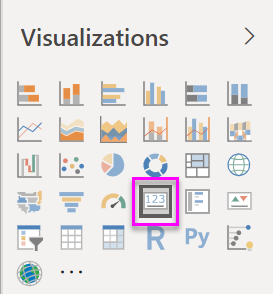
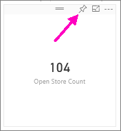
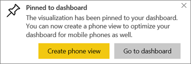
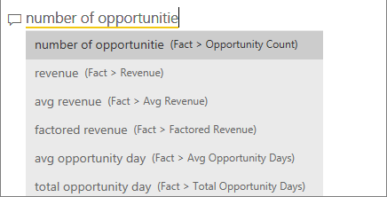
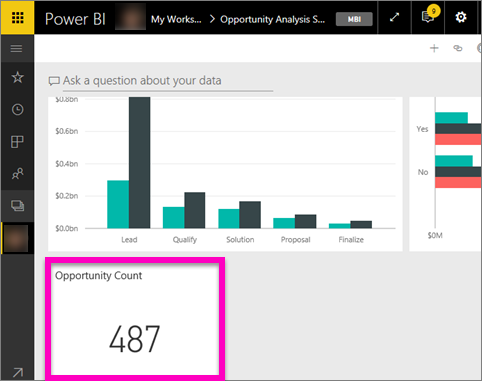
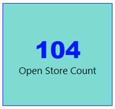

# Card visualizations
Sometimes a single number is the most important thing you want to track in your Power BI dashboard or report, such as total sales, market share year over year, or total opportunities. This type of visualization is called a *Card*. As with almost all of the native Power BI visualizations, Cards can be created using the report editor or Q&A.

## Create a card using the report editor
These instructions use the Retail Analysis Sample. To follow along, [download the sample](../sample-datasets.md) for Power BI service (app.powerbi.com) or Power BI Desktop.   

1. Start on a blank report page and select the **Store** \> **Open store count** field. If you're using Power BI service, you'll need to open the report in [Editing View](../service-interact-with-a-report-in-editing-view.md).

    Power BI creates a column chart with the one number.

   
2. In the Visualizations pane, select the Card icon.

   
6. Hover over the card and select the pin icon  to add the visualization to the dashboard.

   
7. Pin the tile to an existing dashboard or to a new dashboard.

   * Existing dashboard: select the name of the dashboard from the dropdown.
   * New dashboard: type the name of the new dashboard.
8. Select **Pin**.

   A Success message (near the top right corner) lets you know the visualization was added, as a tile, to your dashboard.

   
9. Select **Go to dashboard**. There, you can [edit and move](../service-dashboard-edit-tile.md) the pinned visualization.

## Create a card from the Q&A question box
The Q&A question box is the easiest way to make a Card. The Q&A question box is available in Power BI service from a dashboard or report and in Desktop report view. The steps below describe creating a Card from a Power BI service dashboard. If you'd like to create a card using Q&A in Power BI Desktop, [follow these instructions](https://powerbi.microsoft.com/en-us/blog/power-bi-desktop-december-feature-summary/#QandA) for the Q&A preview for Desktop reports.

1. Create a [dashboard](../service-dashboards.md) and [get data](../service-get-data.md). This example uses the [Opportunity Analysis sample](../sample-opportunity-analysis.md).

1. At the top of your dashboard, start typing what you want to know about your data in the question box. 

   

> [!TIP]
> From a Power BI service report, in Editing view, select **Ask a question** from the top menubar. From a Power BI Desktop report, find some open space in a report and double-click to open a question box.

3. For example, type "number of opportunities" in the question box.

   

   The question box helps you with suggestions and restatements, and finally displays the total number.  
4. Select the pin icon  in the upper-right corner to add the card to a dashboard.

   
5. Pin the card, as a tile, to an existing dashboard or to a new dashboard.

   * Existing dashboard: select the name of the dashboard from the dropdown. Your choices will be limited to only those dashboards withing the current workspace.
   * New dashboard: type the name of the new dashboard and it will be added to your current workspace.
6. Select **Pin**.

   A Success message (near the upper right corner) lets you know the visualization was added, as a tile, to your dashboard.  

   
7. Select **Go to dashboard** to see the new tile. There, you can [rename, resize, add a hyperlink, and reposition the tile, and more](../service-dashboard-edit-tile.md) on your dashboard.

   

## Considerations and troubleshooting
- If you do not see a question box at all, contact your system or tenant administrator.    
- If you are using Desktop and double-clicking empty space in a report doesn't open Q&A, you may need to enable it.  Select **File > Options and Settings > Options > Preview features > Q&A** and restart Desktop.

## Format a card
You have many options for changing labels, text, color and more. The best way to learn is to create a card and then explore the Formatting pane. Here are just a few of the formatting options available. 

1. Start by selecting the paintroller icon to open the Formatting pane. 

    
2. Expand **Data label** and change the color, size, and font family. If you had thousands of stores, you could use **Display units** to show the number of stores by thousands and control the decimal places as well. For example, 125.8K instead of 125,832.00.

3.  Expand **Category label** and change the color and size.

    

4. Expand **Background** and move the slider to On.  Now you can change the background color and transparency.

    

5. Continue to explore the formatting options until your card is exactly how you'd like it. 

    

## Next steps
[Combo charts in Power BI](power-bi-visualization-combo-chart.md)

[Visualization types in Power BI](power-bi-visualization-types-for-reports-and-q-and-a.md)
