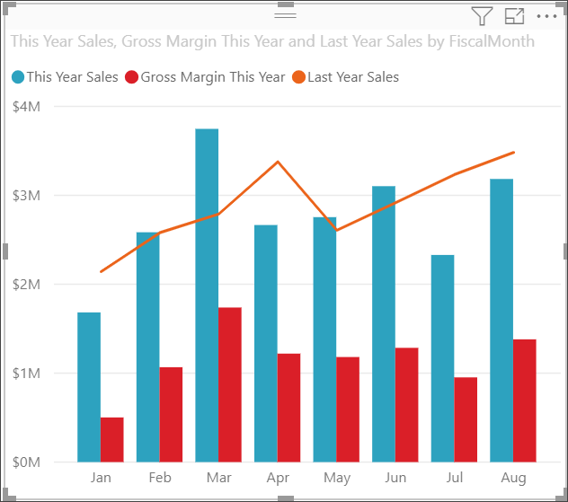
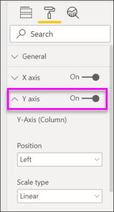

# Combo Chart in Power BI

In Power BI, a combo chart is a single visualization that combines a line chart and a column chart. Combining the two charts into one lets you make a quicker comparison of the data.

Combo charts can have one or two Y axes.

## When to use a Combo Chart

Combo charts are a great choice:

* When you have a line chart and a column chart with the same X axis.

* To compare multiple measures with different value ranges.

* To illustrate the correlation between two measures in one visualization.

* To check whether one measure meets the target defined by another measure.

* To conserve canvas space.

## Prerequisites

Combo charts are available in Power BI service and Power BI Desktop. This tutorial uses Power BI service to create a Combo chart. Make sure you have user credentials to sign in to Power BI.

## Create a basic, single-axis, Combo Chart

Watch Will create a combo chart using the Sales and Marketing sample.

<iframe width="560" height="315" src="https://www.youtube.com/embed/lnv66cTZ5ho?list=PL1N57mwBHtN0JFoKSR0n-tBkUJHeMP2cP" frameborder="0" allowfullscreen></iframe>  

To follow along, open Power BI service and connect to the **Retail Analysis sample**. To create your own combo chart, sign in to Power BI service and select **Get Data** > **Samples** > **Retail Analysis Sample** > **Connect**. The **Retail Analysis Sample** dashboard appears.

1. From the "Retail Analysis Sample" dashboard, select the **Total Stores** tile to open the **Store Sales Overview** report.

1. Select **Edit Report** to open the report in Editing View.

1. At the bottom of the page, select **+** to add a new report page.

1. Create a column chart that shows this year's sales and gross margin by month.

    1. From the Fields pane, select **Sales** \> **This Year Sales** > **Value**.

    1. Drag **Sales** \> **Gross Margin This Year** to the **Value** well.

    1. Select **Time** \> **FiscalMonth** to add it to the **Axis** well.

<<<<<<< HEAD
        
=======
    c. Select **Time** \> **FiscalMonth** to add it to the **Axis** well.
>>>>>>> b0cb07b4a4aa3bfee4796d89d5e0a9098867765f

1. Select the ellipsis in the upper-right corner of the visualization, and select **Sort by > FiscalMonth**. To change the sort order, select the ellipsis again and choose either **Sort ascending** or **Sort descending**.

1. Convert the column chart to a combo chart. There are two combo charts available: **Line and stacked column** and **Line and clustered column**. With the column chart selected, from the **Visualizations** pane select the **Line and clustered column chart**.

    

1. From the **Fields** pane, drag **Sales** > **Last Year Sales** to the **Line Values** well.

    

    Your combo chart should look something like this:

    

## Create a combo chart with two axes

In this task, we'll compare gross margin and sales.

<<<<<<< HEAD
1. Create a new line chart that tracks **Gross Margin last year %** by **Month**. Select the ellipsis to sort it by **Month** and **Ascending**.

    

     In January GM% was 35%, peaked at 45% in April, dropped in July and peaked again in August. Will we see a similar pattern in sales last year and this year?

1. Add **This Year Sales** > **Value** and **Last Year Sales** to the line chart. The scale of **Gross Margin Last Year %** is much smaller than the scale of **Sales**. It's difficult to compare.

    

1. To make the visual easier to read and interpret, convert the line chart to a Line and Stacked Column chart.
=======
1. Create a new line chart that tracks **Gross Margin last year %** by **FiscalMonth**. Select the ellipsis to sort it by **Month** and **Ascending**.  
In January GM% was 35%, peaked at 45% in April, dropped in July and peaked again in August. Will we see a similar pattern in sales last year and this year?
>>>>>>> b0cb07b4a4aa3bfee4796d89d5e0a9098867765f

    

1. Drag **Gross Margin Last Year %** from **Column Values** into **Line Values**. 

    

<<<<<<< HEAD
    Power BI creates two axes, allowing the service so scale the datasets differently. The left measures sales dollars and the right measures percentage. And we see the answer to our question: Yes, we do see a similar pattern.

## Add titles to the axes

1. Select the paint roller icon  to open the Formatting pane.

1. Select the down arrow to expand the **Y-axis** options.
=======
       

## Add titles to the axes
1. Select the paint roller icon  to open the Formatting pane.
2. Select the down arrow to expand the **Y-axis** options.
3. For **Y-Axis (Column)**, set **Position** to **Left**, set **Title** to **On**, **Style** to  **Show title only**, and **Display units** as **Millions**.

   
4. Under **Y-Axis (Column)**, scroll down until you see **Show secondary**. Because there are so many options for the Y axes, you may have to use both scrollbars. The Show secondary section displays options for formatting the line chart portion of the combo chart.

   
5. For **Y-Axis (Line)**, leave **Position** as **Right**, turn **Title** to **On**, and set **Style** to **Show title only**.
>>>>>>> b0cb07b4a4aa3bfee4796d89d5e0a9098867765f

1. For **Y-Axis (Column)**, select these options:

<<<<<<< HEAD
    | Setting | Value |
    | ------- | ----- |
    | Position | Select **Left**. |
    | Display units | Select **Millions**. |
    | Title | Move slider to **On**. |
    | Style | Select **Show title only**. |
    | Show secondary | Move slider to **On**.  This shows options for formatting the line chart portion of the combo chart. |
=======
   
>>>>>>> b0cb07b4a4aa3bfee4796d89d5e0a9098867765f

1. For **Y-Axis (Line)**, select these options:

    | Setting | Value |
    | ------- | ----- |
    | Position | Select **Right**. |
    | Title | Move slider to **On**. |
    | Style | Select **Show title only**. |

    Your combo chart now shows dual axes, both with titles.

    

1. Optionally, change the text font, size, and color and set other formatting options to improve the display and readability of the chart.

From here you might want to:

* [Add the combo chart as a dashboard tile](../service-dashboard-tiles.md).

* [Save the report](../service-report-save.md).

* [Make the report more accessible for people with disabilities](../desktop-accessibility.md).

## Cross-highlighting and cross-filtering

Highlighting a column or line in a combo chart cross-highlights and cross-filters the other visualizations on the report page... and the other way around. Use [visual interactions](../service-reports-visual-interactions.md) to change this default behavior.

## Next steps

[Doughnut charts in Power BI](power-bi-visualization-doughnut-charts.md)

[Visualization types in Power BI](power-bi-visualization-types-for-reports-and-q-and-a.md)