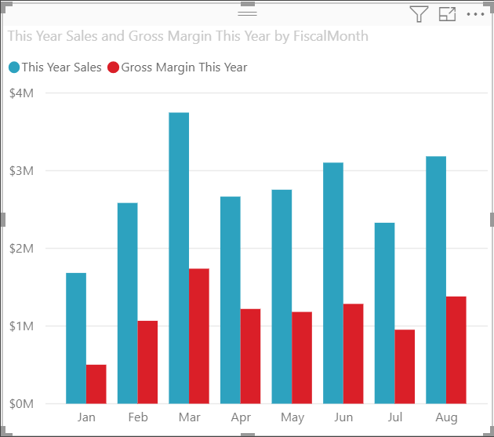
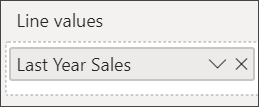

# Combo Chart in Power BI
In Power BI, a combo chart is a single visualization that combines a line chart and a column chart. Combining the 2 charts into one lets you make a quicker comparison of the data.

Combo charts can have one or two Y axes.

## When to use a Combo Chart
Combo charts are a great choice:

* when you have a line chart and a column chart with the same X axis.
* to compare multiple measures with different value ranges.
* to illustrate the correlation between two measures in one visualization.
* to check whether one measure meet the target which is defined by another measure
* to conserve canvas space.

### Prerequisites
Combo charts are available in Power BI service and Power BI Desktop. This tutorial uses Power BI service to create a Combo chart. To follow along, open Power BI service and connect to the "Retail Analysis" sample [instructions below](#create)).

## Create a basic, single-axis, Combo Chart
Watch Will create a combo chart using the Sales and Marketing sample.

<iframe width="560" height="315" src="https://www.youtube.com/embed/lnv66cTZ5ho?list=PL1N57mwBHtN0JFoKSR0n-tBkUJHeMP2cP" frameborder="0" allowfullscreen></iframe>  

To create your own combo chart, sign in to Power BI service and select **Get Data \> Samples \> Retail Analysis Sample > Connect >Go to dashboard**.

1. From the "Retail Analysis Sample" dashboard, select the **Total Stores** tile to open the "Retail Analysis Sample" report.
2. Select **Edit Report** to open the report in Editing View.
3. [Add a new report page](../power-bi-report-add-page.md).
4. Create a column chart that displays this year's sales and gross margin by month.

    a.  From the Fields pane, select **Sales** \> **This Year Sales** > **Value**.

    b.  Drag **Sales** \> **Gross Margin This Year** to the **Value** well.

    c.  Select **Time** \> **FiscalMonth** to add it to the **Axis** well.

    
5. Select the ellipsis (...) in the upper-right corner of the visualization, and select **Sort by > FiscalMonth**. To change the sort order, select the ellipsis again and choose either **Sort ascending** or **Sort descending**.

6. Convert the column chart to a combo chart. There are two combo charts available: **Line and stacked column** and **Line and clustered column**. With the column chart selected, from the **Visualizations** pane select the **Line and clustered column chart**.

    
7. From the **Fields** pane, drag **Sales** \> **Last Year Sales** to the **Line Values** bucket.

   

   Your combo chart should look something like this:

   

## Create a combo chart with two axes
In this task, we'll compare gross margin and sales.

1. Create a new line chart that tracks **Gross Margin last year %** by **Month**. Select the ellipsis to sort it by **Month** and **Ascending**.  
In January GM% was 35%, peaked at 45% in April, dropped in July and peaked again in August. Will we see a similar pattern in sales last year and this year?

   
2. Add **This Year Sales > Value** and **Last Year Sales** to the line chart. The scale of **Gross Margin Last Year %** is much smaller than the scale of **Sales** which makes it difficult to compare.      

   
3. To make the visual easier to read and interpret, convert the line chart to a Line and Stacked Column chart.

   
4. Drag **Gross Margin Last Year %** from **Column Values** into **Line Values**. Power BI creates two axes, thus allowing the datasets to be scaled differently; the left measures sales dollars and the right measures percentage. And we see the answer to our question; yes, we do see a similar pattern.

       

## Add titles to the axes
1. Select the paint roller icon  to open the Formatting pane.
2. Select the down arrow to expand the **Y-axis** options.
3. For **Y-Axis (Column)**, set **Position** to **Left**, set **Title** to **On**, **Style** to  **Show title only**, and **Display** as **Millions**.

   
4. Under **Y-Axis (Column)**, scroll down and ensure that **Show Secondary** is set to **On**. This displays options for formatting the line chart portion of the combo chart.

   
5. For **Y-Axis (Line)**, leave **Position** as **Right**, turn **Title** to **On**, and set **Style** to **Show title only**.

   Your combo chart now displays dual axes, both with titles.

   

6. Optionally, modify the text font, size, and color and set other formatting options to improve the display and readability of the chart.

From here you might want to:

* [Add the combo chart as a dashboard tile](../service-dashboard-tiles.md).
* [Save the report](../service-report-save.md).
* [Make the report more accessible for people with disabilities](../desktop-accessibility.md).

## Cross-highlighting and cross-filtering

Highlighting a column or line in a combo chart cross-highlights and cross-filters the other visualizations on the report page... and vice versa. Use [visual interactions](../service-reports-visual-interactions.md) to change this default behavior.

## Next steps

[Doughnut charts in Power BI](power-bi-visualization-doughnut-charts.md)

[Visualization types in Power BI](power-bi-visualization-types-for-reports-and-q-and-a.md)
