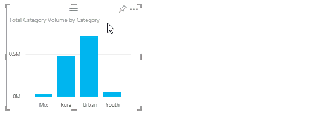

# Copy and paste a report visualization

[!INCLUDE [applies-yes-desktop-yes-service](../includes/applies-yes-desktop-yes-service.md)]

This article covers two different ways to copy and paste a visual.

- copy a visual in a report and paste it onto another report page (requires editing permissions for the report)
- copy an image of a visual from Power BI to your clipboard, and paste it into other applications (available in the Power BI service and mobile, unavailable in Power BI Desktop)

## Copy and paste within the same report

Visuals in Power BI reports can be copied from one page in the report to the same page or different page in the same report. 

Copying and pasting a visualization requires edit permissions to the report. In the Power BI service, this means opening the report in [Editing View](../consumer/end-user-reading-view.md). 

Visualizations on *dashboards* can't be copied and pasted into Power BI reports or other dashboards.

1. Open a report (in editing view) that has at least one visualization.  

1. Select the visualization and use **Ctrl +C** to copy, and **Ctrl +V** to paste.

   

## Copy a visual as an image to your clipboard

Have you ever wanted to share an image from a Power BI report or dashboard? Now you can copy the visual from the Power BI service or mobile and paste it into any other application that supports pasting.

When you copy a static image of a visual, you get a copy of the visual, including filters applied to it, along with its metadata. The list of filters includes:

- link back to the Power BI report or dashboard
- title of the report or dashboard
- notice if the image contains confidential information
- last updated time stamp
- text description of the filters applied to the visual

Visuals can be copied from dashboards and from reports.

#### [Dashboard](#tab/browser)

### Copy from a dashboard tile

1. Open the Power BI service and navigate to the dashboard you want to copy from.

1. From the upper right corner of the visual, select **More options(...)** and choose **Copy visual as image**.

   :::image type="content" source="media/power-bi-visualization-copy-paste/power-bi-dashboard-copy.png" alt-text="Screenshot showing the selection of Copy visual as image.":::

1. If your visual has a sensitivity label applied, you receive a warning before the copy is made. If the data shouldn't be shared with others, select **Cancel**. If you select **Copy**,  the sensitivity label is added to the metadata under the pasted visual. 

    :::image type="content" source="media/power-bi-visualization-copy-paste/power-bi-sensitivity.png" alt-text="Screenshot showing a warning message for visuals with sensitivity labels.":::

1. When the **Image with caption copied** dialog appears, review the image and caption. If it looks OK, select **Copy** and then close the dialog.

   :::image type="content" source="media/power-bi-visualization-copy-paste/power-bi-copy-preview.png" alt-text="Screenshot of a dialog with the Copy to clipboard option.":::

1. When your visual is ready, paste it into another application using **Ctrl + V** or right-click > Paste. In this screenshot, we pasted the visual into Microsoft OneNote. 

   :::image type="content" source="media/power-bi-visualization-copy-paste/power-bi-paste-onenote.png" alt-text="Screenshot of the visual pasted into OneNote.":::

#### [Report](#tab/report)

### Copy from a report visual

1. Open the Power BI service and navigate to the report you want to copy from.

1. From the upper right corner of the visual, select the icon for **Copy as image with caption**. 

   :::image type="content" source="media/power-bi-visualization-copy-paste/power-bi-copy-report.png" alt-text="Screenshot showing Copy visual as image icon.":::

1. If your visual has a sensitivity label applied, you receive a warning before the copy is made. If the data shouldn't be shared with others, select **Cancel**.

1. When the **Image with caption copied** dialog appears, review the image and caption. If it looks OK, select **Copy** and then close the dialog.

    :::image type="content" source="media/power-bi-visualization-copy-paste/power-bi-copy-reports.png" alt-text="Screenshot showing the Copy visual as image icon displayed.":::

1. When your visual is ready, paste it into another application using **Ctrl + V** or right-click > Paste. In this screenshot, we pasted the visual into an email.

   :::image type="content" source="media/power-bi-visualization-copy-paste/power-bi-email.png" alt-text="Screenshot showing the visual pasted into Outlook.":::

---

### Manage use of copying a visual as an image

If you own the content or are an administrator of the tenant, you can control whether a visual can be copied as an image from a report or dashboard.

#### Disable copy and paste for a specific visual

If you don't want users to be able to copy a specific visual, you can remove the copy icon from that visual in the Power BI service (not available in Power BI Desktop).

1. Open the report in Editing mode. 
1. Select the visual to make it active.
1. Select the paint brush icon to open the Formatting pane.
1. Select **General** > **Header icons** > **Icons** and expand the card.
1. Scroll down to the bottom of the card and toggle off **Copy icon**.

   :::image type="content" source="media/power-bi-visualization-copy-paste/power-bi-headers.png" alt-text="Screenshot showing the paint brush selected and the copy icon selected.":::

1. If you can't find the **Visual header** setting, turn on the modern visual header option under **Report settings**.

   :::image type="content" source="media/power-bi-visualization-copy-paste/power-bi-use-modern.png" alt-text="Screenshot showing Enable modern visual header selected.":::

1. Save changes. Reshare and republish as needed.

#### Disable copy and paste for a group of users

If you own the content or are an administrator of the tenant, you can control who can copy visuals. This setting disables *copy as image with caption* in reports and *copy visual as image* on dashboards for all users of the Power BI tenant. Users might still see the copy and paste options but they receive an error message when they try to use them.
  
1. Navigate to the Admin Portal.

1. Under **Tenant settings**, locate **Export and sharing settings**. 

   :::image type="content" source="media/power-bi-visualization-copy-paste/power-bi-enable.png" alt-text="Screenshot showing Enable Copy and paste visuals.":::

1. Disable **Copy and paste visuals**, for your selected user groups. 
  
## Considerations and troubleshooting

:::image type="content" source="media/power-bi-visualization-copy-paste/power-bi-copy-grey.png" alt-text="Screenshot showing the 'Copy not available' screen.":::

Q: Why is the Copy icon disabled on a visual?   
A: The content owner and admin can turn off this feature.    

Q: Which visuals aren't fully supported for copying and pasting?    
A: We currently support native Power BI visuals and certified custom visuals. There's limited support for certain visuals including:

- ESRI and other map visuals. 
- Python visuals. 
- R visuals. 
- Power Apps visuals. 
- Slicer visuals and visuals that use *Filter APIs* which act as slicers. Learn more about [visual filter APIs](../developer/visuals/filter-api.md).
- [Licensed visuals](../developer/visuals/licensing-faq.yml#what-are-licensed-visuals-)
- Custom visuals that aren't certified. See [how to certify your custom visual.](../developer/visuals/power-bi-custom-visuals-certified.md) 
- [AppSource visuals that are managed in your organizational store.](/fabric/admin/organizational-visuals#add-a-visual-from-appsoruce)
- Visuals with applied themes and colors.
- Freshly pinned dashboard tiles.
- Visuals with Odata filters can't be redirected.
- Visuals with personal bookmarks and other *sticky* states.

Q: Can I paste into any application?    
A: No, only applications with support for pasting HTML.    
A: Formatted content from the clipboard may not render everything that was copied from the visual. 

Q: I don't see the copy and paste options.   
A: If you're using Power BI Desktop, this feature isn't yet available.   

## Related content

More about [Visualizations in Power BI reports.](power-bi-report-visualizations.md)

More questions? [Try the Power BI Community.](https://community.powerbi.com/)
