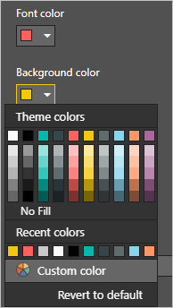
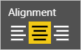
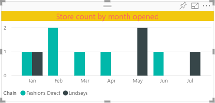
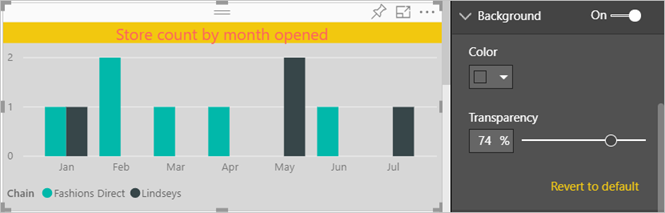
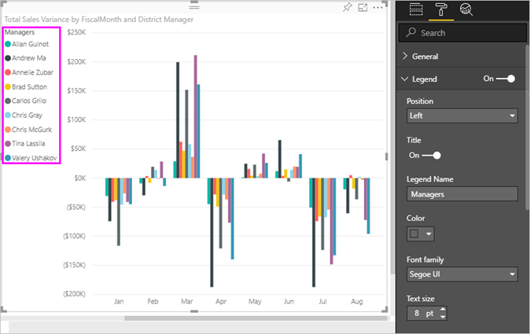

# Customize visualization titles, legends, and backgrounds

In this tutorial, you'll learn a few different ways to customize your visualizations. There are so many options for customizing your visualizations. The best way to learn about them all is by exploring the **Format** pane (select the paint roller icon). To get you started, this article shows you how to customize a visualization title, legend, and background.

You can't customize all visualizations. See the [complete list](#visualization-types-that-you-can-customize).

Fast-forward to 4:50 in the video for a demonstration of how to customize visualizations:

<iframe width="560" height="315" src="https://www.youtube.com/embed/IkJda4O7oGs" frameborder="0" allowfullscreen></iframe>

Now, follow the instructions below to try it out yourself with your own data.

## Prerequisites

- The Power BI service or Power BI Desktop

- Retail Analysis Sample report

## Customize visualization titles in reports

To follow along, sign into [the Power BI service](https://app.powerbi.com) and open the [Retail Analysis Sample](../sample-datasets.md) report in [Edit report](../service-interact-with-a-report-in-editing-view.md) view.

> [!NOTE]
> When you pin a visualization to a dashboard, it becomes a dashboard tile. You can also customize the tiles themselves with [new titles and subtitles, hyperlinks, and resized](../service-dashboard-edit-tile.md).

1. Go to the **New Stores** page of the **Retail Analysis Sample** report.

1. Select the **Open Store Count by Open Month and Chain** Clustered column chart.

1. In the **Visualizations** pane, select the paint roller icon to reveal the format options.

1. Select **Title** to expand that section.

   

1. Turn **Title** on and off by selecting the **On** (or **Off**) slider. For now, leave it **On**.

   

1. Enter *Store count by month opened* in the **Title Text** by text field to change the title.

1. Change **Font color** to orange and **Background color** to yellow.

    1. Select the drop-down and choose a color from **Theme colors**, **Recent colors**, or **Custom color**.

        

    1. Select the drop-down to close the color window.

       You can always revert to the default colors by selecting **Revert to default** in the color window.

1. Increase the text size to **12 pt**.

1. The last customization you'll make to the chart title is to align it in the center of the visualization.

    

At this point in the tutorial, your Clustered column chart title will look something like this:

To revert all the title customization you've done, select **Revert To Default**, at the bottom of the **Title** customization pane.

## Customize visualization backgrounds

With the same Clustered column chart selected, expand the **Background** options.

1. Turn the background on and off by selecting the **On** (or **Off**) slider. For now, leave it **On**.

1. Select the drop-down and choose a grey color from **Theme colors**, **Recent colors**, or **Custom color**.

1. Change **Transparency** to **74%**.

At this point in the tutorial, your Clustered column chart background will look something like this:

To revert all the title background customization you've done, select **Revert to default**, at the bottom of the **Background** customization pane.

## Customize visualization legends

1. Open the **Overview** report page and select the **Total Sales Variance by FiscalMonth and District Manager** chart.

1. In the **Visualization** tab, select the paint brush icon to open the Format pane.

1. Expand **Legend** options:

      

1. Turn the legend on and off by selecting the **On** (or **Off**) slider. For now, leave it **On**.

1. Move the legend to the left side of the visualization.

1. Add a legend title by toggling **Title** to **On**.

1. Enter *Managers* in the **Legend name** field.

At this point in the tutorial, your Clustered column chart legend will look something like this:

To revert all the legend customization you've done, select **Revert to default**, at the bottom of the **Legend** customization pane.

## Visualization types that you can customize

Here is a list of the visualizations and the customization options that are available for each:

| Visualization | Title | Background | Legend |
|:--- |:--- |:--- |:--- |
| Area | yes | yes |yes |
| Bar | yes | yes |yes |
| Card | yes | yes |n/a |
| Multi-row Card | yes | yes | n/a |
| Column | yes | yes | yes |
| Combo | yes | yes | yes |
| Donut | yes | yes | yes |
| Filled map | yes | yes | yes |
| Funnel | yes | yes | n/a |
| Gauge | yes | yes | n/a |
| KPI | yes | yes | n/a |
| Line | yes | yes | yes |
| Map | yes | yes | yes |
| Matrix | yes | yes | n/a |
| Pie | yes | yes | yes |
| Scatter | yes | yes | yes |
| Slicer | yes | yes | n/a |
| Table | yes | yes | n/a |
| Textbox | no | yes | n/a |
| Treemap | yes | yes | yes |
| Waterfall | yes | yes | yes |

## Next steps

- [Customize X-axis and Y-axis](power-bi-visualization-customize-x-axis-and-y-axis.md)

- [Customize colors and axis properties](service-getting-started-with-color-formatting-and-axis-properties.md)

- [Power BI - Basic Concepts](../consumer/end-user-basic-concepts.md)

More questions? [Try the Power BI Community](http://community.powerbi.com/)
