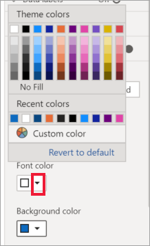
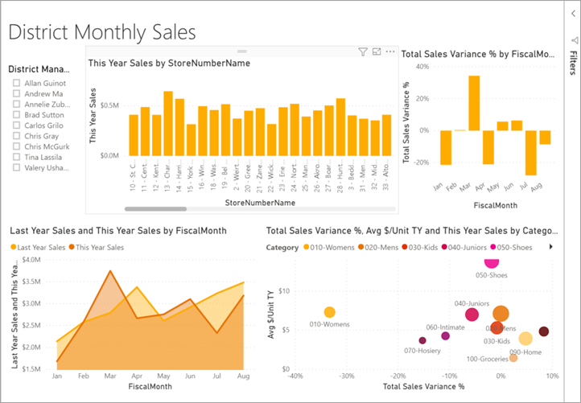

# Customize visualization titles, backgrounds, and legends

In this tutorial, you'll learn a few different ways to customize your visualizations. There are so many options for customizing your visualizations. The best way to learn about them all is by exploring the **Format** pane (select the paint roller icon). To get you started, this article shows you how to customize a visualization title, legend, background, and add a theme.

You can't customize all visualizations. See the [complete list](#visualization-types-that-you-can-customize) of visualizations for details.

## Prerequisites

- The Power BI service or Power BI Desktop

- Retail Analysis Sample report

## Customize visualization titles in reports

To follow along, sign into Power BI Desktop and open the [Retail Analysis Sample](../sample-datasets.md) report.

> [!NOTE]
> When you pin a visualization to a dashboard, it becomes a dashboard tile. You can also customize the tiles themselves with [new titles and subtitles, hyperlinks, and resized](../service-dashboard-edit-tile.md).

1. Go to the **New Stores** page of the **Retail Analysis Sample** report.

1. Select the **Open Store Count by Open Month and Chain** clustered column chart.

1. In the **Visualizations** pane, select the paint roller icon to reveal the format options.

1. Select **Title** to expand that section.

   

1. Move the **Title** slider to **On**.

1. To change the title, enter *Store count by month opened* in the **Title text** field.

    

1. Change **Font color** to white and **Background color** to blue.    

    a. Select the drop-down and choose a color from **Theme colors**, **Recent colors**, or **Custom color**.

        

    b. Select the drop-down to close the color window.

1. Increase the text size to **16 pt**.

1. The last customization you'll make to the chart title is to align it in the center of the visualization.

    

    At this point in the tutorial, your clustered column chart title will look something like this:

    

Save the changes you've made and move to the next section.

If you ever need to revert all of the changes, select **Revert to default**, at the bottom of the **Title** customization pane.

## Customize visualization backgrounds

With the same clustered column chart selected, expand the **Background** options.

1. Move the **Background** slider to **On**.

1. Select the drop-down and choose a grey color.

1. Change **Transparency** to **74%**.

At this point in the tutorial, your clustered column chart background will look something like this:

Save the changes you've made and move to the next section.

If you ever need to revert all of the changes, select **Revert to default**, at the bottom of the **Background** customization pane.

## Customize visualization legends

1. Open the **Overview** report page and select the **Total Sales Variance by FiscalMonth and District Manager** chart.

1. In the **Visualization** tab, select the paint roller icon to open the Format pane.

1. Expand the **Legend** options:

    

1. Move the **Legend** slider to **On**.

1. Move the legend to the left side of the visualization.

1. Add a legend title by toggling **Title** to **On**.

1. Enter *Manager* in the **Legend name** field.

1. Change **Color** to black.

Save the changes you've made and move to the next section.

If you ever need to revert all of the changes, select **Revert to default**, at the bottom of the **Legend** customization pane.

## Customize colors using a theme

With report themes you can apply design changes to your entire report, such as using corporate colors, changing icon sets, or applying new default visual formatting. When you apply a report theme, all visuals in your report use the colors and formatting from your selected theme.

To apply a theme to your report, select **Switch theme** from the menu bar. Choose a theme.  The report below uses the **Solar** theme.

 

## Visualization types that you can customize

Here is a list of the visualizations and the customization options that are available for each:

| Visualization | Title | Background | Legend |
|:--- |:--- |:--- |:--- |
| Area | yes | yes |yes |
| Bar | yes | yes |yes |
| Card | yes | yes |n/a |
| Multi-row Card | yes | yes | n/a |
| Column | yes | yes | yes |
| Combo | yes | yes | yes |
| Donut | yes | yes | yes |
| Filled map | yes | yes | yes |
| Funnel | yes | yes | n/a |
| Gauge | yes | yes | n/a |
| Key Influencer | yes | yes | n/a |
| KPI | yes | yes | n/a |
| Line | yes | yes | yes |
| Map | yes | yes | yes |
| Matrix | yes | yes | n/a |
| Pie | yes | yes | yes |
| Q&A | yes | yes | n/a |
| Scatter | yes | yes | yes |
| Shape | yes | yes | yes |
| Slicer | yes | yes | n/a |
| Table | yes | yes | n/a |
| Textbox | no | yes | n/a |
| Treemap | yes | yes | yes |
| Waterfall | yes | yes | yes |

## Next steps

- [Customize X-Axis and Y-Axis properties](power-bi-visualization-customize-x-axis-and-y-axis.md)

- [Getting started with color formatting and axis properties](service-getting-started-with-color-formatting-and-axis-properties.md)

More questions? [Try the Power BI Community](https://community.powerbi.com/)
