# Customize X-Axis and Y-Axis properties

In this tutorial, you'll learn many different ways to customize the X-Axis and Y-Axis of your visuals. Not all visuals have axes. Pie charts, for example, don't have axes. And customization options vary from visual to visual. There are too many options to cover in a single article, so you'll take a look at some of the most-used axes customizations and get comfortable using the visual **Format** pane in the Power BI report canvas.  

> [!NOTE]
> This page applies to both the Power BI service and Power BI Desktop. These customizations, which are available when the **Format** (the paint roller ) icon is selected, are also available in Power BI Desktop.

Watch Amanda customize her X- and Y-Axes. She'll demonstrate the different ways to control concatenation when using drill down and drill up.

<iframe width="560" height="315" src="https://www.youtube.com/embed/9DeAKM4SNJM" frameborder="0" allowfullscreen></iframe>

## Prerequisites

- The Power BI service

- Retail Analysis Sample report

## Customize visualization X- and Y-Axes in reports

To follow along, sign into [the Power BI service](https://app.powerbi.com) and open the [Retail Analysis Sample](../sample-datasets.md) report in [Edit report](../service-interact-with-a-report-in-editing-view.md) view.

### Create a Stacked column chart visualization

Before you can customize you visualization, you have to build it.

1. In the Power BI service, expand **My Workspace**

1. Scroll down and select **Retail Analysis Sample** from the list of **Datasets**.

1. From the **Visualizations** pane, select the **Stacked column chart** icon.

    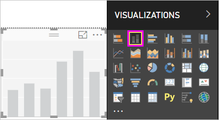

1. To set the X-Axis values, from the **Fields** pane, select **Time** > **FiscalMonth**.

1. To set the Y-Axis values, from the **Fields** pane, select **Sales** > **Last Year Sales** and **Sales** > **This Year Sales** > **Value**.

    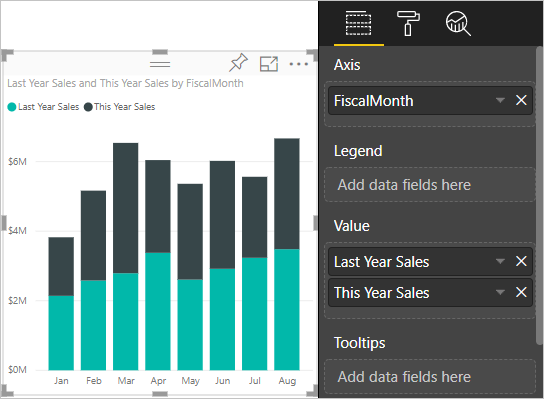

### Customize the X-Axis

Now you can customize your X-Axis.

1. In the **Visualizations** pane, select **Format** (the paint roller icon ) to reveal the customization options.

1. Expand the X-Axis options.

   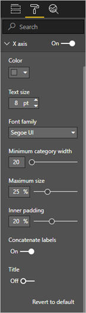

1. Turn the X-Axis on and off by selecting the **On** (or **Off**) slider. For now, leave it **On**.  

    One reason you might want to turn off the X-Axis is to save space for more data.

    

1. Format the text color, size, and font:

    - **Color**: Select black

    - **Text size**: Enter *14*

    - **Font family**: Select **Arial Black**

1. Slide the **Title** option to **On** to display the name of the X-Axis. In this case, t's **FiscalMonth**.

1. Format the title text color, size, and font:

    - **Title color**: Select orange

    - **Axis title**: Enter *Fiscal Month*

    - **Title text size**: Enter *21*

After you finish the customizations, your Stacked column chart will look something like this:

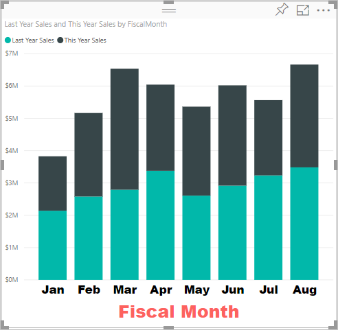

To revert all the X-Axis customization you've done so far, select **Revert to default** at the bottom of the **X-Axis** customization pane.

### Customize the Y-Axis

Next, you'll customize your Y-Axis.

1. Expand the Y-Axis options.

   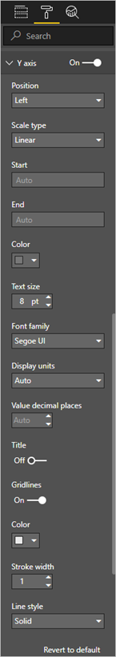

1. Turn the Y-Axis on and off by selecting the **On** (or **Off**) slider. For now, leave it **On**.  

    One reason you might want to turn off the Y-Axis is to save space for more data.

    

1. Set the Y-Axis **Position** to **Right**.

1. Format the text color, size, and font:

    - **Color**: Select black

    - **Text size**: Enter *14*

    - **Font family**: Select **Arial Black**

1. Set **Display units** set to **Millions** and **Value decimal places** to *0*.

1. For this visualization, having a Y-Axis title doesn't improve the visual, so leave **Title** turned **Off**.  

1. Let's make the gridlines stand out by changing the color and increasing the stroke:

    - **Color**: Select dark grey

    - **Stroke**: Enter *2*.

After all these customizations, your column chart should look something like this:

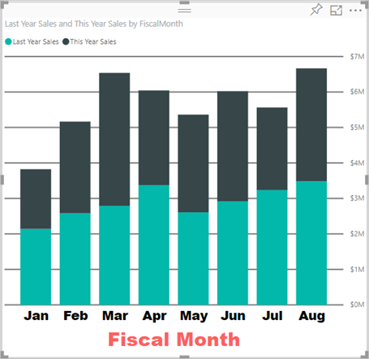

## Customizing visualizations with dual Y-Axes

First you'll create a Combo chart that looks at the impact store count has on sales. It's the same chart that is created in the [Combo chart tutorial](power-bi-visualization-combo-chart.md). Then you'll format the dual Y-Axes.

### Create a chart with two Y-Axes

1. Create a new Line chart that tracks **Sales > Gross Margin last year %** by **Time > FiscalMonth**.

    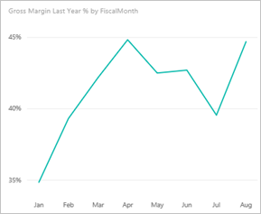

    > [!NOTE]
    > For help sorting by month, see [Sorting using other criteria](../consumer/end-user-change-sort.md#other).

    In January Gross Margin percentage was 35%, peaked in April at 45%, dropped in July, and peaked again in August. Will we see a similar pattern in sales last year and this year?

1. Add **This Year Sales > Value** and **Last Year Sales** to the line chart.

    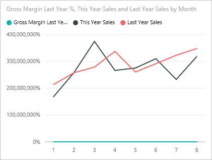

    The scale of **Gross Margin Last Year %** (the blue line running along the **0M%** gridline) is much smaller than the scale of **Sales, which makes it difficult to compare. And the Y-Axis label percentages are ridiculous.

1. To make the visual easier to read and interpret, convert the Line chart to a Line and stacked column chart.

   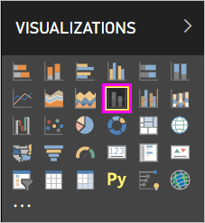

1. Drag **Gross Margin Last Year %** from **Column Values** into **Line Values**.

    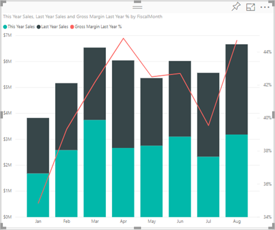

    Now you have the stacked column chart you created in the first section with a Line chart overlaid on top of it. Optionally, use what you learned above to format the axes font color and size.

   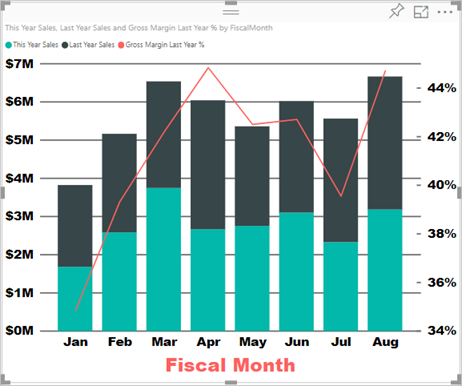

   Power BI creates two Y-Axes allowing the datasets to be scaled differently. The left axis measures dollars and the right axis measures percentage.

### Format the secondary Y-Axis

1. In the **Visualizations** pane, select the paint roller icon to display the format options.

1. Expand the Y-Axis options.

1. Scroll down until you find the **Show secondary** option. Verify that it is **On**.

   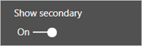

1. (Optional) Customize the two axes. If you switch **Position** for either the column axis or the line axis, then the two axes switch sides.

### Add titles to both axes

With a visualization that's so complicated, it helps to add axes titles.  Titles help your colleagues learn the story your visualization is telling.

1. Toggle **Title** to **On** for **Y-Axis (Column)** and the **Y-Axis (Line)**.

1. Set **Style** to **Show title only** for both.

   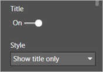

1. Your Combo chart now shows dual axes, both with titles.

   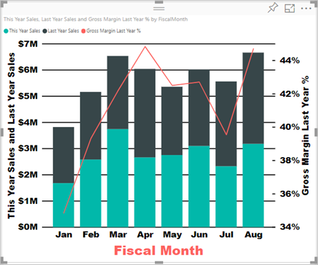

For more info, see [Tips and tricks for color formatting in Power BI](service-tips-and-tricks-for-color-formatting.md).

## Considerations and troubleshooting

If the X-Axis is categorized by the report owner as a date type, the **Type** option will display and you can select between continuous or categorical.

## Next steps

- [Visualizations in Power BI reports](power-bi-report-visualizations.md)

- [Customize visualization titles, legends, and backgrounds](power-bi-visualization-customize-title-background-and-legend.md)

- [Getting started with color formatting and axis properties](service-getting-started-with-color-formatting-and-axis-properties.md)

- [Basic concepts for Power BI service consumers](../consumer/end-user-basic-concepts.md)

More questions? [Try the Power BI Community](http://community.powerbi.com/)
