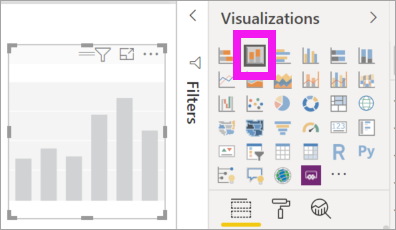
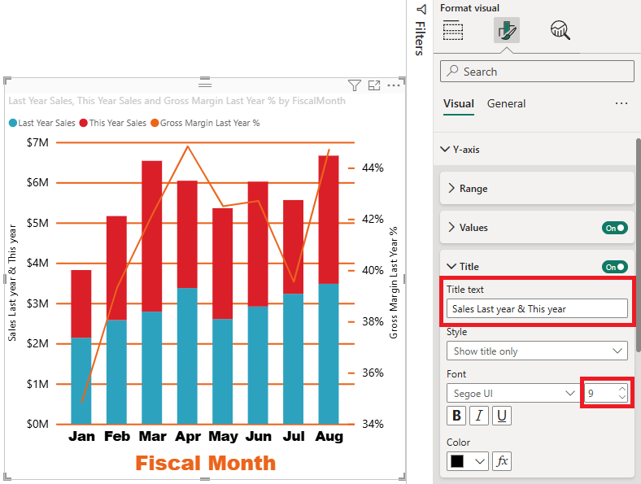

# Customize x-axis and y-axis properties

[!INCLUDE [applies-yes-desktop-yes-service](../includes/applies-yes-desktop-yes-service.md)]

In this tutorial, you'll learn many different ways to customize the X-axis and Y-axis of your visuals. Not all visuals have axes. Pie charts, for example, don't have axes. And customization options vary from visual to visual. There are too many options to cover in a single article, so we'll take a look at some of the most-used customizations and get comfortable using the visual **Format** pane in the Power BI report canvas.  

Watch Amanda customize her X- and Y-axes. She'll also demonstrate the different ways to control concatenation when using drill-down and drill-up options.

> [!NOTE]  
> This video might use earlier versions of Power BI Desktop or the Power BI service.

<iframe width="560" height="315" src="https://www.youtube.com/embed/9DeAKM4SNJM" frameborder="0" allowfullscreen></iframe>

## Prerequisites

- Power BI Desktop

- [Retail Analysis Sample ](https://download.microsoft.com/download/9/6/D/96DDC2FF-2568-491D-AAFA-AFDD6F763AE3/Retail%20Analysis%20Sample%20PBIX.pbix)

## Add a new visualization

Before you can customize your visualization, you have to build it.

1. In Power BI Desktop, open the Retail Analysis sample.  

2. At the bottom, select the yellow plus icon to add a new page. 

    

1. From the **Visualizations** pane, select the stacked column chart icon. This adds an empty template to your report canvas.

    

1. To set the X-axis values, from the **Fields** pane, select **Time** > **FiscalMonth**.

1. To set the Y-axis values, from the **Fields** pane, select **Sales** > **Last Year Sales** and **Sales** > **This Year Sales** > **Value**.

    

    Now you can customize your X-axis. Power BI gives you almost limitless options for formatting your visualization. 

## Customize the X-axis
There are many features that are customizable for the X-axis. You can add and modify the data labels and X-axis title. For categories, you can modify the width, size, and padding of bars, columns, lines, and areas. And for values, you can modify the display units, decimal places, and grid lines. The following example shows customization for a column chart. Let's add a few customizations to get you familiar with the options and then you can explore the rest on your own.

### Customize the X-axis labels
The X-axis labels display below the columns in the chart. Right now, they're light grey, small, and difficult to read. Let's change that.

1. In the **Visualizations** pane, select **Format** (the paint roller icon  ) to reveal the customization options.

2. Expand the X-axis options.

   

3. Move the **X-axis** slider to **On**.

    

    Some reasons you may want to set the X axis to **Off**, is if the visualization is self-explanatory without labels or if you have a crowded report page and need to make space to display more data.

4. Format the text color, size, and font:

    - **Color**: Select black

    - **Text size**: Enter *14*

    - **Font family**: Select **Arial Black**

    - **Inner padding**: Enter *40%*

        
    
5. Maybe you don't like the way the X-axis text is displayed on a diagonal. You have several options. 
    - Change the text size to something smaller than 14.
    - Make the visualization larger. 
    - Display fewer columns and add a scrollbar by increasing **Minimum category width**. 
    
    Here, we've selected the second option and grabbed one of the resize bars to make the visualization wider. It now accommodates the 14-point text without needing to display the text on an angle or with a scrollbar. 

   

### Customize the X-axis title
When the X-axis title is **On**, the X-axis title displays below the X-axis labels. 

1. Start by turning the X-axis title to **On**.  

    

    The first thing you'll notice is that your visualization now has a default X-axis title.  In this case, it's **FiscalMonth**.

   

1. Format the title text color, size, and font:

    - **Title color**: Select orange

    - **Axis title**: Type *Fiscal Month* (with a space)

    - **Title text size**: Enter *18*

    After you finish the customizations, your stacked column chart looks something like this:

    

1. Save the changes you've made and move to the next section. If you ever need to revert all of the changes, select **Revert to default** at the bottom of the **X-Axis** customization pane. Next, you'll customize your Y-Axis.

## Customize the Y-axis
There are many features that can be customized for the Y-axis. You can add and modify the data labels, Y-axis title, and gridlines. For values, you can modify the display units, decimal places, starting point, and end point. And, for categories, you can modify the width, size, and padding of bars, columns, lines, and areas. 

The following example continues our customization of a column chart. Let's make a few changes to get you familiar with the options, and then you can explore the rest on your own.

### Customize the Y-axis labels
The Y-axis labels are displayed to the left by default. Right now, they're light grey, small, and difficult to read. Let's change that.

1. Expand the Y-Axis options.

   

1. Move the **Y-Axis** slider to **On**.  

    

    One reason you might want to turn off the Y-axis, is to save space for more data.

1. Format the text color, size, and font:

    - **Color**: Select black

    - **Text size**: Enter *10*

    - **Display units**: Select **Millions**

    

### Customize the Y-axis title
When the Y-axis title is **On**, the Y-axis title displays next to the Y-axis labels. For this visualization, having a Y-Axis title doesn't improve the visual, so leave **Title** turned **Off**. We'll add Y-axis titles to a dual-axis visual later in this tutorial. 

### Customize the gridlines
Let's make the gridlines stand out by changing the color and increasing the stroke:

- **Color**: Select orange

- **Stroke**: Enter *2*

After all these customizations, your column chart should look something like this:

## Customizing visualizations with dual Y axes

Some visualizations can benefit from having two Y axes. Combo charts are a good example. Before we can format dual Y axes, we'll create a combo chart that compares trends for sales and gross margin.  

### Create a chart with two Y-Axes

1. Select the column chart, and change it to a *Line and stacked column* chart. This type of visual supports a single line chart value and multiple stackable column values. 

    
   

2. Drag **Sales** > **Gross Margin Last Year %** from your Fields pane into the **Line Values** bucket.

    

    
3. Reformat the visualization to remove the angled X-axis labels. 

   

   Power BI creates two Y axes, allowing the values to be scaled differently. The left axis measures sales dollars and the right axis measures gross margin percentage.

### Format the second Y-Axis
Because we started with a visualization with one formatted Y-axis, Power BI created the second Y-axis using the same settings. But we can change that. 

1. In the **Visualizations** pane, select the paint roller icon to display the format options.

1. Expand the Y-Axis options.

1. Scroll down until you find the **Show secondary** option. Verify that it is **On**. Our secondary Y axis represents the line chart.

   

1. (Optional) Customize the font color, size, and display units for the two axes. If you switch **Position** for either the column axis or the line axis, then the two axes switch sides.

### Add titles to both axes

With a visualization that's complex, it helps to add axes titles.  Titles help your colleagues understand the story your visualization is telling.

1. Toggle **Title** to **On** for **Y-Axis (Column)** and the **Y-Axis (Line)**.

1. Set **Style** to **Show title only** for both.

   

1. Your combo chart now shows dual axes, both with titles.

   

1. Format the titles. In this example, we've shorted one of the titles and reduced the font size for both. 
    - Font size: **9**
    - Shortened the **Axis title** for the first Y axis (the column chart): Sales last year & this year. 
    
     

    For more information, see [Tips and tricks for color formatting in Power BI](service-tips-and-tricks-for-color-formatting.md) and [Customize visualization titles, legends, and backgrounds](power-bi-visualization-customize-title-background-and-legend.md). 

## Invert the y-axis

For line, bar, column, area, and combo charts, you can invert the y-axis, putting positive values going down and negative values going up. 

- Select the visual. In the **Format** pane, expand the **Y axis** section. Slide **Invert axis** to **On**.

    

## Next steps

- [Visualizations in Power BI reports](power-bi-report-visualizations.md)

More questions? [Try the Power BI Community](https://community.powerbi.com/)
