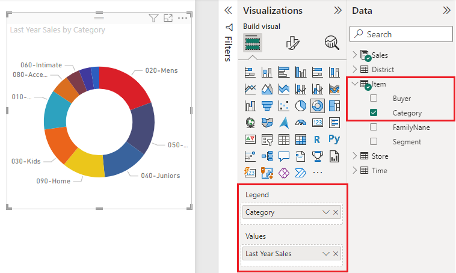

# Create and use doughnut charts in Power BI

[!INCLUDE [applies-yes-desktop-yes-service](../includes/applies-yes-desktop-yes-service.md)]

A doughnut chart is similar to a pie chart in that it shows the relationship of parts to a whole. The only difference is that the center is blank and allows space for a label or icon.

## Prerequisite

This tutorial uses the [Retail Analysis sample PBIX file](https://download.microsoft.com/download/9/6/D/96DDC2FF-2568-491D-AAFA-AFDD6F763AE3/Retail%20Analysis%20Sample%20PBIX.pbix).

1. From the upper left section of the menubar, select **File** > **Open**
   
2. Find your copy of the **Retail Analysis sample PBIX file**

1. Open the **Retail Analysis sample PBIX file** in report view .

1. Select  to add a new page.

> [!NOTE]
> Sharing your report with a Power BI colleague requires that you both have individual Power BI Pro licenses or that the report is saved in Premium capacity.    

## Create a doughnut chart

1. Start on a blank report page and from the Fields pane, select **Sales** \> **Last Year Sales**.  
   
3. From the Visualizations pane, select the icon for doughnut chart  to convert your bar chart to a doughnut chart. If **Last Year Sales** is not in the **Values** area, drag it there.
     
   

4. Select **Item** \> **Category** to add it to the **Legend** area. 
     
    

5. Optionally, [adjust the size and color of the chart's text](power-bi-visualization-customize-title-background-and-legend.md). 

## Considerations and troubleshooting
* The sum of the doughnut chart values must add up to 100%.
* Too many categories make it difficult to read and interpret.
* Doughnut charts are best used to compare a particular section to the whole, rather than comparing individual sections with each other. 

## Next steps
[Funnel charts in Power BI](power-bi-visualization-funnel-charts.md)

[Visualization types in Power BI](power-bi-visualization-types-for-reports-and-q-and-a.md)

