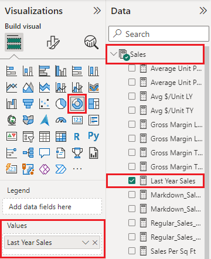

# Doughnut charts in Power BI
A doughnut chart is similar to a pie chart in that it shows the relationship of parts to a whole. The only difference is that the center is blank and allows space for a label or icon.

## Create a doughnut chart
These instructions use the Retail Analysis Sample to create a doughnut chart that displays this year's sales by category. To follow along, [download the sample](../sample-datasets.md) for Power BI service or Power BI Desktop.

1. Start on a [blank report page ](../power-bi-report-add-page.md). If you're using Power BI service, make sure you open the report in [Editing View](../service-interact-with-a-report-in-editing-view.md).

2. From the Fields pane, select **Sales** \> **Last Year Sales**.  
   
3. From the Visualizations pane, select the icon for doughnut chart  to convert your bar chart to a doughnut chart. If **Last Year Sales** is not in the **Values** area, drag it there.
     
   

4. Select **Item** \> **Category** to add it to the **Legend** area. 
     
    

5. Optionally, [adjust the size and color of the chart's text](power-bi-visualization-customize-title-background-and-legend.md). 

## Considerations and troubleshooting
* The sum of the doughnut chart values must add up to 100%.
* Too many categories make it difficult to read and interpret.
* Doughnut charts are best used to compare a particular section to the whole, rather than comparing individual sections with each other. 

## Next steps
[Funnel charts in Power BI](power-bi-visualization-funnel-charts.md)

[Visualization types in Power BI](power-bi-visualization-types-for-reports-and-q-and-a.md)

