# Export the data that was used to create a visualization

> [!IMPORTANT]
> Not all data can be viewed or exported by all users. There are safeguards that report designers and administrators use when building dashboards and reports. Some data is restricted, hidden, or confidential, and cannot be seen or exported without special permissions. 

## Who can export data

If you have permissions to the data, you can see and export the data that Power BI uses to create a visualization. Often, data is confidential or limited to specific users. In those cases, you will not be able to see or export that data. For details, see the **Limitations and considerations** section at the end of this document. 

## Viewing and exporting data

If you'd like to see the data that Power BI uses to create a visualization, [you can display that data in Power BI](service-reports-show-data.md). You can also export that data to Excel as an *.xlsx* or *.csv* file. The option to export the data requires a Pro or Premium license as well as edit permissions to the dataset and report. If you have access to the dashboard or report but the data is classified as *highly confidential*, Power BI will not allow you to export the data.

Watch Will export the data from one of the visualizations in his report, save it as an *.xlsx* file, and open it in Excel. Then follow the step-by-step instructions below the video to try it out yourself. Note that this video uses an older version of Power BI.

<iframe width="560" height="315" src="https://www.youtube.com/embed/KjheMTGjDXw" frameborder="0" allowfullscreen></iframe>

## Export data from a Power BI dashboard

1. Select More actions (...) from the upper-right corner of the visualization.

    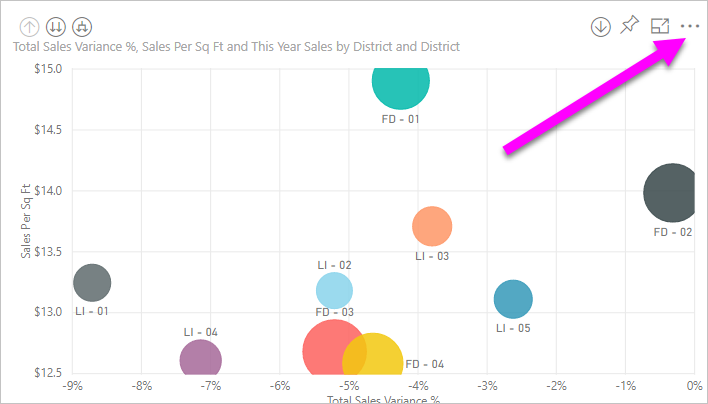

1. Choose the **Export to .csv** option.

    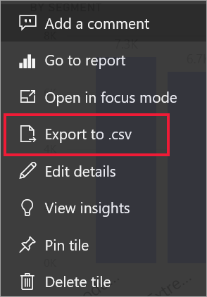

1. Power BI exports the data to a *.csv* file. If you've filtered the visualization, then the .csv export will be filtered as well. 

1. Your browser will prompt you to save the file.  Once saved, open the *.csv* file in Excel.

    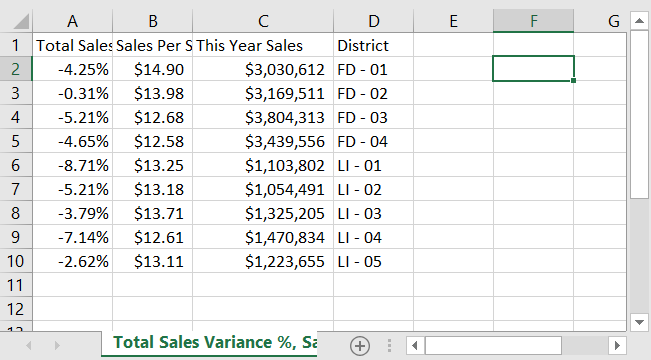

## Export data from a report

To follow along, open the [Procurement analysis sample report](../create-reports/sample-procurement.md) in the Power BI service in Editing view. Add a new blank report page. Then follow the steps below to add an aggregation, hierarchy, and a visualization-level filter.

### Create a stacked column chart

1. Create a new **Stacked column chart**.

    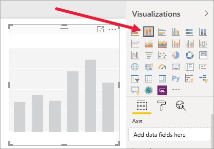

1. From the **Fields** pane, select **Location > City**, **Location > Country/Region**, and **Invoice > Discount Percent**.  You may have to move **Discount Percent** into the **Value** well.

    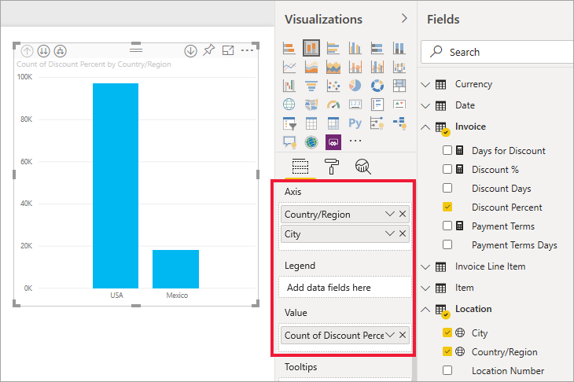

1. Change the aggregation for **Discount Percent** from **Count** to **Average**. In the **Value** well, select the arrow to the right of **Discount Percent** (it may say **Count of Discount Percent**), and choose **Average**.

    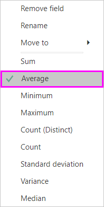

1. Add a filter to **City**, select all cities, and then remove **Atlanta**.

    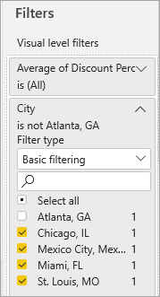

   
1. Drill down one level in the hierarchy. Turn on drilling and drill down to the **City** level. 

    

Now we're ready to try out both options for exporting data.

### Export ***summarized*** data
Select the option for **Summarized data** if you want to export data for what you see in that visual.  This type of export shows you only the data (columns and measures) that are being used to create the visual.  If the visual has an aggregate, you'll export aggregated data. For example, if you have a bar chart showing four bars, you'll get four rows of Excel data. Summarized data is available in the Power BI service as *.xlsx* and *.csv* and in Power BI Desktop as .csv.

1. Select the ellipsis in the upper-right corner of the visualization. Select **Export data**.

    

    In the Power BI service, since your visualization has an aggregate (you changed **Count** to *average*),  you'll have two options:

    - **Summarized data**

    - **Underlying data**

    For help understanding aggregates, see [Aggregates in Power BI](../create-reports/service-aggregates.md).

    > [!NOTE]
    > In Power BI Desktop, you'll only have the option to export summarized data as a .csv file. 
    
    
1. From **Export data**, select **Summarized data**, either choose *.xlsx* or *.csv*, and then select **Export**. Power BI exports the data.

    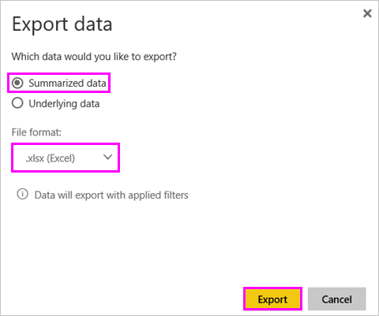

1. When you select  **Export**, your browser prompts you to save the file. Once saved, open the file in Excel. If you're using the Power BI app in Microsoft Teams, you may not receive the same prompts. Your exported file is saved in your local Downloads folder. 

    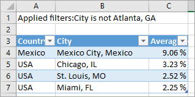

    In this example, our Excel export shows one total for each city. Since we filtered out Atlanta, it isn't included in the results. The first row of our spreadsheet shows the filters that Power BI used when extracting the data.
    
    - All the data used by the hierarchy is exported, not simply the data used for the current drill level for the visual. For example, we had drilled down to the city level, but our export includes country data as well.  

    - Our exported data is aggregated. We get a total, one row, for each city.

    - Since we applied filters to the visualization, the exported data will export as filtered. Notice that the first row displays **Applied filters: City is not Atlanta, GA**. 

### Export ***underlying*** data

Select this option if you want to see the data in the visual ***and*** additional data from the dataset (see chart below for details). If your visualization has an aggregate, selecting **Underlying data** removes the aggregate. In this example, the Excel export shows one row for every single City row in our dataset and the discount percent for that single entry. Power BI flattens the data, it doesn't aggregate it.  

When you select **Export**, Power BI exports the data to an *.xlsx* file and your browser prompts you to save the file. Once saved, open the file in Excel.

1. Select the ellipsis from the upper-right corner of the visualization. Select **Export data**.

    

    In the Power BI service, since your visualization has an aggregate (you changed **Count** to **average**),  you'll have two options:

    - **Summarized data**

    - **Underlying data**

    For help understanding aggregates, see [Aggregates in Power BI](../create-reports/service-aggregates.md).

    > [!NOTE]
    > In Power BI Desktop, you'll only have the option to export summarized data. 
    
    
1. From **Export data**, select **Underlying data**, and then select **Export**. Power BI exports the data.

    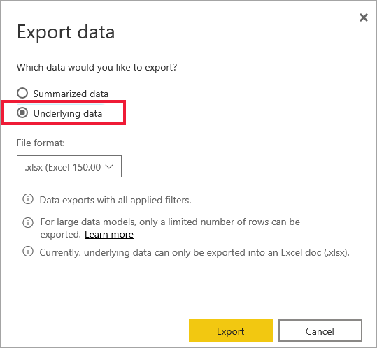

1. When you select  **Export**, your browser prompts you to save the file. Once saved, open the file in Excel.  If you're using the Power BI app in Microsoft Teams, you may not receive the same prompts. Your exported file is saved in your local Downloads folder. 

    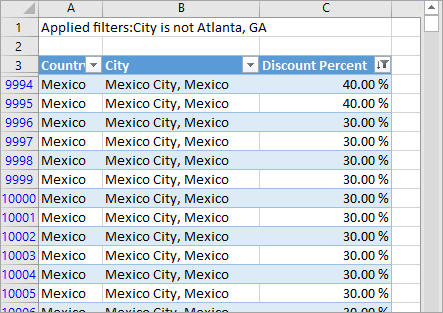
    
    - This screenshot shows you only a small portion of the Excel file; it has more than 100,000 rows.  
    
    - All the data used by the hierarchy is exported, not simply the data used for the current drill level for the visual. For example, we had drilled down to the city level, but our export includes country data as well.  

    - Since we applied filters to the visualization, the exported data will export as filtered. Notice that the first row displays **Applied filters: City is not Atlanta, GA**. 

## Customize the export data user experience

Users who are granted access to a report are **granted access to the entire underlying dataset**, unless [row-level security (RLS)](../admin/service-admin-rls.md) limits their access. Report authors and Power BI administrators can use the capabilities described below to customize the user experience.

- Report authors [decide which *export options*](#set-the-export-options) are available to users.  

- Power BI administrators can turn off some or all data export options for their organization.  

- Dataset owners can set row level security (RLS). RLS will restrict access to read-only users. But if you have configured an app workspace and given members edit permissions, RLS roles will not be applied to them. For more information, see [Row-level security](../admin/service-admin-rls.md).

- Report authors can hide columns so that they don't show up in the **Fields** list. For more information, see [Dataset properties](../developer/automation/api-dataset-properties.md)

**These customized user experience do not restrict what data users can access in the dataset. Use [row-level security (RLS)](../admin/service-admin-rls.md) in the dataset so that each person's credentials determine which data they can access.**

## Protect data when it is exported out of Power BI

- Report authors can classify and label reports using Microsoft Information Protection [sensitivity labels](../admin/service-security-data-protection-overview.md). If the sensitivity label has protection settings, Power BI will apply these protection settings when export report data to Excel, PowerPoint, or PDF files. Only authorized users can open protected files.

- Security and Power BI a administrators can use [Microsoft Cloud App Security](../admin/service-security-data-protection-overview.md) to monitor user access and activity, perform real-time risk analysis, and set label-specific controls. For example, organizations can use Microsoft Cloud App Security to configure a policy that prevents users from downloading sensitive data from Power BI to unmanaged devices.

## Export underlying data details

What you see when you select **Underlying data** can vary. Understanding these details may require the help of your admin or IT department. 

>

| Visual contains | What you'll see in export  |
|---------------- | ---------------------------|
| Aggregates | the *first* aggregate and non-hidden data from the entire table for that aggregate |
| Aggregates | related data - if the visual uses data from other data tables that are  *related* to the data table that contains the aggregate (as long as that relationship is \*:1 or 1:1) |
| Measures* | all measures in the visual *and* all measures from any data table containing a measure used in the visual |
| Measures* | all non-hidden data from tables that contain that measure (as long as that relationship is \*:1 or 1:1) |
| Measures* | all data from all tables that are related to table(s) containing the measures via a chain of \*:1 of 1:1) |
| Measures only | all non-hidden columns from all related tables (to expand the measure) |
| Measures only | summarized data for any duplicate rows for model measures |

\* In Power BI Desktop or service, in the reporting view, a *measure* shows in the **Fields** list with a calculator icon . Measures can be created in Power BI Desktop.

### Set the export options

Power BI report designers control the types of data export options that are available for their consumers. The choices are:

- Allow end users to export summarized data from the Power BI service or Power BI Report Server

- Allow end users to export both summarized and underlying data from the service or Report Server

- Don't allow end users to export any data from the service or Report Server

    > [!IMPORTANT]
    > We recommend that report designers revisit old reports and manually reset the export option as needed.

To set these options:

1. Start in Power BI Desktop.

1. From the upper left corner, select **File** > **Options and Settings** > **Options**.

1. Under **CURRENT FILE**, select **Report settings**.

    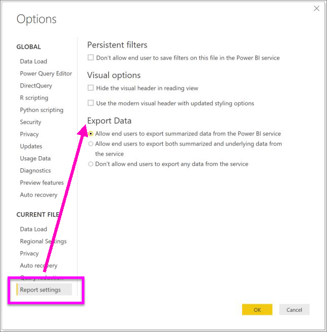

1. Make your selection from the **Export data** section.

You can also update this setting in the Power BI service.

It's important to note that if the Power BI admin portal settings conflict with the report settings for export data, the admin settings will override the export data settings.

## Limitations and considerations
These limitations and considerations apply to Power BI Desktop and the Power BI service, including Power BI Pro and Premium.

- To export the data from a visual, you need to have [Build permission for the underlying dataset](../connect-data/service-datasets-build-permissions.md).

-  The maximum number of rows that **Power BI Desktop** and **Power BI service** can export from an **import mode report** to a *.csv* file is 30,000.

- The maximum number of rows that the applications can export from an **import mode report** to an *.xlsx* file is 150,000.

- Export using *Underlying data* won't work if:

  - the version is older than 2016.

  - the tables in the model don't have a unique key.
    
  -  an administrator or report designer has disabled this feature.

- Export using *Underlying data* won't work if you enable the *Show items with no data* option for the visualization Power BI is exporting.

- When using DirectQuery, the maximum amount of data that Power BI can export is 16-MB uncompressed data. An unintended result may be that you export less than the maximum number of rows of 150,000. This is likely if:

    - There are too many columns. Try reducing the number of columns and exporting again.

    - There's data that is difficult to compress.

    - Other factors are at play that increase file size and decrease the number of rows Power BI can export.

- If the visualization uses data from more than one data table, and no active relationship exists for those tables in the data model, Power BI only exports data for the first table.

- Power BI custom visuals and R visuals aren't currently supported.

- In Power BI, you can rename a field (column) by double-clicking the field and typing a new name. Power BI refers to the new name as an *alias*. It's possible that a Power BI report can end up with duplicate field names, but Excel doesn't allow duplicates. So when Power BI exports the data to Excel, the field aliases revert to their original field (column) names.  

- If there are Unicode characters in the *.csv* file, the text in Excel may not display properly. Examples of Unicode characters are currency symbols and foreign words. You can open the file in Notepad and the Unicode will display correctly. If you want to open the file in Excel, the workaround is to import the *.csv*. To import the file into Excel:

  1. Open Excel.

  1. Go to the **Data** tab.
  
  1. Select **Get external data** > **From text**.
  
  1. Go to the local folder where the file is stored and select the *.csv*.

- When exporting to *.csv*, certain characters will be escaped with a leading **'** to prevent script execution when opened in Excel. This happens when:
  - The column is defined as type "text" in the data model, **_and_**
  - The first character of the text is one of the following: **=, @, +, -**

- Power BI admins can disable the export of data.
- If a dynamic format string is applied to a measure, the exported data would not preserve this formatting in Excel.

More questions? [Try asking the Power BI Community](https://community.powerbi.com/)
