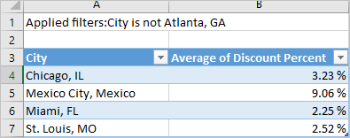
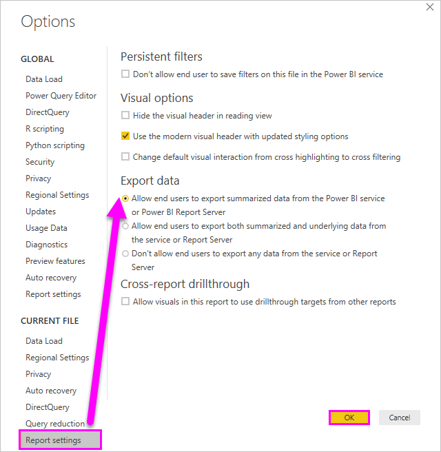

# Export data from visualizations

If you'd like to see the data that Power BI uses to create a visualization, [you can display that data in Power BI](service-reports-show-data.md). You can also export that data to Excel as an *.xlsx* or *.csv* file. The option to export the data requires a Pro or Premium license and edit permissions to the dataset and report.

Watch Will export the data from one of the visualizations in his report, save it as an *.xlsx* file, and open it in Excel. Then follow the step-by-step instructions below the video to try it out yourself.

<iframe width="560" height="315" src="https://www.youtube.com/embed/KjheMTGjDXw" frameborder="0" allowfullscreen></iframe>

## Export data from a Power BI dashboard

1. Select the ellipsis in the upper-right corner of the visualization.

    

1. Choose the **Export data** icon.

    

1. Power BI exports the data to a *.csv* file. If you've filtered the visualization, then the app will filter the downloaded data.

1. Your browser will prompt you to save the file.  Once saved, open the *.csv* file in Excel.

    

## Export data from a report

To follow along, open the [Procurement analysis sample report](../sample-procurement.md) in Editing view. Add a new blank report page. Then follow the steps below to add an aggregation and a visualization-level filter.

1. Create a new **Stacked column chart**.

1. From the **Fields** pane, select **Location > City** and **Invoice > Discount Percent**.  You may have to move **Discount Percent** into the **Value** well.

    

1. Change the aggregation for **Discount Percent** from **Count** to **Average**. In the **Value** well, select the arrow to the right of **Discount Percent** (it may say **Count of Discount Percent**), and choose **Average**.

    

1. Add a filter to **City**, select all cities, and then remove **Atlanta**.

    

   Now we're ready to try out both options for exporting data.

1. Select the ellipsis in the upper-right corner of the visualization. Select **Export data**.

    

    In Power BI online, if your visualization has an aggregate (one example would be if you changed **Count** to *average*, *sum*, or *minimum*),  you'll have two options:

    - **Summarized data**

    - **Underlying data**

    In Power BI Desktop, you'll only have the option for **Summarized data**. For help understanding aggregates, see [Aggregates in Power BI](../service-aggregates.md).

1. From **Export data**, select **Summarized data**, either choose *.xlsx* or *.csv*, and then select **Export**. Power BI exports the data.

    

    If you applied filters to the visualization, the exported data will export as filtered. When you select  **Export**, your browser prompts you to save the file. Once saved, open the file in Excel.
    
    All the data used by the hierarchy is exported, not simply the data used for the current drill level for the visual. For example, if you've drilled down to another level of the visualization, the exported data will include all of the data in the hierarchy, not just the data used to create the visual at its currently drilled level.

    **Summarized data**: Select this option if you want to export data for what you see in that visual.  This type of export shows you only the data (columns and measures) that you chose to create the visual.  If the visual has an aggregate, you'll export aggregated data. For example, if you have a bar chart showing four bars, you'll get four rows of data. Summarized data is available as *.xlsx* and *.csv*.

    In this example, our Excel export shows one total for each city. Since we filtered out Atlanta, it isn't included in the results. The first row of our spreadsheet shows the filters that Power BI used when extracting the data.

    

1. Now try selecting **Underlying data**, *.xlsx*, and then **Export**. Power BI exports the data. 

    > [!NOTE]
    > Depending on report settings, you may or may not have the option to export underlying data.

    If you applied filters to the visualization, the exported data will export as filtered. When you select  **Export**, your browser prompts you to save the file. Once saved, open the file in Excel.
    
           All the data used by the hierarchy is exported, not simply the data used for the current drill level for the visual. For example, if you've drilled down to another level of the visualization, the exported data will include all of the data in the hierarchy, not just the data used to create the visual at its currently drilled level.

    >[!WARNING]
    >Exporting underlying data lets users to see all the detailed data -- every column in the data. Power BI service admins can turn this off for their organization. If you are a dataset owner, you can set proprietary columns to **hidden** so that they don't show up in the **Field** list in Desktop or the Power BI service.

    **Underlying data**: Select this option if you want to see the data in the visual ***and*** additional data from the model (see chart below for details). If your visualization has an aggregate, selecting *Underlying data* removes the aggregate. When you select **Export**, Power BI exports the data to an *.xlsx* file and your browser prompts you to save the file. Once saved, open the file in Excel.

    In this example, the Excel export shows one row for every single City row in our dataset and the discount percent for that single entry. Power BI flattens the data. It doesn't aggregate it. The first row of our spreadsheet shows the filters that Power BI used when extracting the data.  

    

## Export underlying data details

What you see when you select **Underlying data** can vary. Understanding these details may require the help of your admin or IT department. In Power BI Desktop or service, in the reporting view, a *measure* shows in the **Fields** list with a calculator icon . Power BI Desktop creates Measures. The Power BI service does not.

| Visual contains | What you'll see in export  |
|---------------- | ---------------------------|
| Aggregates | the *first* aggregate and non-hidden data from the entire table for that aggregate |
| Aggregates | related data - if the visual uses data from other data tables that are  *related* to the data table that contains the aggregate (as long as that relationship is \*:1 or 1:1) |
| Measures | all measures in the visual *and* all measures from any data table containing a measure used in the visual |
| Measures | all non-hidden data from tables that contain that measure (as long as that relationship is \*:1 or 1:1) |
| Measures | all data from all tables that are related to table(s) containing the measures via a chain of \*:1 of 1:1) |
| Measures only | all non-hidden columns from all related tables (to expand the measure) |
| Measures only | summarized data for any duplicate rows for model measures |

### Set the export options

Power BI report designers control the types of data export options that are available for their consumers. The choices are:

- Allow end users to export summarized data from the Power BI service or Power BI Report Server

- Allow end users to export both summarized and underlying data from the service or Report Server

- Don't allow end users to export any data from the service or Report Server

    > [!IMPORTANT]
    > We recommend that report designers revisit old reports and manually reset the export option as needed.

To set these options:

1. Start in Power BI Desktop.

1. From the upper left corner, select **File** > **Options and Settings** > **Options**.

1. Under **CURRENT FILE**, select **Report settings**.

    

1. Make your selection from the **Export data** section.

You can also update this setting in Power BI service.

It's important to note that if the Power BI admin portal settings conflict with the report settings for export data, the admin settings will override the export data settings.

## Limitations and considerations
These limitations and considerations apply to Power BI Desktop and the Power BI service, including Power BI Pro and Premium.

- To export the data from a visual, you need to have [Build permission for the underlying dataset](https://docs.microsoft.com/power-bi/service-datasets-build-permissions#build-permissions-for-shared-datasets).

-  The maximum number of rows that **Power BI Desktop** and **Power BI service** can export from an **import mode report** to a *.csv* file is 30,000.

- The maximum number of rows that the applications can export from an **import mode report** to an *.xlsx* file is 150,000.

- Export using *Underlying data* won't work if:

  - The data source is an Analysis Services live connection.

  - The version is older than 2016.

  - The tables in the model don't have a unique key.
    
  -  If an administrator or report designer has disabled this feature.

- Export using *Underlying data* won't work if you enable the *Show items with no data* option for the visualization Power BI is exporting.

- When using DirectQuery, the maximum amount of data that Power BI can export is 16 MB uncompressed data. An unintended result may be that you export less than the maximum number of rows. This is likely if:

    - There are many columns.

    - There's data that is difficult to compress.

    - Other factors are at play that increase file size and decrease the number of rows Power BI can export.

- If the visualization uses data from more than one data table, and no relationship exists for those tables in the data model, Power BI only exports data for the first table.

- Custom visuals and R visuals aren't currently supported.

- Export data isn't available for users outside of your organization who are using a dashboard that an internal user has shared with them.

- In Power BI, you can rename a field (column) by double-clicking the field and typing a new name. Power BI refers to the new name as an *alias*. It's possible that a Power BI report can end up with duplicate field names, but Excel doesn't allow duplicates. So when Power BI exports the data to Excel, the field aliases revert to their original field (column) names.  

- If there are Unicode characters in the *.csv* file, the text in Excel may not display properly. Examples of Unicode characters are currency symbols and foreign words. You can open the file in Notepad and the Unicode will display correctly. If you want to open the file in Excel, the workaround is to import the *.csv*. To import the file into Excel:

  1. Open Excel.

  1. Go to the **Data** tab.
  
  1. Select **Get external data** > **From text**.
  
  1. Go to the local folder where the file is stored and select the *.csv*.

- Power BI admins can disable the export of data.

More questions? [Try asking the Power BI Community](http://community.powerbi.com/)
