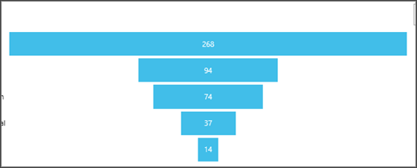
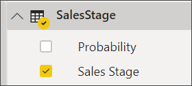
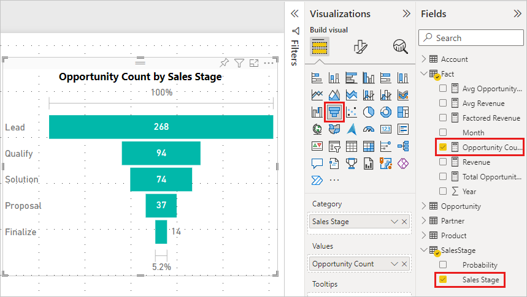
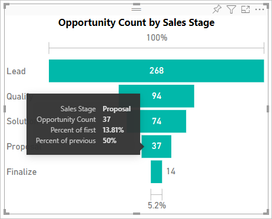
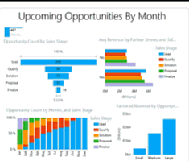

# Create and use funnel charts

[!INCLUDE [applies-yes-desktop-yes-service](../includes/applies-yes-desktop-yes-service.md)]

A funnel chart helps you visualize a linear process that has sequential connected stages. For example, a sales funnel that tracks customers through stages: Lead \> Qualified Lead \> Prospect \> Contract \> Close.  At a glance, the shape of the funnel conveys the health of the process you're tracking.

Each funnel stage represents a percentage of the total. So, in most cases, a funnel chart is shaped like a funnel -- with the first stage being the largest, and each subsequent stage smaller than its predecessor.  A pear-shaped funnel is also useful -- it can identify a problem in the process.  But typically, the first stage, the "intake" stage, is the largest.

> [!NOTE]
> Sharing your report with a Power BI colleague requires that you both have individual Power BI Pro licenses or that the report is saved in Premium capacity.    

## When to use a funnel chart
Funnel charts are a great choice:

* when the data is sequential and moves through at least 4 stages.
* when the number of "items" in the first stage is expected to be greater than the number in the final stage.
* to calculate potential (revenue/sales/deals/etc.) by stages.
* to calculate and track conversion and retention rates.
* to reveal bottlenecks in a linear process.
* to track a shopping cart workflow.
* to track the progress and success of click-through advertising/marketing campaigns.

## Working with funnel charts
Funnel charts:

* Can be sorted.
* Support multiples.
* Can be highlighted and cross-filtered by other visualizations on the same report page.
* Can be used to highlight and cross-filter other visualizations on the same report page.
   > [!NOTE]
   > Watch this video to see Will create a funnel chart using the Sales and Marketing sample. Then follow the steps below the video to try it out yourself using the Opportunity Analysis PBIX sample file
   > 
   > 
## Prerequisite

This tutorial uses the [Opportunity Analysis sample PBIX file](https://download.microsoft.com/download/9/1/5/915ABCFA-7125-4D85-A7BD-05645BD95BD8/Opportunity%20Analysis%20Sample%20PBIX.pbix
).

1. From the upper left section of the menubar, select **File** > **Open**
   
2. Find your copy of the **Opportunity Analysis sample PBIX file**

1. Open the **Opportunity Analysis sample PBIX file** in report view .

1. Select  to add a new page.

## Create a basic funnel chart
Watch this video to see Will create a funnel chart using the Sales and Marketing sample.

<iframe width="560" height="315" src="https://www.youtube.com/embed/qKRZPBnaUXM" frameborder="0" allow="autoplay; encrypted-media" allowfullscreen></iframe>

Now create your own funnel chart that shows the number of opportunities we have in each of our sales stages.

1. Start on a blank report page and select the **SalesStage** \> **Sales Stage** field.
   
    

1. Select the funnel icon  to convert the column chart to a funnel chart.

2. From the **Fields** pane, select **Fact** \> **Opportunity Count**.
   
    
4. Hovering over a bar displays a wealth of information.
   
   * The name of the stage
   * Number of opportunities currently in this stage
   * Overall conversion rate (% of Lead) 
   * Stage-to-stage (also known as Drop Rate) which is the % of the previous stage (in this case, Proposal Stage/Solution Stage)
     
     

6. Save the report.

## Highlighting and cross-filtering
For information about using the Filters pane, see [Add a filter to a report](../create-reports/power-bi-report-add-filter.md).

Highlighting a bar in a funnel cross-filters the other visualizations on the report page... and vice versa. To follow along, add a few more visuals to the report page that contains the funnel chart.

1. On the funnel, select the **Proposal** bar. This cross-highlights the other visualizations on the page. Use CTRL to multi-select.
   
   
2. To set preferences for how visuals cross-highlight and cross-filter each other, see [Visual interactions in Power BI](../create-reports/service-reports-visual-interactions.md)

## Next steps

[Gauges in Power BI](power-bi-visualization-radial-gauge-charts.md)

[Visualization types in Power BI](power-bi-visualization-types-for-reports-and-q-and-a.md)

