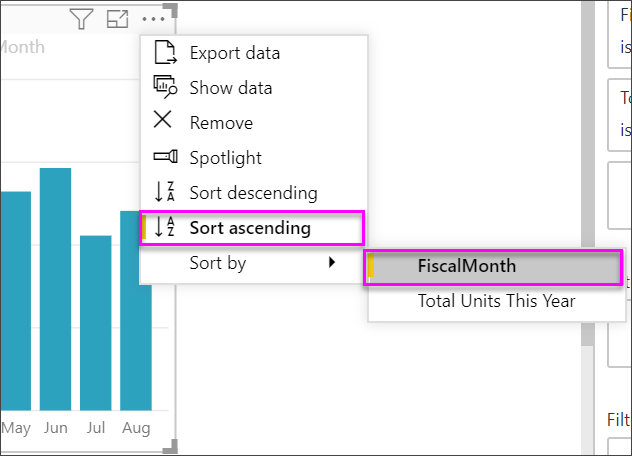

# Key Performance Indicator (KPI) visuals

A Key Performance Indicator (KPI) is a visual cue that communicates the amount of progress made toward a measurable goal. For more about KPIs, see [Key Performance Indicators (KPIs) in PowerPivot](/previous-versions/sql/sql-server-2012/hh272050(v=sql.110)).

Watch Will show you how to create single metric visuals: gauges, cards, and KPIs.

<iframe width="560" height="315" src="https://www.youtube.com/embed/xmja6EpqaO0?list=PL1N57mwBHtN0JFoKSR0n-tBkUJHeMP2cP" frameborder="0" allowfullscreen></iframe>

## When to use a KPI

KPIs are a great choice:

* To measure progress. Answers the question, "What am I ahead or behind on?"

* To measure distance to a goal. Answers the question, "How far ahead or behind am I?"

## KPI requirements

A designer bases a KPI visual on a specific measure. The intention of the KPI is to help you evaluate the current value and status of a metric against a defined target. A KPI visual requires a *base* measure that evaluates to a value, a *target* measure or value, and a *threshold* or *goal*.

A KPI dataset needs to contain goal values for a KPI. If your dataset doesn't contain goal values, you can create them by adding an Excel sheet with goals to your data model or PBIX file.

## Prerequisites

If you're not signed up for Power BI, [sign up for a free trial](https://app.powerbi.com/signupredirect?pbi_source=web) before you begin.

* [Power BI Desktop](https://powerbi.microsoft.com/get-started/) - it's free!

* [The Retail Analysis Sample PBIX file](http://download.microsoft.com/download/9/6/D/96DDC2FF-2568-491D-AAFA-AFDD6F763AE3/Retail%20Analysis%20Sample%20PBIX.pbix)

## How to create a KPI

To follow along, open the [Retail Analysis .PBIX file](http://download.microsoft.com/download/9/6/D/96DDC2FF-2568-491D-AAFA-AFDD6F763AE3/Retail%20Analysis%20Sample%20PBIX.pbix) in Power BI Desktop. You'll create a KPI that measures the progress you've made toward a sales goal.

1. Open the **Retail Analysis Sample** in report view .

1. Select  to add a new page.

1. From the **Fields** pane, select **Sales > Total Units This Year**.  This value will be the indicator.

1. Add **Time > FiscalMonth**.  This value will represent the trend.

1. In the upper-right corner of the visual, select the ellipsis and check that Power BI sorted the columns in ascending order by **FiscalMonth**.

    > [!IMPORTANT]
    > Once you convert the visualization to a KPI, there's **no** option to sort. You must sort it correctly now.

    

    Once sorted correctly, your visual will look like this:

    

1. Convert the visual to a KPI by selecting the **KPI** icon from the **Visualization** pane.

    

1. To add a goal, drag **Total Units Last Year** to the **Target goals** field.

    

1. Optionally, format the KPI by selecting the paint roller icon to open the Formatting pane.

    * **Indicator** - controls the indicator’s display units and decimal places.

    * **Trend axis** - when set to **On**, the visual shows the trend axis as the background of the KPI visual.  

    * **Goals** - when set to **On**, the visual shows the goal and the distance from the goal as a percentage.

    * **Color coding > Direction** - people consider some KPIs better for *higher* values and consider some better for *lower* values. For example, earnings versus wait time. Typically a higher value of earnings is better versus a higher value of wait time. Select **high is good** and, optionally, change the color settings.

KPIs are also available in the Power BI service and on your mobile devices – keeping you always connected to your business's heartbeat.

## Considerations and troubleshooting

If your KPI doesn't look like the one above, it may be because you didn't sort by FiscalMonth. KPIs don't have a sort option. You'll need to start again and sort by FiscalMonth *before* you convert your visualization to a KPI.

## Next steps

* [Tips and Tricks for Power BI Map visualizations](power-bi-map-tips-and-tricks.md)

* [Visualization types in Power BI](power-bi-visualization-types-for-reports-and-q-and-a.md)

More questions? [Try the Power BI Community](http://community.powerbi.com/)
