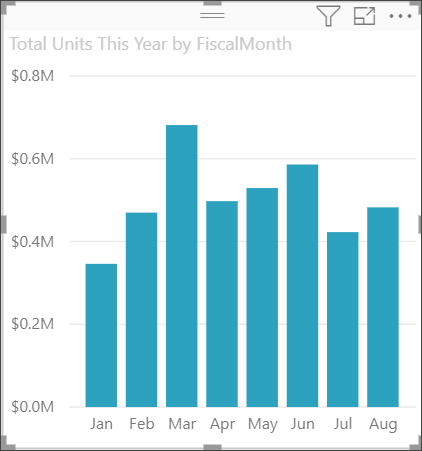
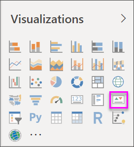
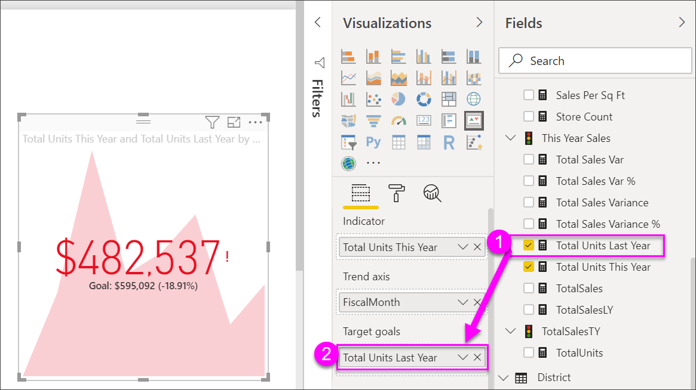

# KPI visuals
A Key Performance Indicator (KPI) is a visual cue that communicates the amount of progress made toward a measurable goal. For more information about KPIs, see [Microsoft Developer Network](https://msdn.microsoft.com/library/hh272050).

If you're not signed up for Power BI, [sign up for a free trial](https://app.powerbi.com/signupredirect?pbi_source=web) before you begin.

## Prerequisites
* [Power BI Desktop - it's free!](https://powerbi.microsoft.com/en-us/get-started/)
* [The Retail Analysis sample PBIX file](http://download.microsoft.com/download/9/6/D/96DDC2FF-2568-491D-AAFA-AFDD6F763AE3/Retail%20Analysis%20Sample%20PBIX.pbix)

## When to use a KPI
KPIs are a great choice:

* to measure progress (what am I ahead or behind on?)
* to measure distance to a goal (how far ahead or behind am I?)   

## KPI requirements
A Key Performance Indicator (KPI) is based on a specific measure and is designed to help you evaluate the current value and status of a metric against a defined target. Therefore, a KPI visual requires a *base* measure that evaluates to a value and a *target* measure or value, and a *threshold* or *goal*.

Currently, a KPI dataset needs to contain goal values for a KPI. If your dataset doesn't contain one, you can create goals by adding an Excel sheet with goals to your data model or PBIX file.

## How to create a KPI
To follow along, open the [Retail Analysis .PBIX file](http://download.microsoft.com/download/9/6/D/96DDC2FF-2568-491D-AAFA-AFDD6F763AE3/Retail%20Analysis%20Sample%20PBIX.pbix) in Power BI Desktop. We'll create a KPI that measures the progress we've made toward a sales goal.

Or watch Will show you how to create single metric visuals: gauges, cards, and KPIs.

<iframe width="560" height="315" src="https://www.youtube.com/embed/xmja6EpqaO0?list=PL1N57mwBHtN0JFoKSR0n-tBkUJHeMP2cP" frameborder="0" allowfullscreen></iframe>

1. Open the report in Report view and [select the yellow tab to add a new page](../power-bi-report-add-page.md).    
2. From the Fields pane, select **Sales > Total Units This Year**.  This will be the indicator.
3. Add **Time > FiscalMonth**.  This will be represent the trend.
4. IMPORTANT: Sort the chart by **FiscalMonth**. Once you convert the visualization to a KPI, there is no option to sort.

    
5. Convert the visual to a KPI by selecting the KPI icon from the Visualization pane.
   
    
6. Add a goal. Add last years sales as the goal. Drag **Total Units Last Year** to the **Target goals** field.
   
    
7. Optionally, format the KPI by selecting the paint roller icon to open the Formatting pane.
   
   * **Indicator** - controls the indicator’s display units and decimal places.
   * **Trend axis** - when set to **On**, the trend axis is displayed as the background of the KPI visual.  
   * **Goals** - when set to **On**, the visual displays the goal and the distance from the goal as a percentage.
   * **Color coding > Direction** - some KPIs are considered *better* for higher values and some are considered *better* for lower values. For example, earnings versus wait time. Typically a higher value of earnings is better versus a higher value of wait time. Select **high is better** and, optionally, change the color settings.

KPIs are also available in Power BI service and on your mobile devices – keeping you always connected to your businesses heartbeat.

## Considerations and troubleshooting
* If your KPI doesn't look like the one above, it may be because you need to sort by fiscalmonth. Since KPIs don't have a sort option, you'll need to sort by fiscalmonth *before* you convert your visualization to a KPI.

## Next steps

[Basic maps in Power BI](power-bi-map-tips-and-tricks.md)

[Visualization types in Power BI](power-bi-visualization-types-for-reports-and-q-and-a.md)