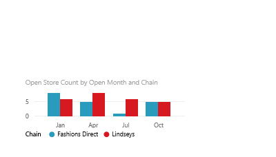

# Move and resize a visualization in a report in Power BI service and Power BI Desktop
Only report creators and owners can move and resize visualizations. In Power BI service (app.powerbi.com) this means opening the report in [Editing view](../consumer/end-user-reading-view.md).

## Open the report
In Power BI, open a report that has at least one visualization, or [create a new visualization](power-bi-report-add-visualizations-i.md). 

## Move the visualization
* Select (left-click) any area of the visualization and drag to the new location.

## Resize the visualization
* Select the visualization to display the border and click and drag the dark frame handles to resize.  
  

## Select Focus mode to see more detail.
* Hover over the visualization and select the Focus mode icon.
  

## Next steps
[Resize a visualization on a dashboard](../service-dashboard-edit-tile.md)  

More questions? [Try the Power BI Community](http://community.powerbi.com/)