# Tutorial: Embed a Power Apps visual in a Power BI report

In this tutorial, you use the Power Apps visual to create a new app that is embedded in a sample Power BI report. This app interacts with other visuals in that report.

If you don't have a Power Apps subscription, [create a free account](../signup-for-powerapps.md) before you begin.

In this tutorial, you learn how to:
> [!div class="checklist"]
> * Add a Power Apps visual to a Power I report
> * Work in Power Apps to create a new app that uses data from the Power BI report
> * View and interact with the Power Apps visual in the report

## Prerequisites

* [Google Chrome](https://www.google.com/chrome/browser/) or [Microsoft Edge](https://www.microsoft.com/windows/microsoft-edge) browser
* A [Power BI subscription](https://docs.microsoft.com/power-bi/service-self-service-signup-for-power-bi), with the [Opportunity Analysis Sample](https://docs.microsoft.com/power-bi/sample-opportunity-analysis#get-the-content-pack-for-this-sample) installed
* An understanding of how to [create apps in PowerApps](data-platform-create-app-scratch.md) and how to [edit Power BI reports](https://docs.microsoft.com/power-bi/service-the-report-editor-take-a-tour)

## Create a new app
When you add the Power Apps visual to your report, it launches PowerApps Studio with a live data connection between Power Apps and Power BI.

1. Open the Opportunity Analysis sample report and select the *Upcoming Opportunities* page. 

2. Move and resize some of the report tiles to make space for the new visual.

    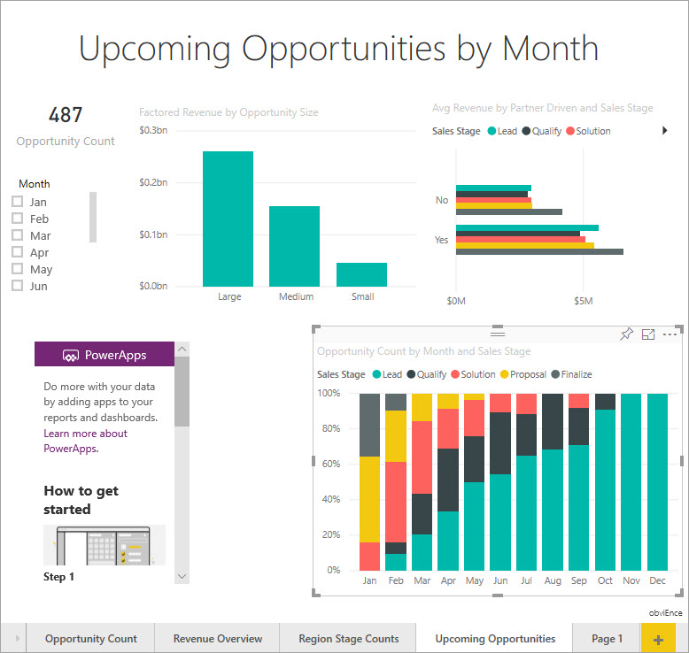

2. From the Visualizations pane, select the Power Apps icon, then resize the visual to fit the space you made.

    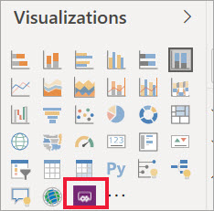

3. In the **Fields** pane, select **Name**, **Product Code**, and **Sales Stage**. 

    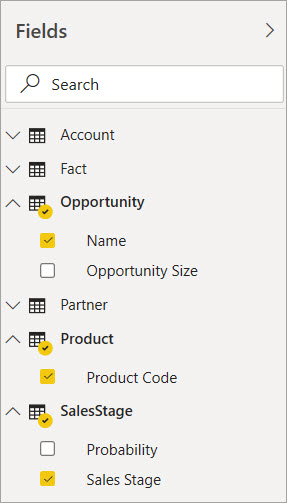

4. On the Power Apps visual, select the Power Apps environment where you want to create the app, then select **Create new**.

    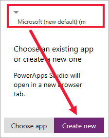

    In Power Apps Studio, you see that a basic app is created, with a *gallery* that shows one of the fields you selected in Power BI.

    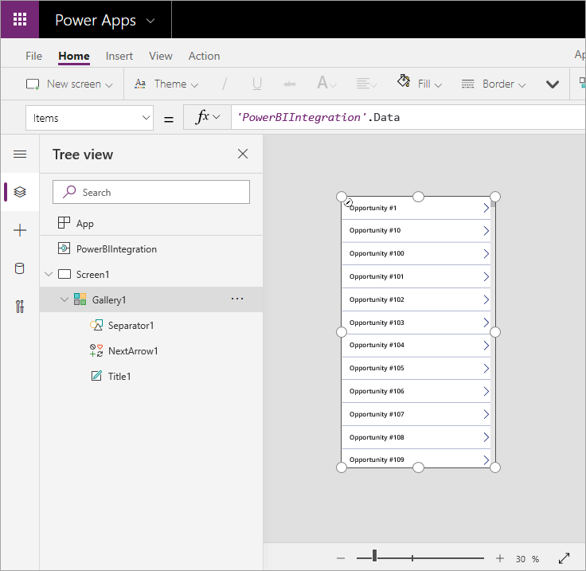

5.  Resize the gallery so it takes up only half of the screen. 

6. In the left pane, select **Screen1**, then set the screen's **Fill** property to "LightBlue" (so it shows up better in the report).

    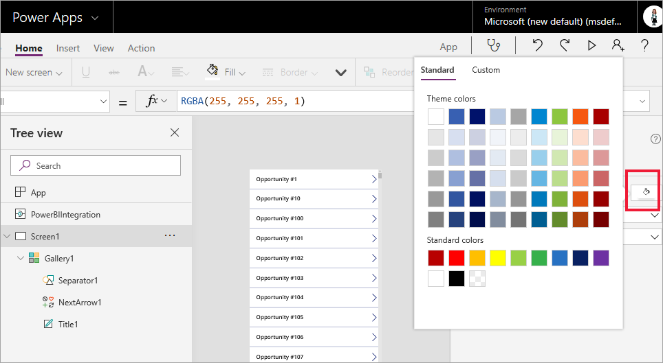

6. Make some room for a label control. 

    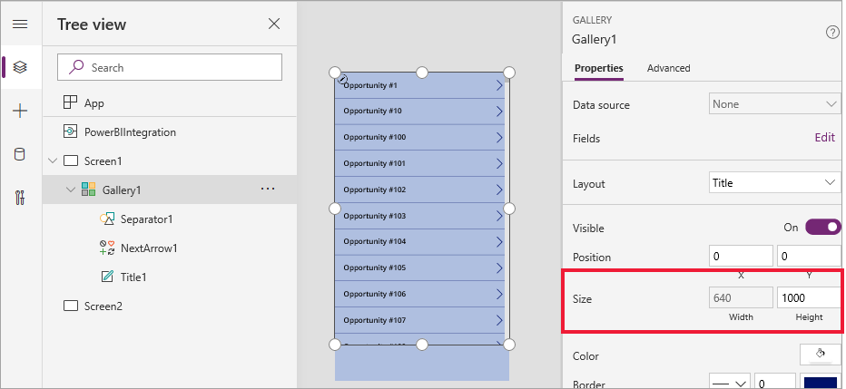

8. Under **gallery**, insert a text label control.

   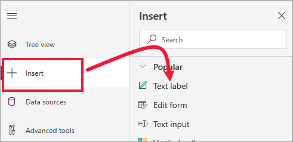

7. Drag the label to the bottom of your visual. Set the **Text** property to `"Opportunity Count: " & CountRows(Gallery1.AllItems)`. It now shows the total number of opportunities in the data set.

    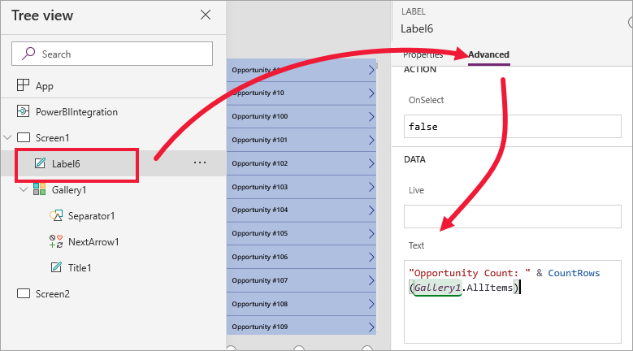

    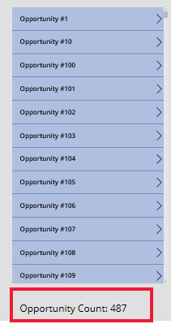

7. Save the app with the name "Opportunities app". 

    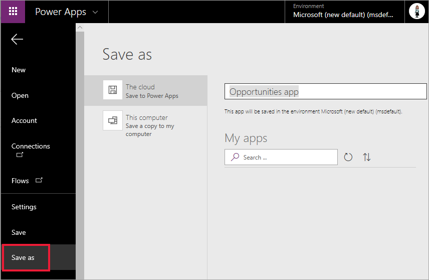

## View the app in the report
The app is now available in the Power BI report, and it interacts with other visuals because it shares the same data source.

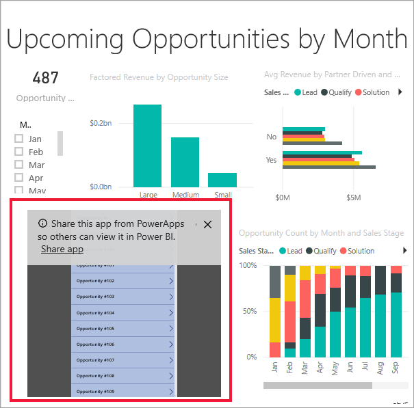

In the Power BI report, select **Jan** in the slicer, which filters the whole report, including the data in the app.

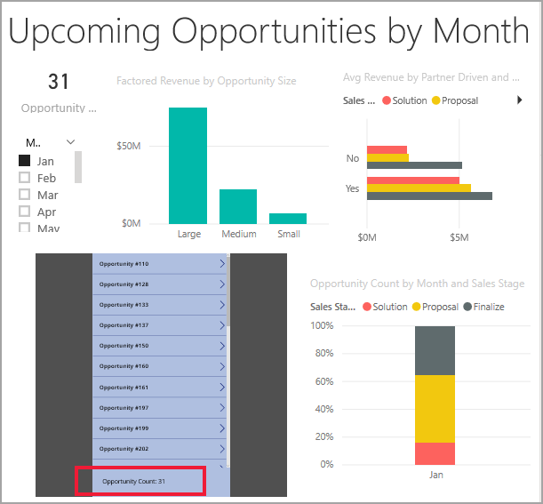

Notice that the opportunity count in the app matches the count in the upper left of the report. You can select other items in the report, and the data in the app updates.

## Clean up resources
If you don't want to use the Opportunity Analysis Sample anymore, you can delete the dashboard, report, and dataset.

## Next steps
[Q&A visual](power-bi-visualization-q-and-a.png)