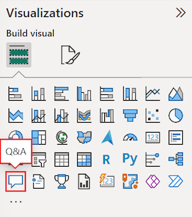
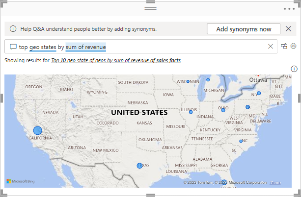
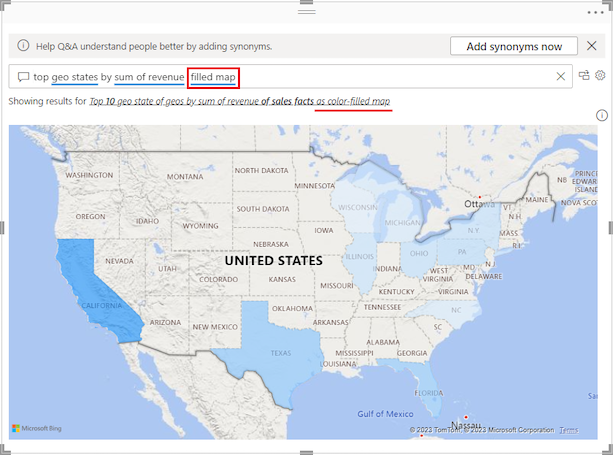
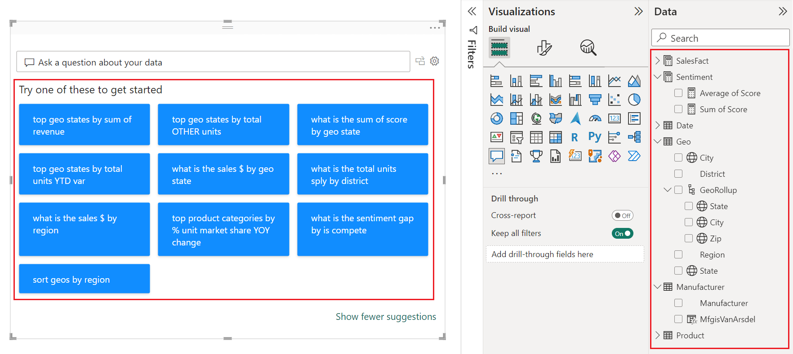
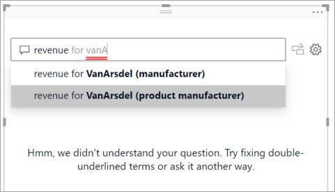
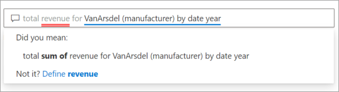
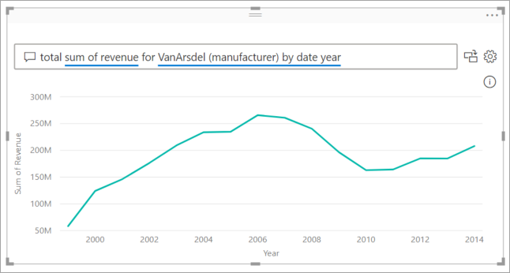
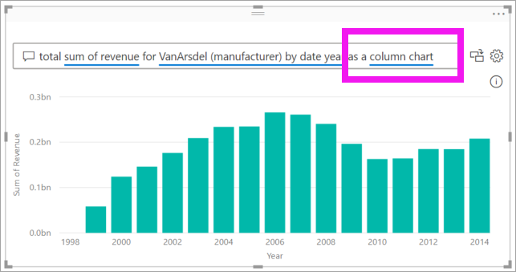
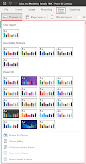
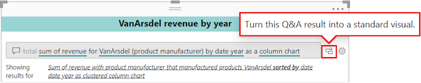

# Create a Q&A visual in Power BI

[!INCLUDE [applies-yes-desktop-yes-service](../includes/applies-yes-desktop-yes-service.md)]

The Q&A visual allows users to ask natural language questions and get answers in the form of a visual. *Consumers* can use it to quickly get answers to their data. *Designers* can also use it to create visuals quickly. If you're a report designer, this article is for you. You can double-click anywhere on a report and use natural language to get started. In this article, you create, format, and customize a Q&A visual. It supports themes and other default formatting options available inside Power BI. After you create it, it behaves like any other visual, supporting cross-filtering, cross-highlighting, and bookmarks. 

Looking for more background about Q&A in Power BI? Check out [Introduction to Q&A](../natural-language/q-and-a-intro.md). 

The Q&A visual consists of four core components:

- The question box. This is where users type in their question and are shown suggestions to help them complete their question.
- A pre-populated list of suggested questions.
- Icon to convert the Q&A visual into a standard visual. 
- Icon to open Q&A tooling, which allows designers to configure the underlying natural language engine.

## Prerequisites

1. Download [Sales & Marketing sample PBIX file](https://download.microsoft.com/download/9/7/6/9767913A-29DB-40CF-8944-9AC2BC940C53/Sales%20and%20Marketing%20Sample%20PBIX.pbix) to follow along.

1. In the upper left section of the Power BI Desktop, select **File** > **Open**.
   
2. Find your copy of the **Sales & Marketing sample PBIX file**.

1. Open the file in report view .

1. Select the plus sign  to add a new page.

If you see an error when creating a Q&A visual, be sure to check the [Q&A limitations](../natural-language/q-and-a-limitations.md) article to see if the data source configuration is supported.    

> [!NOTE]
> Sharing your report with a Power BI colleague requires that either you both have individual Power BI Pro or Premium Per User (PPU) licenses or you save the report in a Premium capacity workspace. See [sharing reports](../collaborate-share/service-share-dashboards.md).

## Create a Q&A visual using a suggested question
In this exercise, we'll select one of the suggested questions to create our Q&A visual. 

1. Start on a blank report page and select the Q&A visual icon from the Visualizations pane.

    

2. Drag the border to resize the visual.

    

3. To create the visual, select one of the suggested questions or start typing in the question box. In this example, we've selected **top geo states by sum of revenue**. Power BI does its best to select which visual type to use. In this case, it's a map.

    

    But you can tell Power BI which visual type to use by adding it to your natural language query. Keep in mind that not all visual types will work or make sense with your data. For example, this data wouldn't produce a meaningful scatter chart. But it works as a filled map.

    

## Create a Q&A visual using a natural language query
In the example above, we selected one of the suggested questions to create our Q&A visual.  In this exercise, we'll type our own question. As we type our question, Power BI helps us with autocomplete, suggestion, and feedback.

If you're unsure what type of questions to ask or terminology to use, expand **Show all suggestions** or look through the Fields pane along the right side of the canvas. The Fields pane will get you familiar with the terms and content of the Sales & Marketing dataset.

1. Type a question in the Q&A field. Power BI adds a red underline to words it does not recognize. Whenever possible, Power BI helps define unrecognized words.  In the first example below, selecting either of the suggestions will work for us.  

    

2. As we type more of the question, Power BI lets us know that it doesn't understand the question, and tries to help. In the example below, Power BI asks us "Did you mean..." and suggests a different way to word our question using terminology from our dataset. 

    

5. With Power BI's help, we were able to ask a question with all recognizable terms. Power BI displays the results as a line chart. 

    

6. Let's change the visual to a column chart. 

    

7.  Add more visuals to the report page and see how the Q&A visual interacts with the other visuals on the page. In this example, the Q&A visual has cross-filtered the line chart and map and cross-highlighted the bar chart.

    

## Format and customize the Q&A visual
The Q&A visual can be customized using the formatting pane, and by applying a theme. 

### Apply a theme
When you select a theme, that theme is applied to the entire report page. There are many themes to choose from, so try them out until you get the look you desire. 

1. In the menu bar, select the **Home** tab and choose **Switch theme**. 

    

    
    
2. In this example, we've selected **More themes** > **Color blind safe**.

    

### Format the Q&A visual
Format the Q&A visual, the question field, and the way suggestions are displayed. You can change everything from the background of a title to the hover color for unrecognized words. Here we've added a grey background to the question box and changed the underlines to yellow and green. The title is centered and has a yellow background. 

## Convert your Q&A visual into a standard visual
We've formatted our color blind safe column chart visual a bit: We added a title and a border. Now we're ready to convert it to a standard visual in our report and also pin it to a dashboard.

Select the icon  to **Turn this Q&A result into a standard visual**.

This visual is no longer a Q&A visual but is a standard column chart. It can be pinned to a dashboard. In the report, this visual behaves the same as other standard visuals. Notice that the Visualizations pane shows a Column chart icon selected instead of the Q&A visual icon.

If you're using the ***Power BI Service***, you can now pin the visual to a dashboard by selecting the pin icon. 

## Advanced features of the Q&A visual
Selecting the cog icon opens the Q&A visual Tooling pane. 

Use the Tooling pane to teach Q&A terms it doesn't recognize, to manage those terms, and to manage the suggested questions for this dataset and report. In the Tooling pane, you can also review questions that users have asked in this Q&A visual and see questions that users have flagged. To learn more, see [Intro to Q&A tooling to train Power BI Q&A](../natural-language/q-and-a-tooling-intro.md).

## Considerations and troubleshooting
The Q&A visual integrates with Office and Bing to attempt to match unrecognized common words with fields in your dataset.  

## Next steps

There are several ways you can integrate natural language. For more information, see the following articles:

* [Q&A Tooling](../natural-language/q-and-a-tooling-intro.md)
* [Q&A Best Practices](../natural-language/q-and-a-best-practices.md)
