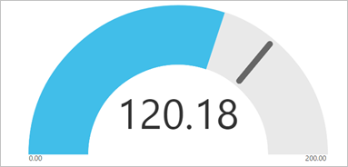
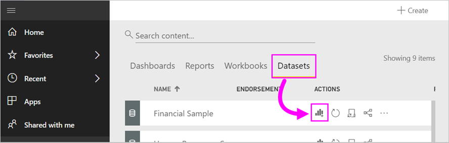
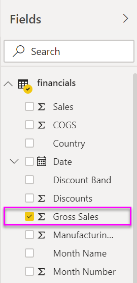
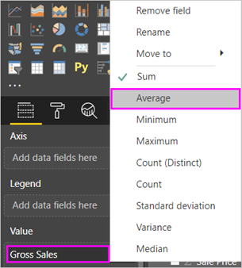
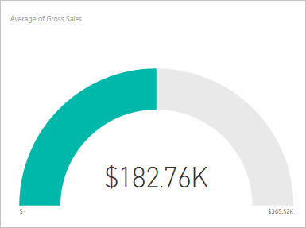
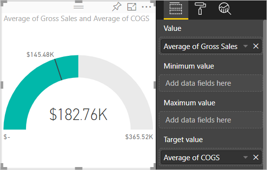
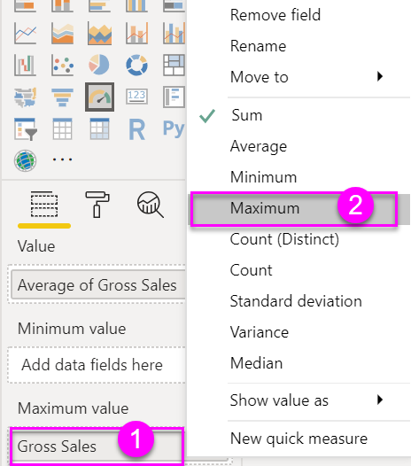
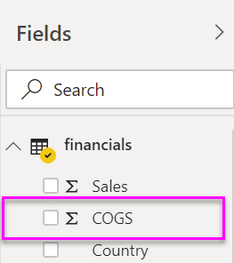

# Radial gauge charts in Power BI

A radial gauge chart has a circular arc and shows a single value that measures progress toward a goal or a Key Performance Indicator (KPI). The line (or *needle*) represents the goal or target value. The shading represents the progress toward that goal. The The value inside the arc represents the progress value. Power BI spreads all possible values evenly along the arc, from the minimum (left-most value) to the maximum (right-most value).

In this example, you're a car retailer tracking the sales team's average sales per month. The needle represents a 140 cars sales goal. The minimum possible average sales is 0 and the maximum is 200.  The blue shading shows that the team is averaging approximately 120 sales this month. Luckily, there's still another week to reach the goal.

Watch Will show you how to create single metric visuals: gauges, cards, and KPIs.

<iframe width="560" height="315" src="https://www.youtube.com/embed/xmja6EpqaO0?list=PL1N57mwBHtN0JFoKSR0n-tBkUJHeMP2cP" frameborder="0" allowfullscreen></iframe>

## When to use a radial gauge

Radial gauges are a great choice to:

* Show progress toward a goal.

* Represent a percentile measure, like a KPI.

* Show the health of a single measure.

* Display information you can quickly scan and understand.

## Prerequisites

* The Power BI service or Power BI Desktop

* Financial sample Excel workbook: [download the sample directly](http://go.microsoft.com/fwlink/?LinkID=521962).

## Create a basic radial gauge

These instructions use the Power BI service. To follow along, sign in to Power BI and open the Excel Financial Sample file.

### Step 1: Open the Financial Sample Excel file

1. If you haven't already, download the [Financial Sample Excel file](../sample-financial-download.md). Remember where you save it.

1. In the Power BI service, select **Get Data** > **Files**.

1. Select **Local File** and browse to the sample file's location.

1. Select **Import**. Power BI adds the Financial Sample to your workspace as a dataset.

1. From the **Datasets** content list, select the **Create report** icon for the **Financial Sample**.

    

### Step 2: Create a gauge to track Gross Sales

In the last section, when you selected the **Create report** icon, Power BI created a blank report in the editing view.

1. From the **Fields** pane, select **Gross Sales**.

   

1. Change the aggregation to **Average**.

   

1. Select the gauge icon  to convert the column chart to a gauge chart.

    

    Depending on when you download the **Financial Sample** file, you may see numbers that don't match these numbers.

    > [!TIP]
    > By default, Power BI creates a gauge chart where it assumes the current value (in this case, **Average of Gross Sales**) is at the halfway point on the gauge. Since the **Average of Gross Sales** value is $182.76K, the start value (Minimum) is set to 0 and the end value (Maximum) is set to double the current value.

### Step 3: Set a target value

1. Drag **COGS** from the **Fields** pane to the **Target value** well.

1. Change the aggregation to **Average**.

   Power BI adds a needle to represent our target value of **$145.48K**.

   

    Notice that we've exceeded our target.

   > [!NOTE]
   > You can also manually enter a target value. See the [Use manual format options to set Minimum, Maximum, and Target values](#use-manual-format-options-to-set-minimum-maximum-and-target-values) section.

### Step 4: Set a maximum value

In Step 2, Power BI used the **Value** field to automatically set minimum and maximum values. What if you want to set your own maximum value? Let's say that, instead of using double the current value as the maximum possible value, you want to set it to the highest Gross Sales number in your dataset.

1. Drag **Gross Sales** from the **Fields** pane to the **Maximum value** well.

1. Change the aggregation to **Maximum**.

   

   The gauge is redrawn with a new end value, 1.21 million in gross sales.

   

### Step 5: Save your report

1. [Save the report](../service-report-save.md).

1. [Add the gauge chart as a dashboard tile](../service-dashboard-pin-tile-from-report.md). 

## Use manual format options to set Minimum, Maximum, and Target values

1. Remove **Max of Gross Sales** from the **Maximum value** well.

1. Select the paint roller icon to open the **Format** pane.

   

1. Expand **Gauge axis** and enter values for **Min** and **Max**.

    

1. Clear the **COGS** option in the **Fields** pane to remove the target value.

    

1. When the **Target** field appears under **Gauge axis**, enter a value.

     

1. Optionally, continue formatting your gauge chart.

Once you're done with these steps, you'll have a gauge chart that looks something like this:

## Next step

* [Key Performance Indicator (KPI) visuals](power-bi-visualization-kpi.md)

* [Visualization types in Power BI](power-bi-visualization-types-for-reports-and-q-and-a.md)

More questions? [Try the Power BI Community](http://community.powerbi.com/)