# Scatter charts, Bubble charts, and Dot Plot charts in Power BI

A scatter chart always has two value axes to show: one set of numerical data along a horizontal axis and another set of numerical values along a vertical axis. The chart displays points at the intersection of an x and y numerical value, combining these values into single data points. Power BI may distribute these data points evenly or unevenly across the horizontal axis. It depends on the data the chart represents.

Watch this video to see Will create a scatter chart and then follow the steps below to create one yourself.

<iframe width="560" height="315" src="https://www.youtube.com/embed/PVcfPoVE3Ys?list=PL1N57mwBHtN0JFoKSR0n-tBkUJHeMP2cP" frameborder="0" allowfullscreen></iframe>

You can set the number of data points, up to a maximum of 10,000.  

## When to use a scatter chart, bubble chart, or a dot plot chart

### Scatter and Bubble charts

A scatter chart shows the relationship between two numerical values. A bubble chart replaces data points with bubbles, with the bubble *size* representing an additional third data dimension.

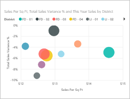

Scatter charts are a great choice:

* To show relationships between two numerical values.

* To plot two groups of numbers as one series of x and y coordinates.

* To use instead of a line chart when you want to change the scale of the horizontal axis.

* To turn the horizontal axis into a logarithmic scale.

* To display worksheet data that includes pairs or grouped sets of values.

    > [!TIP]
    > In a scatter chart, you can adjust the independent scales of the axes to reveal more information about the grouped values.

* To show patterns in large sets of data, for example by showing linear or non-linear trends, clusters, and outliers.

* To compare large numbers of data points without regard to time.  The more data that you include in a sScatter chart, the better the comparisons that you can make.

In addition to what Scatter charts can do for you, Bubble charts are a great choice:

* If your data has three data series that each contains a set of values.

* To present financial data.  Different bubble sizes are useful to visually emphasize specific values.

* To use with quadrants.

### Dot Plot charts

A dot plot chart is similar to a bubble chart and scatter chart, but you can also plot numerical or categorical data along the X-Axis.

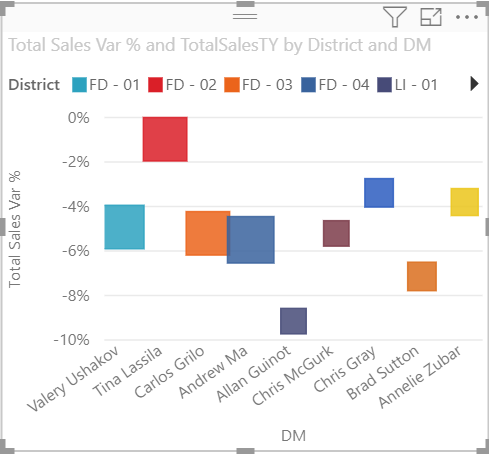

They're a great choice if you want to include categorical data along the X-Axis.

## Prerequisites

* The Power BI service

* Retail Analysis Sample report

## Create a scatter chart

To follow along, sign into [the Power BI service](https://app.powerbi.com) and open the [Retail Analysis Sample](../sample-datasets.md) report in [Edit report](../service-interact-with-a-report-in-editing-view.md) view.

1. Select the  to create a blank report page.

1. From the **Fields** pane, select these fields:

    * **Sales** > **Sales Per Sq Ft**

    * **Sales** > **Total Sales Variance %**

    * **District** > **District**

    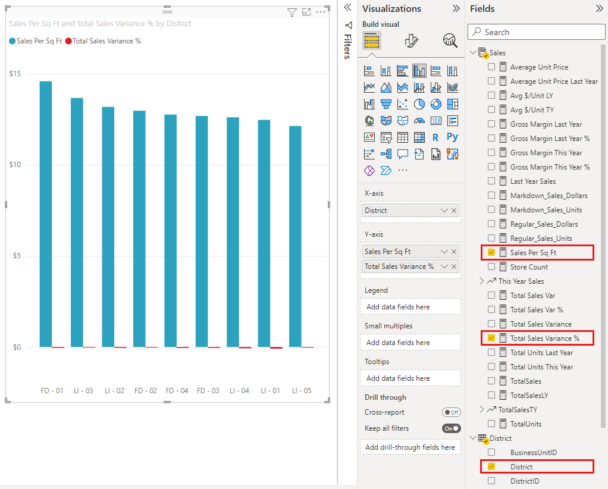

1. In the **Visualization** pane, select  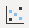 to convert the cluster column chart to a scatter chart.

   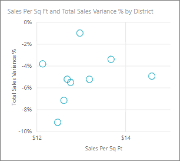

1. Drag **District** from **Details** to **Legend**.

    Power BI displays a scatter chart that plots **Total Sales Variance %** along the Y-Axis, and plots **Sales Per Square Feet** along the X-Axis. The data point colors represent districts:

    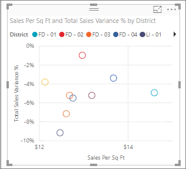

Now let's add a third dimension.

## Create a bubble chart

1. From the **Fields** pane, drag **Sales** > **This Year Sales** > **Value** to the **Size** well. The data points expand to volumes proportionate with the sales value.

   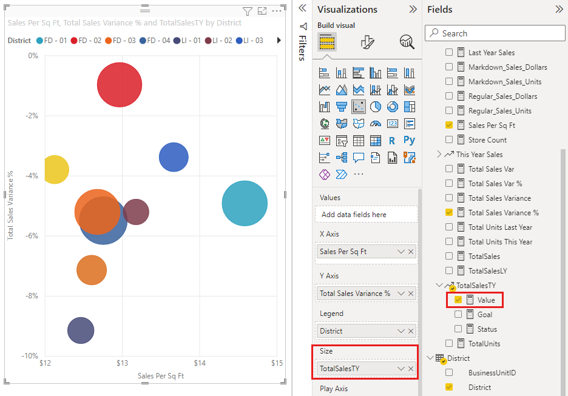

1. Hover over a bubble. The size of the bubble reflects the value of **This Year Sales**.

    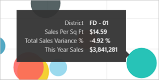

1. To set the number of data points to show in your bubble chart, in the **Format** section of the **Visualizations** pane, expand **General**, and adjust the **Data Volume**.

    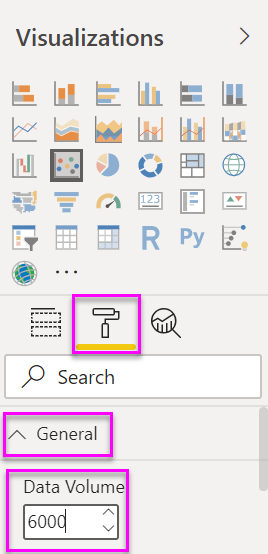

    You can set the max data volume to any number up to 10,000. As you get into the higher numbers, we suggest testing first to ensure good performance.

    > [!NOTE]
    > More data points can mean a longer loading time. If you do choose to publish reports with limits at the higher end of the scale, make sure to test out your reports across the web and mobile as well. You want to confirm that the performance of the chart matches your users' expectations.

1. You can [format the visualization colors, labels, titles, background, and more](service-getting-started-with-color-formatting-and-axis-properties.md).

    To [improve accessibility](../desktop-accessibility.md), consider adding marker shapes to each line. To select the marker shape, expand **Shapes**, select **Marker shape**, and select a shape.

    

    You can change the marker shape to a diamond, triangle, or square. Using a different marker shape for each line makes it easier for report consumers to differentiate lines (or areas) from each other.

## Create a dot plot chart

To create a dot plot chart, replace the numerical **X-Axis** field with a categorical field.

From the **X-Axis** pane, remove **Sales per sq ft** and replace it with **District** > **District Manager**.

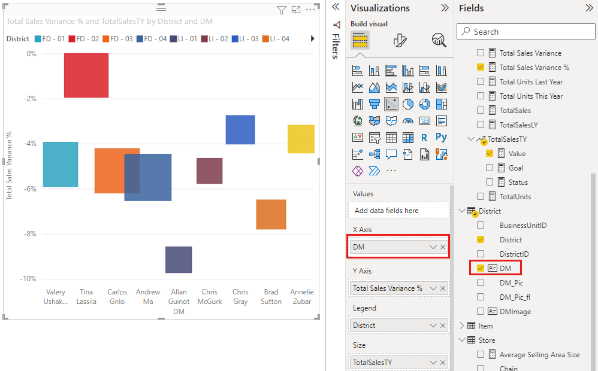

## Considerations and Troubleshooting

### Your scatter chart has only one data point

Does your scatter chart have only one data point that aggregates all the values on the X- and Y-axes?  Or maybe it aggregates all the values along a single horizontal or vertical line?

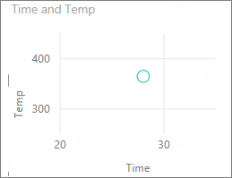

Add a field to the **Details** well to tell Power BI how to group the values. The field must be unique for each point you want to plot. A simple row number or ID field will do.

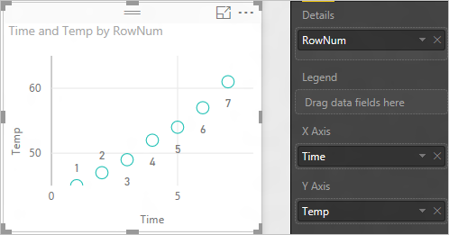

If you don’t have that in your data, create a field that concatenates your X and Y values together into something unique per point:

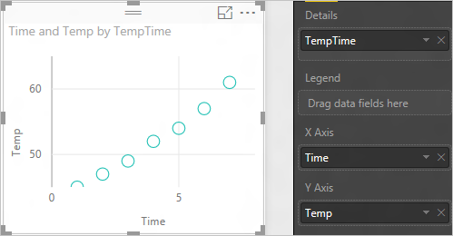

To create a new field, [use the Power BI Desktop Query Editor to add an Index Column](../desktop-add-custom-column.md) to your dataset. Then add this column to your visualization's **Details** well.

## Next steps

* [High-density sampling in Power BI scatter charts](desktop-high-density-scatter-charts.md)

* [Visualization types in Power BI](power-bi-visualization-types-for-reports-and-q-and-a.md)

More questions? [Try the Power BI Community](http://community.powerbi.com/)
