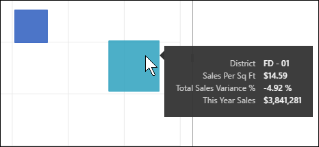

# Scatter charts, bubble charts, and dot plot charts in Power BI
A scatter chart always has two value axes to show one set of numerical data along a horizontal axis and another set of numerical values along a vertical axis. The chart displays points at the intersection of an x and y numerical value, combining these values into single data points. These data points may be distributed evenly or unevenly across the horizontal axis, depending on the data.

A bubble chart replaces data points with bubbles, with the bubble *size* representing an additional dimension of the data.

A dot plot chart is similar to a bubble chart and scatter chart except that you can plot numerical or categorical data along the X axis. 

You can set the number of data points, up to a maximum of 10,000.  

## When to use a scatter chart or bubble chart
### Scatter charts are a great choice:
* to show relationships between 2 (scatter) or 3 (bubble) **numerical** values.
* to plot two groups of numbers as one series of xy coordinates.
* instead of a line chart when you want to change the scale of the horizontal axis    
* to turn the horizontal axis into a logarithmic scale.
* to display worksheet data that includes pairs or grouped sets of values. In a scatter chart, you can adjust the independent scales of the axes to reveal more information about the grouped values.
* to show patterns in large sets of data, for example by showing linear or non-linear trends, clusters, and outliers.
* to compare large numbers of data points without regard to time.  The more data that you include in a scatter chart, the better the comparisons that you can make.

### Bubble charts are a great choice:
* if your data has 3 data series that each contain a set of values.
* to present financial data.  Different bubble sizes are useful to visually emphasize specific values.
* to use with quadrants.

### Dot plot charts are a great choice in place of a scatter or bubble:
* if you want to include categorical data along the X axis

## Create a scatter chart
Watch this video to see Will create a scatter chart and then follow the steps below to create one yourself.

<iframe width="560" height="315" src="https://www.youtube.com/embed/PVcfPoVE3Ys?list=PL1N57mwBHtN0JFoKSR0n-tBkUJHeMP2cP" frameborder="0" allowfullscreen></iframe>

These instructions use the Retail Analysis Sample. To follow along, [download the sample](../sample-datasets.md) for Power BI service (app.powerbi.com) or Power BI Desktop.   

1. Open the report in Editing view and select the yellow plus icon to create a [blank report page ](../power-bi-report-add-page.md).
 
2. From the Fields pane, select the following fields:
   - **Sales** > **Sales Per Sq Ft**
   - **Sales** > **Total Sales Variance %**
   - **District** > **District**

     

     If you're using Power BI service, make sure you open the report in [Editing View](../service-interact-with-a-report-in-editing-view.md).

3. Convert to a scatter chart. In the Visualization pane, select the Scatter chart icon.

   .

4. Drag **District** from **Details** to **Legend**. This displays a scatter chart that plots **Total Sales Variance %** along the Y axis, and plots **Sales Per Square Feet** along the X axis. The data point colors represent districts:

    

Now let's add a third dimension.

## Create a bubble chart

1. From the **Fields** pane, drag **Sales** > **This Year Sales** > **Value** to the **Size** area. The data points expand to volumes proportionate with the sales value.
   
   

2. Hover over a bubble. The size of the bubble reflects the value of **This Year Sales**.
   
    

3. To set the number of data points to show in your bubble chart, in the **Formatting** section of the **Visualizations** pane, expand the **General** card and adjust the **Data Volume**. You can set the max data volume to any number up to 10,000. As you get into the higher numbers, we suggest testing first to ensure good performance. 

     

   Because more data points can mean a longer loading time, if you do choose to publish reports with limits at the higher end of the scale, make sure to test out your reports across the web and mobile as well to ensure performance matches your users' expectations. 

4. You can [format the visualization colors, labels, titles, background, and more](service-getting-started-with-color-formatting-and-axis-properties.md). To [improve accessibility](../desktop-accessibility.md), consider adding marker shapes to each line. Using a different Marker shape for each line makes it easier for report consumers to differentiate lines (or areas) from each other. To select the marker shape, expand the **Shapes** card, then select a marker shape.

      

   You can also change the marker shape to diamond, triangle, or square:

   

## Create a dot plot
To create a dot plot, replace the numerical X axis field with a categorical field.

From the **X Axis** pane, remove **Sales per sq ft** and replace it with **District > DM**.
   

## Considerations and Troubleshooting

### **Your scatter chart has only one data point**
Does your scatter chart have only one data point that aggregates all the values on the X and Y axes?  Or maybe it aggregates all the values along a single horizontal or vertical line?

Add a field to the **Details** area to tell Power BI how to group the values. The field must be unique for each point you want to plot; like a simple row number or ID field.

Or if you don’t have that in your data, create a field that concatenates your X and Y values together into something unique per point:

To create a new field, [use the Power BI Desktop Query Editor to add an Index Column](../desktop-add-custom-column.md) to your dataset.  Then add this column to the **Details** area of your visualization.

## Next steps

[High density scatter charts](desktop-high-density-scatter-charts.md)

[Visualization types in Power BI](power-bi-visualization-types-for-reports-and-q-and-a.md)

