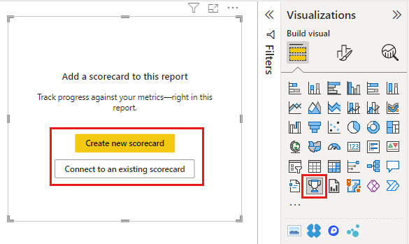
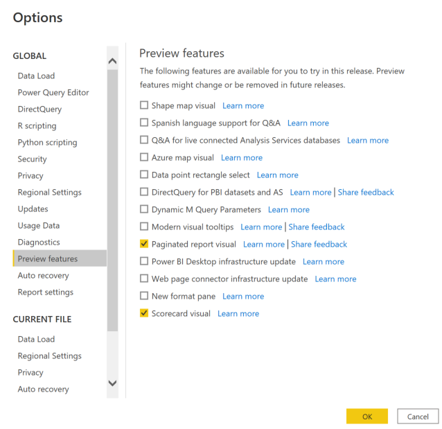
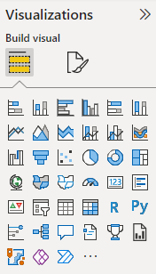
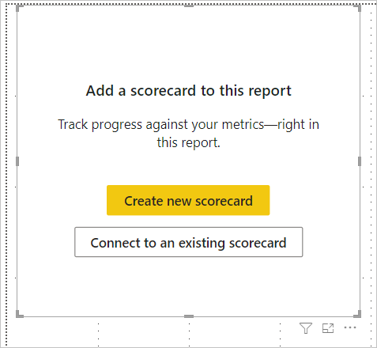
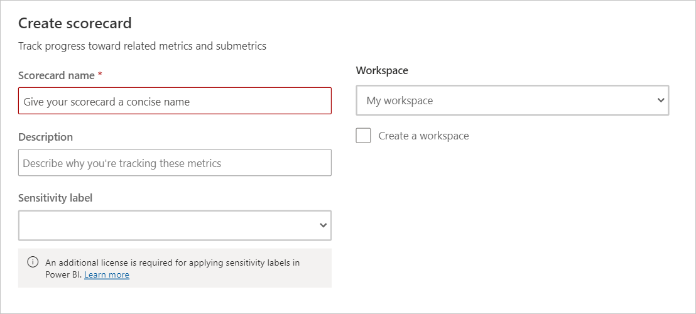
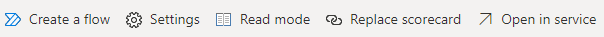
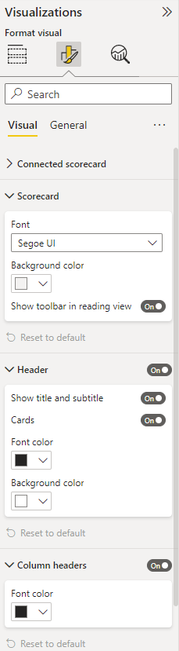

# Create scorecard visual in Power BI (preview)

[!INCLUDE [applies-yes-desktop-yes-service](../includes/applies-yes-desktop-yes-service.md)]

Integrating goals and scorecards deeply into reporting solutions is a great way to help drive alignment and progress on a team. With the new scorecard visual in desktop, users have the flexibility from an authoring perspective to add an existing scorecard in a report or create a new scorecard. Users can seamlessly integrate existing scorecards into reports, and even make updates to the scorecard directly from Power BI Desktop. 

## Get started
This feature is in preview, so you first need to turn on the feature switch. Go to **File** > **Options and Settings** > **Options** > **Preview features**, and make sure **Scorecard visual** is turned on:

Select the **Scorecard visual** icon from the **Visualizations** pane.

Users can choose to either create a new scorecard or connect to an existing scorecard from Power BI service.

Selecting "Create a new scorecard", lets users author scorecards in Desktop just like in Power BI service. This creates a new scorecard and the associated dataset in the workspace the user selects.

Check out [this documentation page](https://docs.microsoft.com/en-us/power-bi/create-reports/service-goals-create) to learn more about creating Scorecards and goals!

Selecting "Connect to an existing scorecard", lets users pick and embed an existing  scorecard from the list of ones that they have access to.

## Actions 
User can access the Scorecard toolbar while hovering over the visual.

The toolbar provides the following options:
 - Create a flow: User can launch Power Automate and define automated business process from events within their scorecard. Check out this documentation page to learn more.
 - Edit: Users can edit the scorecard just like in Power BI service. Users can create or update goals/subgoals, add notes/check-ins, create automated status rules etc. These changes made to the scorecard will be synced to the original scorecard. 
 - Replace scorecard: Users can replace the scorecard with another existing or new scorecard.
 - Open in Service:  Users can access this scorecard in Power BI service using this link.

## Format Scorecard
 The visual supports various formatting options for scorecards, such as font style and colors, backgrounds, so users can customize the scorecards to fit the look and feel of the rest of their report. Users can also turn off the Scorecard header or status overview cards. When an existing scorecard in Power BI service is connected in the report, formatting changes made from the Visualizations pane will only apply to the scorecard in this report and will not be updated in the original scorecard in Power BI service.
 
 
 
## Limitations
- Users must be signed in to Power BI Desktop and have a Power BI Pro license
- Since visual requires users to be signed-in, it is not supported in PaaS or anonymous report embed
- Visual does not support cross-filtering/highlight
- Goals cannot be connected to the current report until the report is published in service
