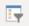
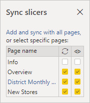

# Slicers in Power BI

[!INCLUDE [power-bi-visuals-desktop-banner](../includes/power-bi-visuals-desktop-banner.md)]

Suppose you want your report readers to be able to look at overall sales metrics, but also highlight performance for individual district managers and different time frames. You could create separate reports or comparative charts. Or, you could use slicers. A slicer is an alternate way of filtering that narrows the portion of the dataset shown in the other visualizations in a report. 

This tutorial uses the free [Retail Analysis Sample](../sample-retail-analysis.md) to walk you through creating, formatting, and using list and date range slicers. Have fun discovering ways to format and use slicers. 

## When to use a slicer
Slicers are a great choice when you want to:

* Display commonly used or important filters on the report canvas for easier access.
* Make it easier to see the current filtered state without having to open a drop-down list. 
* Filter by columns that are unneeded and hidden in the data tables.
* Create more focused reports by putting slicers next to important visuals.

Power BI slicers have the following limitations:

- Slicers don't support input fields.
- Drilldown isn't supported for slicers.

## Create slicers

**Create a new slicer to filter data by District Manager**

This tutorial uses the [Retail Analysis sample PBIX file](http://download.microsoft.com/download/9/6/D/96DDC2FF-2568-491D-AAFA-AFDD6F763AE3/Retail%20Analysis%20Sample%20PBIX.pbix).

1. From the menu bar, select **File** > **Open**.
   
1. Browse to the **Retail Analysis sample PBIX.pbix** file, and then select **Open**.

1. Select the **Report** icon  to open the file in report view.

1. On the **Overview** page, with nothing selected on the report canvas, select the **Slicer** icon  in the **Visualizations** pane to create a new slicer. 

1. With the new slicer selected, from the **Fields** pane, select **District** > **DM** to populate the slicer. 

    The new slicer is now populated with a list of names and selection boxes.
    
    
    
1. Resize and drag the elements on the canvas to make room for the slicer. Note that if you resize the slicer too small, its items are cut off. 

1. Select names on the slicer and notice the effects on the other visualizations on the page. Select names again to deselect them, or hold down the **Ctrl** key to select more than one name. Selecting all names has the same effect as selecting none. 

1. Alternately, select **Format** (paint roller icon) in the **Visualizations** pane to format your slicer. 

   There are too many options to describe them all here; experiment and create a slicer that works for you. In the following image, the first slicer has a horizontal orientation and colored backgrounds for the items. The second slicer has a vertical orientation and colored text for a more standard look.

   

   >[!TIP]
   >Slicer list items are sorted in ascending order, by default. To reverse the sort order to descending, select the ellipsis (**...**) in the top right corner of the slicer and choose **Sort descending**.

**To create a new slicer to filter data by date range**

1. Select the **Overview** page of the report. With nothing selected on the report canvas, select the **Fields** icon in the **Visualizations** pane. 

1. In the **Fields** pane, select **Store** >  **OpenDate**. 

    This action populates the **Values** box in the **Visualizations** pane to create a new visualization.
    
    

1. With the new visualization selected in the report, select the **Slicer** icon in the **Visualizations** pane to convert the new visualization to a slicer. This **OpenDate** slicer is a slider control with the date range populated.
    
1. Resize and drag the slicer and the other elements on the canvas to make room for the slicer. Although the slider resizes with the slicer size, it disappears and the dates are cut off if you resize the slicer too small. 

1. Select different date ranges with the slider, or select a date field to enter a date or pop up a calendar for more precise selection. Note the effects on the other visualizations on the page.
    
    >[!NOTE]
    >Numeric and date/time data types produce range slider slicers by default. Starting with the February 2018 Power BI update, whole number data type range sliders now snap to whole number values rather than showing decimal places. 

1. To change the slicer type, with the slicer selected, hover over the upper-right area of the slicer, drop down the carat that appears, and choose one of the options, such as **List** or **Before**. Notice how the slicer appearance and selection options change. 
 
    

For more information about creating date and numeric range slicers, watch the following video and see [Use the numeric range slicer in Power BI Desktop](../desktop-slicer-numeric-range.md).
   > [!NOTE]
   > This video uses an older version of Power BI Desktop.
   > 
   > 

<iframe width="560" height="315" src="https://www.youtube.com/embed/zIZPA0UrJyA" frameborder="0" allowfullscreen></iframe> 

## Control which page visuals are affected by slicers
By default, slicers on report pages affect all the other visualizations on that page, including each other. As you choose values in the list and date sliders you just created, notice the effects on the other visualizations. The filtered data is an intersection of the values selected in both slicers. 

You can use visual interactions to exclude some page visualizations from being affected by others. On the **Overview** page, the **Total Sales Variance by FiscalMonth and District Manager** chart shows overall comparative data for district managers by month, which you want to keep visible at all times. Use visual interactions to keep slicer selections from filtering this chart. 

1. Go to the **Overview** page of the report, and then select the **DM** slicer you previously created.

1. On the Power BI Desktop menu, select the **Format** menu under **Visual Tools**, and then select **Edit interactions**.
   
   Filter controls , each with a **Filter** and a **None** option, appear above all the visuals on the page. Initially, the **Filter** option is preselected on all the controls.
   
1. Select the **None** option in the filter control above the **Total Sales Variance by FiscalMonth and District Manager** chart to stop the **DM** slicer from filtering it. 

1. Select the **OpenDate** slicer, and then select the **None** icon above the **Total Sales Variance by FiscalMonth and District Manager** chart to stop this slicer from filtering it. 

   Now, as you select names and date ranges in the slicers, the **Total Sales Variance by FiscalMonth and District Manager** chart is unchanged.

For more information about editing interactions, see [Visual interactions in a Power BI report](../service-reports-visual-interactions.md).

## Sync and use slicers on other pages
Starting with the February 2018 Power BI update, you can sync a slicer and use it on any or all pages in a report. 

In the current report, the **District Monthly Sales** page has a **District Manager** slicer, but what if we also wanted that slicer on the **New Stores** page? The **New Stores** page has a slicer, but it provides only **Store Name** information. With the **Sync slicers** pane, you can sync the **District Manager** slicer to these pages, so that slicer selections on any page affect visualizations on all three pages.

1. On the Power BI Desktop **View** menu, select **Sync slicers**.

    

1.  The **Sync slicers** pane appears between the **Filters** and **Visualizations** panes.  

    

1. On the **District Monthly Sales** page of the report, select the **District Manager** slicer. 

    Because you've already created a **District Manager** (**DM**) slicer on the **Overview** page, the **Sync slicers** pane appears as follows:
    
    
    
1. In the **Sync** column of the **Sync slicers** pane, select the **Overview**, **District Monthly Sales**, and **New Stores** pages. 

    This selection causes the **District Monthly Sales** slicer to sync across these three pages. 
    
1. In the **Visible** column of the **Sync slicers** pane, select the **New Stores** page. 

    This selection causes the **District Monthly Sales** slicer to be visible in these three pages. The **Sync slicers** pane now appears as follows:

    

1. Observe the effects of syncing the slicer and making it visible on the other pages. On the **District Monthly Sales** page, notice that the **District Manager** slicer now shows the same selections as on the **Overview** page. On the **New Stores** page, the **District Manager** slicer is now visible and it selections affect the selections that are visible in the **Store Name** slicer. 
    
    >[!TIP]
    >Although the slicer initially appears on the synced pages at the same size and position as on the original page, you can move, resize, and format synced slicers on the various pages independently. 

    >[!NOTE]
    >If you sync a slicer to a page but don't make it visible on that page, slicer selections made on the other pages still filter the data on the page.
 
## Format slicers
Different formatting options are available, depending on the slicer type. By using **Horizontal** orientation, **Responsive** layout, and **Item** coloring, you can produce buttons or tiles rather than standard list items, and make slicer items resize to fit different screen sizes and layouts.  

1. With the **District Manager** slicer selected on any page, in the **Visualizations** pane, select the **Format** icon  to display the formatting controls. 
    
    
    
2. Select the drop-down arrows next to each category to display and edit the options. 

### General options
1. Under **Format**, select **General**, select a red color under **Outline color**, and then change **Outline weight** to *2*. 

    This setting changes the color and thickness of the header and item outlines or underlines.

1. For **Orientation**, **Vertical** is selected by default. Select **Horizontal** to produce a slicer with horizontally arranged tiles or buttons, and scroll arrows to access items that don't fit in the slicer.
    
    
    
3. Turn **On** the **Responsive** layout to change the size and arrangement of slicer items according to the view screen and slicer size. 

    For list slicers, responsive layout is only available in horizontal orientation, and prevents items from being cut off on small screens. For range slider slicers, responsive formatting changes the style of the slider and provides more flexible resizing. Both types of slicers become filter icons at small sizes.
    
    
    
    >[!NOTE]
    >Responsive layout changes can override specific heading and item formatting that you set. 
    
4. Under **X Position**, **Y Position**, **Width**, and **Height**, set the slicer position and size with numeric precision, or move and resize the slicer directly on the canvas. 

    Experiment with different item sizes and arrangements, and note how the responsive formatting changes accordingly. These options are available only when you select horizontal orientations. 

    

For more information about horizontal orientations and responsive layouts, see [Create a responsive slicer you can resize in Power BI](../power-bi-slicer-filter-responsive.md).

### Selection controls options (list slicers only)
1. Under **Selection controls**, turn **Show Select all option** to **On** to add a **Select All** item to the slicer. 

    **Show Select all option** is **Off** by default. When enabled, this option, when toggled, selects or deselects all items. If you select all items, selecting an item deselects it, allowing an *is-not* type of filter.
    
    
    
1. Turn **Single Select** to **Off** to allow you to select multiple items without holding down the **Ctrl** key. 

    **Single Select** is **On** by default. Selecting an item selects it, and holding down the **Ctrl** key selects multiple items. Selecting item again deselects it.

### Title options
**Title** is **On** by default. This selection shows the data field name at the top of the slicer. 
- For this tutorial, format the title text as follows: 
   - **Font color**: red
   - **Text size**: **14 pt**
   - **Alignment**: **Center**
   - **Font family**: **Arial Black**

### Items options (list slicers only)
1. For this tutorial, format the **Items** options as follows:
- **Font color**: black
- **Background**: light red
- **Text size**: **10 pt**
- **Font family**: **Arial**
 
1. For **Outline**, choose **Frame** to draw a border around each item with the size and color you set under the **General** options. 
    
    
    
    >[!TIP]
    >- With **General** > **Orientation** > **Horizontal** selected, deselected items show the chosen text and background colors, while selected items use the system default, usually black background with white text.
    >- With **General** > **Orientation > Vertical** selected, items always show the selected colors, and check boxes are always black when selected. 

### Date/numeric inputs and slider options (range slider slicers only)
- Date/numeric input options are the same as the **Items** options for list slicers, except that there's no outline or underline options.
- Slider options allow you to set the color of the range slider, or turn the slider to **Off**, leaving only the numeric inputs.

### Other formatting options
The other formatting options are off by default. Turn **On** these options to control them: 
- **Background**: Add a background color to the slicer and sets its transparency.
- **Lock aspect:** Retain the shape of the slicer if it's resized.
- **Border:** Add a border around the slicer and sets its color. This slicer border is separate from and unaffected by the **General** settings. 

## Next steps
For more information, see the following articles:

[Visualization types in Power BI](power-bi-visualization-types-for-reports-and-q-and-a.md)

[Tables in Power BI](power-bi-visualization-tables.md)

