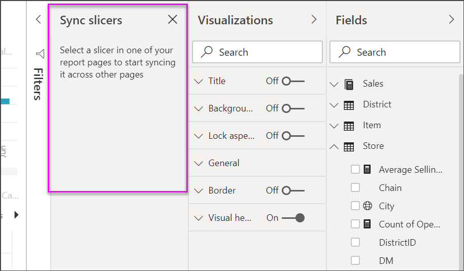
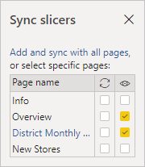

# Slicers in Power BI

[!INCLUDE [applies-to](../includes/applies-to.md)] [!INCLUDE [yes-desktop](../includes/yes-desktop.md)] [!INCLUDE [yes-service](../includes/yes-service.md)]

Suppose you want your report readers to be able to look at overall sales metrics, but also highlight performance for individual district managers and different time frames. You could create separate reports or comparative charts. You could add filters in the Filters pane. Or you could use *slicers*. Slicers are another way of filtering. They narrow the portion of the dataset that is shown in the other report visualizations. 

This article walks through creating and formatting a basic slicer, using the free [Retail Analysis Sample](../create-reports/sample-retail-analysis.md). It also covers controlling which visuals are affected by a slicer, syncing with slicers on other pages, and filtering and formatting slicers.

These other articles explain how to make specific types of slicers:

- [Numeric range slicers](../create-reports/desktop-slicer-numeric-range.md).
- [Relative date slicers](desktop-slicer-filter-date-range.md).
- [Relative time slicers](../create-reports/slicer-filter-relative-time.md).
- Responsive, [resizable slicers](../create-reports/power-bi-slicer-filter-responsive.md).
- [Hierarchy slicers](../create-reports/power-bi-slicer-hierarchy-multiple-fields.md) with multiple fields.

## When to use a slicer
Slicers are a great choice when you want to:

* Display commonly used or important filters on the report canvas for easier access.
* Make it easier to see the current filtered state without having to open a drop-down list. 
* Filter by columns that are unneeded and hidden in the data tables.
* Create more focused reports by putting slicers next to important visuals.

Power BI slicers don't support:

- Input fields
- Drill-down options

## Create a slicer

This slicer filters data by district manager. If you want to follow along with this procedure, download the [Retail Analysis sample PBIX file](https://download.microsoft.com/download/9/6/D/96DDC2FF-2568-491D-AAFA-AFDD6F763AE3/Retail%20Analysis%20Sample%20PBIX.pbix).

1. Open Power BI Desktop, and from the menu bar, select **File** > **Open**.
   
1. Browse to the **Retail Analysis sample PBIX.pbix** file, then select **Open**.

1. On the left pane, select the **Report** icon  to open the file in report view.

1. On the **Overview** page, with nothing selected on the report canvas, select the **Slicer** icon  in the **Visualizations** pane to create a new slicer. 

1. With the new slicer selected, from the **Fields** pane, select **District** > **DM** to populate the slicer. 

    The new slicer is now populated with a list of district manager names and their selection boxes.
    
    
    
1. Resize and drag the elements on the canvas to make room for the slicer. Note that if you resize the slicer too small, its items are cut off. 

1. Select names on the slicer and notice the effects on the other visualizations on the page. Select names again to deselect them, or hold down the **Ctrl** key to select more than one name. Selecting all names has the same effect as selecting none. 

1. Alternately, select **Format** (paint roller icon) in the **Visualizations** pane to format your slicer. 

   There are too many options to describe them all here; experiment and create a slicer that works for you. In the following image, the first slicer has a horizontal orientation and colored backgrounds for the items. The second slicer has a vertical orientation and colored text for a more standard look.

   

   >[!TIP]
   >Slicer list items are sorted in ascending order, by default. To reverse the sort order to descending, select the ellipsis (**...**) in the top right corner of the slicer and choose **Sort descending**.

## Control which page visuals are affected by slicers
By default, slicers on report pages affect all the other visualizations on that page, including each other. As you choose values in the list and date sliders you just created, notice the effects on the other visualizations. The filtered data is an intersection of the values selected in both slicers. 

Use visual interactions to exclude some page visualizations from being affected by others. On the **Overview** page, the **Total Sales Variance by FiscalMonth and District Manager** chart shows overall comparative data for district managers by month, which you want to keep visible at all times. Use visual interactions to keep slicer selections from filtering this chart. 

1. Go to the **Overview** page of the report, and then select the **DM** slicer you previously created.

1. On the Power BI Desktop menu, select the **Format** menu under **Visual Tools**, and then select **Edit interactions**.
   
   Filter controls , each with a **Filter** and a **None** option, appear above all the visuals on the page. Initially, the **Filter** option is preselected on all the controls.
   
1. Select the **None** option in the filter control above the **Total Sales Variance by FiscalMonth and District Manager** chart to stop the **DM** slicer from filtering it. 

1. Select the **OpenDate** slicer, and then select the **None** option above the **Total Sales Variance by FiscalMonth and District Manager** chart to stop this slicer from filtering it. 

   Now, as you select names and date ranges in the slicers, the **Total Sales Variance by FiscalMonth and District Manager** chart is unchanged.

For more information about editing interactions, see [Change how visuals interact in a Power BI report](../create-reports/service-reports-visual-interactions.md).

## Sync and use slicers on other pages
You can sync a slicer and use it on any or all pages in a report. 

In the current report, the **District Monthly Sales** page has a **District Manager** slicer, but what if we also wanted that slicer on the **New Stores** page? The **New Stores** page has a slicer, but it provides only **Store Name** information. With the **Sync slicers** pane, you can sync the **District Manager** slicer to these pages, so that slicer selections on any page affect visualizations on all three pages.

1. On the Power BI Desktop **View** menu, select **Sync slicers**.

    

    The **Sync slicers** pane appears between the **Filters** and **Visualizations** panes.

    

1. On the **District Monthly Sales** page of the report, select the **District Manager** slicer. 

    Because you've already created a **District Manager** (**DM**) slicer on the **Overview** page, the **Sync slicers** pane appears as follows:
    
    
    
1. In the **Sync** column of the **Sync slicers** pane, select the **Overview**, **District Monthly Sales**, and **New Stores** pages. 

    This selection causes the **District Monthly Sales** slicer to sync across these three pages. 
    
1. In the **Visible** column of the **Sync slicers** pane, select the **New Stores** page. 

    This selection causes the **District Monthly Sales** slicer to be visible in these three pages. The **Sync slicers** pane now appears as follows:

    

1. Observe the effects of syncing the slicer and making it visible on the other pages. On the **District Monthly Sales** page, notice that the **District Manager** slicer now shows the same selections as on the **Overview** page. On the **New Stores** page, the **District Manager** slicer is now visible and it selections affect the selections that are visible in the **Store Name** slicer. 
    
    >[!TIP]
    >Although the slicer initially appears on the synced pages at the same size and position as on the original page, you can move, resize, and format synced slicers on the various pages independently. 

    >[!NOTE]
    >If you sync a slicer to a page but don't make it visible on that page, slicer selections made on the other pages still filter the data on the page.

### Sync separate slicers
You can also sync two or more separate slicers. This is particulary useful when working with composite models as you might want to make the same selection across sources without relying on cross source group relationships. To sync two or more separate slicers, you will need to create a group.

1. To get started, make sure the **Selection pane** is visible by selecting it from the **View** menu.

2. Select the slicers you want to sync and in the **Selection pane**, create a group using the context menu:
   
   

   Alternatively, you can create the group by selecting the slicers and selecting **Group** from the **Format** menu.

3. Rename the group you just created by double clicking on the group name in the **Selection pane** and confirming the rename:

   

4. Make sure the **Sync slicers** pane is visible by selecting it from the **View** menu.

5. In the **Sync slicers** pane, select one of the slicers in the group and enter the group name under **Advanced options**:

   

6. Make sure to select either **Sync field changes to other slicers**, **Sync filter changes to other slicers** or both depending on your scenario. If you just want to keep the slicers in sync so filters set by the slicers are kept in sync, select **Sync filter changes to other slicers**. If you also want to make sure that any changes you make to the field on which the slicers is based get synced across the group select **Sync field changes to other slicers**.

7. Test the sync works as you need by changing the selection and / or field in one of the slicers and observe it gets updated in the other slicer(s) in the group.

## Filtering slicers
You can apply visual-level filters to slicers to reduce the list of values that are displayed in the slicer. For example you might filter out blank values from a list slicer, or filter out certain dates from a range slicer. When you do this it only affects *the values that are shown in the slicer*, not *the filter that the slicer applies to other visuals* when you make a selection. For example, let's say you apply a filter to a range slicer to only show certain dates. The selection on the slicer will only show the first and last dates from that range, but you would still see other dates in your other visuals. Once you change the selected range in the slicer you'll see the other visuals update. Clearing the slicer would show all the dates again.

See [Filter types](../create-reports/power-bi-report-filter-types.md) for more information on visual-level filters.

## Format slicers
Different formatting options are available, depending on the slicer type. By using **Horizontal** orientation, **Responsive** layout, and **Item** coloring, you can produce buttons or tiles rather than standard list items, and make slicer items resize to fit different screen sizes and layouts.  

1. With the **District Manager** slicer selected on any page, in the **Visualizations** pane, select the **Format** icon  to display the formatting controls. 
    
    
    
1. Select the drop-down arrows next to each category to display and edit the options. 

### General options
1. Under **Format**, select **General**, select a red color under **Outline color**, and then change **Outline weight** to *2*. 

    This setting changes the color and thickness of the header and item outlines and underlines.

1. For **Orientation**, **Vertical** is selected by default. Select **Horizontal** to produce a slicer with horizontally arranged tiles or buttons, and scroll arrows to access items that don't fit in the slicer.
    
    
    
1. Turn **On** the **Responsive** layout to change the size and arrangement of slicer items according to the view screen and slicer size. 

    For list slicers, responsive layout prevents items from being cut off on small screens. It's available only in horizontal orientations. For range slider slicers, responsive formatting changes the style of the slider and provides more flexible resizing. Both types of slicers become filter icons at small sizes.
    
    
    
    >[!NOTE]
    >Responsive layout changes can override specific heading and item formatting that you set. 
    
1. Under **X Position**, **Y Position**, **Width**, and **Height**, set the slicer position and size with numeric precision, or move and resize the slicer directly on the canvas. 

    Experiment with different item sizes and arrangements, and note how the responsive formatting changes accordingly. These options are available only when you select horizontal orientations. 

    

For more information about horizontal orientations and responsive layouts, see [Create a responsive slicer you can resize in Power B I](../create-reports/power-bi-slicer-filter-responsive.md).

### Selection controls options (list slicers only)
1. Under **Selection controls**, turn **Show "Select all" option** to **On** to add a **Select All** item to the slicer. 

    **Show "Select all" option** is **Off** by default. When enabled, this option, when toggled, selects or deselects all items. If you select all items, selecting an item deselects it, allowing an *is-not* type of filter.
    
    
    
1. Turn **Single select** to **Off** to allow you to select multiple items without needing to hold down the **Ctrl** key. 

    **Single select** is **On** by default. Selecting an item selects it, and holding down the **Ctrl** key selects multiple items. Selecting item again deselects it.

### Title options
**Title** is **On** by default. This selection shows the data field name at the top of the slicer. You can edit the title, too, which is especially useful for hierarchy slicers. See [Change the title](../create-reports/power-bi-slicer-hierarchy-multiple-fields.md#change-the-title) in the article "Add multiple fields to a hierarchy slicer" for details.

- For this article, format the title text as follows: 
   - **Font color**: red
   - **Text size**: **14 pt**
   - **Alignment**: **Center**
   - **Font family**: **Arial Black**

### Items options

Items options are only available for list slicers.

1. For this article, format the **Items** options as follows:
    - **Font color**: black
    - **Background**: light red
    - **Text size**: **10 pt**
    - **Font family**: **Arial**
 
1. For **Outline**, choose **Frame** to draw a border around each item with the size and color you set under the **General** options. 
    
    
    
    >[!TIP]
    >- With **General** > **Orientation** > **Horizontal** selected, deselected items show the chosen text and background colors. Selected items use the system default, usually a black background with white text.
    >- With **General** > **Orientation > Vertical** selected, items always show the selected colors, and check boxes are always black when selected. 

### Date/numeric inputs and slider options

Date/numeric inputs and slider options are only available for range slider slicers.

- For list slicers, date/numeric input options are the same as **Items** options except that there's no outline or underline options.
- **Slider** options allow you to set the color of the range slider, or turn the slider to **Off**, leaving only the numeric inputs.

### Other formatting options
The other formatting options are **Off** by default. Turn **On** these options to control them: 

- **Background**: Add a background color to the slicer and sets its transparency.
- **Lock aspect**: Retain the relative height and width of the slicer if it's resized.
- **Border**: Add a border around the slicer and sets its color. This slicer border is separate from and unaffected by the **General** settings.
- **Shadow**: Add a drop shadow to the slider.

## Next steps
For more about slicers, see the following articles:

- [Numeric range slicers](../create-reports/desktop-slicer-numeric-range.md)
- [Relative date slicers](desktop-slicer-filter-date-range.md)
- [Relative time slicers](../create-reports/slicer-filter-relative-time.md)
- Responsive, [resizable slicers](../create-reports/power-bi-slicer-filter-responsive.md)
- [Hierarchy slicers](../create-reports/power-bi-slicer-hierarchy-multiple-fields.md) with multiple fields
