# Create smart narrative summaries

[!INCLUDE[consumer-appliesto-nyyn](../includes/consumer-appliesto-nyyn.md)]    

[!INCLUDE [power-bi-visuals-desktop-banner](../includes/power-bi-visuals-desktop-banner.md)]

The smart narrative visualization helps you quickly summarize visuals and reports. It provides relevant innovative insights that you can customize.

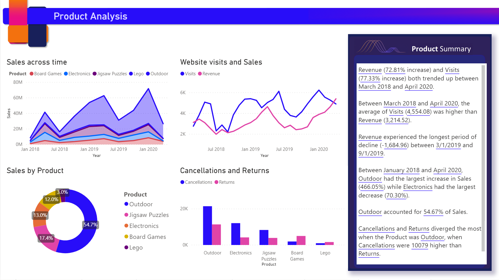

Use smart narrative summaries in your reports to address key takeaways, to point out trends, and to edit the language and format for a specific audience. In PowerPoint, instead of pasting a screenshot of your report's key takeaways, you can add narratives that are updated with every refresh. Your audience can use the summaries to understand the data, get to key points faster, and explain the data to others.

## Get started 
Watch Justyna show you how to use smart narratives, then try it out yourself using the tutorial, below the video.  To follow along with this tutorial, download the [sample file](https://github.com/microsoft/powerbi-desktop-samples/blob/main/Monthly%20Desktop%20Blog%20Samples/2020/2020SU09%20Blog%20Demo%20-%20September.pbix) of an online-sales scenario.

<iframe width="560" height="315" src="https://www.youtube.com/embed/01UrT-z37sw" frameborder="0" allow="accelerometer; autoplay; clipboard-write; encrypted-media; gyroscope; picture-in-picture" allowfullscreen></iframe>

In the **Visualizations** pane, select the **Smart narrative** icon to automatically generate a summary.

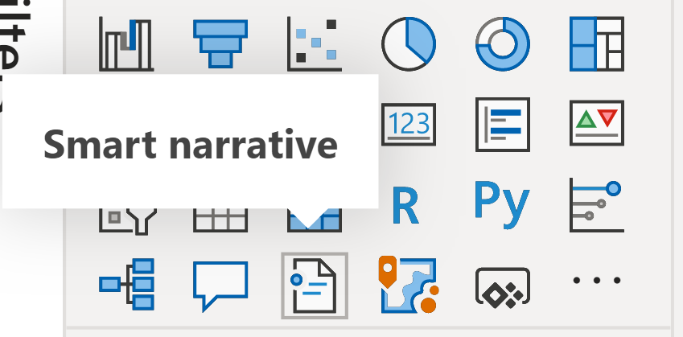

You see a narrative that's based on all of the visuals on the page. For example, in the sample file, smart narratives can automatically generate a summary of the report's visuals that address revenue, website visits, and sales. Power BI automatically analyzes trends to show that revenue and visits have both grown. It even calculates growth, which in this case is 72 percent.
 
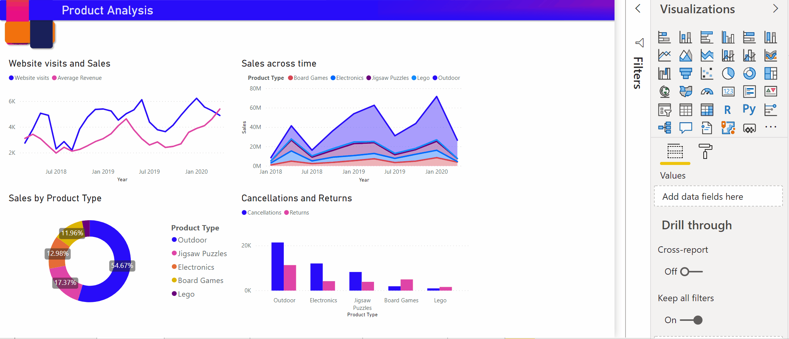
 
To generate a smart narrative of a visualization, right-click it and then select **Summarize**. For example, in the sample file, try summarizing a scatter chart that shows various transactions. Power BI analyzes the data and shows which city or region has the highest revenue per transaction and the highest number of transactions. The smart narrative also shows the expected range of values for these metrics. You see that most cities produce less than $45 per transaction and have fewer than 10 transactions.
 
  
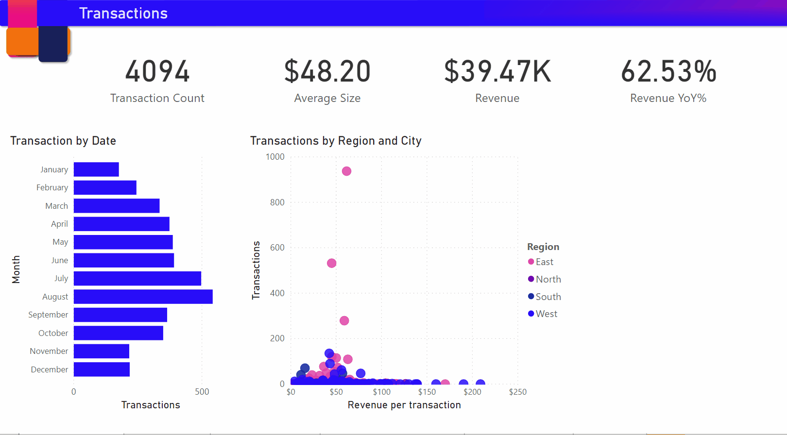
 
## Edit the summary
 
The smart narrative summary is highly customizable. You can edit or add to the existing text by using the text box commands. For example, you can make the text bold or change its color.
 
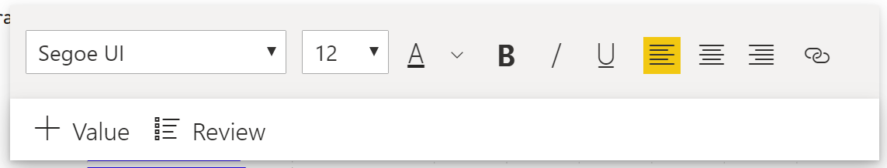
  
To customize the summary or add your own insights, use *dynamic values*. You can map text to existing fields and measures or use natural language to define a new measure to map to text. For example, to add information about the number of returned items in the sample file, add a value. 

As you type a value name, you can choose from a list of suggestions as you do in a Q&A visual. So, in addition to asking questions of your data in a Q&A visual, you can now create your own calculations without even using Data Analysis Expressions (DAX). 
  
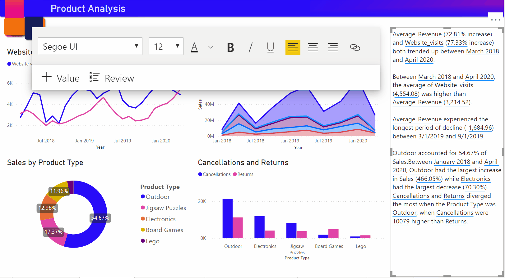
  
You can also format dynamic values. For example, in the sample file, you can show values as currency, specify decimal places, and choose a separator for thousands. 
   
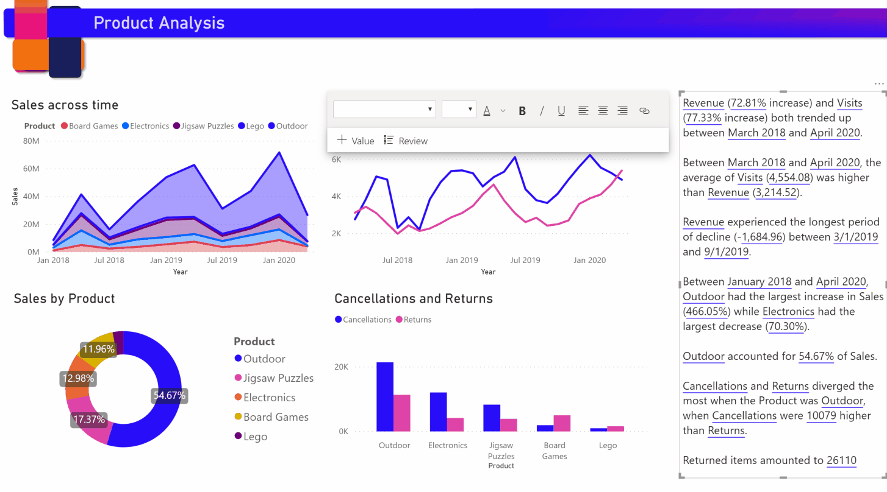
   
To format a dynamic value, select the value in the summary to see your editing options on the **Review** tab. Or in the text box, next to the value that you want to edit, select the edit button. 
   
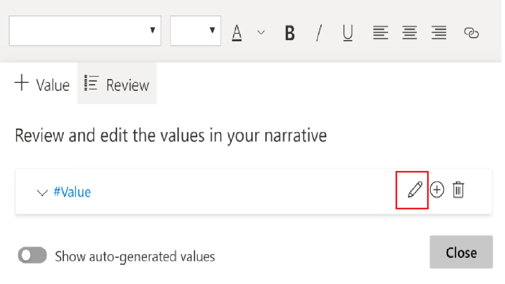
   
You can also use the **Review** tab to review, delete, or reuse previously defined values. Select the plus sign (+) to insert the value into the summary. You can also show automatically generated values by turning on the option at the bottom of the **Review** tab.

Sometimes a hidden-summary symbol appears in the smart narrative. It indicates that current data and filters produce no result for the value. A summary is empty when no insights are available. For example, in the sample file's line chart, a summary of high and low values might be empty when the chart's line is flat. But the summary might appear under other conditions. Hidden-summary symbols are visible only when you try to edit a summary.

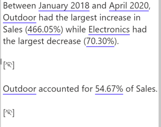
   
## Visual interactions
A summary is dynamic. It automatically updates the generated text and dynamic values when you cross-filter. For example, if you select electronics products in the sample file's donut chart, the rest of the report is cross-filtered, and the summary is also cross-filtered to focus on the electronics products.  

In this case, the visits and revenues have different trends, so the summary text is updated to reflect the trends. The count-of-returns value that we added is updated to $4196. Empty summaries can be updated when you cross-filter.
   
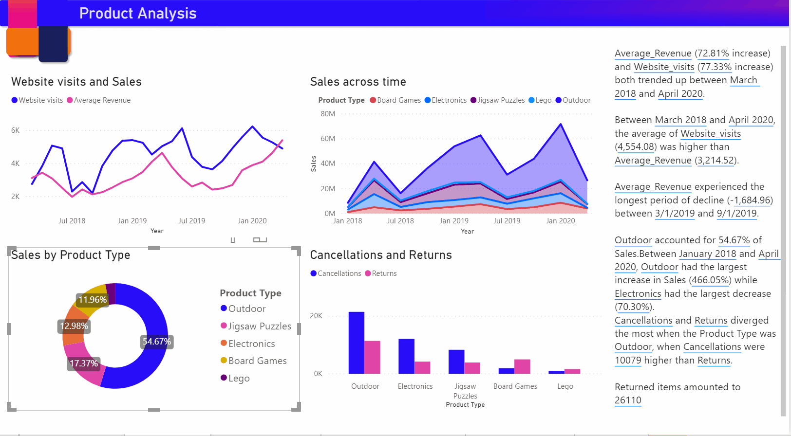
   
You can also do more advanced filtering. For example, in the sample file, look at the visual of trends for multiple products. If you're interested only in a trend for a certain quarter, then select the relevant data points to update the summary for that trend.
   
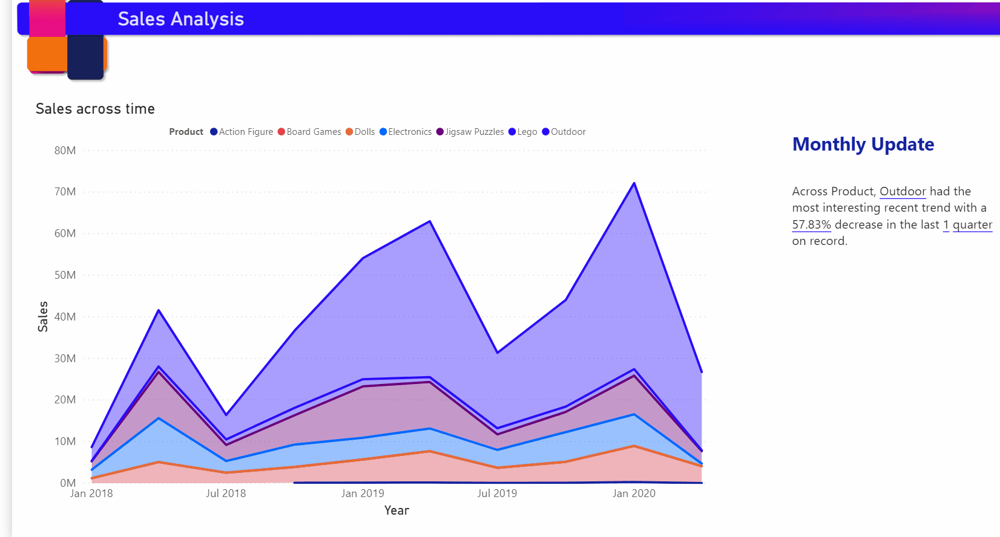

There is a limit to the number of summaries that can be generated so Smart Narratives picks the most interesting things to summarize about the visual. Smart Narratives generates upto four summaries per visual and upto sixteen per page. The summaries that are generated for a page depend on the location and size of visuals and it avoids generating the same kind of summaries for different visuals. Therefore summarizing just the visual can generate more summaries that are not present while summarizing the whole page.
   
## Limitations

The smart narrative feature doesn't support the following functionality:
- Pinning to a dashboard 
- Using dynamic values and conditional formatting (for example, data bound title)
- Publish to Web
- Power BI Report Server
- On-premises Analysis Services
- Live Connection to Azure Analysis Services or SQL Server Analysis Services
- MultiDimensional Analysis Services data sources 
- Key influencers visual with a categorical metric or unsummarized numerical field as 'Analyze' field from a table:
    - that contains more than one primary key 
    - without a primary key, and measures or aggregates as 'Explain by' fields
- Map visual with non-aggregated latitude or longitude
- Multi-row card with more than three categorical fields
- Cards with non-numeric measures
- Tables, matrices, R visuals or Python visuals, custom visuals 
- Summaries of visuals whose columns are grouped by other columns and for visuals that are built on a data group field 
- Cross-filtering out of a visual
- Renaming dynamic values or editing automatically generated dynamic values
- Summaries of visuals that contain on-the-fly calculations like QnA arithmetic, complex measures such as percentage of grand total and measures from extension schemas.
- [Calculation groups](/analysis-services/tabular-models/calculation-groups)

   
