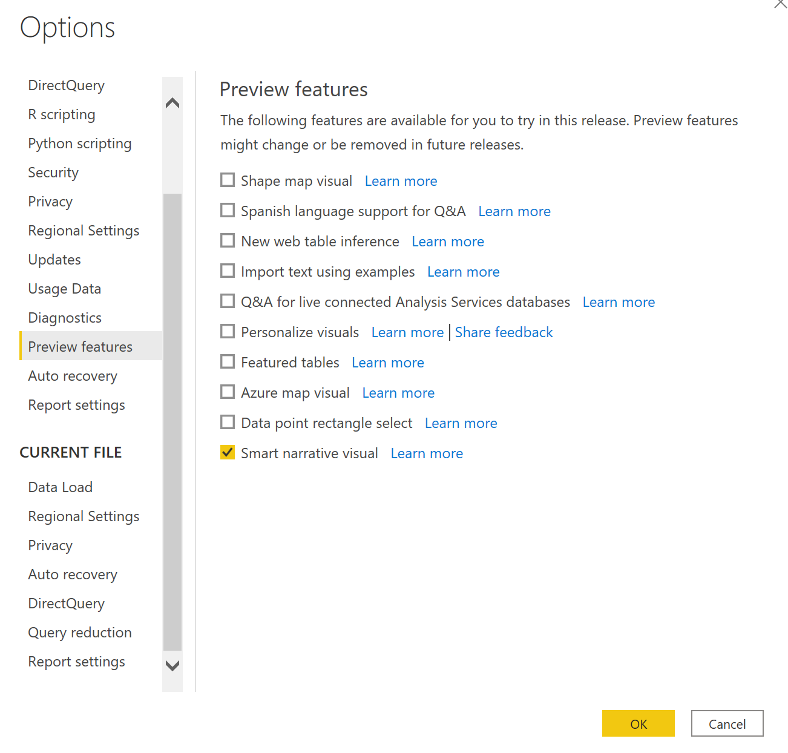

# Create Smart Narratives (preview)

[!INCLUDE[consumer-appliesto-nyyn](../includes/consumer-appliesto-nyyn.md)]    

[!INCLUDE [power-bi-visuals-desktop-banner](../includes/power-bi-visuals-desktop-banner.md)]

The Smart narrative visualization helps you quickly summarize visuals and reports by providing relevant out-of-the-box insights that are customizable.

Using this feature creators can add narratives to their report to address key takeaways, point out trends, edit the language and format it to fit a specific audience. Instead of pasting a screenshot of their report in PowerPoint with key takeaways added, they can now add narratives to the report that are updated with every refresh. Your end users can use the narratives to understand their data, get to the key points faster, and explain the data to others.

>[!NOTE]
> Since this feature is in preview, you will need to first turn on the feature switch by going to File > Options and Settings > Options > Preview feature and make sure **Smart narrative visual** is turned on:

## Get Started 

Click on the new smart narratives icon in the visualization pane to automatically generate a summary.

 You will see a narrative created based on all the visuals on the page. For example, you can click on the icon to automatically generate a summary of the visuals talking about revenue, website visits, and sales in this report. Notice that Power BI automatically does trend analysis to show that Revenue and Visits have both grown and it even calculates what kind of growth it sees - in this case, 72% increase.
 
 
 
 You can also right-click the visual and select **'summarize'**. This will generate an automatic summary of that visualization. For example, when you right-click -> summarize on the scatter chart showing the various transactions, Power BI analyses the data and shows which city/region has the highest revenue per transaction and the highest number of transactions. It also shows the expected range of values for these metrics, so you can understand most cities were below $45 in revenue per transaction and had fewer than 10 transactions.
 
  
 
 
 ## Edit the summary
 
 The summary is highly **customizable** where you can add new text or edit the existing text using the same controls available in the regular text box. For example, you can make the text bold or change the text color.
 
  
  
  You can also customize the summary and add your own insights by adding **dynamic values**. You can map text to existing fields and measures, or use natural language to define a new measure to map to text. For example, if you want to add information about the number of returned items, you can use the add value experience as shown in the gif. We have integrated the Q&A experience to add dynamic values. As you type, you'll get suggestions in a drop-down just as in a Q&A visual and you can just save this as a value.  So, in addition to being able to ask questions of your data in Q&A, the scope has been expanded to create your own calculations without even doing DAX. 
  
   
  
  You can format the dynamic values, for example, to show as currency, specify decimal places, thousand separator, etc. 
   
   
   
   You can do this by clicking directly on the value in the summary to format it or clicking on the edit button corresponding to the value in the review tab of the text box control. 
   
   
   
   You can also the Review tab to review, delete, or reuse previously defined values.  Clicking on the plus icon will insert the value in the summary. You can also show autogenerated values by toggling the option at the bottom.

Sometimes, you will see hidden summaries symbol saying "Current data and filters produce no result for this value". This is because some summaries can be empty as there is nothing interesting to say. For example, a summary looking at high and low values in a line chart could be empty if it's a flat line but could be non-empty under other conditions. These symbols will be visible only when you try to edit the summaries.

   
   
   ## Visual interactions
   The summary is dynamic and automatically updates the generated text and dynamic values when you cross filter. For example, if you select Electronics products in the donut chart, the rest of the report is going to cross filter and the summary will also cross filter to focus on the Electronics products too.  In this case, the visits and revenues have different trends, so the text gets updated to reflect that. And the count of returns value you added gets updated to $4196. Note that some of the empty summaries could be updated when you cross-filter.
   
   
   
   You can also do more advanced filtering. For example, if you are only interested in the trend across a certain quarter in this visual that looks at trends of multiple different products, you can just select the relevant data points to get the summary updated for that fragment.
   
   
   

