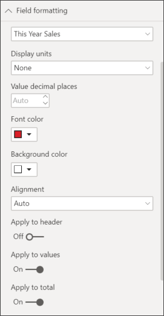
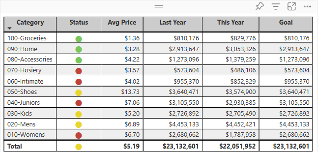
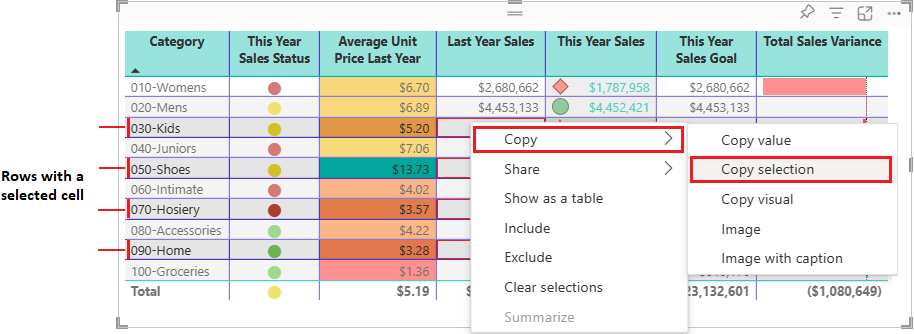
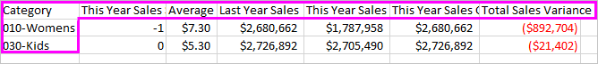

# Tables in Power BI reports and dashboards
A table is a grid that contains related data in a logical series of rows and columns. It may also contain headers and a row for totals. Tables work well with quantitative comparisons where you are looking at many values for a single category. For example, this table displays 5 different measures for **Category**.

Create tables  in reports and cross-highlight elements within the table with other visuals on the same report page.  In addition, you can select rows, columns, and even individual cells and cross-highlight. Individual cells and multiple cell selections can by copied and pasted into other applications.

## When to use a table
Tables are a great choice:

* to see and compare detailed data and exact values (instead of visual representations)
* to display data in a tabular format
* to display numerical data by categories   

> [!NOTE]
> If a table has too many values, consider converting it to a matrix and/or using drilldown. The maximum data points a table will display is 3,500.

## Prerequisites
- Power BI service or Power BI Desktop
- Retail Analysis sample

## Create a table
We'll create the table pictured above to display sales values by item category. To follow along, sign in to Power BI service and select **Get Data \> Samples \> Retail Analysis Sample > Connect** and choose **Go to dashboard**. Creating a visualization requires edit permissions to the dataset and report. Luckily, the Power BI samples are all editable. If a report has been shared with you, you won't be able to create visualizations in reports.

1. From the left navpane, select **Workspaces >My workspace**.    
2. Select the Datasets tab, and scroll down to the Retail Analysis Sample dataset you just added.  Select the **Create report** icon.

    
2. In the report editor, select **Item** > **Category**.  Power BI automatically creates a table that lists all the categories.

    
3. Select **Sales > Average Unit Price** and **Sales > Last Year Sales** and **Sales > This Year Sales** and choose all 3 options (Value, Goal, Status).   
4. In the Visualizations pane, locate the **Values** well and drag-and-drop the values until the order of your chart columns matches the first image on this page.  Your Values well should look like this.

    
5. Pin the table to the dashboard by selecting the pin icon  

     

## Format the table
There are many ways to format a table and we'll only cover a few of them here. A great way to learn about the other formatting options is to open the Formatting pane (paint roller icon ) and explore.

* Try formatting the table grid. Here we've added a blue vertical grid, added space to the rows, increased the outline and text size a bit.

    

    
* For the column headers we changed the background color, added an outline, and increased the font size. 

    

    

* You can even apply formatting to individual columns and column headers. Start by expanding **Field formatting** and selecting the column to format from the dropdown. Depending on the column values, Field formatting lets you set things like: display units, font color, number of decimal places, background, alignment, and more. Once you've adjusted the settings, decide whether to apply those settings to the header and totals row as well.

    

* And after some additional formatting, here is our final table. Since there are so many formatting options, the best way to learn is to start with the default formatting, open the Formatting pane   , and start exploring. 

    

### Conditional formatting
One type of formatting is referred to as *conditional formatting* and is applied to fields in the **Values** well of the **Visualizations** pane in Power BI service or Desktop. 

With conditional formatting for tables, you can specify customized cell background colors and font colors based on cell values, including using gradient colors. 

1. In the **Visualizations** pane in Power BI service or Desktop, select the down-arrow beside the value in the **Values** well that you want to format (or right-click the field). You can only manage conditional formatting for fields in the **Values** area of the **Fields** well.

    
2. Select **Background color scales**. In the dialog that appears, you can configure the color, as well as the *Minimum* and *Maximum* values. If you select the **Diverging** box, you can configure an optional *Center* value as well.

    

    Let's apply some custom formatting to our Average Unit Price values. Select **Diverging**, add some colors, and choose **OK**. 

    
3. Add a new field to the table that has both positive and negative values.  Select **Sales > Total Sales Variance**. 

    
4. Add data bar conditional formatting by selecting the down-arrow beside **Total Sales Variance** and choosing **Conditional formatting > Data bars**.

    
5. In the dialog that appears, set colors for **Positive bar**, **Negative bar**, place a checkmark next to **Show bar only**, and make any other changes you'd like.

    

    When you select **OK**, data bars replace the numerical values in the table making it easier to scan.

    
6. To remove conditional formatting from a visualization, just right-click the field again, and select **Remove Conditional Formatting**.

> [!TIP]
> Conditional formatting is also available from the Formatting pane (paintroller icon). Select the value to format and then set **Color scales** or **Data bars** to **On** to apply the default settings or, to customize the settings, select **Advanced controls**.
> 
## Copy values from Power BI tables for use in other applications

Your table or matrix may have content that you'd like to use in other applications, like Dynamics CRM, Excel, and even other Power BI reports. With the Power BI right-click, you can copy a single cell or a selection of cells onto your clipboard, and paste into the other application.

* To copy the value of a single cell, select the cell,  right-click, and choose **Copy value**. With the unformatted cell value on your clipboard, you can now paste it into another application.

    

* To copy more than a single cell, select a range of cells or use CTRL to select one or more cells. The copy will include the column and row headers.

    

    The copy includes the column and row headers.

    

## Adjust the column width of a table
Sometimes Power BI will truncate a column heading in a report and on a dashboard. To show the entire column name, hover over the space to the right of the heading to reveal the double arrows, select and drag.

## Considerations and troubleshooting
* When applying column formatting, you can only choose one alignment option per column: Auto, Left, Center, Right. Usually, a column contains all text or all numbers, and not a mix. But in cases where a column contains both numbers and text, **Auto** will align left for text and right for numbers. This behavior supports languagues where you read left-to-right.   

## Next steps

[Treemaps in Power BI](power-bi-visualization-treemaps.md)

[Visualization types in Power BI](power-bi-visualization-types-for-reports-and-q-and-a.md)